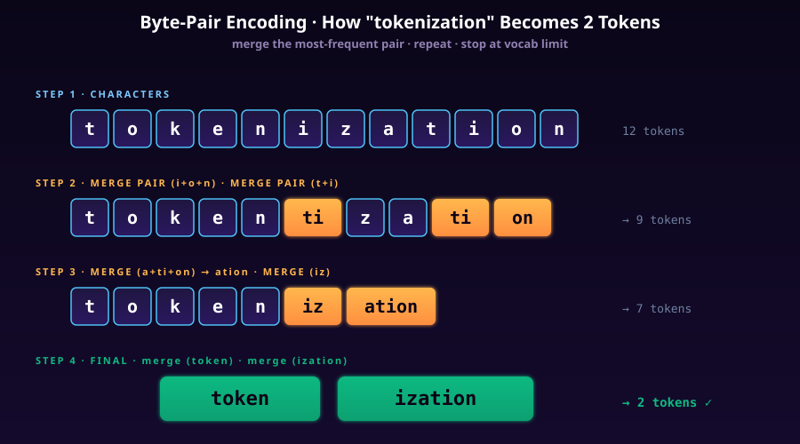
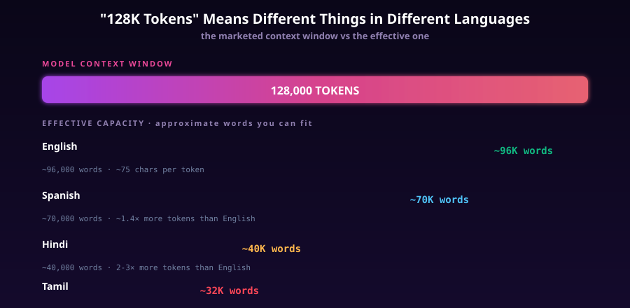

# Tokenization — Why ChatGPT Can't Count R's in "Strawberry"

> Episode 1 · You Already Know AI

Try it right now. Open ChatGPT. Type:

> *How many r's are in the word strawberry?*

It will say **2**.

The correct answer is **3** — s-t-**r**-a-w-b-e-**r**-**r**-y.

Every major LLM gets this wrong. GPT-4. Claude. Gemini. All of them. And it's not because they're stupid. It's because of a step that happens **before** the AI even sees your question.

That step is called **tokenization**.



*You see 10 letters with 3 r's. The AI sees 2 chunks: `STRAW` and `BERRY`. The r's are hidden inside the chunks.*

Picture this: you ask a friend "how many r's in strawberry?" while holding the word up on a card. They look. They count. They say 3. Easy.

Now ask ChatGPT. Same word. Same question. Wrong answer. Confidently wrong.

This isn't a one-off bug. It's not a model quirk that gets fixed in the next release. It's a **fundamental property of how every modern LLM perceives text** — and once you understand it, half the weird LLM failures you've seen will suddenly make sense.

This article is Episode 1 of *You Already Know AI* — a series for engineers and curious folks who want to understand what's actually happening inside the box. No hand-waving, no math gymnastics. Just real mechanics.

---

## You Already Do This

When you read fast, you don't read letter by letter. You read in chunks.

Look at this word: `understanding`.

Your brain doesn't process u-n-d-e-r-s-t-a-n-d-i-n-g. It reads `under` + `standing`. Two chunks. One meaning.

This is how skilled readers process text — chunk by chunk, not letter by letter. It's also why you can read a sentence with a missing letter and not notice. Your eye samples enough of the chunk to recognise it, then moves on.

**AI does the exact same thing.**

But there's a catch — once you read in chunks, you lose direct access to individual letters. If someone asked you "how many d's are in 'understanding' without looking?", you'd have to mentally re-spell it letter by letter. Your default reading mode doesn't track letters.

AI has the same problem. Except worse — AI never spells things out. It always operates on chunks.

Here's a quick test. Look at this for one second, then look away:

> `Antidisestablishmentarianism`

Now without looking — how many `i`'s are in it? You probably can't say. You'd have to re-read it character by character. That re-reading step? An LLM literally cannot do it. The letters are gone the moment the tokenizer runs.

---

## What AI Sees

When you type "strawberry" into ChatGPT, this is what happens before the AI does anything:

1. The text goes into a **tokenizer**
2. The tokenizer breaks the text into chunks called **tokens**
3. Each token is converted to a **token ID** — a number from a fixed vocabulary
4. The model only ever sees these numbers — not the original letters

For "strawberry", the tokenizer outputs:

```
input:  "strawberry"
tokens: ["straw", "berry"]
ids:    [125634, 51240]
```

Two tokens. Two integers. The individual letters? Gone. The model has no idea there are 3 r's because it never saw the letters in the first place — it saw `[125634, 51240]`.

You can verify this yourself in three lines of Python:

```python
import tiktoken
enc = tiktoken.encoding_for_model("gpt-4o")
print(enc.encode("strawberry"))   # → [125634, 51240]  (or similar IDs)
print([enc.decode([t]) for t in enc.encode("strawberry")])
# → ['straw', 'berry']
```

That `tiktoken` library is OpenAI's open-source tokenizer. It's a small Rust binary wrapped in Python, fast enough to tokenize gigabytes of text per second. Every time you call the OpenAI API, this exact code runs on the server before your prompt reaches the model.



*Every prompt you send to GPT, Claude, or Gemini goes through this exact pipeline. You write words. The model reads numbers.*

When you ask "how many r's in strawberry?", here's what the AI is actually doing:

- It sees the token IDs `[125634, 51240]`
- It tries to *remember* (from training) how many r's are usually in this word
- It pattern-matches against text it saw during training and outputs a guess

The guess is wrong, because counting letters from memory isn't reliable. The model never *counts* — it predicts the most likely next token. When the most likely next token after "strawberry has" is " 2 r's" (because that pattern appeared often enough in training data), that's what comes out. Even though it's wrong.

---

## The Algorithm: Byte-Pair Encoding (BPE)

The most popular tokenizer algorithm — used by GPT-2, GPT-3, GPT-4, GPT-4o, Llama, Mistral — is called **Byte-Pair Encoding**, or **BPE**.

BPE was originally a 1994 data compression algorithm by Philip Gage. In 2015, researchers at the University of Edinburgh adapted it for machine translation. Today, almost every major LLM uses some variant of it.

Here's the core idea, in plain language.

**Start at characters. Then merge the most common pair. Repeat until your vocabulary is the size you want.**

That's it. That's the whole algorithm.

### Worked example: how "tokenization" becomes 2 tokens

Let's walk through it. Imagine we're building a tokenizer from scratch on a tiny corpus. We see the word `tokenization` appear thousands of times.

**Step 1.** Start with characters:

```
[t][o][k][e][n][i][z][a][t][i][o][n]   → 12 tokens
```

**Step 2.** Scan the entire training corpus. Find the most frequent adjacent pair. Say `t+i` is super common (appears in `tion`, `tionary`, `tive`, etc). Merge it everywhere:

```
[t][o][k][e][n][i][z][a][ti][on]       → after a few more merges
```

**Step 3.** Repeat. Find the next most frequent pair. Maybe `a+ti+on` collapses to `ation` (it's everywhere — *creation, station, nation, vacation*). Merge:

```
[t][o][k][e][n][iz][ation]
```

**Step 4.** Keep going until vocabulary hits the target size (~50K-200K tokens). Eventually `token` becomes one token, `ization` becomes one token, and you stop merging:

```
[token][ization]                        → 2 tokens
```



*Byte-Pair Encoding in 4 steps. Start with characters, merge the most frequent pair, repeat until vocabulary fills up.*

That's how GPT-4o ends up tokenizing `tokenization` as exactly 2 tokens: `token` and `ization`. Both showed up so often in training data that BPE built dedicated tokens for them.

### Why BPE was chosen

Why not just use words as tokens? Why not just use individual characters?

| Approach | Vocab size | Problem |
|---|---|---|
| **Character-level** | ~256 (for ASCII) | Sequences too long. "the cat sat" = 11 tokens. Slow. |
| **Word-level** | ~170,000 (English) | Out-of-vocabulary words break it. New names? Typos? Code? Hindi? Disaster. |
| **BPE (subword)** | ~50K-200K | Best of both. Common words = 1 token. Rare words = 2-4 tokens. Anything is representable down to bytes. |

BPE wins because it gracefully handles **anything**. A word it's never seen? It falls back to smaller subword chunks. A weird Unicode character? It falls back to raw UTF-8 bytes. Nothing crashes.

That's also why modern BPE is technically **byte-level BPE** — the base alphabet isn't characters, it's the 256 possible byte values. This is why GPT models can handle emoji, Chinese, code, and binary garbage without ever throwing "unknown token" errors.

### A small but important note on cousins

People sometimes conflate three algorithms. Quick clarifier:

- **BPE** — used by GPT, Llama, Mistral. Greedy merge of frequent pairs.
- **WordPiece** — used by BERT. Similar to BPE but uses a likelihood criterion instead of frequency.
- **SentencePiece** — Google's library that wraps BPE *or* unigram tokenization, treats text as a raw stream (no pre-splitting on whitespace). Used by T5, Llama, Gemma.

The difference matters if you're training a model. For understanding LLMs as a user, treat them as variations on the same theme: split text into subword chunks, build a fixed vocabulary, map text ↔ IDs.

### The tokenizer is fixed at training time

One critical thing: **the tokenizer is locked in when the model is trained, and cannot be changed afterward**. If you train a model with a 50K-vocab tokenizer, you can't just upgrade to a 200K-vocab tokenizer later — every embedding in the model is keyed to specific token IDs. Change the tokenizer, and the model speaks gibberish.

This is why GPT-4o has a different tokenizer (`o200k_base`) than GPT-4 (`cl100k_base`) — they were trained from scratch with different vocabularies. And why prompt-caching across model versions doesn't work: the cached tokens don't translate.

It's also why the tokenizer choice has a long shadow. A bad tokenizer choice in 2022 (e.g., poor multilingual coverage) bakes in a "tokenizer tax" for every user of that model for its entire lifespan.

---

## Tokenizer Comparison — Same Sentence, Different Tokens

Here's a fun thing. The same sentence produces a different number of tokens depending on which model you're talking to.

Take: **"I love coding in Python"**

| Model | Tokenizer | Token count | Tokens |
|---|---|---|---|
| GPT-4o | `o200k_base` (200K vocab) | 6 | `["I"," love"," cod","ing"," in"," Python"]` |
| GPT-4 / GPT-3.5 | `cl100k_base` (100K vocab) | 6 | `["I"," love"," coding"," in"," Python"]` (similar) |
| Claude (Sonnet/Opus) | custom Anthropic tokenizer | ~5 | not publicly documented; close to GPT |
| Llama 3 | tiktoken-style (128K vocab) | 5 | `["I"," love"," coding"," in"," Python"]` |



*Same sentence, three tokenizers. Differences look small here — but they compound across millions of API calls.*

You can verify GPT counts yourself at **platform.openai.com/tokenizer**. Anthropic doesn't ship a public web tokenizer for Claude — their token count is reported in API responses and via the `count_tokens` endpoint. Open-weight Llama tokenizers ship with the model and you can run them locally with `transformers` or `tiktoken`.

A quick caveat on the GPT-4o split of `"coding"` into `"cod"` + `"ing"` — it really does happen. The `o200k_base` tokenizer does add `coding` as a single token in many contexts but in others (depending on whitespace and surroundings) it splits. You can confirm this on OpenAI's tokenizer page.

### English vs Hindi vs Tamil vs code

The real fun starts when you leave English. Let's translate **"Hello, how are you?"** and run each through GPT-4o:

| Language | Sentence | Tokens (approx) |
|---|---|---|
| English | "Hello, how are you?" | 6 |
| Spanish | "Hola, ¿cómo estás?" | 9 |
| French | "Bonjour, comment allez-vous?" | 8 |
| Hindi | "नमस्ते, आप कैसे हैं?" | ~22 |
| Tamil | "வணக்கம், எப்படி இருக்கிறீர்கள்?" | ~30 |
| Chinese | "你好，你好吗？" | ~7 |



*Same meaning. Same intent. 5× the tokens for Tamil. This is the "tokenizer tax" non-English speakers pay every time they call an LLM.*

Why does Hindi blow up to 22 tokens? Because English text dominated GPT's training corpus, BPE built dedicated tokens for English subwords like `the`, `ing`, `tion`. Hindi (Devanagari script) didn't have nearly as much representation, so most Hindi characters fall back to multi-byte UTF-8 sequences — and each byte becomes a token.

It's not a deliberate bias. It's an emergent consequence of training-data frequency. But the cost lands the same: **non-English users pay more per word**.

For code, the trade-off goes the other way. Common code patterns like `def`, `function`, `import`, ` = `, `})` get dedicated tokens. A 200-line Python file might be ~1,500 tokens. The same content as plain English prose might be 800. Code is denser in concept-per-token than free-form text in many cases.

---

## The Real Cost Math

Here's where tokenization becomes a line item on your AWS bill.

LLM APIs charge **per token**, not per word. As of early 2026, here are real prices for the major frontier models:

| Model | Input ($/M tokens) | Output ($/M tokens) |
|---|---|---|
| GPT-5.4 | $2.50 | $15 |
| Claude Opus 4.7 | $5 | $25 |
| Claude Sonnet 4.6 | $3 | $15 |
| Claude Haiku 4.5 | $1 | $5 |
| GPT-4o-mini | $0.15 | $0.60 |

These are per-million-token prices. Doesn't sound like a lot. Until you start running an actual product.

### Worked example: a customer support bot

Say you're building a chat support bot. Average conversation:
- System prompt: 500 tokens
- User messages (5 turns): ~150 tokens each = 750 tokens
- Assistant replies (5 turns): ~200 tokens each = 1,000 tokens

Per conversation on GPT-5.4:
- Input: 1,250 tokens × $2.50/M = **$0.003125**
- Output: 1,000 tokens × $15/M = **$0.015**
- Total: **~$0.018 per conversation**

Now scale to 100,000 conversations/month: **$1,800/month**.

Now run that **same product in Hindi.** Same prompts, same flow, same model:
- Same content, but Hindi tokenizes ~2.5× as expensive
- Input: 3,125 tokens × $2.50/M = $0.0078
- Output: 2,500 tokens × $15/M = $0.0375
- Total: **~$0.045 per conversation**

100,000 Hindi conversations/month: **$4,500/month**.

**Same product. Same users. 2.5× the bill — purely because of tokenization.**

This is why most Indian SaaS companies launching AI products quietly run their LLM calls in English under the hood (translate input → process → translate output) even when the user-facing UI is Hindi. It's a tokenizer-tax workaround.

### Context window math

The other place tokenization quietly hurts you: context windows.

When a model says "128K context", that's **128,000 tokens** — not words, not characters. And tokens-to-words is wildly different per language:



*The marketed context window is the same. The effective capacity isn't.*

Rough English heuristic: **1 token ≈ 0.75 words ≈ 4 characters**. So 128K tokens ≈ 96K words ≈ a 350-page book.

In Hindi, that same 128K context window holds **~40K words** — about 60% less. In Tamil, it can drop to ~32K. The model has the same architectural memory, but the language eats it faster.

For RAG (retrieval-augmented generation) builders, this matters a lot. You can stuff fewer Hindi documents into context. Your prompt-engineering instructions take more tokens. Your output ceiling drops too.

### The "billing surprise" cheat sheet

Some practical rules of thumb every engineer shipping LLMs should know:

- **English plain text:** 1 token ≈ 4 characters ≈ 0.75 words
- **Code:** 1 token ≈ 3 characters (denser due to symbols and short keywords)
- **Hindi / Tamil / Bengali / Arabic:** 1 token ≈ 1-2 characters (much worse due to byte fallback)
- **Chinese / Japanese / Korean:** 1 token ≈ 1-1.5 characters (better than Indic, worse than Latin)
- **JSON / structured output:** 1.5-2× the cost of equivalent prose due to brackets, quotes, indentation
- **System prompts:** count once; if you cache them, count once per cache lifetime

The cheapest token is the one you don't send. Trim system prompts. Compress tool definitions. Use shorter variable names in code prompts. Every saved token times every API call equals real money.

---

## Why Letter-Level Tasks Fail

Once you understand tokenization, an entire genre of "haha, ChatGPT is dumb" memes makes sense. They're all the same bug.

### 1. Counting letters

The strawberry case. Also:
- "How many `o`s are in 'phenomenon'?" → often wrong
- "Count the spaces in this sentence" → guesses
- "Is the letter z in 'apple'?" → sometimes hallucinates yes

The model literally cannot see individual letters. It pattern-matches from training memories like "phenomenon has two o's, no wait three" — and outputs whichever pattern fired hardest.

### 2. Reversing strings

Ask GPT-4 to reverse `algorithm` letter-by-letter. It often returns something close but with shuffled letters: `mhtirogla` instead of `mhtirogla` — actually wait, let me check that. Run it yourself. It's flaky. It works sometimes for short common words it has memorised reversed. It fails for anything novel.

The reason: reversing requires positional access to each letter. The model has tokens, not letters. It tries to reverse-engineer the spelling from the token IDs, which is like asking you to reverse a word using only a description of what it sounds like.

### 3. Spelling games

- "Give me 5 words that start with `dr` and end with `ck`" → often returns words that violate the constraint (`drink`, `drunk`, `truck` — none of which actually fit)
- "What's the second-to-last letter of `expedition`?" → guesses
- Anagrams → frequently wrong unless the answer is famous

### 4. Character-level math on text

- Count vowels in a sentence → unreliable
- Find all words longer than 7 characters → drops or duplicates
- Capitalise every other letter → fails after 4-5 characters

### Why it's not a "reasoning" failure

This is the key insight. The model is not failing because it's bad at logic. It's failing because **it cannot perceive the input at the granularity the question requires**.

Imagine someone hands you a JPEG of a number and asks "is the digit in the thousands place even or odd?" — but you're only allowed to use a function that returns the *category* of the image (e.g., `number_4_to_6_digits`). You can't answer the question. Not because you can't reason, but because you don't have the right perception of the input.

That's the LLM with letters. It has fluent reasoning. It just doesn't see what it would need to see.

The fix? Models can use **tools**. ChatGPT now often runs code (`len([c for c in word if c == 'r'])`) when you ask letter questions, and gets the right answer. It's offloading the perception problem to a real interpreter that can see characters. Future models will do this automatically and silently — but the underlying tokenization doesn't go away. It's just hidden behind a tool call.

---

## SolidGoldMagikarp & The Weird Token Phenomenon

In early 2023, a researcher named Jessica Rumbelow noticed something strange.

There were certain "tokens" in GPT-2 and GPT-3's vocabulary — actual single tokens, like `SolidGoldMagikarp`, ` petertodd`, ` Skydragon` — that the model behaved bizarrely around. Ask GPT-3 "what does ` SolidGoldMagikarp` mean?" and it would output gibberish, refuse, claim you said something different, or get hostile.

These were called **"glitch tokens"** or **"unspeakable tokens"**.

### What was happening

The OpenAI tokenizer was trained on a huge web scrape — Reddit, Common Crawl, etc. It saw the username `SolidGoldMagikarp` (a real Reddit user who posted very frequently in a counting subreddit) thousands of times. So BPE merged it into a single dedicated token.

But when GPT-3's actual *training corpus* was filtered/sampled, those Reddit threads got mostly filtered out. Result: the token existed in the vocabulary, but the model barely ever saw it during training. The token's embedding vector was essentially random — it pointed to nowhere meaningful in concept-space.

So when you fed the token in, the model produced garbage, because it had no learned "meaning" attached to that input.

### Why it matters

A few reasons:

1. **It proves tokens are real.** The model doesn't see your text — it sees a sequence of integer IDs each pointing into an embedding table. If an ID was never trained on, the model has no idea what to do with it.

2. **It's a security flag.** Glitch tokens have been used to break safety training, jailbreak models, and produce unexpected behaviour. Anthropic, OpenAI, and others now actively audit their vocabularies for these.

3. **It's a beautiful illustration of the tokenizer/model split.** Tokenizer vocabulary ≠ training distribution. The two are independently produced and can drift apart.

Most modern frontier models (GPT-4o, Claude 4.x, Gemini) have cleaned up their vocabularies, so the dramatic glitch-token behaviour is mostly gone. But the lesson sticks: **the tokenizer is a real, inspectable, sometimes-buggy component of the system. It's not magic. It's just a lookup table.**

If you want to go deeper, search for "GPT vocabulary inspection" — there are public tools that let you scroll through every single token GPT-4 knows. It's an oddly meditative experience. You'll see ` strawberry` as one token. You'll see ` ChatGPT` as one token. You'll see weird Reddit usernames, forum signature footers, and chunks of common boilerplate like ` according to`, ` In conclusion`. The vocabulary is a frozen snapshot of the internet circa training cutoff.

---

## What This Means For You As An Engineer

Three practical takeaways if you're shipping anything that touches an LLM:

**1. Always count tokens, never count words.** Wire `tiktoken` into your prototypes. Make token-cost visible at every layer — request middleware, logs, dashboards. The team that knows their token usage ships profitable products. The team that doesn't gets surprised by the bill.

**2. Don't trust LLMs with letter-level tasks.** If your product needs to count characters, validate spelling, generate anagrams, or do any precise textual manipulation — use code, not prompts. Either call a real function from your backend, or let the model write code and execute it (Python REPL / tool use). Never just ask politely and hope.

**3. Test your prompts in every language you ship.** A prompt that fits 32K tokens in English may be 80K tokens in Hindi, blowing your context window. A few-shot example that works fluently in English may be a garbled mess in Tamil. Real engineers test the actual production language, not the developer's English version.

---

## The One-Line Takeaway

> AI doesn't read words. It reads chunks. That single design choice explains half of everything LLMs are weirdly bad at.

Next time you see ChatGPT confidently fail at counting letters, remember: it's not stupid. It just never saw the letters.

And next time someone quotes you "this model has 128K context" — ask them in which language. Because the answer changes by 2-3×.

This is Episode 1 of *You Already Know AI*. Next: **Embeddings — How AI turns "king - man + woman = queen" into actual math.**

---

## Reel Script (~50s) — What + How + Example

| Beat | Line |
|---|---|
| **Hook (example)** | ChatGPT se poochho — strawberry mein kitne r hain. Woh DO bolega. Sahi answer hai TEEN. |
| **What** | Yeh bug nahi hai. Yeh tokenization hai. Tokenization matlab — AI tumhara text padhne se pehle, usse chunks mein todta hai. |
| **How** | Tum strawberry likhte ho. Pehle yeh tokenizer ke through jaata hai. Tokenizer ne strawberry ko 2 chunks mein toda — STRAW aur BERRY. AI ko sirf yeh 2 chunks dikhte hain. Letters dikhte hi nahi. |
| **Why it fails** | Ab agar tum r count karne bolo — AI ke paas counting ke liye letters hi nahi hote. Woh memory se guess karta hai. Aur galat ho jaata hai. |
| **Takeaway** | Yahi tokenization hai — har LLM ka pehla step. ChatGPT, Claude, Gemini — sab pehle tumhara text tokens mein todte hain. |
| **CTA** | Comment TOKEN — main tumhe poori AI series ka roadmap bhejta hoon. |

Full teleprompter: `scripts/ai-series-ep01-tokenization-teleprompter.txt`

---

## On-Screen Text Cues

- Hook: `STRAWBERRY → [STRAW][BERRY]`
- Demo: Screenshot of ChatGPT saying "2 r's", red strikethrough, correct: `3`
- Term reveal: `TOKENIZATION` in big letters with chunks animating

---

## References

- OpenAI's interactive tokenizer: `platform.openai.com/tokenizer`
- Andrej Karpathy — "Let's build the GPT Tokenizer" (YouTube)
- Hugging Face — Tokenizer summary docs

---

## Hashtags

#ai #aiexplained #llm #chatgpt #tokenization #softwareengineer #systemdesign #aibasics #machinelearning #tech #coding #engineering
