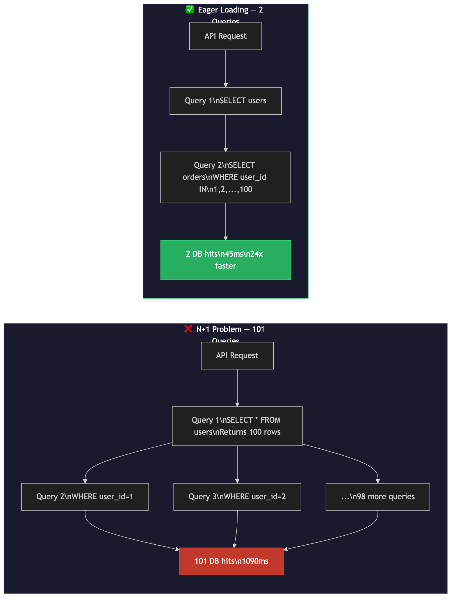
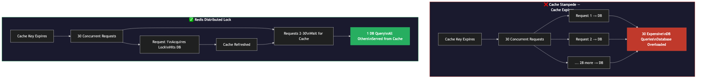
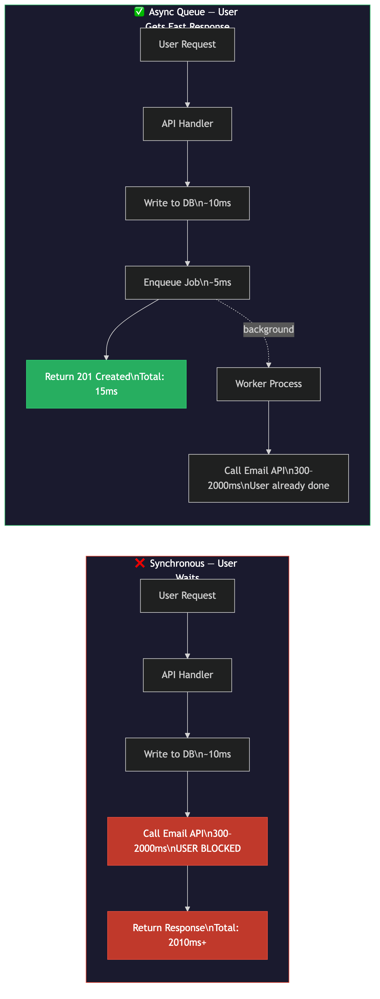
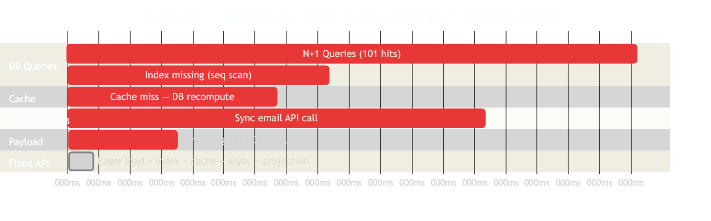

# Your API Takes 3 Seconds. Your Users Leave in 2. Here Are the 5 Fixes.

Every slow API has a root cause. Usually one of five. These aren't theoretical — they're what AppSignal, LinkedIn, Percona, and AWS have measured in production. Fix them and your API latency drops fast.

---

## The Problem

A slow API isn't just bad UX. It's lost revenue. Amazon's internal research found that every 100ms of added latency costs roughly 1% in sales. Your users don't wait — they bounce. The frustrating part: most API slowness comes from a handful of well-known, fixable mistakes.

Here they are, with real numbers.

---

## Mistake 1 — The N+1 Query Problem

### What's Happening

Your ORM fetches a list of records in one query. Then, for each record, it fires a separate query to get related data. Loop of 100 users = 101 queries. 1,000 users = 1,001 queries. This is the N+1 problem, and every major ORM defaults into it via lazy loading.

```python
# Django — this looks innocent
users = User.objects.all()
for user in users:
    print(user.orders.all())  # Fires a new DB query per user!
```

### The Data

AppSignal benchmarked this in Django on a real dataset:

| Approach | Queries | Response Time |
|---|---|---|
| Lazy loading (N+1) | 1,024 | 1,090ms |
| Eager loading (`select_related`) | 2 | 45ms |

**Result: 24x faster. 512x fewer queries.** Same data, one line of code changed.



### The Fix

Use eager loading — tell the ORM to JOIN or batch the related data upfront:

- **Django:** `User.objects.select_related('profile')` (JOIN for FK/OneToOne), `prefetch_related('orders')` (batch query for M2M/reverse FK)
- **Rails:** `User.includes(:orders)`
- **Hibernate:** `JOIN FETCH` in JPQL, or `@EntityGraph`
- **Sequelize/TypeORM:** `{ include: [Order] }`

For GraphQL APIs, use the **DataLoader pattern** — it batches and deduplicates all queries for a request cycle.

**Detection:** Install Django Debug Toolbar, Bullet gem (Rails), or Sentry's Performance Monitoring. They surface N+1 queries automatically.

---

## Mistake 2 — Missing Database Indexes

### What's Happening

Without an index, the database engine does a full table scan — reading every row from disk, sequentially, until it finds matches. Time complexity: O(n). On a table with 10 million rows, that's 10 million row reads per query.

With a B-tree index (the default in PostgreSQL and MySQL), the engine does a binary search — jumping directly to matching rows. Time complexity: O(log n).

### The Data

Percona's benchmarks show index-only scans completing in **0.058ms** on queries that take seconds without an index. Real-world case studies document queries going from **12 seconds to 0.01 seconds** after adding the right index — a 1,200x improvement.

For multi-column range queries, Percona's optimized MySQL index handling achieved up to **1,000x faster** execution.

### Diagnosis

Run `EXPLAIN ANALYZE` (PostgreSQL) or `EXPLAIN` (MySQL) before your slow query. Look for:

- **Seq Scan** — full table scan. If the table is large and you're filtering, this is a red flag.
- **Index Scan** — good for selective queries
- **Index Only Scan** — fastest (reads only the index, no heap fetch)
- **Bitmap Heap Scan** — batched index lookups, good for moderate selectivity

```sql
EXPLAIN ANALYZE SELECT * FROM orders WHERE user_id = 42;
-- Look for "Seq Scan" vs "Index Scan"
```

### The Fix

Index the columns you filter, join, and sort on:

```sql
-- Index on WHERE clause column
CREATE INDEX idx_orders_user_id ON orders(user_id);

-- Composite index for multi-column queries
CREATE INDEX idx_orders_user_status ON orders(user_id, status);
-- Order matters: put the most selective column first
```

**Rules:**
- Index every `WHERE` clause column
- Index both sides of every `JOIN`
- Index `ORDER BY` columns to prevent sort operations
- Use composite indexes for multi-column filters (leftmost prefix rule applies)
- Avoid indexing low-cardinality columns (e.g., a boolean `is_active` with 90% `true` values — the DB may ignore the index for full scans)

Note: If a query matches more than ~10% of table rows, MySQL may ignore the index and choose a full scan anyway. Index selectivity matters.

---

## Mistake 3 — Cache Stampede (Thundering Herd)

### What's Happening

You add Redis caching to a popular endpoint. Works great — until the cache key expires. At that moment, every concurrent request finds a cache miss and races to the database to recompute the value. If you have 30 requests/second and your page takes 3 seconds to render, **30 simultaneous expensive DB queries** hit at once. The database gets overwhelmed. Latency spikes. You've traded a cache miss for an outage.

This is the cache stampede (also called the thundering herd problem). Facebook experienced it in 2010. It's well-documented and common.



### The Data

- Redis caching reduces database read load by ~90% in typical applications (Redis official benchmarks show serving from memory is 10–100x faster than disk-based databases)
- AWS ElastiCache for Redis 7.1: at peak load, P99 latency reduced by **more than 50%** vs without caching
- Semantic caching with Redis: up to **68.8% reduction in API calls** and **40–50% latency improvement** (Redis official blog)

### The Fix — Three Approaches

**Option 1: Distributed Lock (Mutex)**

When a cache miss occurs, the first request acquires a short-lived Redis lock and rebuilds the cache. All others wait (returning stale data if available) until the lock releases.

```python
import redis
import time

r = redis.Redis()

def get_with_lock(key, rebuild_fn, ttl=300):
    value = r.get(key)
    if value:
        return value

    lock_key = f"lock:{key}"
    if r.set(lock_key, "1", nx=True, ex=10):  # Acquire lock
        try:
            value = rebuild_fn()
            r.setex(key, ttl, value)
            return value
        finally:
            r.delete(lock_key)
    else:
        # Lock held by another process — wait briefly and retry
        time.sleep(0.1)
        return get_with_lock(key, rebuild_fn, ttl)
```

**Option 2: TTL Jitter**

Add randomness to expiration times to spread cache rebuilds:

```python
import random

ttl_base = 300  # 5 minutes
ttl_jitter = random.randint(-30, 30)  # ±30 seconds
r.setex(key, ttl_base + ttl_jitter, value)
```

**Option 3: Probabilistic Early Expiration (XFetch)**

The XFetch algorithm (Vattani, Chierichetti, Lowenstein — VLDB 2015) lets each process independently and randomly decide to recompute the cache *before* it expires, with increasing probability as TTL decreases. No locks, no coordination. The cache is always warm.

```python
import math
import random
import time

def fetch_with_xfetch(key, rebuild_fn, beta=1.0):
    cached = r.get(key)
    ttl = r.ttl(key)

    if cached:
        # Decide whether to early-recompute
        delta = time.time()
        value, expiry, recompute_time = cached  # stored with metadata
        if delta - beta * recompute_time * math.log(random.random()) >= expiry:
            cached = None  # Probabilistically decide to recompute early

    if not cached:
        start = time.time()
        value = rebuild_fn()
        recompute_time = time.time() - start
        # Store with metadata for XFetch
        r.setex(key, 300, (value, time.time() + 300, recompute_time))

    return value
```

---

## Mistake 4 — Synchronous External API Calls in the Request Path

### What's Happening

Your API endpoint calls an external service inline — an email provider, SMS gateway, payment webhook, push notification service. While waiting for that external call, your server thread is blocked and idle. The user is waiting. If the external API is slow or down, your entire endpoint degrades.



### The Data

SoftwareMill's MQPerf benchmark measures real SQS processing latency at **94ms to 1,960ms** depending on polling configuration. That 1,960ms gets added to the user's response time when you call it synchronously. For email providers, SMTP round-trips routinely add 300–500ms.

The async pattern eliminates this entirely from the user's critical path.

### The Fix — Async Queue Pattern

The pattern: API validates, writes to DB, enqueues a job, returns immediately. Background worker processes the job independently.

```python
# ❌ Synchronous — user waits for email
@app.post("/register")
def register(user: UserCreate):
    db_user = create_user(db, user)          # ~10ms
    send_welcome_email(user.email)           # ~300-500ms, USER BLOCKED
    return {"id": db_user.id}               # Total: ~500ms+

# ✅ Async — user gets instant response
@app.post("/register")
def register(user: UserCreate):
    db_user = create_user(db, user)          # ~10ms
    email_queue.enqueue("send_welcome", user.email)  # ~5ms
    return {"id": db_user.id}               # Total: ~15ms
```

**Queue tool selection:**

| Tool | Best For | Throughput |
|---|---|---|
| **Kafka** | High-throughput event streaming, event sourcing, analytics | Millions/sec |
| **RabbitMQ** | Flexible routing, traditional job queues | Thousands/sec |
| **SQS** | AWS-native stacks, no ops overhead | Scalable, managed |
| **BullMQ** | Node.js services, Redis-backed, lightweight | Thousands/sec |

Microsoft's Azure Architecture Center explicitly recommends the Asynchronous Request-Reply pattern for any operation that may take more than a few seconds.

**Important:** Not everything should be async. Operations where the user needs the result immediately (e.g., payment confirmation with real-time status) require synchronous handling or a polling/webhook pattern. Use async for fire-and-forget work only.

---

## Mistake 5 — Payload Bloat

### What's Happening

`SELECT *` returns every column in every row. If your `users` table has 50 columns and the client needs 3, you're:
- Reading 50 columns from disk instead of 3 (extra DB I/O)
- Allocating memory to hold all 50 columns server-side
- Serializing all 50 columns to JSON (extra CPU)
- Transmitting the full payload over the network (extra bandwidth)
- Making the client deserialize and discard 47 unused fields

The same problem happens at the API level: returning full entity objects when the client only needs a summary view.

### The Data

**LinkedIn's Protocol Buffers migration** (LinkedIn Engineering Blog, July 2023):
- LinkedIn had 50,000+ REST API endpoints returning JSON
- Migrated to Protocol Buffers (binary format, 3–10x smaller than equivalent JSON)
- Result: up to **60% latency reduction** for services with large payloads

**GZIP/Brotli compression** reduces JSON payload size by **70–90%** with negligible CPU cost on modern hardware. This is free latency improvement — just enable it on your web server.

### The Fix

**1. SELECT specific columns**

```sql
-- ❌ Returns all 50 columns
SELECT * FROM users WHERE id = 42;

-- ✅ Returns only what the client needs
SELECT id, name, email, created_at FROM users WHERE id = 42;
```

**2. Field projection in NoSQL**

```javascript
// MongoDB — return only needed fields
db.users.find({ _id: 42 }, { name: 1, email: 1, _id: 0 })
```

**3. Pagination — never return unbounded lists**

```python
# ❌ No limit — could return millions of rows
GET /api/orders

# ✅ Paginated
GET /api/orders?limit=20&cursor=eyJpZCI6MTAwfQ==
```

Use cursor-based pagination over offset pagination for large datasets — it's O(1) per page regardless of dataset size, and stable under concurrent inserts/deletes.

**4. Enable GZIP compression**

```nginx
# Nginx — enable GZIP globally
gzip on;
gzip_types application/json text/plain;
gzip_min_length 1000;
```

**5. REST sparse fieldsets or GraphQL**

```
# REST sparse fieldsets
GET /api/users?fields=id,name,email

# GraphQL — client declares exact fields needed
query {
  user(id: 42) {
    id
    name
    email
  }
}
```

GraphQL note: parsing GraphQL queries adds per-request CPU overhead — enable query plan caching (persisted queries) for high-traffic endpoints to avoid re-parsing identical queries.

---

## The Latency Stack — Where Your Time Goes

This is what a slow, unfixed API looks like broken into components:



Fix all five, and you collapse this into a sub-100ms response.

---

## Summary

| Mistake | Root Cause | Real Number | Fix |
|---|---|---|---|
| N+1 Queries | ORM lazy loading in loops | 1,024 queries → 2 queries (24x) | Eager loading: `select_related`, `includes`, `JOIN FETCH` |
| Missing Index | Full table scan O(n) | 12s → 0.01s (1,200x) | Index WHERE/JOIN/ORDER BY columns |
| Cache Stampede | All requests hit DB on cache miss | 30 simultaneous DB queries → 1 | Redis lock, TTL jitter, or XFetch algorithm |
| Sync External Calls | Blocking thread on external I/O | 300–2,000ms added to response | Async queue: Kafka, SQS, RabbitMQ, BullMQ |
| Payload Bloat | Over-fetching unused fields | LinkedIn: 60% latency drop | SELECT specific columns, pagination, GZIP |

---

## Detection Checklist

Before fixing, profile first:

- [ ] Run `EXPLAIN ANALYZE` on your slowest queries — look for Seq Scan
- [ ] Count DB queries per request (Django Debug Toolbar, Sentry Performance, Bullet gem)
- [ ] Measure p95/p99 latency, not just average (average hides tail latency)
- [ ] Check Redis hit rate — below 80% usually indicates a stampede or key design issue
- [ ] Inspect response payload size — anything over 500KB for a mobile client is a problem
- [ ] Check if external API calls are in your critical path (Datadog APM traces show this clearly)

---

## References

- [AppSignal: Find and Fix N+1 Queries in Django](https://blog.appsignal.com/2024/12/04/find-and-fix-n-plus-one-queries-in-django-using-appsignal.html)
- [PlanetScale: The N+1 Query Problem](https://planetscale.com/blog/what-is-n-1-query-problem-and-how-to-solve-it)
- [Percona: Full Table Scan vs Full Index Scan Performance](https://www.percona.com/blog/full-table-scan-vs-full-index-scan-performance/)
- [MySQL 8.0 Docs: Avoiding Full Table Scans](https://dev.mysql.com/doc/refman/8.0/en/table-scan-avoidance.html)
- [XFetch Algorithm — Vattani, Chierichetti, Lowenstein (VLDB 2015)](https://cseweb.ucsd.edu/~avattani/papers/cache_stampede.pdf)
- [Cache Stampede — Wikipedia](https://en.wikipedia.org/wiki/Cache_stampede)
- [Redis: Cache Optimization Strategies](https://redis.io/blog/guide-to-cache-optimization-strategies/)
- [AWS: ElastiCache Redis 7.1 — 500M RPS Benchmark](https://aws.amazon.com/blogs/database/achieve-over-500-million-requests-per-second-per-cluster-with-amazon-elasticache-for-redis-7-1/)
- [SoftwareMill: Message Queue Performance Benchmark (MQPerf)](https://softwaremill.com/mqperf/)
- [Microsoft Azure: Asynchronous Request-Reply Pattern](https://learn.microsoft.com/en-us/azure/architecture/patterns/asynchronous-request-reply)
- [LinkedIn Engineering Blog: Protocol Buffers Integration](https://engineering.linkedin.com/blog/2023/linkedin-integrates-protocol-buffers-with-rest-li-for-improved-m)
- [InfoQ: LinkedIn Reduces Latency 60% with Protocol Buffers](https://www.infoq.com/news/2023/07/linkedin-protocol-buffers-restli/)
- [Sentry: N+1 Query Detection](https://docs.sentry.io/product/issues/issue-details/performance-issues/n-one-queries/)

---

#apiperformance #backendengineering #systemdesign #softwareengineer #webdevelopment #database #redis #coding #developerlife #techlearning
