# Backend Engineer → AI Engineer: The 6-Month Pivot for 2026

> Agar tum backend engineer ho, toh tumhe AI engineer bhi banna padega. AI ke aane ke baad backend engineer mein code likhna sabse simple part ho gaya hai — asli skill AI systems build karna hai.

Something quietly shifted between the end of 2024 and the start of 2026. Coding agents — Copilot, Cursor, Claude Code, Windsurf — stopped being toys and started being the default way competent engineers ship features. Ask any senior backend engineer how much of their code they personally type character-by-character in 2026, and the honest answer is closer to 30% than 100%. The other 70% is prompted, reviewed, refactored, and stitched together. Code writing is not dead. It has been demoted from the *hard* part of the job to the *easy* part.

That demotion is the whole story. When the easy part of a job becomes cheap, the premium moves to whatever is still hard. In our world, the still-hard parts are: knowing what to build, operating it reliably at scale, and — new to this era — building and running the AI systems that now sit in front of almost every product surface. Backend engineers already own two of those three. The third is the pivot.

And here is the part nobody tells you enough: backend fundamentals are not obsolete; they are the *foundation* that makes AI engineers effective. The pure-ML PhD who has never debugged a flaky 500ms p99, never written a retry-with-jitter, never designed a schema for a high-write system, is at a real disadvantage when it comes to shipping production LLM features. Databases, APIs, concurrency, queues, idempotency, observability — these are exactly the skills that separate an "AI engineer who ships" from an "AI engineer who demos on Twitter."

The market has noticed. In India alone, there were 50,000+ open AI/ML roles as of December 2025 against roughly 15,000 qualified candidates — a 3.3:1 demand-to-supply ratio ([shifttotech.co.in](https://shifttotech.co.in/blog/ai-ml-jobs-india-2025-complete-guide)). At Indian product companies — Razorpay, Flipkart, Swiggy, PhonePe, Zomato, Meesho, CRED — backend engineers who layer on AI skills are earning 30–70% more than their backend-only peers. The JDs give it away: most don't ask for a PhD; they ask for a strong backend engineer who can also "develop, optimize, and deploy applications using LLMs." This article is the 6-month roadmap to become exactly that engineer.

## The problem: why "just a backend engineer" won't be enough in 2026

Start with the honest framing. Addy Osmani wrote about what he calls the ["70% problem"](https://addyosmani.com/blog/ai-coding-workflow/): AI will confidently close 70% of almost any coding task. The remaining 30% — edge cases, failure modes, prod-readiness, actually-correct business logic — is where judgment lives. That 30% does not get cheaper when AI gets better at the 70%. If anything, it gets *more valuable*, because now there are more "90%-done" systems floating around in the world, and someone has to turn them into the 100%-done systems customers actually rely on.

The Harvard 62M-worker labor study put numbers on this. At companies that adopted GenAI tools aggressively, junior developer employment dropped about 9–10% within six quarters of adoption. Senior developer employment barely moved. This is not "AI is killing software engineering" — it is "AI is compressing the bottom of the ladder." If you are at the junior end, the ladder is getting pulled up. If you are mid-to-senior, your judgment is more valuable than ever, but only if you learn to apply it to the new stack.

And yet — Metaintro's 2026 data shows software engineer listings are *up 30%* year-over-year, driven almost entirely by AI-adjacent roles. Read that carefully: more listings, but with a different shape. Companies don't want fewer engineers; they want engineers who can build AI features. Pragmatic Engineer's 2026 review ([newsletter.pragmaticengineer.com](https://newsletter.pragmaticengineer.com/p/the-impact-of-ai-on-software-engineers-2026)) captures the same signal from the inside: hiring is back, CFOs are supportive again, but the bar has moved.

The signal is clear. The role is not dying. It is bifurcating — into AI-fluent engineers and everyone else. "Everyone else" is not unemployed; they are just not the ones being paid the premium.

> **In short:** AI compresses coding into the cheapest skill in the stack. Judgment, evals, and production AI systems are what you're paid for now.

## Architecture overview: the 6-layer AI engineer stack

The good news: the AI engineer stack is finite and learnable. It is six layers, and each one maps cleanly to one month of focused work on top of your existing backend skills.

1. **LLM API fundamentals** — text-in / text-out, streaming, structured outputs (JSON schema, tool use). The literal mechanics of calling a model and getting reliable output back.
2. **RAG / retrieval engineering** — vector DBs (Pinecone, Qdrant, pgvector), chunking strategies, hybrid search (BM25 + vector), rerankers. The art of getting the *right* context into the model's window.
3. **Prompt engineering as code** — prompt templates, versioning, few-shot, chain-of-thought, structured outputs, guardrails. Prompts as first-class artifacts, not strings scattered across the codebase.
4. **Eval harnesses** — golden datasets, LLM-as-judge, regression tests in CI, error analysis. The Hamel Husain + Shreya Shankar consensus: this is *the* #1 skill separating demo engineers from production engineers.
5. **Cost + latency observability** — token counting, prompt caching, request batching, streaming, tracing. Langfuse / Helicone / LangSmith. The operations side: who is burning your budget and why is p95 spiking?
6. **Agent orchestration** — tool-use loops, ReAct pattern, MCP (Model Context Protocol), LangGraph. Going from "one-shot LLM call" to "system of coordinated LLM + tool calls that accomplishes a multi-step task."

Each layer sits on top of the last, and the entire tower sits on top of your backend fundamentals — queues, retries, idempotency, observability, async I/O. This is why backend engineers have a structural advantage: the bottom of the tower is already your day job.



The roadmap maps one layer to one month. Six months from "backend engineer who has used ChatGPT" to "backend engineer who can design, ship, and operate production AI features." It is realistic because every layer builds on skills you already have.



> **In short:** Six layers, six months. Each layer is 80% backend skills you already own plus 20% new AI-specific knowledge.

### Month 1–2: LLM APIs + RAG basics

Start with the model APIs themselves. In April 2026 the landscape is stable enough that you can actually pick a default stack: the OpenAI API (GPT-5.4 family) and the Anthropic API (Claude 4 family). Both are well-documented, both have mature SDKs in Python and Node, and both support the things you need on day one: streaming, structured outputs via JSON schema, and tool use.

The model IDs to know as of April 2026:

- `claude-opus-4-7` — the flagship for hardest reasoning and long-horizon agent tasks
- `claude-sonnet-4-6` — the workhorse, the default "good enough, fast enough, cheap enough"
- `claude-haiku-4-5` — released October 15, 2025 ([anthropic.com](https://www.anthropic.com/news/claude-haiku-4-5)); cheap, fast, surprisingly capable
- `gpt-5.4` — OpenAI flagship
- `gpt-5.4-nano` — cheap tier

Pricing table (verified April 2026):

| Model | Input / 1M tokens | Output / 1M tokens |
|---|---|---|
| GPT-5.4 | $2.50 standard / $5.00 for >272K context | $15.00 |
| GPT-5.4 Nano | $0.20 | $1.25 |
| Claude Opus 4.7 | $5.00 | $25.00 |
| Claude Sonnet 4.6 | $3.00 | $15.00 |
| Claude Haiku 4.5 | $1.00 | $5.00 |

Your first working skill is "call the API, stream the response, handle the errors like a backend engineer." Minimal code:

```python
import os
from openai import OpenAI

client = OpenAI(api_key=os.environ["OPENAI_API_KEY"])

def stream_answer(question: str):
    stream = client.chat.completions.create(
        model="gpt-5.4",
        messages=[
            {"role": "system", "content": "You are a concise technical assistant."},
            {"role": "user", "content": question},
        ],
        stream=True,
        temperature=0.2,
    )
    for chunk in stream:
        delta = chunk.choices[0].delta.content or ""
        yield delta
```

That is the "hello world." The real job starts when you wrap this in a proper backend — timeouts, retries with exponential backoff, circuit breakers around the provider, request-level token budgets, and structured logging of every prompt and response. If you have built a microservice that calls a third-party API, you have 90% of the skill. An LLM API is just another flaky upstream dependency.

Month 2 is retrieval. RAG — Retrieval-Augmented Generation — is the pattern that almost every production AI feature uses because model context windows are bounded and training data is stale. You embed your corpus, store the vectors, retrieve the most relevant chunks at query time, and stuff them into the prompt.

The vector DB landscape, grounded in real production data:

- **Pinecone** — roughly 70% of the managed-segment share. The default if you want "serverless, works out of the box, someone else's problem to scale." Ideal for teams without infrastructure engineers to spare.
- **Qdrant** — Rust-based, the fastest at filtered vector search by a clear margin. Best pick when you are latency-critical and willing to operate it yourself.
- **pgvector** — the most pragmatic choice when you already run Postgres and your vector set is under ~5 million. Zero extra infra, one extension, joins directly with your relational data.
- **Weaviate** — best-in-class hybrid search (BM25 + vector) out of the box.

A minimal embedding + retrieval sketch:

```python
from openai import OpenAI
import numpy as np

client = OpenAI()

def embed(texts: list[str]) -> np.ndarray:
    resp = client.embeddings.create(
        model="text-embedding-3-small",
        input=texts,
    )
    return np.array([d.embedding for d in resp.data])

# At index time:
chunks = load_and_chunk_documents()  # your existing backend code
vectors = embed([c.text for c in chunks])
save_to_pinecone(chunks, vectors)

# At query time:
q_vec = embed([user_query])[0]
top_k = pinecone.query(vector=q_vec.tolist(), top_k=8)
context = "\n\n".join(chunks[i].text for i in top_k.ids)
```

Real numbers: OpenAI `text-embedding-3-small` costs about $0.10 per 1M tokens. A naive RAG chatbot serving one user 100 queries a day will run you roughly $20/month on Bedrock Nova Pro economics. Scale that to 8,000 queries/day across users and you are looking at ~$1,500/month total — a number you should be able to estimate, defend to a CFO, and drive down through the caching and batching tricks you'll learn in Month 5.

One hard-earned gotcha: naive RAG — chunk, embed, cosine, stuff — is a prototype, not a production system. Production RAG adds hybrid search (BM25 score fused with vector score via Reciprocal Rank Fusion) and a cross-encoder reranker (e.g., Cohere Rerank, bge-reranker) on top of the top-50 results. Without those two additions, you will hit a wall of "the model gave a wrong answer because retrieval returned the wrong chunk." Eugene Yan's [LLM patterns writeup](https://eugeneyan.com/writing/llm-patterns/) is the canonical reference here.

> **In short:** Month 1 is "call the API like a backend engineer would." Month 2 is "build retrieval that doesn't embarrass you in prod" — hybrid search and rerankers, not just cosine similarity.

### Month 3: Prompt engineering as code

Month 3 is where most backend engineers level up the fastest, because this is where their instincts — testability, versioning, reproducibility — actually pay off. The core idea: treat prompts as first-class artifacts. Not strings in code. Not hardcoded blobs. Artifacts with templates, versions, owners, and tests.

Start with templating. Jinja2 or Mustache are both fine. The point is: separate the structure of the prompt from the data that fills it.

```python
from jinja2 import Template

SYSTEM_PROMPT = Template("""
You are a {{ role }} assistant.

Rules:

- {{ rule }}


Respond in JSON matching this schema:
{{ schema | tojson }}
""".strip())

rendered = SYSTEM_PROMPT.render(
    role="billing-support",
    rules=["Never make up policy.", "Escalate refunds >$500.", "Cite source IDs."],
    schema={"action": "string", "reason": "string", "escalate": "bool"},
)
```

Next: versioning. Every prompt gets a version string (`billing-support.v3`) and lives in a prompt registry — could be a git-tracked YAML file, could be a Langfuse prompt repo, could be a database row. When you change a prompt, you bump the version, you do not mutate v3 in place. Why? Because the moment you change a prompt, every eval you ran yesterday is now stale. You need to be able to reproduce "what was prompt v3 exactly?" and "what was the eval score on v3 vs v4?"

Then comes the real unlock for production reliability: **structured outputs via JSON schema and tool use**. The difference between a demo and a production system is that the demo parses the model's freeform prose with regex and the production system forces the model to return JSON matching a schema. With Anthropic's tool use:

```python
import anthropic

client = anthropic.Anthropic()

tools = [
    {
        "name": "classify_ticket",
        "description": "Classify a support ticket and extract fields.",
        "input_schema": {
            "type": "object",
            "properties": {
                "category": {
                    "type": "string",
                    "enum": ["billing", "bug", "feature-request", "other"],
                },
                "priority": {"type": "integer", "minimum": 1, "maximum": 5},
                "customer_id": {"type": "string"},
                "summary": {"type": "string", "maxLength": 240},
            },
            "required": ["category", "priority", "summary"],
        },
    }
]

resp = client.messages.create(
    model="claude-sonnet-4-6",
    max_tokens=1024,
    tools=tools,
    tool_choice={"type": "tool", "name": "classify_ticket"},
    messages=[{"role": "user", "content": ticket_text}],
)

# resp.content[0].input is now a dict matching the schema — guaranteed.
classification = resp.content[0].input
```

That single pattern — forced tool use with a strict JSON schema — eliminates an entire class of production bugs. No more regex parsing. No more "the model returned JSON with a trailing comma and our parser crashed." The model is constrained by the API.

Prompt caching is the other Month-3 skill that pays for itself in the first week. Anthropic's prompt caching gives you up to 90% input cost savings on cache reads (cache-read tokens bill at 0.1× the normal input rate), and the batch API is 50% off for non-real-time workloads. If your system has a 4,000-token system prompt that is identical across 100,000 requests a day, caching that once turns a $300/day bill into a $30/day bill. That is not a rounding error.

Few-shot and chain-of-thought still matter, especially for reasoning tasks. ReAct (Reason + Act) is the pattern that bridges Month 3 and Month 6. But the single most important Month 3 habit is: **never deploy a prompt without a version pin and a test**.

One honest caveat from Simon Willison's work on prompt injection: the [lethal trifecta](https://simonwillison.net/) — a system that has (1) access to private data, (2) exposure to untrusted input, and (3) the ability to exfiltrate — is unsolved in 2026. Prompt injection is not a bug you fix with a better system prompt. It is an architectural concern. Treat guardrails (input classifiers, output filters, capability sandboxing) as a separate layer, not as a prompt-engineering problem.

> **In short:** Prompts are code. Version them, test them, force structured outputs with tool use, cache aggressively, and treat prompt injection as architecture not prompt text.

### Month 4: Evals — the #1 skill

If you only learn one thing from this roadmap, learn evals. Hamel Husain and Shreya Shankar's course [AI Evals For Engineers & PMs](https://maven.com/parlance-labs/evals) has run with 4,000+ students across 500+ companies — the single most cross-posted "this changed how my team ships AI" class of the last 18 months. Lenny Rachitsky called evals the [hottest new AI skill](https://www.lennysnewsletter.com/p/why-ai-evals-are-the-hottest-new-skill) for a reason.

The thesis is simple and ruthless: every AI feature you ship without an eval harness is a feature you cannot safely change. Without evals, you cannot answer "did this prompt change improve or regress things?" Without evals, you cannot switch from Opus to Sonnet to save money without gambling. Without evals, you cannot even agree with your PM on what "good" means.

Hamel's [evals FAQ](https://hamel.dev/blog/posts/evals-faq/) is the working engineer's bible here. The 3-layer eval stack:

1. **Golden dataset** — 50 to 500 hand-curated input/expected-output pairs that represent the real distribution of your production traffic. Not synthetic. Not scraped. Collected from real usage, labeled by humans who care.
2. **LLM-as-judge** — a second, cheaper LLM grades outputs against a rubric. This scales where human labeling can't. The rubric is itself a prompt you version and test.
3. **Regression tests in CI** — your eval harness runs on every prompt change, every model swap, every retrieval-pipeline tweak. Pass/fail gates on your CI just like unit tests.

Error analysis is the secret sauce on top of all three. Every time a production output is wrong, you tag it with a category: *retrieval missed the right chunk*, *model hallucinated a policy*, *schema violation*, *tone was off*, *refused when it shouldn't have*. Over a week you have a histogram of your failure modes. You fix the tallest bar first. Repeat.

Here is why backend engineers dominate at this: **evals are unit tests for prompts**. If you have ever written a good test suite — fixtures, parametrization, golden files, regression thresholds — you already have 80% of the skill. The mental model is identical.

A minimal eval harness in pytest:

```python
import json
import pytest
from anthropic import Anthropic

client = Anthropic()

with open("evals/golden_tickets.jsonl") as f:
    GOLDEN = [json.loads(line) for line in f]

@pytest.mark.parametrize("case", GOLDEN, ids=lambda c: c["id"])
def test_ticket_classifier(case):
    resp = client.messages.create(
        model="claude-sonnet-4-6",
        max_tokens=512,
        tools=TOOLS,
        tool_choice={"type": "tool", "name": "classify_ticket"},
        messages=[{"role": "user", "content": case["input"]}],
    )
    out = resp.content[0].input

    # Exact-match checks for the easy fields.
    assert out["category"] == case["expected"]["category"], \
        f"Category mismatch for {case['id']}"

    # LLM-as-judge for the fuzzy ones (summary quality).
    judge_score = llm_judge(
        input_text=case["input"],
        generated_summary=out["summary"],
        rubric="Summary is accurate, under 240 chars, and omits PII.",
    )
    assert judge_score >= 4, f"Summary rubric fail for {case['id']}"
```

Wire that into CI. Now every PR that touches a prompt, a retrieval config, or a model ID either passes your 500-case golden set or gets blocked. This single practice is what separates teams that ship AI features weekly from teams that shipped once and are now terrified to touch it.

> **In short:** Evals are unit tests for prompts. Backend engineers already know how to write good test suites — apply that muscle to LLMs and you are ahead of 80% of the AI job market.

### Month 5: Cost + latency observability

Month 5 is pure backend-engineer home turf with an AI-shaped twist. Once you have something in production, you need to answer four operational questions at any time: *what is my p50/p95/p99 latency? what is my cost per request? which user / feature is the biggest spender? and when something regresses, why?*

Step one is token counting at the edge. Every request logs: model ID, prompt version, input tokens, output tokens, cache-hit tokens, tool calls, total latency, time-to-first-token. Without these fields you are flying blind. With them you can slice by feature, by customer, by prompt version, and find the budget leak in five minutes.

Step two is prompt caching and batching. Re-used system prompts go into the cache (90% off on Anthropic cache reads). Non-real-time workloads go to the batch API (50% off). Streaming is almost free to implement and cuts perceived latency dramatically — the user sees tokens at 200ms rather than waiting 4 seconds for the full response.

Step three is the observability stack. In 2026 the pragmatic picks:

- **Helicone** — a gateway proxy you drop in front of your provider calls. 2-minute setup (change the base URL), 50K requests on the free tier, and you get automatic logging, caching, rate limiting, and cost tracking with zero code changes. The "I need observability yesterday" choice.
- **Langfuse** — 19K+ GitHub stars, MIT-licensed, 12M+ monthly SDK downloads, OpenTelemetry-native. Self-hostable. The "I want a real open-source tracing backend I own" choice. Best-in-class for complex multi-step agent traces.
- **LangSmith** — $39/month, made by the LangChain team. The "I am already on LangChain and want one-click tracing" choice.

Most teams start with Helicone for cost/latency, add Langfuse when they start building agents, and skip LangSmith unless they're deep in LangChain already.

One tokenizer quirk worth knowing because it burned real teams in early 2026: Claude Opus 4.7's tokenizer can produce up to 35% more tokens for the same input text compared to older Anthropic models ([finout.io](https://www.finout.io/blog/claude-opus-4.7-pricing-the-real-cost-story-behind-the-unchanged-price-tag)). The $/token price did not change, but effective cost per English-word-of-input did. If your monthly bill mysteriously jumped when you upgraded, this is why. Measure tokens, not characters.

A simple Langfuse-instrumented call:

```python
from langfuse import Langfuse
from langfuse.openai import openai  # drop-in wrapper

langfuse = Langfuse()

@langfuse.observe()
def answer(user_id: str, question: str):
    with langfuse.trace(user_id=user_id, name="support-qa") as trace:
        context = retrieve(question)
        trace.update(metadata={"retrieved_chunks": len(context)})

        resp = openai.chat.completions.create(
            model="gpt-5.4",
            messages=[
                {"role": "system", "content": SYSTEM_PROMPT},
                {"role": "user", "content": f"{context}\n\nQ: {question}"},
            ],
        )
        return resp.choices[0].message.content
```

One decorator, one context manager. Now every call has a traceable span with input, output, token counts, latency, and user ID — searchable and chartable in Langfuse. This is the kind of setup that turns "my AI feature got 10× more expensive last month and I don't know why" into a 2-minute query.

> **In short:** Treat LLM calls like any other outbound dependency — log tokens, cache what repeats, batch what can wait, stream what can't, and wire traces into an observability backend on day one.

### Month 6: Agent orchestration + MCP

Month 6 is the leap from "LLM feature" to "LLM system." Agents are the pattern where the model gets a goal, a set of tools, and runs a loop: think, pick a tool, observe the result, think again, repeat until done. ReAct (Reason + Act) is the canonical framing — every step is a (Thought, Action, Observation) triple.

The infrastructure headline of 2025–2026 is the **Model Context Protocol (MCP)**. Anthropic introduced it, the industry embraced it — by March 25, 2026, MCP had crossed 97 million installs ([arturmarkus.com](https://www.arturmarkus.com/anthropics-model-context-protocol-hits-97-million-installs-on-march-25-mcp-transitions-from-experimental-to-foundation-layer-for-agentic-ai/)). Anthropic donated it to the Linux Foundation's Agentic AI Foundation in December 2025 ([anthropic.com](https://www.anthropic.com/news/donating-the-model-context-protocol-and-establishing-of-the-agentic-ai-foundation)). OpenAI, Microsoft, Google, and Amazon have all adopted it. It is the fastest-adopted infrastructure standard in AI history, and it has earned "foundation layer" status — you will build against MCP whether you started on OpenAI, Anthropic, or something else.

Why MCP matters to backend engineers: it is essentially a standard protocol for tool servers. Instead of writing N different tool integrations for N different agent frameworks, you write one MCP server that exposes your database, your internal API, your queue — and *every* MCP-aware agent client can use it. It is USB for agents. One recent production case study ([earezki.com](https://www.earezki.com/), April 2026) describes connecting 87 tools into a single agent via MCP — the kind of scale that was a research project in 2024 and is a Tuesday-afternoon feature in 2026.

LangGraph is the other pillar. It is the agent-orchestration framework from the LangChain team, used in production by Klarna, Uber, and J.P. Morgan, with somewhere in the 600–800 range of companies running it in production by end of 2025. It models agents as stateful graphs — nodes are LLM calls or tool calls, edges are conditional transitions, state is explicit. If you have built workflow engines or step functions in your backend life, LangGraph will feel familiar.

Honest caveat on LangGraph: it sits on top of LangChain, which [zenml.io](https://zenml.io) and many practitioners have criticized for changing week-to-week. Shops that prize stability often build a custom orchestrator — a few hundred lines of "call LLM, call tool, loop until done-tool is emitted" that they fully control. That is a legitimate path. Start with LangGraph to learn the patterns, then decide whether to keep it or replace it.

A sketch of a tiny ReAct-style loop without a framework, just to show the bones:

```python
def run_agent(goal: str, tools: dict, max_steps: int = 10):
    messages = [
        {"role": "system", "content": build_system_prompt(tools)},
        {"role": "user", "content": goal},
    ]
    for step in range(max_steps):
        resp = client.messages.create(
            model="claude-sonnet-4-6",
            max_tokens=2048,
            tools=list(tools.values()),
            messages=messages,
        )
        if resp.stop_reason == "end_turn":
            return resp.content[-1].text  # final answer
        for block in resp.content:
            if block.type == "tool_use":
                result = tools_impl[block.name](**block.input)
                messages.append({"role": "assistant", "content": resp.content})
                messages.append({
                    "role": "user",
                    "content": [{
                        "type": "tool_result",
                        "tool_use_id": block.id,
                        "content": json.dumps(result),
                    }],
                })
                break
    raise RuntimeError("Agent did not terminate within max_steps")
```

That is a real agent. 20 lines. The hard part isn't the loop — it's the tool design, the guardrails (rate limits, cost caps, destructive-action confirmations), the observability, and the evals that tell you when the agent stops doing its job. Again: backend engineer skills are 80% of the work.

> **In short:** Agents are workflow engines with an LLM as the scheduler. MCP is the standard tool-server protocol — 97M installs and counting. LangGraph is a fine starting point; graduate to custom orchestrators when stability matters more than velocity.

## End-to-end walkthrough: building a production RAG chatbot

Let's trace a single user query through a real production RAG system, end to end. This is the system you should be able to design and ship by the end of the 6 months.



**Step 1 — API gateway.** The user query hits your API gateway (Kong, Envoy, or your own FastAPI/Fastify service). You authenticate, rate-limit, attach a trace ID, and record the request in your logs. This is pure backend work. Nothing AI-specific yet, and yet it is where the majority of reliability problems live.

**Step 2 — Retrieve.** The query fans out two ways in parallel: a BM25 full-text query on Elasticsearch / OpenSearch (keyword-relevance signal), and a vector-similarity query on Pinecone (semantic signal). Each returns top-50 candidates. This fan-out is backend concurrency — `asyncio.gather`, `Promise.all`, Goroutines — the same pattern you've written a hundred times for "call two microservices in parallel."

**Step 3 — Fuse and rerank.** The two result sets are combined via Reciprocal Rank Fusion (RRF), producing a unified top-50. Then a cross-encoder reranker (Cohere Rerank or a self-hosted bge-reranker) scores the top-50 against the query and returns the top-8. This is the difference between a toy and a production system.

**Step 4 — Context injection + cache key.** The top-8 chunks are formatted into the prompt template. The system prompt is identical across users, so it gets a cache key — Anthropic prompt caching will read it from cache at 0.1× cost. Your effective bill just dropped by an order of magnitude on the input side.

**Step 5 — Stream.** Call `claude-sonnet-4-6` with streaming enabled. First token arrives around 200–400ms; full response around 2–4s. The user sees text appearing immediately. This is your backend async-streaming muscle — Server-Sent Events, WebSockets, or HTTP chunked encoding — applied to LLM output.

**Step 6 — Log the trace.** The full request, retrieved chunks, prompt version, model ID, token counts, cache-hit tokens, latencies, and final response go to Langfuse via a decorator. Zero marginal latency (the SDK buffers and batches). Searchable, chartable, regressable.

**Step 7 — Nightly eval regression.** Every night a cron job pulls a sample of yesterday's real traffic, runs it through your golden dataset + LLM-as-judge harness, and posts the delta to Slack. If average quality drops or p95 latency climbs, the on-call engineer gets paged before any customer notices.

Notice where backend skills show up: API gateway (step 1), parallel fan-out (step 2), caching (step 4), async streaming (step 5), structured logging (step 6), and scheduled jobs with alerting (step 7). That is six of seven steps where backend engineering is the primary skill. The AI-specific craft shows up at the fusion / reranking step (3) and the prompt+model choice (4–5). This is exactly why backend engineers have a structural advantage: the AI layer is thin, and the rest of the stack is your day job.

> **In short:** A production RAG pipeline is 80% backend engineering — gateway, concurrency, caching, streaming, logging, scheduling — with a thin AI-specific layer (retrieval + rerank + prompt + model) on top.

## Why this architecture wins — trade-offs

Not every RAG system needs every bell and whistle. Here is the honest comparison:

| Dimension | Naive RAG | Production RAG |
|---|---|---|
| Retrieval | Cosine similarity only | BM25 + vector + RRF + cross-encoder rerank |
| Cost per query | ~$0.002–0.005 | ~$0.006–0.015 (rerank adds cost) |
| p95 latency | 1–2s | 2–4s (rerank adds ~300ms) |
| Failure mode | Wrong chunk → wrong answer | Graceful degradation; rerank catches bad chunks |
| Ops complexity | One vector DB | Vector DB + search index + rerank service |
| When to use | Prototypes, internal tools, <100 QPS | Customer-facing, >100 QPS, brand-critical |

Pick naive RAG for your prototype and internal tools. Pick production RAG the moment a real customer is going to see the output.

The Indian market reality table — all figures verified from public salary data — explains why the pivot is worth it:

| Tier | Median / Typical Range | Sources |
|---|---|---|
| Backend engineer only (India, product co., 3–6 yrs) | ~₹13 LPA median | [6figr.com](https://6figr.com/in/salary/backend-developer--t) |
| Backend + AI skills (AI Engineer, 3–6 yrs) | ₹21.6–38 LPA (median / avg range) | [levels.fyi](https://www.levels.fyi/t/software-engineer/title/ai-engineer/locations/india), [buildfastwithai.com](https://www.buildfastwithai.com/blogs/ai-jobs-india-salary-2026) |
| Senior GenAI engineer (product co., 6+ yrs) | ₹55–90 LPA | [buildfastwithai.com](https://www.buildfastwithai.com/blogs/ai-jobs-india-salary-2026), [hakia.com](https://hakia.com/news/software-developer-salaries-2026/) |

That is a 30–70% median delta just for layering AI skills onto an existing backend resume, and a 2–4× delta at the senior end. The JDs back it up — Flipkart's SDE II Gen AI posting asks engineers to "Develop, optimize, and deploy applications using LLMs," not to hold a PhD in deep learning. Razorpay, Swiggy, PhonePe, Zomato, Meesho, and CRED all post similarly shaped roles: backend fundamentals + LLM fluency.

Now the honest caveats, because the senior engineer test demands them:

- Gergely Orosz's 2026 review ([newsletter.pragmaticengineer.com](https://newsletter.pragmaticengineer.com/p/the-impact-of-ai-on-software-engineers-2026)) notes that hiring has recovered in part because "CFOs are supportive" again — meaning the market has tailwinds that could reverse if the macro environment shifts. Build durable skills, not resume keywords.
- Simon Willison, writing in Lenny's Newsletter on April 3, 2026, described the "mental exhaustion from running coding agents." Being an AI engineer is not a free lunch. Agent loops, eval triage, and constant model migration have a real cognitive cost.
- The lethal trifecta (private data × untrusted input × exfiltration) is still unsolved. Production AI systems need architectural guardrails, not prompt-level wishes. If you ignore this, you will ship a vulnerability, not a feature.

None of these caveats invalidates the pivot. They just mean you do the pivot with eyes open. The 3.3:1 demand-to-supply ratio is real. The salary delta is real. The Curo Minds [high-demand AI skills](https://www.curominds.com/blog/high-demand-ai-skills/) breakdown for 2026 confirms the picture: the job titles that pay the most in India right now are "backend engineer with LLM + RAG + evals + MCP experience," not "pure ML researcher."

> **In short:** The pivot is 30–70% more salary, 3.3× more demand than supply, and real but manageable downsides. Do it with eyes open.

## References

- [AI Jobs India Salary 2026 — Build Fast With AI](https://www.buildfastwithai.com/blogs/ai-jobs-india-salary-2026)
- [Levels.fyi — AI Engineer salaries in India](https://www.levels.fyi/t/software-engineer/title/ai-engineer/locations/india)
- [6figr — Backend Developer salary in India](https://6figr.com/in/salary/backend-developer--t)
- [ShiftToTech — AI/ML Jobs India 2025 Complete Guide](https://shifttotech.co.in/blog/ai-ml-jobs-india-2025-complete-guide)
- [Hakia — Software Developer Salaries 2026](https://hakia.com/news/software-developer-salaries-2026/)
- [Curo Minds — High-demand AI skills](https://www.curominds.com/blog/high-demand-ai-skills/)
- [Hamel Husain — Evals FAQ](https://hamel.dev/blog/posts/evals-faq/)
- [Maven — AI Evals For Engineers & PMs (Hamel + Shreya Shankar)](https://maven.com/parlance-labs/evals)
- [Lenny's Newsletter — Why AI Evals are the hottest new skill](https://www.lennysnewsletter.com/p/why-ai-evals-are-the-hottest-new-skill)
- [Eugene Yan — LLM Patterns](https://eugeneyan.com/writing/llm-patterns/)
- [O'Reilly — AI Engineering (Chip Huyen)](https://www.oreilly.com/library/view/ai-engineering/9781098166298/)
- [Addy Osmani — The Next Two Years](https://addyosmani.com/blog/next-two-years/)
- [Addy Osmani — AI Coding Workflow (the 70% problem)](https://addyosmani.com/blog/ai-coding-workflow/)
- [Pragmatic Engineer — The impact of AI on software engineers 2026](https://newsletter.pragmaticengineer.com/p/the-impact-of-ai-on-software-engineers-2026)
- [Artur Markus — MCP hits 97M installs on March 25](https://www.arturmarkus.com/anthropics-model-context-protocol-hits-97-million-installs-on-march-25-mcp-transitions-from-experimental-to-foundation-layer-for-agentic-ai/)
- [Anthropic — Donating MCP to the Agentic AI Foundation](https://www.anthropic.com/news/donating-the-model-context-protocol-and-establishing-of-the-agentic-ai-foundation)
- [Prem AI — LangChain vs LlamaIndex 2026 Production RAG Comparison](https://blog.premai.io/langchain-vs-llamaindex-2026-complete-production-rag-comparison/)
- [Anthropic — Claude Haiku 4.5 release](https://www.anthropic.com/news/claude-haiku-4-5)
- [Finout — Claude Opus 4.7 pricing: the real cost story](https://www.finout.io/blog/claude-opus-4.7-pricing-the-real-cost-story-behind-the-unchanged-price-tag)

## Hashtags

#systemdesign #softwareengineer #coding #aiengineer #llm #rag #backend #genai #careergrowth #pythonai #claude #openai
