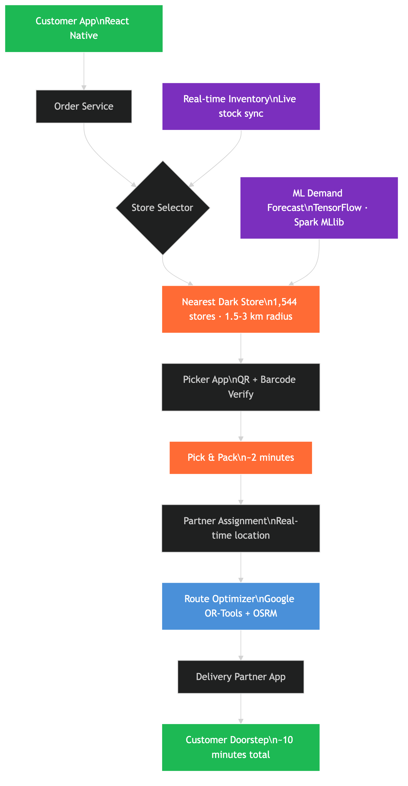
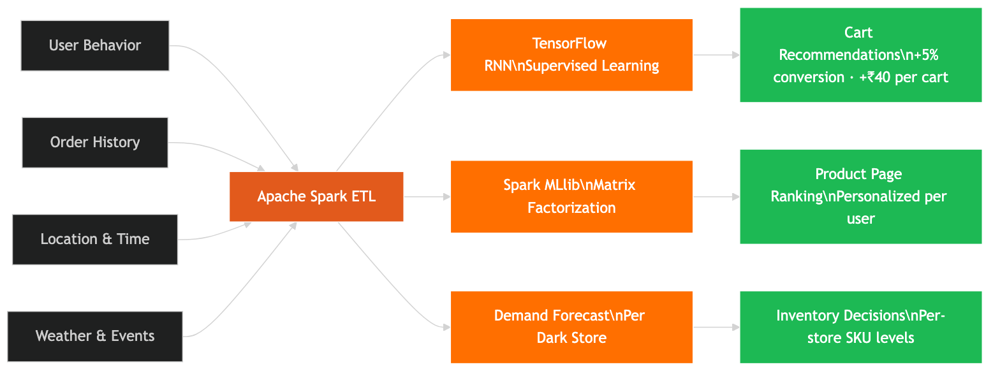
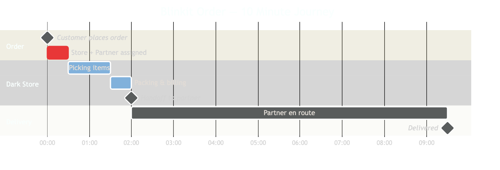

# How Blinkit Delivers in 10 Minutes: The Engineering Behind India's Fastest Grocery

You open the Blinkit app. Add milk, bread, a phone charger you forgot. Hit order. In 2 minutes, someone inside a warehouse 1.8 km away has already picked every item, packed it, and handed it to a delivery partner. 8 minutes later, your doorbell rings.

424 million orders in FY25. ₹9,421 crore GMV in a single quarter. Average delivery time: 12.5 minutes.

How does this not collapse under its own complexity? Let's break it down.

---

## The Problem with Traditional Delivery

Traditional food delivery works because the restaurant already has the inventory. Zomato or Swiggy just needs to route efficiently.

Groceries are different:
- **5,000–25,000 SKUs** per location — not a 30-item restaurant menu
- **Picking is a skill** — wrong item = refund, bad review, lost customer
- **Cold chain** — fruits, dairy, and frozen items need separate storage zones
- **Unpredictable local demand** — neighborhood-level patterns matter (a single cricket match spikes packaged snacks)

A 45-minute grocery delivery is logistics. A 10-minute delivery requires a completely different architecture built on three layers.

---

## Layer 1: The Dark Store Network — Hyperlocal Warehousing

The foundational insight: **you cannot deliver in 10 minutes from a central warehouse. Physics won't allow it.**

Blinkit's answer is **dark stores** — micro-warehouses placed inside the neighborhoods they serve. No walk-in customers. No retail floor. Just inventory, a picking system, and a dispatch area.

**Verified numbers (Q1 FY26, June 2025):**

| Metric | Value |
|--------|-------|
| Dark stores | 1,544 |
| Cities covered | 30+ |
| Coverage radius per store | 1.5–3 km |
| Store size (typical) | 2,500–4,000 sq ft |
| SKUs per store (larger stores) | Up to 25,000 |
| Break-even threshold | ~₹50 lakh GMV/month |

The density is the product. In dense metro neighborhoods — Koramangala, Andheri West, Connaught Place — there may be multiple stores within a few kilometers of each other. This redundancy ensures coverage even when one store runs out of a specific SKU.

Picking happens through a dedicated **Blinkit Picker App** (Android): the picker scans a QR code on the shelf, then a barcode on the product to verify the correct item before placing it in a crate. No guesswork, no wrong items. Pick + pack time: approximately 2 minutes per order.

---

## Layer 2: ML-Driven Inventory — Knowing What You'll Order Before You Do

A dark store is useless if it runs out of what people want. The ML layer exists to make sure that never happens — and to increase the value of every cart.

Blinkit's ML infrastructure runs on two frameworks, confirmed in their engineering blog:

- **TensorFlow** — for neural network-based supervised learning
- **Apache Spark MLlib** — for unsupervised learning
- **Apache Spark ETL** — data pipelines feeding both

### What these models do

**1. Cart recommendations — RNN via TensorFlow**
When you add an item to your cart, a Recurrent Neural Network predicts what you'll add next — not just based on your history, but based on what households *like yours* typically co-purchase. Result: **5% improvement in cart conversion** and an average **~₹40 additional spend per cart**. *(Source: Blinkit engineering blog)*

**2. Product page ranking — Collaborative Filtering via Matrix Factorization (Spark MLlib)**
The products at the top of any category page are ranked by a model that understands your preferences based on similar users. Not a generic bestseller list — personalized per user, per store.

**3. Demand forecasting per dark store**
Each dark store gets its own demand forecast accounting for: neighborhood buying patterns, time of day, day of week, weather, and local events. This is what prevents stockouts and overstocking. *(Note: The exact forecasting model architecture — XGBoost, LSTM, ARIMA — is not publicly documented by Blinkit.)*

### The data infrastructure

Confirmed at PrestoCon 2022 by Blinkit's Engineering Manager Satyam Krishna:

| Component | Technology |
|-----------|------------|
| Query engine | Presto (distributed SQL) |
| Data lake storage | AWS S3 |
| Table format | Apache Hudi + Apache Iceberg |
| Data processing | Apache Spark |
| Cloud | AWS |

The migration from a traditional cloud data warehouse was driven by cost, scale limitations, and vendor lock-in. In Satyam Krishna's words: *"It has been the primary driver of how, as a company, we have shifted our delivery model from us delivering in one day to someone who is delivering in 10 minutes."*

---

## Layer 3: Real-Time Routing — The 2-Minute Assignment Problem

Once an order is placed, three things happen simultaneously:

1. **Store selection** — the system identifies the nearest dark store with all (or most) items in stock
2. **Partner assignment** — a delivery partner is assigned based on their real-time location relative to both the dark store and the customer address
3. **Route optimization** — built using **Google OR-Tools** (combinatorial optimization) and **OSRM (Open Source Routing Machine)** for geocoding and distance calculation. Parameters: delivery SLAs, order weight, minimum total distance. *(Source: blinkit.com/blog — Order Journey)*

### The math that makes 10 minutes possible

| Step | Time |
|------|------|
| Pick + pack | ~2 min |
| Handoff to partner | ~0.5 min |
| Transit (avg 2 km at ~18 km/h) | ~7–8 min |
| **Total** | **~10 min** |

Over **70% of deliveries complete in under 15 minutes** (from earnings data). The Zomato billing platform — which covers Blinkit orders — processes approximately **10 million billing events per day** across all verticals, running on DynamoDB after migrating from TiDB. *(Source: Zomato engineering blog)*

---

## Confirmed Tech Stack

| Component | Technology | Source |
|-----------|------------|--------|
| Mobile app | React Native | Official (blinkit.com/blog) |
| Route optimization | Google OR-Tools | Official (blinkit.com/blog) |
| Geocoding / distance | OSRM | Official (blinkit.com/blog) |
| ML — supervised | TensorFlow | Official (engineering blog) |
| ML — unsupervised | Spark MLlib | Official (engineering blog) |
| Data processing | Apache Spark | Official |
| Query engine | Presto | Official (PrestoCon 2022) |
| Data lake | AWS S3 | Official |
| Table format | Apache Hudi + Iceberg | Official |
| Cloud | AWS | Official |
| Billing DB | DynamoDB (migrated from TiDB) | Official (Zomato engineering blog) |

> **Note:** Backend language stack (Java, Node.js, Python), specific app databases (PostgreSQL, Redis), and messaging systems (Kafka) are widely mentioned in third-party analyses but have **not been confirmed** in official Blinkit engineering publications. Exact demand forecasting model architecture is also not publicly documented.

---

## Business Numbers (Verified)

| Metric | Value | Period |
|--------|-------|--------|
| Dark stores | 1,544 | Q1 FY26 (Jun 2025) |
| Annual orders | 424 million | FY25 |
| Daily orders (avg) | ~1.16 million | FY25 avg |
| GOV (Q4 FY25) | ₹9,421 crore | Q4 FY25 |
| AOV | ₹707 | Q3 FY25 |
| Average delivery time | 12.5 minutes | March 2024 |
| Pick + pack time | ~2 minutes | Operational |
| Market share (quick commerce) | ~45% | FY25 |

---

## Why This Is Hard to Copy

The 10-minute model is defensible not because of any single tech decision — it's the combination:

1. **Density at scale** — 1,544 stores across 30+ cities took years and thousands of crore to build. Zepto has ~700. Instamart ~600.
2. **ML flywheel** — more orders → better demand signals → fewer stockouts → faster delivery → more orders
3. **Zomato integration** — shared delivery partner network and identity infrastructure creates real synergies that a standalone player cannot replicate

The key insight Blinkit figured out first: **the bottleneck in quick commerce isn't the delivery. It's the dark store density and the inventory intelligence.** Get those right, and 10 minutes is just physics.

---

## References

- [Blinkit Official Blog](https://blinkit.com/blog) — React Native, picker app, order journey
- [Lambda by Blinkit](https://lambda.blinkit.com/) — Engineering publications
- [PrestoCon 2022 — Blinkit Open Data Lakehouse](https://prestodb.io/videos/how-blinkit-is-building-an-open-data-lakehouse-with-presto-on-aws-satyam-krishna-akshay-agarwal/)
- [SiliconANGLE — Blinkit Data Lakehouse Case Study](https://siliconangle.com/2022/04/05/blinkit-meets-super-speedy-goals-adopting-open-data-lakehouse-awsshowcases2e2/)
- [Zomato Engineering Blog — TiDB to DynamoDB](https://blog.zomato.com/switching-from-tidb-to-dynamodb)
- [Zomato Q1 FY26 Earnings — MediaNama](https://www.medianama.com/2025/07/223-zomato-q1fy26-earnings-blinkit-127-growth-net-order-value/)
- [Zomato FY25 Annual Report — MediaNama](https://www.medianama.com/2025/07/223-eternal-fy25-annual-report-highlights-zomato-blinkit/)

---

## Hashtags

#blinkit #quickcommerce #systemdesign #softwareengineer #machinelearning #indiatech #darkstoretechnology #techexplained #zomato #buildingindia #engineeringblog
