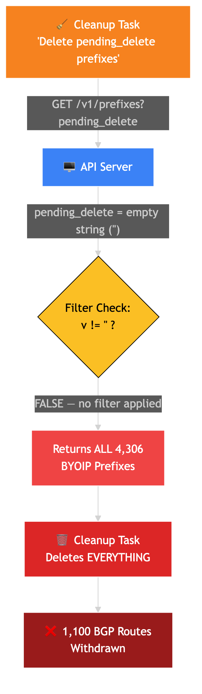
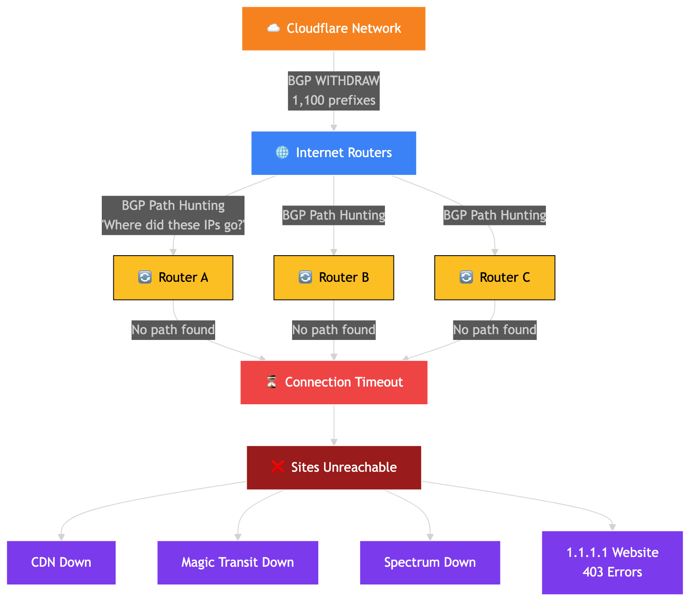
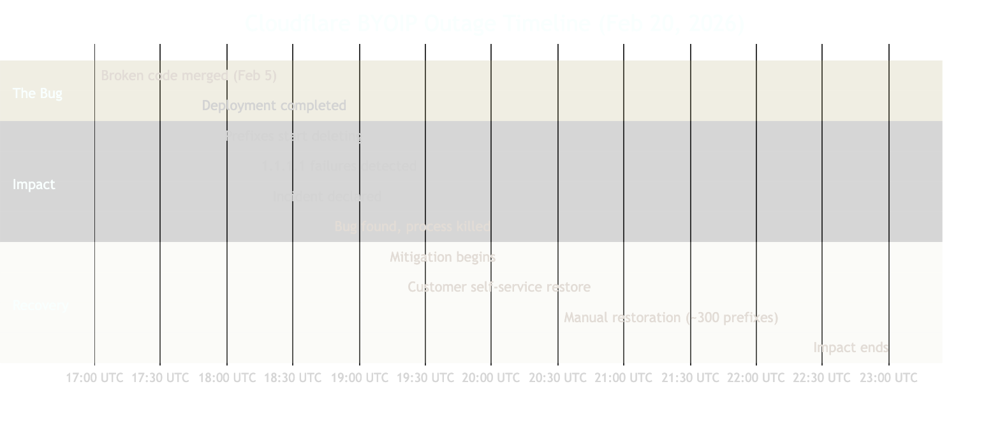
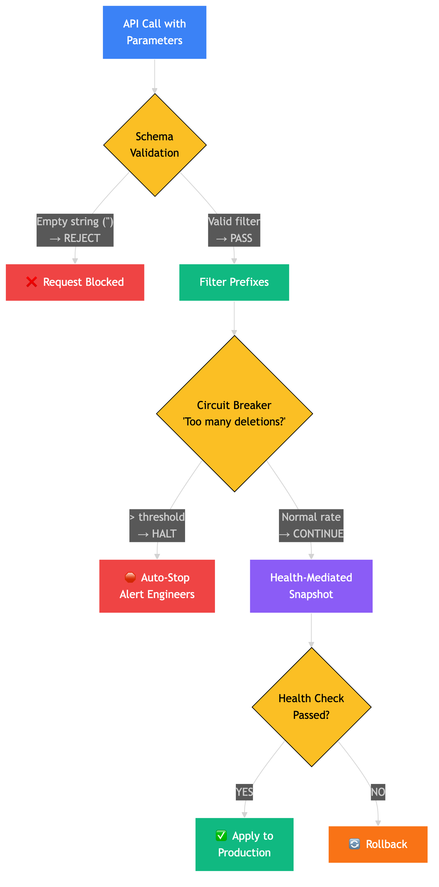

# How One Empty String Took 1,100 Websites Offline for 6 Hours — Cloudflare's February 2026 Outage

On February 20, 2026, Cloudflare — the company that protects ~20% of all websites — accidentally deleted 25% of their BYOIP customer routes from the Internet. Not a hack. Not a DDoS. An empty string in an API call.

Here's exactly what happened, why it cascaded, and how they're preventing it from happening again.

## What is BYOIP?

**Bring Your Own IP (BYOIP)** lets companies use their own IP address ranges with Cloudflare's network. Instead of getting Cloudflare-assigned IPs, enterprises bring their existing allocations — keeping address ownership while gaining Cloudflare's DDoS protection and CDN.

Cloudflare advertises these customer-owned IP prefixes via **BGP (Border Gateway Protocol)** — the Internet's routing protocol. When Cloudflare announces a prefix via BGP, traffic destined for those IPs flows through Cloudflare's network first.


## The Bug: One Empty String

Cloudflare had a cleanup task that was supposed to find and delete BYOIP prefixes marked as `pending_delete`. The API call looked like this:

```
GET /v1/prefixes?pending_delete
```

The problem? The `pending_delete` parameter was passed **with no value** — an empty string.

On the server side, the code checked:

```go
if v := req.URL.Query().Get("pending_delete"); v != "" {
    // filter by pending_delete status
}
```

When `pending_delete=""`, the condition evaluated `false`. The server returned **ALL prefixes** instead of just the ones marked for deletion. The cleanup task then proceeded to systematically delete every single one.



### The Numbers

| Metric | Value |
|--------|-------|
| Total prefixes advertised | 6,500 |
| Total BYOIP prefixes | 4,306 (66% of total) |
| Prefixes withdrawn | **1,100 (25% of BYOIP)** |
| Active deletion window | 50 minutes (17:56–18:46 UTC) |
| Total incident duration | **6 hours 7 minutes** |

## The Cascade: BGP Path Hunting

When Cloudflare withdrew those 1,100 BGP routes, the Internet didn't just show an error. It entered a state called **BGP Path Hunting**.

Here's the thing — BGP is a protocol where routers tell each other "I know how to reach this IP range." When Cloudflare withdrew the announcements, routers worldwide started desperately searching for an alternative path. Connections kept bouncing between networks, timing out, bouncing again — until they eventually failed.

Every service behind those IPs went dark:

| Product | Impact |
|---------|--------|
| Core CDN/Security | Traffic no longer routed to Cloudflare |
| Spectrum | Apps failed to proxy traffic |
| Dedicated Egress | Customers couldn't send traffic out |
| Magic Transit | End users saw connection timeouts |
| 1.1.1.1 website | HTTP 403 "Edge IP Restricted" errors |

One saving grace: DNS resolution over 1.1.1.1 Public Resolver stayed operational — the DNS service itself wasn't affected, just the website.



## The Timeline

The broken code was actually merged **15 days before the outage** (February 5). It sat unnoticed until deployment on February 20.

| Time (UTC) | Event |
|------------|-------|
| Feb 5, 21:53 | Broken code merged |
| Feb 20, 17:46 | Deployment completed |
| Feb 20, 17:56 | **Impact begins** — prefixes start getting deleted |
| Feb 20, 18:13 | 1.1.1.1 failures detected |
| Feb 20, 18:18 | Internal incident declared |
| Feb 20, 18:46 | Issue identified, process terminated |
| Feb 20, 19:19 | Customer self-service remediation begins |
| Feb 20, 20:30 | Manual restoration starts for severely impacted accounts |
| Feb 20, 23:03 | **Impact ends** |



## Recovery: Three Different Paths

Not all affected customers were equally impacted. There were three tiers:

1. **Prefixes withdrawn only (~800)** — Customers could self-restore by toggling their BGP advertisements back on via the Cloudflare dashboard.

2. **Prefixes withdrawn + partial bindings removed** — Mix of self-service and manual recovery by Cloudflare engineers.

3. **Prefixes withdrawn + ALL bindings removed (~300)** — The worst case. Service bindings (which map IPs to Cloudflare products) were completely deleted. Engineers had to use database recovery methods and push global configuration updates to every edge machine worldwide. This was the slowest path.

## The Fix: Circuit Breakers + API Standardization

Cloudflare is implementing three key safeguards:

### 1. API Schema Standardization
Prevent the empty string ambiguity. Every API parameter must have explicit validation — no more treating `""` and "no filter" as the same thing.

### 2. Circuit Breakers for Mass Deletions
The system will detect when changes are happening too fast or too broadly (e.g., withdrawing hundreds of BGP prefixes in minutes) and automatically halt the process.

### 3. Health-Mediated Configuration Snapshots
Instead of directly applying changes to production, the system will snapshot configurations and deploy them through the same pipeline as other production changes — with health metrics that can automatically stop the rollout if something looks wrong.



## Why Testing Didn't Catch It

Cloudflare's staging environment had production-like data, but the test coverage had a critical gap: **no test simulated the cleanup task independently querying the API and modifying user data without explicit input.**

The lesson: integration tests that cover automated background tasks — not just user-facing API calls — are essential.

## Key Takeaways

1. **Empty strings are not the same as null/undefined** — explicit parameter validation is non-negotiable
2. **BGP changes are nuclear** — any system that can withdraw BGP routes needs circuit breakers
3. **15 days between merge and blast** — the code was broken for 2 weeks before deployment triggered it
4. **Test your cleanup tasks** — background jobs that modify production data need their own integration tests
5. **Recovery tiers matter** — design systems so partial recovery is possible (Cloudflare's dashboard self-service saved ~800 prefixes)

## References

- [Cloudflare Blog — Cloudflare outage on February 20, 2026](https://blog.cloudflare.com/cloudflare-outage-february-20-2026/)
- [CyberSecurity News — Cloudflare Down: 6 Hour Massive Global Service Outage](https://cybersecuritynews.com/cloudflare-down-6-hour-of-massive-global-service-outage/)
- [VPNCentral — Cloudflare Faces 6-Hour Global Outage from BYOIP Config Error](https://vpncentral.com/cloudflare-faces-6-hour-global-outage-from-byoip-config-error/)
- [Laravel Cloud Incident Report: February 20, 2026](https://laravel.com/blog/laravel-cloud-incident-report-february-20-2026)
