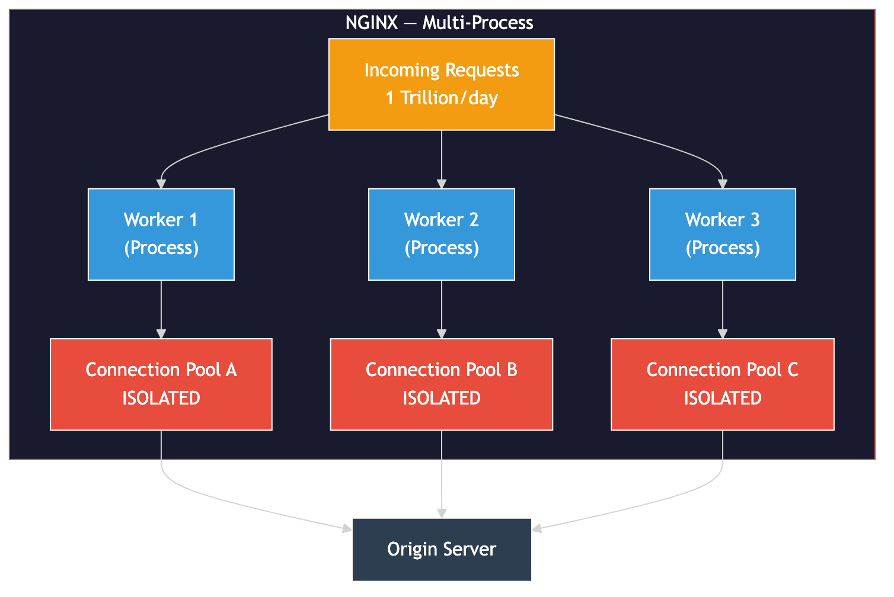
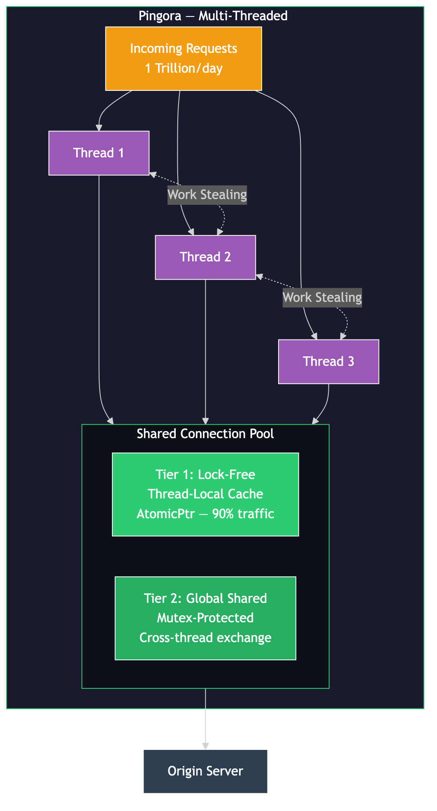
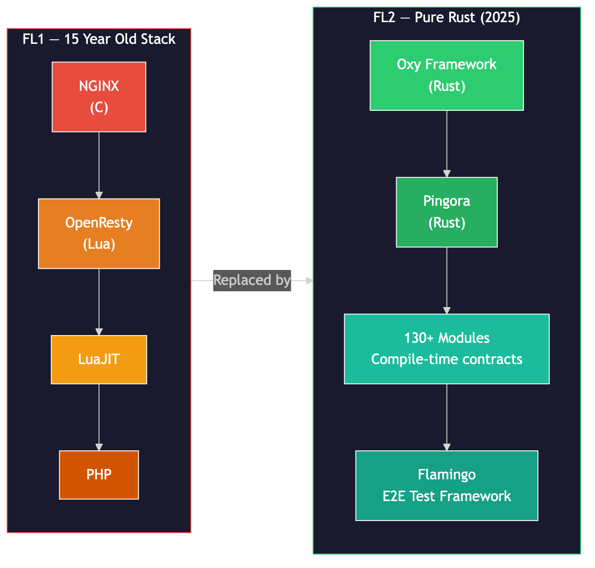
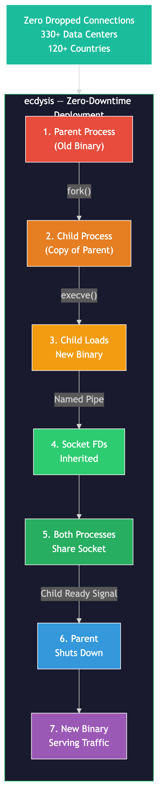

# How Cloudflare Replaced NGINX with Rust — and Upgraded 20% of the Internet

Cloudflare runs in front of roughly 20% of all internet traffic. For years, NGINX was the proxy doing that work. Then they replaced it — entirely — with a Rust-based proxy called **Pingora**. 70% less CPU. 67% less memory. Zero crashes from service code across hundreds of trillions of requests.

Here's exactly how and why they did it.

---

## The Problem with NGINX at Cloudflare's Scale

NGINX is excellent software. It serves 34% of all websites. But at Cloudflare's scale — over **1 trillion requests per day** across **330+ data centers** — its architectural decisions became bottlenecks.

### 1. Per-Worker Connection Pool Isolation

NGINX uses a **multi-process** model. Each worker is a separate OS process with its own memory space. This means each worker maintains its own connection pool to upstream (origin) servers.

The problem: a request handled by Worker A cannot reuse a connection already open in Worker B. When Cloudflare added more workers to handle more traffic, connection reuse actually got **worse** — connections were scattered across more isolated pools.

Cloudflare measured their connection reuse at **87.1%**. Sounds high — but at their scale, the remaining 12.9% meant **millions of new TLS handshakes every second** globally.

### 2. Load Imbalance

Linux's epoll-based accept queue exhibits LIFO-like behavior — the worker that most recently returned to the event loop tends to get the next connection. Under load, the busiest worker keeps getting busier while others sit idle. Enabling `SO_REUSEPORT` helps distribute connections but introduces a new failure mode: if one worker blocks, all connections in its accept queue are stuck, increasing tail latency.

### 3. Functional Limitations

Cloudflare's engineers needed to modify request headers when retrying or failing over to a different origin. NGINX's architecture doesn't allow this. From their blog:

> *"When retrying/failing over a request, sometimes we want to send a request to a different origin server with a different set of request headers. But that is not something NGINX allows us to do."*

### 4. Memory Safety in C

NGINX is written in C. Cloudflare had already experienced the consequences of memory-unsafe code — **Cloudbleed** (2017) was a buffer over-read in a C parser that leaked sensitive data. NGINX's own codebase produced **4 memory safety CVEs in 2024 alone**, just from HTTP/3:

| CVE | Type | Impact |
|-----|------|--------|
| CVE-2024-24990 | Use-after-free | Worker crash / RCE potential |
| CVE-2024-24989 | NULL pointer dereference | Worker crash |
| CVE-2024-35200 | NULL pointer dereference | Worker crash |
| CVE-2024-34161 | Memory issue | Worker crash |

---

## Why Not Just Patch NGINX?

The connection pool problem isn't a bug — it's a direct consequence of NGINX's multi-process architecture. Processes don't share memory, so pools can't be shared. Switching to threads would require rewriting NGINX's concurrency model — essentially a rewrite.

Cloudflare's customizations were already in Lua (via OpenResty), layering dynamic language fragility on top of C's memory unsafety. The NGINX open-source community was described by Cloudflare as "inactive," with development happening "behind closed doors."

The right move was a clean break.

---

## How Pingora Works

### Multithreading over Multiprocessing

The fundamental design decision: Pingora uses **threads, not processes**. All threads live in one process. This means the connection pool is **shared** across all threads.

### Async Runtime: Tokio with Work Stealing

Pingora runs on the **Tokio** async runtime in **work-stealing mode**. When a thread runs out of tasks, it steals from other threads' queues. This eliminates the load imbalance problem at the scheduler level — no thread sits idle while others are overloaded.

### Two-Tier Connection Pool

This is the key engineering innovation:

**Tier 1 — Lock-Free Hot Pool (Thread-Local)**
- Each thread has its own connection cache using `AtomicPtr` (atomic pointer swaps at CPU instruction level — no mutex)
- Handles **~90% of traffic** with zero lock overhead

**Tier 2 — Global Shared Pool (Mutex-Protected)**
- Overflow/exchange buffer for when a thread's local pool fills or empties
- Connections flow between threads through this tier
- Uses a Mutex (not RWLock) because frequent insert/remove makes reader-writer locks inefficient

Result: connections are reused across all threads while keeping hot-path latency near zero.

### Why Rust

- **Memory safety without garbage collection** — no pause-the-world latency spikes like Go or Java
- **Compile-time thread safety** — data races are compile errors, not runtime crashes
- **No null pointer dereferences** — Rust uses `Option<T>` instead
- **Performance parity with C** — same machine code output, with stricter aliasing guarantees that often enable better optimization

From Cloudflare: *"Rust can do what C can do in a memory safe way without compromising performance."*

---

## The Numbers

| Metric | NGINX | Pingora | Improvement |
|--------|-------|---------|-------------|
| CPU usage | baseline | -70% | ~3x more efficient |
| Memory usage | baseline | -67% | ~3x more efficient |
| Connection reuse (major customer) | 87.1% | 99.92% | 160x fewer new connections |
| TTFB (median) | baseline | -5ms | — |
| TTFB (p95) | baseline | -80ms | — |

The connection reuse improvement saves **434 years of TLS handshake time per day** globally. That's compute and latency that simply no longer exists.

And Cloudflare's own statement:

> *"Since Pingora's inception we've served a few hundred trillion requests and have yet to crash due to our service code."*

---

## FL2: Replacing the Entire Stack

Pingora was just the proxy layer. In September 2025, Cloudflare went further with **FL2** (Forward Layer 2) — replacing the entire "brain" of Cloudflare.

**FL1** (the old system) was a 15-year-old monolith:
- NGINX + OpenResty + LuaJIT + PHP
- Grown organically, tightly coupled

**FL2** is pure Rust:
- Built on **Oxy** — Cloudflare's internal Rust proxy framework (itself built on Pingora)
- **130+ modules** built by **100+ engineers**
- Every module has explicit input/output contracts enforced at **compile time**
- No module performs I/O directly — strict separation
- Tested with **Flamingo** — thousands of concurrent end-to-end tests

Results:
- **10ms median latency reduction**
- **25% CDN performance boost** (third-party verified)
- Less than half the CPU and memory of FL1

The "20% of the internet" framing comes from Cloudflare's network size — they sit in front of roughly 20% of all web traffic globally.

---

## ecdysis: Zero-Downtime Deployments

One problem remained: how to deploy new code across 330+ data centers without dropping a single connection?

Cloudflare built **ecdysis** — a Rust library for graceful restarts, open-sourced in February 2026 after **5 years** in production.

How it works:
1. Parent process `fork()`s a child
2. Child replaces itself with the new binary via `execve()`
3. Socket file descriptors are passed to the child via a **named pipe**
4. Both processes share the socket during transition — **zero dropped connections**
5. Child signals readiness; parent shuts down

Production stats:
- Running since **2021**
- **330+ data centers**, **120+ countries**
- Each restart preserves **hundreds of thousands** of requests that would've been dropped in a naive stop/start
- Apache 2.0 license, Tokio-integrated, systemd socket activation supported

---

## The Broader Shift: Rust in Infrastructure

Cloudflare isn't alone in this migration:

| Who | What |
|-----|------|
| **Linux Kernel** | 600,000+ lines of production Rust. DRM subsystem ~1 year from requiring Rust for new drivers |
| **Microsoft** | Targeting 1 billion lines of C/C++ for Rust migration |
| **Android** | Memory safety vulnerabilities dropped below 20% (from ~70%) after Rust adoption |
| **AWS** | Firecracker (Lambda/EC2 foundation) written entirely in Rust |
| **Discord** | Backend rewritten from Go to Rust for latency |

A University of Waterloo study found **67% of Linux kernel CVEs** from 2020–2024 were in memory safety categories that Rust's ownership model structurally prevents.

As of 2025, **45.5% of companies** use Rust in production — up 17.6% year-over-year.

---

## Summary

| What | Detail |
|------|--------|
| Problem | NGINX's per-worker connection pools don't share at scale |
| Solution | Pingora — multithreaded Rust proxy with shared two-tier connection pool |
| Key number | Connection reuse: 87.1% → 99.92% (160x improvement) |
| Full replacement | FL2 replaced 15-year NGINX+LuaJIT+PHP stack with pure Rust |
| Zero downtime | ecdysis handles graceful restarts across 330+ data centers |
| Safety | Hundreds of trillions of requests, zero crashes from service code |

---

## Reel Script

| # | Scene | On-Screen (English Only) | Voiceover (Hindi/Hinglish) |
|---|-------|--------------------------|---------------------------|
| 1 | Hook | "Cloudflare replaced NGINX with Rust — handles 20% of the internet" | Cloudflare ne NGINX hata diya. Rust mein naya proxy banaya — PINGORA. Yeh ab internet ka 20% handle karta hai. |
| 2 | NGINX Problem | Diagram: isolated worker pools, "87.1% reuse — sounds good, isn't enough" | NGINX mein har worker ka apna connection pool hai — share nahi hota. Reuse ratio? 87%. Scale pe? Kaafi nahi. |
| 3 | The Numbers | "87.1% → 99.92% = 160x improvement / 434 years TLS saved per day" | Pingora ke baad? 99.92%. 160 GUNA improvement. Har din 434 SAAL ki TLS time bach'ti hai globally. |
| 4 | Pingora Architecture | Diagram: shared pool, work stealing, two-tier system | Multi-threading, shared pool, Tokio work-stealing. 70% kam CPU, 67% kam memory. |
| 5 | FL2 | "15-year stack → Pure Rust / 130+ modules, compile-time contracts" | 2025 mein poora stack replace kiya — NGINX plus LuaJIT plus PHP ko pure Rust mein. |
| 6 | Safety + CTA | "Hundred trillion requests. Zero crashes." + Comment RUST | NGINX ke C code mein 2024 mein CHAAR CVEs. Rust mein? Compile time pe catch. Comment karo RUST. |

---

## References

- [How we built Pingora, the proxy that connects Cloudflare to the Internet](https://blog.cloudflare.com/how-we-built-pingora-the-proxy-that-connects-cloudflare-to-the-internet/) — Cloudflare Blog, September 2022
- [Open sourcing Pingora](https://blog.cloudflare.com/pingora-open-source/) — Cloudflare Blog, February 2024
- [Cloudflare just got faster and more secure, powered by Rust](https://blog.cloudflare.com/20-percent-internet-upgrade/) — Cloudflare Blog, September 2025
- [Shedding old code with ecdysis](https://blog.cloudflare.com/ecdysis-rust-graceful-restarts/) — Cloudflare Blog, February 2026
- [Pingora GitHub Repository](https://github.com/cloudflare/pingora)
- [Pingora Internals Documentation](https://github.com/cloudflare/pingora/blob/main/docs/user_guide/internals.md)
- [NGINX Official Security Advisories](https://nginx.org/en/security_advisories.html)
- [State of Rust 2025 — JetBrains](https://blog.jetbrains.com/rust/2026/02/11/state-of-rust-2025/)
- [Inside NGINX — NGINX Blog](https://blog.nginx.org/blog/inside-nginx-how-we-designed-for-performance-scale)
- [The sad state of Linux socket balancing — Cloudflare Blog](https://blog.cloudflare.com/the-sad-state-of-linux-socket-balancing/)

---

## Hashtags

#cloudflare #nginx #rust #pingora #systemdesign #proxy #reverseproxy #softwareengineer #coding #webdev #rustlang #infrastructure #memorysafety #performance
