# Consistent Hashing — The Ring That Saves Your Cache

> *"System design interview mein consistent hashing zaroor aata hai. Aur 90% candidates ise galat samjha ke jaate hain."*

You add **one** new database server. Your entire cache gets wiped. Your database goes down for an hour. Why does that happen — and how does a 1997 algorithm still run Cassandra, DynamoDB, ScyllaDB, and Discord today?

This is the deep-dive doc. Read it once and you will never get this question wrong in an interview again. It is written in plain English with animated visuals you can pause and study.

---

## TL;DR (read this first)

| Concept | One-line answer |
|---|---|
| **Why naive `hash(key) % N` breaks** | Changing N (adding or removing a server) remaps almost every key. Cache stampede. |
| **What consistent hashing does** | Puts both keys *and* servers on the same circular hash space. Each key belongs to the next clockwise server. |
| **Why it scales** | Adding 1 server moves only ~`1/(N+1)` of keys. For 10 → 11 servers, that's about **9%**, not 100%. |
| **What virtual nodes fix** | Uneven distribution + cascading failover. ~100 vnodes per real server makes load uniform. |
| **Who uses it in production** | Cassandra, DynamoDB, ScyllaDB, Discord, Akamai, Memcached client pools, Riak. |
| **What the interviewer wants to hear** | "Ring + Virtual Nodes." Then explain *why*. |
| **Common trap** | Don't confuse Redis Cluster (which uses 16,384 fixed hash slots) with consistent hashing. They are different. |

---

## 1. The Problem: Naive Hashing Doesn't Scale

You're building a cache layer in front of your database. You have **10 cache servers**. To distribute keys across them, you reach for the simplest scheme that works:

```python
server_index = hash(key) % N   # N = 10
```

Each key now has a deterministic home. Lookup is O(1). Your cache hit rate is around 95%. Life is good.

Then traffic doubles. You provision an **11th server**. N becomes 11.

```python
server_index = hash(key) % 11   # the modulus changed
```

Here's the problem. `hash("user:42") % 10 = 2` but `hash("user:42") % 11 = 9`. The key just **moved**. And not just that one — almost every key in the system moved, because the modulus changed for *everyone*.

### Watch what happens

<p align="center">
  
</p>

Before you add the 11th server, the 3 sample keys (`user:42`, `user:99`, `user:7`) point cleanly to specific servers. The moment N changes from 10 to 11, **all the arrows snap to different servers** in red — every key in the system has a new home, and the cache hit rate collapses to zero.

### What actually breaks

1. **Cache hit ratio crashes from ~95% to near 0%.** Every lookup goes to the wrong server, finds nothing, and falls through to the database.
2. **Every miss becomes a database query — all at once.**
3. **The database, sized to handle 5% of read traffic, suddenly gets 100%.** Connection pool exhausted. Latency spikes.
4. **Cascading failure.** Other services time out waiting for the database. Alerts everywhere.

This is called a **cache stampede**. One server added → entire production goes down.

The exact same disaster happens when a server *fails*. N drops from 10 to 9, and again every key remaps. So this is not just a scaling problem — it's a reliability problem too.

> **The lesson:** you cannot scale a distributed cache or database with `hash(key) % N`. The math is hostile to change.

---

## 2. The Fix: Consistent Hashing (Karger, 1997)

In 1997, David Karger and his team at MIT published a paper called *"Consistent Hashing and Random Trees: Distributed Caching Protocols for Relieving Hot Spots on the World Wide Web."* It was originally designed to solve exactly this problem for **Akamai's CDN** — and the same algorithm now runs every distributed database you've heard of.

The core idea fits in one sentence:

> **Instead of mapping keys to a fixed number of servers, map both keys *and servers* onto a circular hash space — and let each key belong to the next server going clockwise.**

That's it. That's the whole trick. Now let's break down what that actually means.

### The Hash Ring

Imagine a circle. Not a small one — a *huge* one. The circle represents the entire output range of your hash function:

- For a 32-bit hash, that's `[0, 2^32 - 1]` — over 4 billion positions.
- Cassandra uses 64-bit positions.
- DynamoDB uses 128-bit.

The exact size doesn't matter — what matters is that it's a **circular space**. When you go past the highest value, you wrap around back to zero. Like a clock face, but with billions of positions instead of 12.

### See the ring in motion

<p align="center">
  
</p>

The ring is the hash space `[0, 2^32)`. Four servers (S-A, S-B, S-C, S-D) are placed at random points on the ring — wherever their hash values land. The yellow key dot orbits the ring continuously to show how a key "looks for" its server: it follows the ring clockwise from its hash position until it hits a server.

### The 4-step algorithm

**Step 1 — Hash the servers.** Each server gets hashed using the same hash function as the keys. Whatever value comes out, that's where the server "sits" on the ring.

```
hash("server-A") = 1.2 billion  →  position 1.2B on the ring
hash("server-B") = 2.7 billion  →  position 2.7B
hash("server-C") = 3.9 billion  →  position 3.9B
hash("server-D") = 0.4 billion  →  position 0.4B
```

**Step 2 — Hash the keys.** When a key arrives, you hash it the same way to find *its* position on the ring.

**Step 3 — Walk clockwise.** From the key's position, walk clockwise around the ring until you hit the next server. That server owns the key.

```
hash("user:42") = 1.5 billion  →  walk clockwise → first hit is server-B (2.7B)
hash("user:99") = 0.1 billion  →  walk clockwise → first hit is server-D (0.4B)
hash("user:7")  = 3.1 billion  →  walk clockwise → first hit is server-C (3.9B)
```

**Step 4 — That's it.** No central registry. No lookup table. No coordination. Pure math.

> **Key insight:** every server is responsible for the *arc* of the ring that ends at its position. So `server-D` (at 0.4B) owns everything from where the previous server ends, all the way up to position 0.4B. This is what makes the next step work.

---

## 3. The Magic — Adding a Server Only Moves One Slice

This is the part that wins interviews. Watch carefully.

You add a new server, `server-E`, with `hash("server-E") = 2.0 billion`. It sits between A (1.2B) and B (2.7B) on the ring.

> **Only the keys whose hashes fall between 1.2B and 2.0B need to move.** They used to belong to B (the next clockwise server), but now E is closer. Every other key on the ring stays exactly where it is.

### See it happen

<p align="center">
  
</p>

The ring has 4 original servers (S-A, S-B, S-C, S-D) and 8 keys scattered around it. After 2 seconds, a new red server fades in. **Only one key** — the gold one in the slice between S-A and the new server — animates over to the new server. The other 7 keys stay exactly where they are. The stat boxes show **9% moved, 91% safe**.

### The math

With N servers, adding one more moves only `1/(N+1)` of the keys. For 10 → 11 servers, that's `1/11 ≈ 9%`, **not** 100%.

> **Senior signal:** in interviews, candidates routinely say "10%" for 10 → 11 servers. The exact answer is **~9%** because it's `1/(N+1)`, not `1/N`. Saying the right number signals you've actually thought it through.

The same logic works in reverse. When a server fails, only the keys that server owned get reassigned to the next clockwise server. Everyone else is unaffected. This is *huge* for reliability — a single server crash no longer triggers a cluster-wide cache wipe.

---

## 4. The Hidden Problem: Hot Spots

So far so good. But there's a catch.

With only 4 servers placed at random positions on a 4-billion-point ring, the segments aren't equal. One server might own 10% of the ring while another owns 40%. That means traffic is uneven — one server gets hammered while another sits idle.

And when a server fails, **all of its load** goes to the **next clockwise server**. That server now handles double the traffic. If it can't keep up, it falls over too — and now its load goes to *its* next clockwise neighbor. Cascading failure.

This is the same problem we were trying to solve, just in a smaller form. We need one more refinement.

---

## 5. The Fix to the Fix: Virtual Nodes

The solution, popularized by Amazon's 2007 Dynamo paper (the foundation of DynamoDB), is brilliantly simple:

> **Don't put each physical server on the ring once. Put it on the ring hundreds of times, at different positions.**

Each physical server is represented by **100–256 virtual nodes** (also called "vnodes" or "tokens"), each placed at a random position around the ring. With hundreds of points per server, the law of large numbers takes over and the ring gets covered nearly uniformly. Every physical server ends up owning roughly the same fraction of the keyspace.

### See the shatter

<p align="center">
  
</p>

At the start, one server is shown as a single tall pillar on the top of the ring. The pillar then fades out and is replaced by ~50 small dots scattered evenly around the entire ring (cyan + gold = two real servers, each shattered into ~25 vnodes).

### Two wins from one trick

1. **Uniform distribution.** No more hot servers. Load is spread evenly because the law of large numbers smooths out random placement.
2. **Graceful failover.** When a server dies, its virtual nodes disappear from many points around the ring, so its load gets spread across **all** the remaining servers — not just the next clockwise one. No cascading collapse.

Cassandra defaults to many virtual nodes per server. ScyllaDB inherits the same model. DynamoDB uses the same idea internally. This is the *production-grade* version of consistent hashing — and it's what every "big data" system you've heard of actually runs.

> **One way to remember it:** consistent hashing without vnodes is like trying to balance a wobbly table by adding shims under random legs. Vnodes are like sanding all the legs to the same length — the table stays level no matter what you put on it.

---

## 6. Who Uses This in Production?

| System | How they use it |
|---|---|
| **Cassandra** | Consistent hashing with virtual nodes for partitioning across the cluster. |
| **ScyllaDB** | Cassandra-compatible model — same ring, same vnodes. |
| **DynamoDB** | Originated the Dynamo paper that popularized vnodes. |
| **Discord** | Chat backend runs on Cassandra → migrated to ScyllaDB → consistent hashing under the hood. Trillions of messages. |
| **Akamai CDN** | The original use case from the 1997 Karger paper. |
| **Memcached client pools** (`ketama`) | Standard client-side library for consistent hashing across memcached nodes. |
| **Riak KV** | Distributed key-value store directly inspired by the Dynamo paper. |

### ⚠ The Trap Most Candidates Fall Into

> **Redis Cluster does NOT use classic consistent hashing.**
>
> It uses a different scheme: **16,384 fixed hash slots** (`CRC16(key) mod 16384`), distributed across nodes. The *goal* is the same (avoid mass remap when you resize), but the mechanism is different.
>
> Don't conflate the two in an interview. If asked "which cache uses consistent hashing?", the right answer is **Memcached client pools (via the `ketama` library)** — not Redis Cluster.

---

## 7. The Interview Lens — How to Actually Answer This

Why does this question come up in literally every L5+ system design interview?

Because it tests **three things at once**:

1. **Do you understand why naive partitioning fails?**
2. **Do you know the standard solution that production systems actually use?**
3. **Can you reason about trade-offs?** (uniform distribution, failover behavior, the vnodes refinement)

### The 3-line answer that signals senior

When the interviewer asks how you'd partition data across nodes, here's the answer that wins:

> **"I'd use consistent hashing with virtual nodes. Servers and keys both hash onto a circular space, each key belongs to the next clockwise server, and each physical server is represented by ~100 virtual nodes for uniform distribution. When I add a node, only ~`1/N` of keys move — not all of them — and when a node fails, its load spreads across all remaining servers, not just one."**

That's it. Three sentences. Strong-hire signal.

### Common mistakes (and why they tank the round)

| Mistake | Why it tanks |
|---|---|
| Naming "Cassandra" without explaining the ring | Sounds like you Googled the architecture, didn't actually understand it. |
| Saying "10 → 11 nodes = 10% move" | Off by one. The right answer is `1/(N+1) ≈ 9%`. Sloppy math = junior signal. |
| Forgetting virtual nodes | Naive consistent hashing has hot spots. Strong-hire candidates always mention vnodes. |
| Mentioning "Redis Cluster" as an example | Wrong — Redis Cluster uses fixed hash slots, not consistent hashing. Instant credibility loss. |
| Skipping the "what happens on node failure" trade-off | Interviewers actively probe this. Be ready with the cascading-load answer + how vnodes fix it. |
| Drawing the ring before clarifying requirements | At Google L7+, jumping to architecture without clarifying is a red flag. Always state the goal first. |

---

## 8. TL;DR (one more time)

- Naive `hash(key) % N` breaks because changing N remaps almost every key.
- Consistent hashing puts both keys and servers on a giant circular hash space.
- Each key belongs to the next clockwise server.
- Adding a node moves only ~`1/(N+1)` of the keys, **not** all of them.
- Virtual nodes (~100 per physical server) fix uneven distribution and graceful failover.
- Used in production by Cassandra, ScyllaDB, DynamoDB, Discord, Akamai, Memcached client pools, Riak.
- Redis Cluster uses **fixed hash slots** — same goal, different mechanism. Don't confuse them.
- In an interview, just say: **"Ring + Virtual Nodes."** Then explain *why*.

---

## References (the real sources, not Medium summaries)

- Karger et al., *Consistent Hashing and Random Trees: Distributed Caching Protocols for Relieving Hot Spots on the World Wide Web*, STOC 1997 — [paper PDF](https://www.cs.princeton.edu/courses/archive/fall09/cos518/papers/chash.pdf)
- DeCandia et al., *Dynamo: Amazon's Highly Available Key-value Store*, SOSP 2007 — [paper PDF](https://www.allthingsdistributed.com/files/amazon-dynamo-sosp2007.pdf)
- Apache Cassandra — [Architecture overview](https://cassandra.apache.org/doc/latest/cassandra/architecture/dynamo.html)
- Discord Engineering, *How Discord Stores Trillions of Messages* — [blog post](https://discord.com/blog/how-discord-stores-trillions-of-messages)
- Redis Cluster Specification (the contrast example) — [Redis docs](https://redis.io/docs/latest/operate/oss_and_stack/reference/cluster-spec/)

---

## Diagrams in this article

All animated diagrams in this article are stored as standalone SVG files in `images/consistent-hashing-interview/`. When viewed in any browser or markdown preview that supports external SVG, the animations will play automatically and loop continuously.

| File | What it shows |
|---|---|
| `naive-trap-animation.svg` | Why `hash(key) % N` causes mass remap when you add a server |
| `ring-animation.svg` | The hash ring with 4 servers and a key orbiting clockwise |
| `add-node-animation.svg` | Adding a 5th server — only ~9% of keys move, 91% stay safe |
| `vnode-shatter-animation.svg` | One server pillar shattering into ~25 virtual nodes for uniform distribution |

For static fallback (e.g., where SMIL is not supported), the original Mermaid PNG diagrams are also available in the same folder: `naive-hash-fail.png`, `ring-architecture.png`, `vnode-distribution.png`, `production-users.png`.

---

## Hashtags

#systemdesign #consistenthashing #distributedsystems #softwareengineer #coding #cassandra #dynamodb #interviewprep #scalability #backend #faang #techinterview
