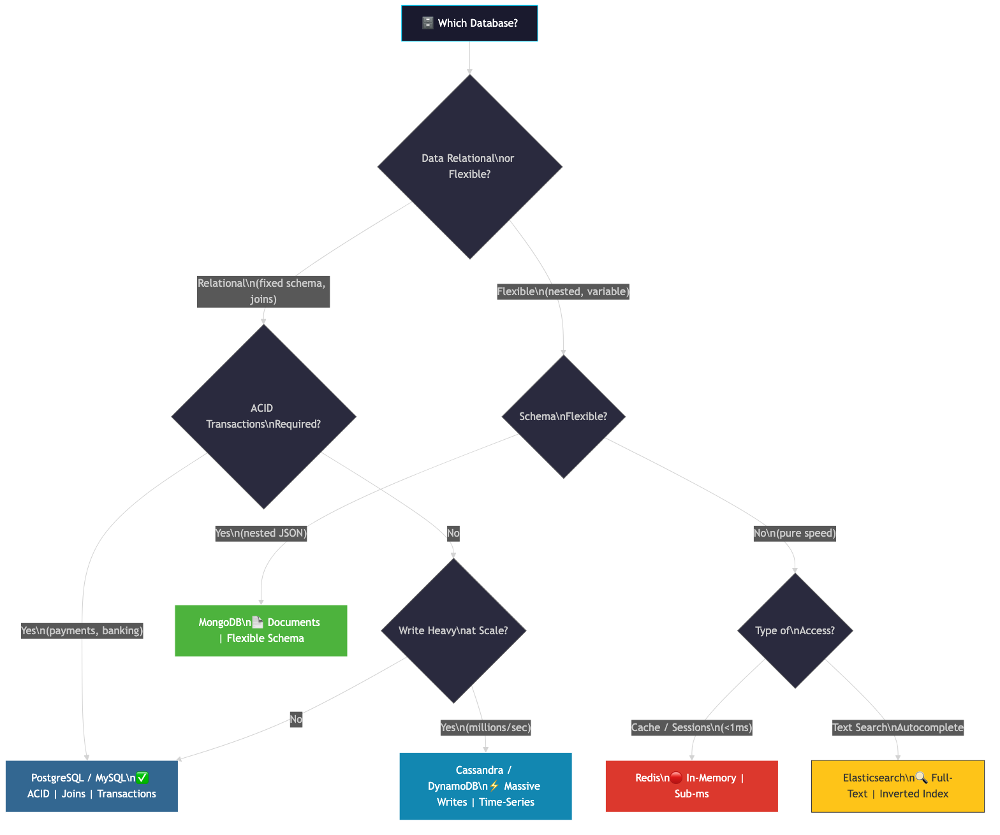
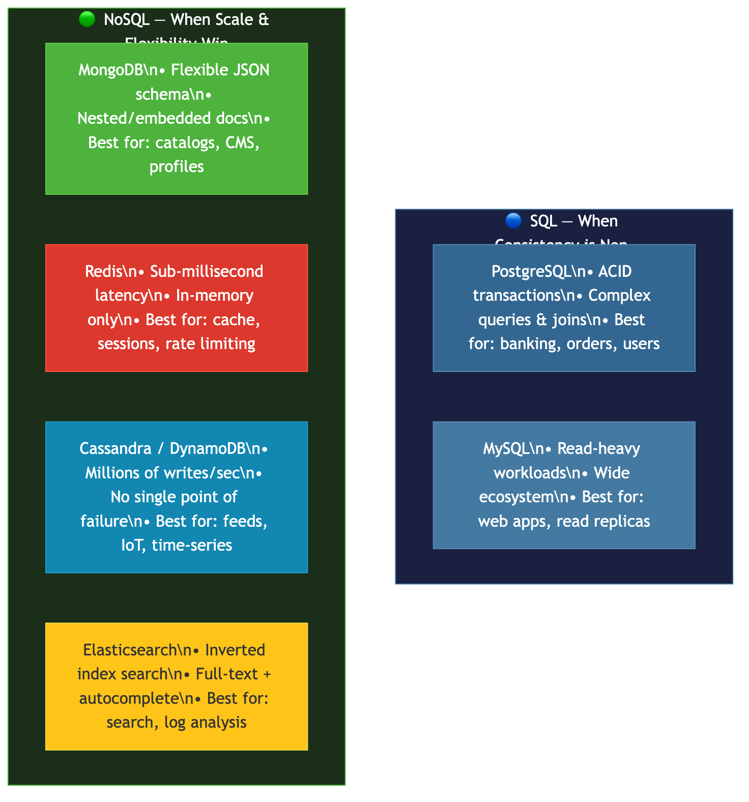

# Which Database Should You Use? The System Design Interview Framework

> Every system design interview eventually asks: "Which database would you use and why?" This is not a trivia question. It's a **decision-making** test. Here's the framework that separates prepared candidates from the rest.

---

## The Wrong Answer (That 90% of Freshers Give)

"I'll use MySQL."

That's it. No reasoning. No tradeoffs. No acknowledgment that different problems demand different data stores.

Here's what the interviewer hears: *"I don't know how to think about data modeling under constraints."*

The right answer is not about naming the correct database. It's about **asking the right questions first**.

---

## The Decision Framework: 3 Questions Before You Pick

Before touching a database name, ask these three questions:

### Question 1: Is the data relational or flexible?

- **Relational / structured** → fixed schema, rows and columns, data joins required → lean toward **SQL**
- **Flexible / nested** → variable shape, embedded documents, no joins → lean toward **NoSQL**

### Question 2: Do you need ACID transactions?

ACID = Atomicity, Consistency, Isolation, Durability.

- **Yes** (payments, banking, order management, anything where partial failure = disaster) → **SQL**
- **No** (social feeds, analytics, logs, content delivery) → NoSQL is fine

### Question 3: What is the read/write pattern?

- **Write-heavy, massive scale** → Cassandra, DynamoDB
- **Read-heavy, low latency** → Redis cache layer
- **Balanced, relational** → PostgreSQL / MySQL
- **Text search / autocomplete** → Elasticsearch on top of primary DB

---

## When to Use SQL (PostgreSQL / MySQL)

**Use when:** data is structured, relationships matter, transactions are critical.

| Use Case | Why SQL |
|---|---|
| E-commerce order system | Order → User → Product → Payment all must be consistent |
| Banking / fintech | ACID guarantees: a debit and credit must both succeed or both fail |
| User accounts + profiles | Relational data (user → roles → permissions) |
| Inventory management | Concurrent updates need isolation |

**PostgreSQL vs MySQL:**
- PostgreSQL: more advanced features (JSONB, CTEs, window functions, full-text search). Preferred for complex queries.
- MySQL: simpler, widely deployed, great for read-heavy workloads. Twitter historically used MySQL at massive scale.

> **Verified:** Instagram uses PostgreSQL for core user data. Twitter used MySQL extensively before building distributed systems on top. (Source: Instagram Engineering Blog, Twitter Engineering Blog)

---

## When to Use NoSQL

NoSQL is not "SQL but worse." It's a different tool for different problems.

### MongoDB (Document Store)

**Use when:** schema is flexible, data is nested/embedded, no complex joins needed.

```json
// A product document — nested, flexible
{
  "_id": "prod_123",
  "name": "MacBook Pro",
  "specs": { "ram": "16GB", "storage": "512GB" },
  "variants": [{"color": "Space Gray", "price": 1299}]
}
```

**Good for:** product catalogs, CMS, user profiles, mobile app backends, anywhere schema evolves.

### Redis (Key-Value / In-Memory)

**Use when:** you need sub-millisecond latency. Redis keeps everything in RAM.

**Never use as your only database.** Use it as a cache layer, session store, or rate limiter on top of a primary DB.

**Good for:** sessions, caching, rate limiting, leaderboards, pub/sub, real-time counters.

> Redis is single-threaded for command execution (covered in the Redis architecture reel).

### Cassandra / DynamoDB (Wide-Column)

**Use when:** you need massive write throughput at scale, often time-series data.

- Cassandra: open-source, built at Facebook for inbox search. Distributed, no single point of failure.
- DynamoDB: AWS managed version. Pay-per-use, auto-scaling.

**Good for:** activity feeds, IoT sensor data, event logs, viewing history, time-series metrics.

> **Verified:** Netflix uses Apache Cassandra for storing viewing history data. (Source: Netflix Tech Blog)

### Elasticsearch (Search Engine)

**Use when:** you need full-text search, autocomplete, or complex filtering.

Built on Apache Lucene, Elasticsearch maintains an inverted index — mapping every unique word to the documents containing it, enabling near-instant text search across millions of records.

**Never use as primary DB.** Use it alongside your primary store, syncing data via change-data-capture or event streams.

**Good for:** product search, log analysis (ELK stack), autocomplete, recommendation filtering.

---

## The Interview Answer Formula

This is what a strong answer sounds like:

> *"I'd use PostgreSQL as the primary store because the data is relational — users, orders, and products all have clear relationships and we need ACID guarantees for payments. On top of that, I'd add Redis for session management and caching frequently accessed product data to reduce database load. If we add a search feature later, I'd sync to Elasticsearch for full-text product search."*

**Why this works:**
- Names a specific database (not just "SQL")
- Explains **why** (relational + ACID)
- Adds a second database for a specific use case
- Mentions future extensibility → shows architectural thinking

---

## Quick Reference: When to Use Which

| Database | Type | Use When |
|---|---|---|
| PostgreSQL | Relational | Structured data, ACID required, complex queries |
| MySQL | Relational | Simpler relational workloads, read-heavy |
| MongoDB | Document | Flexible schema, nested data, no joins |
| Redis | Key-Value | Sub-ms latency, caching, sessions |
| Cassandra | Wide-Column | Massive writes, time-series, distributed |
| DynamoDB | Key-Value/Doc | AWS ecosystem, auto-scale, serverless |
| Elasticsearch | Search | Full-text search, autocomplete, log analysis |

---

## CAP Theorem (Bonus — If Interviewer Goes Deeper)

CAP Theorem: In a distributed system, you can guarantee only 2 of these 3:

- **C**onsistency — every read gets the latest write
- **A**vailability — every request gets a response
- **P**artition Tolerance — system works even if network partitions happen

Since network partitions are unavoidable in distributed systems, real choice is between **CP** (consistency + partition tolerance, e.g. HBase, Zookeeper) and **AP** (availability + partition tolerance, e.g. Cassandra, DynamoDB).

SQL databases prioritize **CP**. Most NoSQL databases prioritize **AP** (eventual consistency).

---

## Diagrams





---

## References

- [Instagram Engineering — Sharding & IDs at Instagram](https://instagram-engineering.com/sharding-ids-at-instagram-1cf5a71e5a5c)
- [Netflix Tech Blog — Cassandra at Netflix](https://netflixtechblog.com/tagged/cassandra)
- [AWS — DynamoDB Overview](https://aws.amazon.com/dynamodb/)
- [Elasticsearch — How search works](https://www.elastic.co/guide/en/elasticsearch/reference/current/documents-indices.html)
- [MongoDB — When to use MongoDB](https://www.mongodb.com/nosql-explained/when-to-use-nosql)
- [PostgreSQL Documentation](https://www.postgresql.org/docs/)

---

*Comment "DATABASE" on the reel to get this doc sent to you.*

*Follow @techvijayforyou for more system design breakdowns.*
