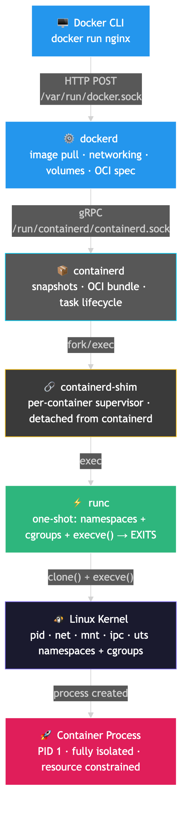
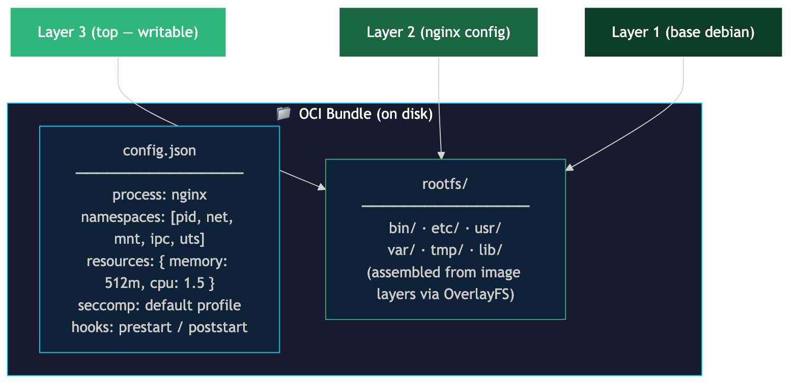
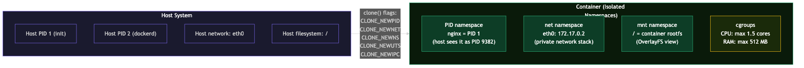
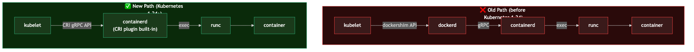

# What Actually Happens When You Run `docker run`

> Comment **DOCKER** to get the full breakdown doc.

You've typed `docker run nginx` hundreds of times. You know it starts a container. But between that command and your app accepting traffic, **seven distinct things happen** — and most engineers can only name one.

This matters because Kubernetes removed Docker from its runtime stack in 2022. Engineers who understand *why* — who know what containerd, runc, and the OCI spec actually are — make better architecture decisions and ace infrastructure interviews. Engineers who don't are confused when `docker` stops working on their K8s node.

Let's trace every step.

---

## The Full Call Stack

```
docker run nginx
      │
      ▼ HTTP POST → /var/run/docker.sock
    dockerd              ← image pull, networking, volumes, OCI spec assembly
      │
      ▼ gRPC → /run/containerd/containerd.sock
  containerd             ← snapshots, bundle assembly, task lifecycle, shim management
      │
      ▼ fork/exec
  containerd-shim        ← per-container supervisor, detached, persists for container lifetime
      │
      ▼ exec
    runc                 ← one-shot: clone() → namespaces + cgroups + pivot_root → execve() → EXITS
      │
      ▼
  container process      ← PID 1 inside container, isolated namespaces, constrained by cgroups
```



---

## Step 1: Docker CLI

You type `docker run nginx`. The Docker CLI is just a thin HTTP client. It sends an HTTP POST request to dockerd's Unix socket at `/var/run/docker.sock`.

The CLI does almost nothing itself. It's a UI wrapper.

---

## Step 2: dockerd (Docker Engine Daemon)

This is where the high-level orchestration happens. When dockerd receives your request, it:

1. **Pulls the image** if it's not already cached locally (pulls each layer from the registry)
2. **Sets up networking** — creates a virtual network interface, assigns an IP address inside the bridge network
3. **Attaches volumes** — maps your `-v` mounts into the container's filesystem
4. **Assembles the OCI runtime spec** — a config.json describing exactly how to run the container

Then dockerd hands off to containerd over gRPC. The key insight: **dockerd does NOT run containers itself**. It delegates everything to containerd.

---

## Step 3: containerd

containerd is an OCI-compliant "high-level container runtime." Its job:

1. **Pull and store image layers** in its content store
2. **Build the container filesystem** — using OverlayFS, it stacks image layers into a single unified read-write filesystem (the rootfs)
3. **Assemble the OCI bundle** — a directory on disk containing:
   - `rootfs/` — the container's root filesystem
   - `config.json` — the runtime configuration: which namespaces to create, cgroup limits, the command to run, environment variables, mounts, seccomp rules
4. **Spawn a shim process** for this container
5. **Hand the OCI bundle to the shim**



---

## Step 4: containerd-shim

This is the least-understood component. The shim is a **lightweight per-container daemon**. Here's what makes it special:

- As soon as it's spawned, the shim **double-forks** to detach from containerd's process tree. It becomes a child of PID 1 (init/systemd) instead.
- This means: **if containerd crashes or is restarted, the shim (and your container) keeps running**
- When containerd restarts, it reconnects to existing shims via their Unix sockets — one socket per shim
- The shim also supervises the container process, collects its exit code, and reaps zombie processes

This is Docker's "live restore" capability. The shim is the stable middle layer between the ephemeral `runc` and the potentially-restartable containerd.

---

## Step 5: runc

runc is the **OCI low-level runtime** — the only component that talks directly to the Linux kernel. It reads the OCI bundle's `config.json` and does the actual container creation:

1. **Creates Linux namespaces** by calling `clone()` with the appropriate flags:

| Namespace | What it isolates |
|-----------|-----------------|
| `pid` | Process IDs — container can only see its own processes |
| `net` | Network stack — container gets its own network interfaces |
| `mnt` | Filesystem mounts — container has its own mount table |
| `ipc` | System V IPC and POSIX message queues |
| `uts` | Hostname — container can have its own hostname |

2. **Configures cgroups** — enforces resource limits:
   - `--memory 512m` → sets `memory.limit_in_bytes`
   - `--cpus 1.5` → sets `cpu.cfs_quota_us` / `cpu.cfs_period_us`

3. **Calls `pivot_root()`** — changes the container's root directory to the prepared rootfs

4. **Applies seccomp profile** — restricts which syscalls the container can make

5. **Calls `execve()`** — launches your container's entrypoint process



**Then runc exits.** This is intentional. runc's job is purely initialization — fire and forget. The shim supervises the container process from here. runc is stateless after handoff.

---

## Step 6 & 7: Linux Kernel + Your Container Process

After `execve()`, your container's entrypoint (e.g., `nginx`) is running:
- As PID 1 **inside** the container's isolated pid namespace
- With its own network stack (net namespace)
- Constrained by cgroups (can't use more CPU/RAM than you specified)
- Seeing only its own rootfs (mnt namespace)

Your app is running. The whole stack above it is now invisible to it.

---

## Why Kubernetes Removed Docker (2022)

Before 2022, the Kubernetes path was:
```
kubelet → dockershim → dockerd → containerd → runc
```

The dockershim was a translation layer inside kubelet that spoke Docker's API. It added latency and complexity, and was maintained entirely to support Docker — which itself just forwarded everything to containerd anyway.

In **April 2022 (Kubernetes 1.24)**, dockershim was removed. The new path:
```
kubelet → containerd (CRI plugin) → runc
```

Two fewer hops. The Container Runtime Interface (CRI) is a gRPC API that kubelet uses to talk to any compliant runtime — containerd and CRI-O both implement it.

Your Docker images still work because they follow the OCI image spec. Nothing changed about the images. Only the *path to run them* changed.



---

## The "Wrong Way" Most Devs Think About This

Most devs think Docker is a monolith: type command → Docker runs your container.

**Reality:** Docker is a layered stack. `docker` CLI → `dockerd` (networking, volumes) → `containerd` (image layers, bundles) → `shim` (supervisor) → `runc` (one-shot kernel caller) → Linux namespaces + cgroups → your process.

Each layer has a specific job. Removing any one breaks something specific. That's why Kubernetes could remove *dockerd* from the path without breaking anything — containerd and runc were already doing the real work.

---

## Summary

| Step | Component | Role |
|------|-----------|------|
| 1 | Docker CLI | Sends HTTP request to dockerd |
| 2 | dockerd | Image pull, networking, volumes, OCI spec |
| 3 | containerd | Snapshot/rootfs, OCI bundle, shim management |
| 4 | containerd-shim | Per-container supervisor, detached, persists |
| 5 | runc | namespaces + cgroups + pivot_root → execve() → exits |
| 6 | Linux kernel | Enforces isolation (namespaces) + limits (cgroups) |
| 7 | Container process | Your app, PID 1, fully isolated |

---

## References

- [OCI Runtime Specification — opencontainers/runtime-spec](https://github.com/opencontainers/runtime-spec/blob/main/config.md)
- [OCI Linux Namespace Config — opencontainers/runtime-spec](https://github.com/opencontainers/runtime-spec/blob/main/config-linux.md)
- [Dockershim Removal FAQ — Kubernetes.io](https://kubernetes.io/blog/2022/02/17/dockershim-faq/)
- [Kubernetes Moving on From Dockershim — Kubernetes.io](https://kubernetes.io/blog/2022/01/07/kubernetes-is-moving-on-from-dockershim/)
- [Container Runtimes — Kubernetes.io](https://kubernetes.io/docs/setup/production-environment/container-runtimes/)
- [Implementing Container Runtime Shim: runc — iximiuz.com](https://iximiuz.com/en/posts/implementing-container-runtime-shim/)
- [containerd 2.0 Release Notes — containerd.io](https://containerd.io/releases/)
- [How Docker Runs Containers Under the Hood — tbhaxor.com](https://tbhaxor.com/how-do-docker-run-containers-under-the-hood/)

---

## Reel Script Table

| Scene | On-Screen Text | Voiceover (Hindi/Hinglish) |
|-------|---------------|---------------------------|
| Hook | `$ docker run nginx` → "7 things happen before your app starts" | "Tum likhte ho docker run nginx... aur SAAT cheezein hoti hain tera app start hone se pehle." |
| Stack | Full call stack: CLI → dockerd → containerd → shim → runc → kernel → process | "Yeh hai poora call stack. Har layer ka ek specific kaam hai." |
| Daemon | Steps 1-2: CLI + dockerd + containerd | "CLI sirf ek HTTP request hai. dockerd image, network, volumes handle karta hai — lekin khud containers nahi run karta." |
| Runtime | Steps 3-5: containerd → shim → runc → namespaces | "runc clone() call karta hai — namespaces create hote hain. Phir runc khud EXIT ho jaata hai." |
| Takeaway | "2022: K8s removed Docker" → old path vs new path | "Kubernetes ne 2022 mein dockershim remove kar diya. Direct containerd path — do steps kam." |
| CTA | Comment DOCKER | "Comment DOCKER for the full breakdown doc." |

---

## Hashtags

#docker #kubernetes #containerization #devops #softwareengineer #systemdesign #linux #cloudnative #coding #techvijayforyou
