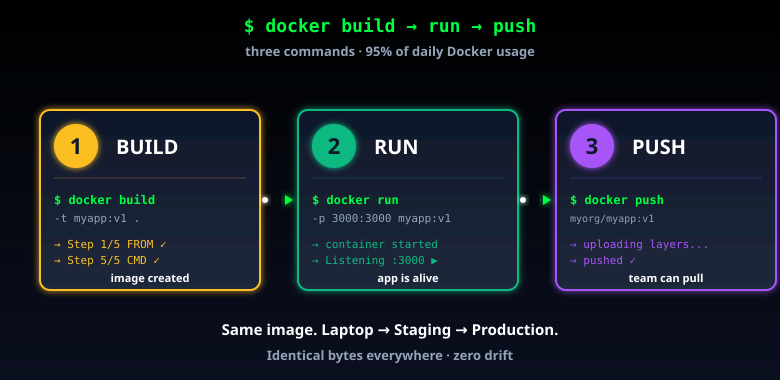
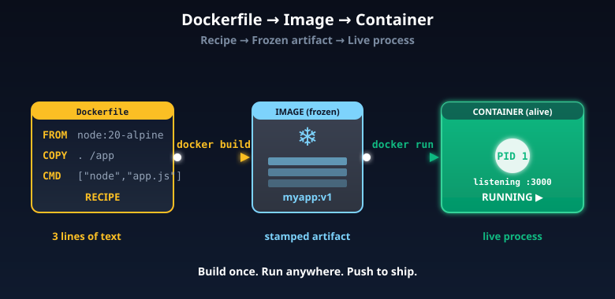

# Docker Explained in 60 Seconds (For Freshers Who've Never Used It)

> Comment **DOCKER** to get the full hands-on walkthrough doc.

You wrote code. It works on your laptop. You push to staging — crash. You push to production — bigger crash. Your senior smirks: *"Works on your machine, huh?"*

Every fresher hits this wall in their first six months on the job. Different OS, different Node version, a missing system library, a different timezone setting, a native dependency compiled for the wrong CPU architecture. The bug isn't in your code — it's in the *environment around* your code. And you can't `git pull` an environment.

But every Docker tutorial on the internet starts with "what is virtualization", spends 30 minutes on hypervisors, dives into kernel namespaces and cgroups — and 40 minutes in, you still haven't seen a single `docker` command. By the time you make it through, you've forgotten why you started, and you sure as hell aren't going to ship anything.

This guide skips the academic detour. In the next 10 minutes you'll understand exactly what Docker does, the three concepts you cannot avoid (**image**, **container**, **Dockerfile**), and the three commands you'll actually type at work — explained with examples from real life, not from a textbook. By the end, you'll have a mental model that holds up the rest of your career.

> **In short:** Docker packages your app + everything it needs to run into a sealed unit that runs identically on any machine. That's the entire pitch — and that one idea changed how the industry ships software.

---

## The Problem: "Works On My Machine"

Picture this. You're a fresher at your first job. You build a small Node.js API on your MacBook. Tests pass. You demo it to your tech lead. He nods. You push to the company's Linux staging server. It crashes immediately.

The reasons are things you never thought about:

- Your Mac has Node 20.5. The server has Node 16.
- Your Mac has `libssl 3`. The server has `libssl 1.1`.
- Your code reads an environment variable that's set in your shell but missing on the server.
- The server runs in UTC. Your Mac is on IST. A subtle date-handling bug appears.
- A native dependency compiled for ARM (Mac M1/M2) — but the server is x86.
- Your `package-lock.json` was ignored, so a transitive dependency installed a different version on the server.

Each one is invisible until it bites. Fixing them by hand means SSH-ing into the server, chasing a checklist for hours, then writing a "How to set up the dev environment" wiki page that's outdated within a week. The next person on the team hits the same problems and the cycle restarts.

This is the **environment drift** problem. Code is the same; the environment around it is different. Software ships not just as code, but as code-plus-context — and that context is what every team historically struggled to standardize.



*The exact same code crashes on the server because the surrounding environment is different. Docker eliminates this entire class of problem.*

> **In short:** Code doesn't run in a vacuum. It depends on the OS, runtime versions, system libraries, env vars, file paths, and even CPU architecture. Any of these can break a deploy. Docker fixes the entire category, not individual symptoms.

---

## The Real-Life Analogy: Shipping Containers

Before 1956, shipping cargo was chaos. Every product had its own packaging — barrels of wine, sacks of grain, crates of toys, machinery on pallets, rolls of cloth. Loading a ship at port meant solving a custom Tetris puzzle every voyage. Unloading at the next port meant the same chaos in reverse. Goods got damaged, lost, or stuck on a dock for weeks.

Then a trucking company owner named **Malcolm McLean** had a simple idea: *what if every shipment ships in identical metal boxes?* Same dimensions. Same connectors. Same locking points. The truck, the train, the crane, and the ship all only need to know how to handle the box — not what's inside.

That single idea kicked off the modern shipping industry. Today's intermodal container is exactly McLean's design. The contents could be furniture, rice, electronics, chemicals, or live cattle. The world doesn't care — the box is standardized. Every port crane, every truck, every ship handles the same box the same way. World trade volume exploded as shipping costs collapsed.

**Docker is exactly this idea, applied to software.**

The word "container" in Docker is borrowed from this metaphor on purpose. Your app, its dependencies, its OS layer — everything goes into a standardized box. That box runs the same way on your laptop, on AWS, on Google Cloud, on a Raspberry Pi, on the office server, on your colleague's Windows machine. The host doesn't care what's inside. It just knows how to run "the box".



*Same container, every transport. Truck, ship, train — none of them need to know what's inside. That's exactly what Docker does for software.*

That's the entire pitch. The rest of this article is just *how* Docker actually does it.

> **In short:** Docker is the shipping container of software — a standard box that runs identically everywhere, regardless of what's inside or what's outside. The metaphor isn't decoration; the engineering really does mirror it.

---

## The Three Concepts You Can't Avoid

Before any commands, lock these three words into your head. They get confused all the time, even by mid-level engineers, and getting them straight is what separates "I sort of use Docker" from "I actually understand Docker".

### 1. Image — The Frozen Blueprint

An **image** is a frozen, immutable snapshot of:

- Your application code
- All its dependencies (`node_modules`, Python packages, system libraries)
- The OS layer it needs (a thin Linux base)
- Environment variables and config
- A command to start the app when the image runs

Think of an image like a **mould for a chocolate bar**. The mould itself isn't the chocolate — it's the shape that produces chocolates. You can store the mould forever. You can ship it to ten kitchens around the world. You can stamp out a thousand identical chocolates from it. But the mould itself never changes. It's read-only. It's the spec, not the product.

Images are versioned with **tags**: `nginx:1.25`, `node:20-alpine`, `myapp:v1.4.2`, `postgres:16`. The tag is part of the image's identity. `node:20` and `node:18` are two completely different images.

Once an image is built, it's a fixed artifact. You can store it on disk, push it to a registry like DockerHub, and pull it from anywhere in the world. Two people pulling the same tag get *byte-identical* content.

### 2. Container — The Living Instance

A **container** is the running process created from an image. It's the actual chocolate that came out of the mould.

- One image → many containers. You can run 100 containers from a single image with one command, all identical, all isolated from each other.
- Each container has its own filesystem, its own process tree, its own network namespace, its own view of the system.
- Containers are **ephemeral**. Start one, kill it, start another. The image doesn't change.

The image is the recipe in a cookbook. The container is the dish on a plate. You can make the dish over and over from the same recipe, and each plate is its own thing — but they all came from the same source of truth.

This is the part that confuses freshers most. People say "Docker container" when they mean "Docker image" all the time. Stay disciplined: **image is the artifact, container is the running process**. If it's not running, it's not a container — it's an image (or just stopped state).

### 3. Dockerfile — The Build Instructions

A **Dockerfile** is a plain text file that tells Docker how to build an image. It's a recipe written in a simple, line-by-line format. No special editor, no compiler — just a file named `Dockerfile` in your project root.

A minimal Dockerfile for a Node app is genuinely 3 lines of substance:

```dockerfile
FROM node:20-alpine
COPY . /app
CMD ["node", "/app/server.js"]
```

That's it. Read it line by line:

- `FROM` — start with this base image. `node:20-alpine` is a tiny Linux distribution (Alpine, ~5 MB) plus Node 20 pre-installed. You're standing on someone else's shoulders for the OS layer.
- `COPY` — copy files from your build context (the current directory) into the image at `/app`.
- `CMD` — when this image runs as a container, execute this command.

You'll add a few more lines for real projects (`WORKDIR`, `RUN npm install`, `EXPOSE`, `USER`, `ENV`), but the spine stays this simple. A 10-line Dockerfile is normal. A 30-line Dockerfile is on the long end.



*One image, many containers. The image is the immutable mould; each container is a live, running instance stamped from it.*

> **In short:** **Dockerfile** is the recipe (text). **Image** is the frozen result of cooking the recipe (artifact). **Container** is the dish on the plate (running process). Three words, three layers, do not mix them up.

---

## The Three Commands You'll Actually Type

You can ignore 90% of Docker's command-line surface area as a fresher. These three commands cover 95% of daily usage. Memorize them, and you can hold your own in any conversation about deploying.

### `docker build` — Cook the Recipe

```bash
docker build -t myapp:v1 .
```

Read this as: *"Look at the Dockerfile in the current directory (the trailing `.`), follow the instructions, and tag the resulting image as `myapp:v1`."*

The `-t` flag is short for `--tag`. The trailing `.` is the **build context** — the set of files Docker can read while building (typically your project root).

The first build is slow. Docker downloads base images, runs `RUN` commands, installs dependencies. Future builds are dramatically faster because Docker **caches each step** — every line in the Dockerfile becomes a layer that's reused if its inputs haven't changed. We'll come back to this in the layer-cake section.

### `docker run` — Plate the Dish

```bash
docker run -p 3000:3000 myapp:v1
```

Read this as: *"Start a container from the `myapp:v1` image, and forward host port 3000 to container port 3000."*

This command actually runs the app. Hit `localhost:3000` in your browser — your API responds.

Common flags you'll see:
- `-p HOST:CONTAINER` — port forwarding
- `-d` — detached mode (run in the background)
- `--name myapp-prod` — give the container a friendly name
- `-e KEY=VALUE` — set an environment variable
- `-v /host/path:/container/path` — mount a volume (for persistence)
- `--rm` — auto-delete the container when it exits

### `docker push` — Ship the Recipe

```bash
docker push myorg/myapp:v1
```

Read this as: *"Upload the image to a registry (DockerHub by default) so anyone with access can pull and run it."*

Once pushed, your colleague on Windows, the staging server, and the production cluster can all pull `myorg/myapp:v1` and run the *same image*. There's no "but it works on my machine" anymore — there's only one machine that matters: the image itself.

Common registries:
- **DockerHub** — the default public registry
- **ECR** (AWS), **GCR** (Google), **ACR** (Azure) — cloud-native registries
- **GitHub Container Registry** (`ghcr.io`) — increasingly popular, free for public repos
- **Self-hosted Harbor / Nexus** — common at larger companies



*The three commands, in order. Build creates the image, run starts a container, push uploads to a registry. That's the loop.*

> **In short:** `build` makes the image. `run` starts a container. `push` uploads the image so others can pull it. Four other commands matter for daily use (`ps`, `logs`, `exec`, `pull`), but build/run/push is the spine.

---

## End-to-End: Dockerizing a Real App in 5 Minutes

Let's make this concrete. You have a tiny Node API:

```js
// server.js
const http = require("http");
http.createServer((_, res) => {
  res.end("Hello from inside Docker!");
}).listen(3000, () => console.log("Listening on 3000"));
```

**Step 1.** Add a `Dockerfile` next to it:

```dockerfile
FROM node:20-alpine
WORKDIR /app
COPY server.js ./
EXPOSE 3000
CMD ["node", "server.js"]
```

`WORKDIR` sets the current directory inside the image (creates it if missing). `EXPOSE 3000` documents that this image expects to talk on port 3000 (it doesn't actually open the port — that's `-p` on `docker run`).

**Step 2.** Build the image:

```bash
docker build -t hello-docker:v1 .
```

Docker reads the Dockerfile, downloads `node:20-alpine` (~50 MB the first time, instant on subsequent builds), copies `server.js` in, and produces an image tagged `hello-docker:v1`.

**Step 3.** Run the container:

```bash
docker run -p 3000:3000 hello-docker:v1
```

The container boots in milliseconds, the Node process starts, port 3000 is forwarded.

**Step 4.** Hit it from your browser or `curl`:

```bash
curl localhost:3000
# Hello from inside Docker!
```

**Step 5.** Push to a registry (after `docker login`):

```bash
docker tag hello-docker:v1 yourname/hello-docker:v1
docker push yourname/hello-docker:v1
```

Your friend in Bangalore, your CI server, your AWS EC2 box — all of them can now run the *exact same thing* with one line:

```bash
docker run -p 3000:3000 yourname/hello-docker:v1
```

That's the whole pitch. Same image, anywhere, identical behavior.



*The full pipeline: Dockerfile is the recipe → build produces an image → run starts a container. Same code travels through every environment as the same image.*

> **In short:** Five steps from "code on my laptop" to "image anyone in the world can run identically." That's the productivity unlock that took Docker from a side project to industry standard in five years.

---

## How an Image Is Built — The Layer Cake

Every line in your Dockerfile creates a **layer**. An image is a stack of these layers, like a cake.

```
┌─────────────────────────────────┐  ← Layer 5: CMD ["node", "server.js"]
├─────────────────────────────────┤  ← Layer 4: EXPOSE 3000
├─────────────────────────────────┤  ← Layer 3: COPY server.js ./
├─────────────────────────────────┤  ← Layer 2: WORKDIR /app
├─────────────────────────────────┤  ← Layer 1: FROM node:20-alpine
└─────────────────────────────────┘
```

This matters for two reasons.

**1. Caching.** If you change `server.js` and rebuild, only layers 3, 4, 5 are rebuilt. The base layer (`FROM node:20-alpine`) and `WORKDIR` come straight from cache — Docker recognizes their inputs are unchanged and reuses the previous result. Builds drop from 60 seconds to 2 seconds.

**2. Reuse across images.** If 10 of your services all start with `FROM node:20-alpine`, that base layer is downloaded once and shared across all 10 images on the host. Disk space savings are huge — and pulls are faster because most of the layers already exist locally.

**3. Order matters.** Put the most-stable lines on top, the most-frequently-changing lines at the bottom. The classic Node template:

```dockerfile
FROM node:20-alpine
WORKDIR /app
COPY package*.json ./
RUN npm ci
COPY . .
CMD ["node", "server.js"]
```

`package*.json` and `npm ci` come *before* `COPY . .`. Why? Because changing your application code shouldn't trigger a full re-install of `node_modules`. Only changes to `package.json` should bust the dependency cache. Naive Dockerfiles get this backwards and wait 60 seconds on every code change.



*Each Dockerfile line creates a layer, cached independently. Order them stable-to-volatile for fast rebuilds.*

> **In short:** Images aren't monolithic — they're stacks of layers, cached aggressively, shared across services. Order your Dockerfile from "rarely changes" to "changes every push" for max cache hits. Doing this right turns a 60-second build into a 2-second build.

---

## Why This Changes Everything

Before Docker, deploying a service meant:

- A document called "How to set up the server" — half-outdated, half-wrong
- 2-hour onboarding for new engineers, just to get the dev environment running
- "Staging works, production doesn't" debugging marathons that ate weekends
- Different bugs in different environments because the environments were different
- Deploys involving custom shell scripts that nobody fully understood

After Docker:

| Pain | Pre-Docker | With Docker |
|---|---|---|
| Local dev setup | Hours of installing the right versions | `docker run` and you're up |
| New engineer onboarding | 1-2 days minimum | Minutes |
| "Works on my machine" bugs | Common | Almost extinct |
| Reproducing prod issues locally | Painful | Pull the same image, reproduce instantly |
| Deploys | Custom shell scripts per service | Same `docker run` everywhere |
| Rollbacks | Re-deploying old code from git, hoping the env is the same | Run the previous tag — guaranteed identical |
| Multi-service local dev | Install Postgres, Redis, RabbitMQ on your laptop | `docker-compose up` starts them all |

Docker is no longer the only way to do this. **Kubernetes** uses `containerd` directly (it removed Docker from its runtime stack in 2022). **Podman** is a daemonless drop-in alternative. **OrbStack** is a faster Mac runtime. But the **container model** Docker popularized is now the default unit of deployment for almost every modern company.

Whether you end up using Docker the tool or one of its successors, you're using container thinking. Master it once, the model transfers.

> **In short:** Docker turned environment setup from a multi-hour ritual into a one-line command. That's why it took over the industry in five years and never gave the ground back.

---

## Common Gotchas Freshers Hit

These are the bugs you'll waste a Saturday on if nobody warns you. Save this list.

1. **`COPY` order matters for caching.** Put `package.json` + `npm install` *before* `COPY . .`, so changing your code doesn't reinstall all dependencies on every build. This single change can cut build times by 30x.
2. **`CMD` vs `RUN`.** `RUN` executes during build (installs packages, builds your app). `CMD` runs when the container starts (the app itself). Don't mix them up. A Dockerfile with `CMD npm install && node server.js` reinstalls dependencies on every container start.
3. **Containers don't persist data by default.** When you `docker rm` a container, its filesystem is gone. Use **volumes** (`-v`) for databases, logs, uploads. Otherwise your local Postgres data evaporates the next time you restart.
4. **`localhost` inside a container ≠ your laptop.** A container's `localhost` is itself. Use `host.docker.internal` (Mac/Windows) or the container's network to reach your host. This is the #1 confusing thing for first-time users.
5. **Don't run as root inside containers.** Add a non-root `USER` line in production Dockerfiles. It's a security baseline; many companies fail audits on this exact gotcha.
6. **`alpine` base images are tiny but limited.** Alpine uses `musl` libc instead of `glibc`. Many Python/Node native packages need glibc and break on alpine. If you hit weird build errors involving `binutils` or compilation, switch to `node:20-slim` or `python:3.12-slim` (Debian-based, slightly bigger but compatible with everything).
7. **Image bloat.** A naive `FROM ubuntu` + `apt install` image can be 1 GB. A well-trimmed `alpine` image with multi-stage builds can be 50 MB. Smaller = faster pulls, faster deploys, faster autoscaling.
8. **`.dockerignore` exists and matters.** Like `.gitignore`, it tells Docker what to *not* copy into the build context. Without it, your `node_modules` (or worse, secrets in `.env`) gets sent into every image.
9. **Tags are mutable. Digests are not.** `myapp:latest` can change underneath you. In production, pin to digests (`myapp@sha256:abc...`) or specific version tags (`myapp:v1.4.2`). "It worked last week" stops being a safe assumption otherwise.
10. **`docker-compose` is the next step.** When you have multiple containers (app + DB + Redis), `docker-compose up` orchestrates them all from a single YAML file. Most fresher projects can stop at compose; you don't need Kubernetes until you're at multiple servers.

> **In short:** Docker is simple to start, but a few sharp edges trip up freshers. Knowing them in advance saves entire weekends.

---

## The Bigger Picture — Why Learning This Now Pays Off

Once you understand Docker, you understand 90% of modern infrastructure:

- **Kubernetes** runs containers at massive scale (clusters of thousands of nodes). Every Kubernetes pod is one or more containers. If you can read a Dockerfile, you can read a Kubernetes manifest.
- **CI/CD pipelines** (GitHub Actions, GitLab CI, Jenkins) build images and ship them through staging → production. The `docker build` you ran on your laptop is the same `docker build` that runs in CI.
- **Cloud Run, ECS, Fargate, App Runner** are managed container platforms — you give them an image, they run it. No servers to manage, just images.
- **Serverless containers** (AWS Lambda with container images, Cloudflare Workers Containers) let you write a Dockerfile and deploy without managing servers at all.
- **Local dev environments** (devcontainers in VS Code, GitHub Codespaces) are just containers under the hood. The "open this repo in a sandboxed dev environment" magic? That's a Dockerfile.

Docker isn't a niche tool you can ignore until later. It's the layer almost every cloud-native system sits on. Spending one afternoon getting comfortable with `build`, `run`, `push`, and `docker-compose` puts you ahead of most fresh hires — and unlocks every conversation about deploying, scaling, and operating real software.

If you're reading this as a final-year student or first-job dev: **build one personal project that runs in Docker before you finish reading this article**. A simple Node/Python API in a Dockerfile, pushed to your DockerHub. Put it on your resume. It's the single highest-leverage line you can add.

> **In short:** Docker is the entry point to all of modern infrastructure. Skip it now, and you're playing catch-up later. Learn it now, and every "DevOps" conversation suddenly makes sense.

---

## References

- [Docker Official Docs — Get Started](https://docs.docker.com/get-started/) — the canonical first-time tutorial
- [Dockerfile Reference](https://docs.docker.com/engine/reference/builder/) — every instruction explained
- [The Twelve-Factor App](https://12factor.net/) — environment-portable design principles Docker amplifies
- [Open Container Initiative (OCI) Spec](https://github.com/opencontainers/runtime-spec) — the standard image and runtime format Docker uses
- [containerd](https://containerd.io/) — the container runtime Kubernetes actually uses (Docker is built on this)
- [Kubernetes deprecates Docker as a runtime](https://kubernetes.io/blog/2020/12/02/dont-panic-kubernetes-and-docker/) — the 2022 dockershim removal explained
- [The Box: How the Shipping Container Made the World Smaller and the World Economy Bigger](https://en.wikipedia.org/wiki/The_Box_(book)) — Marc Levinson's book on Malcolm McLean and shipping containers
- [Best Practices for Dockerfiles](https://docs.docker.com/develop/dev-best-practices/) — official guidance
- [Docker vs Podman vs containerd](https://www.docker.com/blog/containerd-vs-docker/) — modern container ecosystem
- [Multi-stage builds](https://docs.docker.com/build/building/multi-stage/) — the technique that gets your image down to 50 MB

---

#docker #devops #softwareengineer #coding #firstjob #webdevelopment #backend #freshers #placement #systemdesign #containers #cloudcomputing
