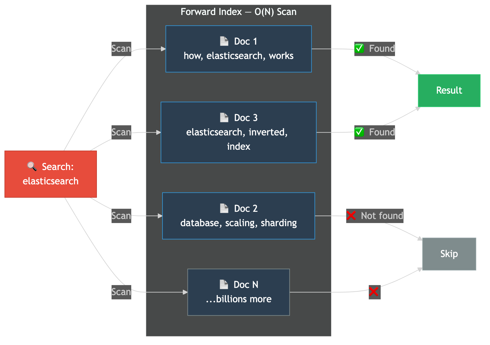
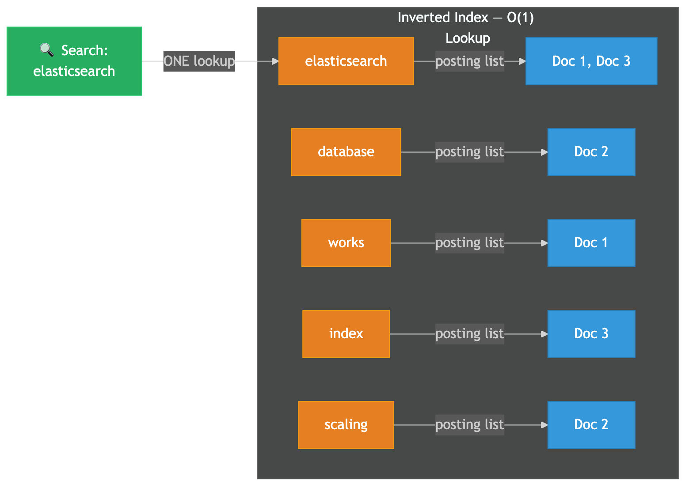
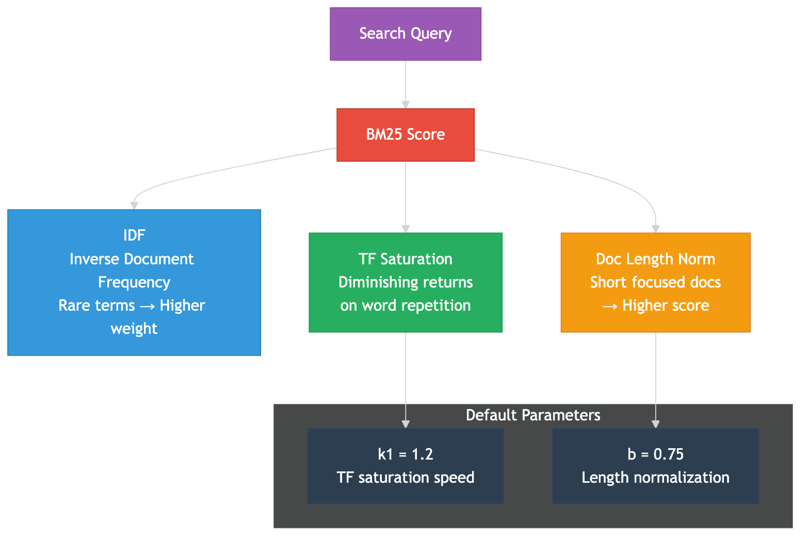
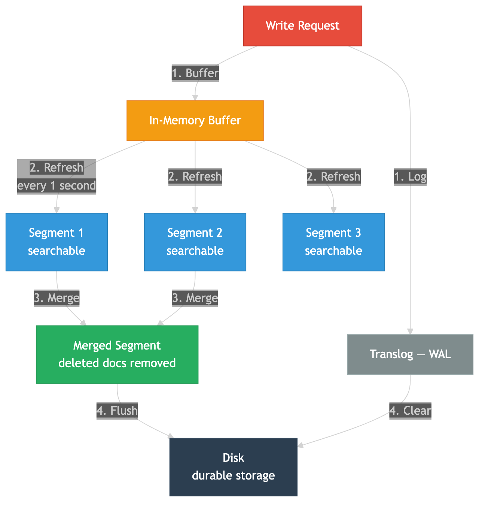
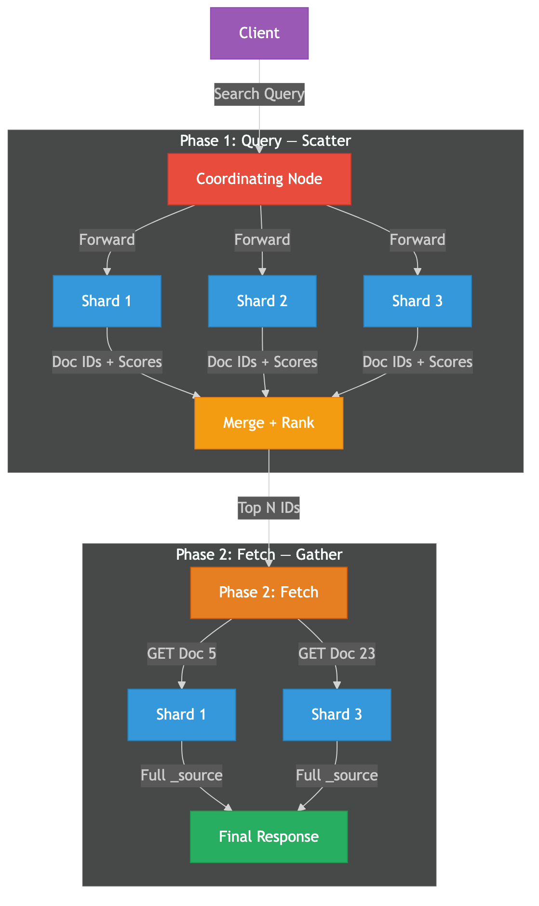

# How Elasticsearch Finds Your Query in 10ms Across Billions of Documents

Every time you search on Flipkart, GitHub, or Wikipedia, your query returns results in milliseconds — across billions of documents. The engine behind most of these? **Elasticsearch.**

But how does it actually work? How do you search through billions of documents faster than you can blink?

The answer starts with flipping the entire problem backwards.

## The Wrong Way: Forward Index

The naive approach is a **forward index** — map each document to the words it contains.

| Document | Words |
|----------|-------|
| Doc 1 | "how", "elasticsearch", "works" |
| Doc 2 | "database", "scaling", "sharding" |
| Doc 3 | "elasticsearch", "inverted", "index" |

Search for "elasticsearch"? You scan **every single document**, checking if it contains that word.

1 billion documents = 1 billion scans.

This is O(N) — it doesn't scale. A query across billions of documents would take **minutes**, not milliseconds.



## The Real Architecture: Inverted Index

Elasticsearch is built on **Apache Lucene**, and Lucene's core data structure is the **inverted index**. Instead of "document → words", it builds a **word → documents** mapping.

| Term | Document IDs |
|------|-------------|
| "elasticsearch" | [Doc 1, Doc 3] |
| "database" | [Doc 2] |
| "works" | [Doc 1] |
| "index" | [Doc 3] |
| "scaling" | [Doc 2] |

Search for "elasticsearch"? **One lookup** → instantly get [Doc 1, Doc 3]. No scanning.



### How Lucene Stores This Internally

Under the hood, Lucene uses two structures:

1. **Term Dictionary** — A sorted list of all unique terms, stored as a **Finite State Transducer (FST)**. FSTs are ~38-52% smaller in RAM than traditional tries and enable fast prefix/fuzzy lookups. The `BlockTree` terms dictionary uses an FST at the top level pointing into blocks of 25-48 terms each.

2. **Posting Lists** — For each term, a sorted list of document IDs + term frequency + positions. These use:
   - **Delta encoding** — store differences between sorted doc IDs (e.g., [1, 5, 8] becomes [1, 4, 3])
   - **Packed integer blocks** — 128 integers per block, same bit-width encoding for fast SIMD decode
   - **Skip lists** — layered on top for fast multi-term intersection

Searching for "elasticsearch AND index"? Skip lists let Lucene jump through both posting lists simultaneously, skipping irrelevant doc IDs without reading every entry.

### Lucene Segment File Structure

Each Lucene segment stores its index across multiple files:

| File | Contents |
|------|----------|
| `.tim` | Term dictionary (terms + stats like doc frequency) |
| `.tip` | Term index (FST → points into .tim blocks) |
| `.doc` | Posting lists (doc IDs + frequencies) |
| `.pos` | Term positions within documents |
| `.fdt` | Stored field data (original document source) |
| `.dvd` | Doc values (columnar data for sorting/aggregations) |

## BM25: How Elasticsearch Ranks Results

Finding documents is step one. **Ranking** them by relevance is step two.

Elasticsearch uses **BM25** (Best Matching 25), the default scoring algorithm since Elasticsearch 5.0 (2016). It replaced the earlier TF-IDF-based similarity with a smarter approach:

```
score(q, d) = IDF(q) × [ tf(q,d) × (k1 + 1) ] / [ tf(q,d) + k1 × (1 - b + b × dl/avgdl) ]
```

### What Each Component Does

**IDF (Inverse Document Frequency):** Rare terms score higher. "elasticsearch" appearing in 100 of 1 million docs gets much higher weight than "the" appearing in 900,000 docs.

**TF Saturation:** This is BM25's key improvement over raw TF-IDF. The first few occurrences of a term matter most — repeating "elasticsearch" 50 times in a document doesn't make it 50x more relevant. BM25's saturation curve creates diminishing returns, preventing keyword stuffing from gaming the ranking.

**k1 = 1.2 (default):** Controls how quickly term frequency saturates. Higher values let additional occurrences keep contributing longer.

**b = 0.75 (default):** Document length normalization. A 100-word document mentioning "elasticsearch" once is considered more focused than a 10,000-word document mentioning it once.



## Segments: Why Writes Never Block Reads

Each Elasticsearch shard is a Lucene index, and each Lucene index is a collection of **immutable segments**.

### The Segment Lifecycle

1. **Write** → Documents go to an in-memory buffer + translog (write-ahead log for durability)
2. **Refresh (every 1 second by default)** → Buffer is flushed to a new segment in the filesystem cache. This segment is immediately searchable — this is Elasticsearch's "near-real-time" search. Up to 1 second delay between indexing and searchability.
3. **Flush/Commit** → Segments are written from the filesystem cache to durable disk storage. Translog is cleared.
4. **Merge** → Background process (TieredMergePolicy by default) merges smaller segments into larger ones, physically removing deleted documents.

### Why Immutability Matters

- **No read locks needed** — multiple searches read segments concurrently without synchronization
- **Writes never block reads** — new data goes to new segments, existing segments are untouched
- **Deletes are lazy** — marked in a `.del` bitset, physically removed only during segment merging
- **Trade-off:** More segments = slightly slower search (Lucene searches all segments sequentially within a shard). Merging keeps segment count manageable.



## Distributed Search: The 2-Phase Query

Billions of documents can't fit on one machine. Elasticsearch distributes data across **shards** on multiple **nodes**. Each shard is a complete Lucene index with its own inverted index.

When a search query arrives, Elasticsearch executes a two-phase protocol:

### Phase 1: Query (Scatter)

1. Client sends search request to any node → that node becomes the **coordinating node**
2. Coordinating node forwards the query to **every relevant shard** (primary or replica)
3. Each shard executes the query **locally** against its Lucene index, builds a local priority queue
4. Each shard returns only **doc IDs + sort scores** — not full documents — minimizing network transfer
5. Coordinating node **merges** all shard results into a global sorted list, applying `from + size` pagination

### Phase 2: Fetch (Gather)

1. Coordinating node identifies which specific documents to retrieve (the final page of results)
2. Sends **multi-GET requests** to the shards holding those specific document IDs
3. Each shard loads the full `_source` + highlighting + script fields
4. Coordinating node assembles and returns the final response

### Why Two Phases?

If you need 10 results across 5 shards, Phase 1 transfers only tiny doc ID + score pairs from all shards. Phase 2 fetches full documents for only the final 10 results. This minimizes network transfer and is the key reason distributed queries stay fast.



## The Lucene Limit: 2.1 Billion Documents Per Shard

Here's a gotcha most developers don't know: each Elasticsearch shard (= one Lucene index) has a hard limit of **2,147,483,519 documents** (Integer.MAX_VALUE - 128). Lucene uses 32-bit signed integers for internal document IDs.

When you hit this limit, indexing operations fail — no graceful degradation.

Discord hit this exact limit. Their search infrastructure collapsed under trillions of messages. They rebuilt with **40 Elasticsearch clusters** and thousands of indices to stay under the per-shard limit.

## Real Numbers at Scale

| Company | Scale | Details |
|---------|-------|---------|
| **Discord** | Trillions of messages | 40 ES clusters, thousands of indices, p50 < 100ms, p95/p99 < 500ms |
| **GitHub** | Started with 8M repos | 2 billion documents, 128 shards (~120 GB each). Later outgrew ES at 200M+ repos → built custom Rust engine |
| **Netflix** | 700-800 nodes | ~100 ES clusters for messaging, user trends, security logs |
| **Wikipedia** | All Wikimedia projects | Migrated from Solr to ES, CirrusSearch extension, near-real-time edit indexing |
| **Global adoption** | 58,000+ companies | Including Walmart, Amazon, Apple, Adobe, Uber, LinkedIn |

## 2024-2026: The AI Evolution

Elasticsearch isn't just keyword search anymore:

- **Vector Search (kNN):** Dense vector fields indexed using HNSW (Hierarchical Navigable Small World) graphs for approximate nearest neighbor search. Supports cosine, dot product, and L2 similarity.
- **Hybrid Search:** BM25 lexical search + kNN vector search combined in a single query. **Reciprocal Rank Fusion (RRF)** merges the two result sets. BM25 catches exact/phrase matches; vectors catch semantic similarity.
- **ELSER (Elastic Learned Sparse Encoder):** Expands text into semantically related terms with weights — enabling semantic matching without dense vectors, more interpretable than embeddings.
- **Semantic Reranking:** Cross-encoder models deployed in Elasticsearch to re-score initial BM25/hybrid results for higher precision.

## Summary

| Layer | What It Does | Why It's Fast |
|-------|-------------|---------------|
| **Inverted Index** | Word → document mapping | One lookup instead of scanning every document |
| **FST** | Term dictionary in memory | ~38-52% smaller than tries, fast fuzzy matching |
| **BM25** | Relevance ranking | Saturation prevents gaming, length normalization |
| **Segments** | Immutable data chunks | No read locks, writes never block reads |
| **2-Phase Query** | Scatter-gather across shards | Phase 1 transfers only doc IDs, Phase 2 fetches only top N |

The core insight: Elasticsearch is fast because it does **less work**, not more. Inverted indices avoid scanning. Two-phase queries minimize data transfer. Immutable segments eliminate lock contention. Every architectural choice reduces the work needed to answer a query.

## References

- [Elasticsearch from the Bottom Up — Elastic Blog](https://www.elastic.co/blog/found-elasticsearch-from-the-bottom-up)
- [Practical BM25 Part 2: The Algorithm — Elastic Blog](https://www.elastic.co/blog/practical-bm25-part-2-the-bm25-algorithm-and-its-variables)
- [Practical BM25 Part 3: Picking b and k1 — Elastic Blog](https://www.elastic.co/blog/practical-bm25-part-3-considerations-for-picking-b-and-k1-in-elasticsearch)
- [Distributed Search — Elastic Definitive Guide](https://apprize.best/data/elasticsearch_1/11.html)
- [Near-Real-Time Search — Elastic Docs](https://www.elastic.co/docs/manage-data/data-store/near-real-time-search)
- [Using Finite State Transducers in Lucene — Mike McCandless](https://blog.mikemccandless.com/2010/12/using-finite-state-transducers-in.html)
- [How Discord Indexes Trillions of Messages — Discord Blog](https://discord.com/blog/how-discord-indexes-trillions-of-messages)
- [The Technology Behind GitHub's New Code Search — GitHub Blog](https://github.blog/engineering/architecture-optimization/the-technology-behind-githubs-new-code-search/)
- [Elasticsearch Customers: GitHub — Elastic](https://www.elastic.co/customers/github)
- [Lucene Max Documents Limit — Elastic Discuss](https://discuss.elastic.co/t/lucene-max-documents-limit/34761)
- [Introducing ESRE — Elastic Labs](https://www.elastic.co/search-labs/blog/introducing-elasticsearch-relevance-engine-esre)
- [Hybrid Search in Elasticsearch — Elastic Labs](https://www.elastic.co/search-labs/blog/hybrid-search-elasticsearch)
- [What is an Apache Lucene Codec — Elastic Blog](https://www.elastic.co/blog/what-is-an-apache-lucene-codec)
- [Netflix at ElastiCon 2015](https://www.elastic.co/elasticon/conf/2015/sf/arrestful-development-how-netflix-uses-elasticsearch-to-better-understand)
- [Wikimedia Moving to Elasticsearch — Wikimedia Diff](https://diff.wikimedia.org/2014/01/06/wikimedia-moving-to-elasticsearch/)

---

*Follow @techvijayforyou for more system design breakdowns.*

## Hashtags

#elasticsearch #systemdesign #softwareengineer #coding #invertedindex #searchengine #lucene #distributedsystems #backenddevelopment #techexplained #howthingswork #webdev
