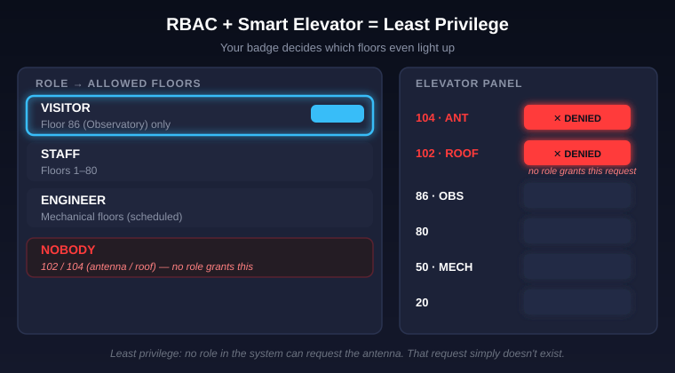

# Design the Security System for the Empire State Building (A FAANG System Design Interview, Disguised as a Heist)

At 9 PM on July 1, 2026, two Russian daredevils — Angela Nikolau and Ivan Kuznetsov, known online as **Angela Nikolau & Ivan Beerkus**, the couple behind Netflix's 2024 documentary *Skywalkers: A Love Story* — walked into the Empire State Building and bought two completely legitimate observatory tickets.

They didn't sneak in. They didn't fake a badge. They paid, scanned in like every other tourist, and then simply didn't leave.

They hid overnight, believed to be in a maintenance area. At around 5 AM, a security camera caught them stepping through a hatch on the **102nd floor** — nobody stopped them in time. They bypassed a cable-locked stairwell gate by loosening its wall brackets, cut two padlocks on the **104th floor**, and climbed the final stretch to the building's antenna, 1,454 feet above Manhattan. Just before noon on Wednesday, they unfurled a banner reading **"When the power of love beats the love of power the world knows peace"** and, on the way down, Kuznetsov proposed. The NYPD Emergency Service Unit met them as they descended. The antenna — which emits RF signals — had to be powered down for about 30 minutes during the response. Both were arrested and charged with burglary, criminal trespass, criminal tampering, possession of burglar's tools, and reckless endangerment, among other counts. They pleaded not guilty and were released under supervision.

Strip away the romance and the banner, and what's left is a textbook security failure — the kind system design interviewers at Google, Amazon, and Meta ask about every week, except usually framed as "design a payments fraud system" or "design an access-control system for an office building." This time, a real building handed us the case study for free.

So let's treat it exactly like an interview question: **"Design a security system for a landmark building like the Empire State Building so that an incident like this is far less likely to succeed — and is caught and stopped fast when it starts."**

This is not about guaranteeing nothing bad ever happens again. Nobody can promise that — not Google, not the NYPD, not us. Physical security, like cybersecurity, deals in probabilities and blast radius, not absolutes. Our job as system designers is to shrink the attack surface, cut detection time from hours to seconds, and make sure detection always triggers a response. That's the whole game.

---

## Why "Lock the Doors Harder" Doesn't Work

The instinctive answer to "how do we stop this" is: more locks, more guards, a taller fence. This is called the **castle-and-moat** model of security — build a hard perimeter, trust everything inside it. It's how physical security (and, for decades, corporate networks) was designed by default. Cloudflare's own explainer on this pattern is a good primer on why it's now considered outdated for network security — and the same logic applies to buildings ([Cloudflare: castle-and-moat](https://www.cloudflare.com/learning/access-management/castle-and-moat-network-security/)).

Here's the wrong-way version of Empire State Building security: one perimeter check at the front door (the ticket scan), and then implicit trust for anyone who made it past that check. Once you're in, you're "a visitor," full stop — free to wander, blend in, and wait.

That's exactly the model Nikolau and Kuznetsov beat. They didn't break the perimeter. **They walked through the front door with a valid ticket.** The moat didn't matter because they never needed to swim across it — they had a ferry ticket.

This is precisely the insight behind **Zero Trust** security: never trust a credential just because it's valid, and never trust a location just because someone is "inside." Every action, every floor transition, every door needs its own independent check, continuously, not just once at the gate ([Cloudflare: what is Zero Trust](https://www.cloudflare.com/learning/security/glossary/what-is-zero-trust/)). A castle-and-moat building asks "did you get in?" once. A Zero Trust building asks "should you be *here, right now, doing this*?" at every single checkpoint.

> **In short:** A single strong perimeter fails the moment someone acquires a valid credential — a ticket, a badge, a password. Real security has to re-verify identity and intent at every layer inside the building too, not just at the front door.

---

## Mapping the Break-In to the Cyber Kill Chain

Here's the part most security write-ups on this story missed: this physical intrusion follows the **exact same stages** as a real-world cyberattack — the "Cyber Kill Chain" framework that security operations centers (SOCs) use to describe how hackers actually breach networks.

| Physical action at the Empire State Building | Security concept it maps to |
|---|---|
| Cased the building beforehand | **Reconnaissance** |
| Bought a legitimate 9 PM observatory ticket | **Valid credentials** — "attackers don't break in, they log in" |
| Hid overnight in a maintenance area | **Persistence / dwell time** |
| Camera saw them at 5 AM, nobody intercepted them | **Detection without response** — the single biggest failure mode |
| Loosened brackets, cut two padlocks to reach restricted floors | **Privilege escalation / lateral movement** |
| Unfurled the banner at the antenna | **Action on objective** — the "payload" |



*Every stage of this "old-school" physical stunt has a name in cybersecurity. That's not a coincidence — access control, whether it's guarding a server or a skyscraper, is the same problem wearing a different costume.*

The single most important row in that table is the fourth one. A camera *did* catch them. The system worked — for detection. It failed for **response**. This is, by a wide margin, the most common real-world security-operations failure, in buildings and in networks alike: alerts fire, and nobody — or nothing — acts on them fast enough. Global security teams report that alert fatigue and false positives are their #1 detection challenge, with the SANS/Stamus 2025 Detection & Response Survey finding that **73% of security teams cite false positives as their top detection headache** ([SANS/Stamus 2025 survey summary](https://www.stamus-networks.com/blog/what-the-2025-sans-detection-response-survey-reveals-false-positives-alert-fatigue-are-worsening)) — which is exactly why a 5 AM hatch alert can get lost in the noise of hundreds of other camera events from a 102-floor building.

> **In short:** This wasn't a sophisticated hack. It was reconnaissance, valid-credential entry, dwell time, an ignored detection, privilege escalation, and payload delivery — the same six-stage anatomy every major cyberattack follows, just executed with a backpack and bolt cutters instead of malware.

---

## Architecture Overview

If this were a real system design interview, here's the component list you'd sketch on the whiteboard in the first five minutes — each one earning its own deep-dive later in this article.

| # | Component | One-line job |
|---|---|---|
| 1 | **Requirements & scale** | Define functional needs and the non-functional bar: available, fault-tolerant, low-latency |
| 2 | **Visitor Auth Service** | QR ticket + government ID verification, time-boxed access windows |
| 3 | **Staff RFID/NFC cards** | Employee and vendor identity, tied to a role, not a floor list |
| 4 | **RBAC engine** | Decides what any credential is allowed to do — least privilege, by default |
| 5 | **Smart destination-dispatch elevators** | Physically enforces RBAC — you can't visit a floor your credential doesn't list |
| 6 | **AI-powered CCTV** | Watches for anomalies: loitering, after-hours motion, restricted-zone entry |
| 7 | **Door/contact sensors** | Detects physical tampering — forced doors, cut locks, propped gates |
| 8 | **SOC dashboard** | One real-time pane of glass for every signal above |
| 9 | **Alert + SOAR automation** | Turns a detection into an automatic response, not just a red dot on a screen |
| 10 | **Immutable audit log** | Every access event, timestamped and tamper-proof, for after-the-fact investigation |
| 11 | **Redundancy / HA** | No single failed sensor, camera, or server brings the whole system down |



*Every physical entry point — ticket scan, staff badge, service door — feeds through the same identity and authorization layer before it ever reaches an elevator or a floor.*



*This is the hero flow: one credential, checked four separate times, before anyone gets near a restricted floor.*

> **In short:** The architecture isn't a wall — it's a chain of independent checkpoints (auth, RBAC, elevator, sensor, camera, alerting) where every link has to fail for an intrusion to succeed, instead of one perimeter check where a single valid ticket unlocks the whole building.

---

## 1. Requirements & Scale — What Are We Actually Building?

Before any diagram, an interview answer needs requirements. Get this wrong and you'll design the wrong system beautifully.

**Functional requirements:**
- Authenticate every person entering — visitors and staff, differently.
- Authorize every floor/zone transition based on role, not just "are you inside the building."
- Detect anomalies in real time: unauthorized zones, after-hours motion, forced entry, loitering.
- Alert a human (or an automated responder) within seconds of a high-confidence detection.
- Log every access event immutably, for audits and post-incident investigation.

**Non-functional requirements** — this is where most candidates lose points by only talking about features:
- **Highly available**: a security system with downtime is a security hole with a schedule. Auth checks and camera feeds can't have a maintenance window at 5 AM.
- **Fault-tolerant**: one dead camera, one jammed door sensor, or one offline reader must degrade the system gracefully, not blind it entirely.
- **Low latency**: an elevator access decision has to resolve in well under a second, or you've just designed a building where the lobby stalls every morning.
- **Scalable**: the Empire State Building gets roughly **4 million visitors a year**. At peak, that's thousands of ticket scans per hour, on top of every staff badge swipe, every elevator call, every camera frame — all needing a decision in real time.
- **Auditable**: every decision the system makes has to be reconstructable after the fact, because "why did the hatch alarm not escalate" is exactly the question investigators asked here.

> **In short:** Before you design a single component, you have to state the bar you're designing to — available, fault-tolerant, fast, and auditable — because those non-functional requirements decide which architecture choices are even on the table.

---

## 2. Visitor Authentication — The Front Door That Got Beaten

This is the component that actually failed here — not because the ticket check was skipped, but because a valid ticket was treated as a **permanent** credential instead of a **time-boxed** one.

The naive design: scan a QR code once at the door, and the visitor is "authenticated" for the rest of the day (or, as it turned out, the rest of the night).

The real design ties every visitor credential to three things:
1. **Identity verification** — QR ticket paired with a government-issued ID scan at entry, so the credential is bound to a specific person, not just a barcode that anyone holding the phone can use.
2. **A hard time window** — the ticket isn't valid access to the building; it's valid access to the building **between 9:05 PM and 10:45 PM**, say. Outside that window, the same QR code should fail, automatically, without a human needing to notice.
3. **Zone scoping** — a general observatory ticket authorizes the observation deck and public floors only. It never authorizes maintenance corridors, the 102nd floor hatch, or the 104th floor stairwell, no matter what time it is.

```python
def authorize_visitor(ticket_id, scanned_id_hash, current_time):
    ticket = ticket_store.get(ticket_id)

    if ticket is None or ticket.id_hash != scanned_id_hash:
        return deny("identity mismatch")

    if not (ticket.window_start <= current_time <= ticket.window_end):
        return deny("outside authorized time window")

    if ticket.status == "checked_out":
        return deny("already exited — re-entry not permitted")

    return allow(zones=ticket.authorized_zones, expires_at=ticket.window_end)
```

Notice this function has no concept of "inside the building = trusted." Every single check re-derives trust from the credential and the clock — that's Zero Trust applied to a paper (or QR) ticket.

> **In short:** A ticket should expire at a specific minute and unlock a specific set of floors — not "the building, indefinitely" — so that even a legitimate, unstolen credential can't be quietly reused after hours.

---

## 3. Staff RFID/NFC Access Cards

Visitors need a lightweight, disposable credential. Staff, vendors, and maintenance crews need something durable, revocable, and individually identifiable — that's an **RFID or NFC access card**, tapped at readers throughout the building.

Unlike a QR ticket, a staff card is provisioned once and used for months, so it needs different guarantees:
- **Individual revocation** — if one contractor's card is lost, you disable that one card instantly, without touching anyone else's access.
- **Role binding at issuance** — the card itself doesn't carry a list of floors; it carries an identity, and the floor list is looked up live from the RBAC engine (more on this below), so a role change takes effect the next time the card is tapped, not the next time someone reprints a badge.
- **Tap-to-verify, not tap-to-open** — every card read is itself an event sent to the SOC, timestamped, even on doors that unlock successfully. A valid tap that opens a door should look identical, from a logging standpoint, to a valid tap that gets denied — both are recorded.

> **In short:** Staff credentials should be long-lived identities with short-lived permissions — the card doesn't change, but what it's allowed to do can change instantly and centrally.

---

## 4. Role-Based Access Control (RBAC) — Least Privilege by Design

This is the component that decides, for any credential, "what floors, what doors, what elevators." The core principle: **least privilege** — give every identity the minimum access required to do its job, and nothing more.

Here's the naive version most buildings default to: a small number of broad tiers — "visitor," "staff," "management" — where "staff" quietly means "staff can go basically anywhere staff-looking doors exist." That's how a maintenance worker's badge, or a maintenance-area hiding spot, ends up adjacent to antenna access at all.

The real design is a fine-grained policy, expressed the same way cloud IAM systems express permissions — because it's the exact same problem:

```json
{
  "role": "observatory_visitor",
  "allowed_zones": ["lobby", "86th_floor_deck", "gift_shop"],
  "allowed_time_window": "ticket_window",
  "elevator_stops": ["1", "80", "86"],
  "requires_escort": false
}

{
  "role": "maintenance_technician",
  "allowed_zones": ["mechanical_rooms", "service_corridors"],
  "allowed_time_window": "shift_hours",
  "elevator_stops": ["1", "40", "60", "90"],
  "requires_escort": false
}

{
  "role": "antenna_access",
  "allowed_zones": ["102nd_floor_hatch", "104th_floor_stairwell", "antenna_deck"],
  "allowed_time_window": "pre_approved_work_order_only",
  "elevator_stops": ["1", "102"],
  "requires_escort": true,
  "requires_dual_authorization": true
}
```

Notice there is no role in this building — not visitor, not general staff, not even most maintenance technicians — that includes `antenna_access` by default. It exists as its own narrow role, granted only against a specific, pre-approved work order, and requiring two people to authorize it. Nobody "has the antenna role" just by virtue of being an employee. This single design choice — a dedicated, rarely-granted, dual-authorized role for the most sensitive zone in the building — is arguably the one architectural decision that would have mattered most here, because it means a valid ticket or a valid staff badge structurally cannot reach the 104th floor, regardless of what locks get cut downstream.



*The RBAC engine doesn't just record what a role is allowed to do — it hands that floor list directly to the elevator system, which is the next line of defense.*

> **In short:** Least privilege means no default role includes the most sensitive zones — the antenna, the mechanical penthouse — so a stolen or overextended credential simply has nowhere dangerous to go, by construction, not by luck.

---

## 5. Smart Destination-Dispatch Elevators — Enforcing RBAC in Physical Space

An RBAC policy is just data until something physically enforces it. In a skyscraper, that something is the elevator.

**Destination-dispatch elevators** work differently from the "press a button, pick a floor" elevators most people grew up with. You tell the system your destination *before* boarding — often by tapping your badge or ticket at a kiosk — and the system assigns you to a specific car that is already programmed to stop only at the floors its assigned riders are authorized for. This is a well-established pattern in modern access-controlled buildings, used by vendors like Avigilon and Genea in their elevator access-control integrations ([Genea: elevator access control](https://www.getgenea.com/blog/elevator-access-control/), [Avigilon: access control systems](https://www.avigilon.com/solutions/access-control)).

The naive design puts a floor button panel in every car, with all buttons active for everyone, and relies on a lock or a guard at any restricted floor to turn people away *after* they've already arrived. That's a second-line defense doing the job of a first-line one.

The real design flips it: **the elevator car itself doesn't have a working button for a floor you're not authorized to visit.** If your credential authorizes floors 1, 80, and 86, the car assigned to you can physically only stop there. This is also the direct countermeasure to **tailgating** — someone slipping in behind an authorized person through a held door. Tailgating is consistently cited as a leading driver of unauthorized physical entry in enterprise security assessments; even if a tailgater gets into the elevator lobby, they still can't select a floor the assigned car isn't programmed to serve, and they can only exit where the authorized riders in that car are exiting.

> **In short:** Destination-dispatch elevators turn "don't go to that floor" from a rule into a physical impossibility — the button for floor 104 simply doesn't exist for a car carrying an observatory ticket, which defeats tailgating at the floor level even if it beats the front door.

---

## 6. AI-Powered CCTV Anomaly Detection

The Empire State Building's cameras did their job here — a camera caught the pair at the 102nd floor hatch at 5 AM. The gap wasn't visibility; it was turning that footage into an actionable signal fast enough. That's exactly the problem AI video analytics is built to solve.

The naive design: cameras record continuously, and a human operator watches a wall of monitors, hoping to notice something wrong in real time across dozens or hundreds of feeds. This does not scale — human attention degrades within minutes of monitoring passive video, and a hatch opening at 5 AM on floor 102 out of 102 floors is a needle in a very large haystack.

The real design runs every feed through a model trained to flag specific anomaly patterns, not just motion in general:
- **Loitering** — a person stationary in a non-public area for longer than a threshold.
- **After-hours motion** in zones that should be empty given the current time and shift schedule.
- **Restricted-zone intrusion** — a person appearing in a zone their last known credential swipe doesn't authorize.
- **Object-left-behind / tool use** — patterns consistent with tampering, like sustained motion at a door or lock rather than simple foot traffic.

The single hardest engineering problem in this component isn't detecting anomalies — it's **false positives**. A wind-blown curtain, a maintenance worker on a legitimate late shift, a shadow at dusk: any naive motion-based system will flag all of these, and a human operator who gets 200 false alerts a day will start ignoring all of them, including the real one. This is why production-grade video analytics vendors like Actuate design specifically around false-positive suppression — requiring an anomaly to persist across multiple consecutive frames before confirming, and cross-referencing against known schedules and badge data before escalating ([Actuate: AI false-positive reduction](https://actuate.ai/solutions/ai-video-analytics/ai-false-positive-reduction/)). Enterprise-grade deployments generally aim to keep false alarms to a small handful per day per hundred cameras — anything higher, and the system trains its own operators to distrust it.

> **In short:** The camera isn't the weak link — alert quality is. An AI system that cries wolf a hundred times a day guarantees the one real wolf gets ignored, so anomaly detection has to be tuned as hard for precision as it is for recall.

---

## 7. Door and Contact Sensors — The Layer That Should Have Caught the Lock-Cutting

Cameras watch open space; sensors watch specific physical objects. A **contact sensor** on a door or gate reports a binary state — open or closed, locked or forced — and a **cable-lock sensor** can report tension loss the instant a bracket is loosened, before the gate is even fully bypassed.

This is exactly the layer that, per the reporting on this incident, should have registered the two padlocks being cut on the 104th floor and the wall brackets being loosened on the stairwell gate. Cutting a physical lock isn't silent to a well-instrumented door — it's a sudden state change that a $20 contact sensor reports in milliseconds.

The naive design treats locks as purely mechanical — a lock either holds or it doesn't, and nobody finds out which until someone walks up and checks. The real design instruments every restricted-zone door and gate electronically, so "this lock is now open" and "this lock is now open **and it wasn't opened by a valid badge tap in the last 10 seconds**" are two very different, separately alertable events. The second one — a door opening with no matching authorized access event — is one of the highest-confidence signals a physical security system can generate, because it has almost no legitimate false-positive case.

> **In short:** A lock without a sensor is a lock that only tells you it failed after someone's already through it — instrumenting the lock itself turns "cut in silence" into an alert in milliseconds.

---

## 8. Real-Time SOC Dashboard

Every component so far generates signals: ticket scans, badge taps, elevator calls, camera anomalies, sensor state changes. None of that matters if it's scattered across five different vendor consoles that nobody is watching at 5 AM.

The **Security Operations Center (SOC) dashboard** is the single pane of glass where every one of those signals lands, correlated by location and time. Its job isn't just to display data — it's to **prioritize** it, so a human operator's attention goes to the 3 events that matter out of the 3,000 that happened in the last hour.

A well-designed SOC dashboard for a building like this would surface, in real time:
- Current occupancy per floor, cross-referenced against expected occupancy for that hour.
- Any active anomaly flags from AI CCTV, ranked by confidence score.
- Any sensor state changes in restricted zones, especially ones without a matching badge event.
- A live feed of the most recent RBAC denials — repeated denials at the same door in a short window is itself a signal worth escalating.

> **In short:** Detection scattered across disconnected systems is functionally the same as no detection — the value of a SOC dashboard is turning ten separate weak signals into one strong, prioritized one a human can actually act on.

---

## 9. Alert Service and Automated Response (SOAR) — Fixing the Actual Failure

This is the component this incident's public reporting says failed, and it's worth being precise about *why*. A camera flagged the hatch activity at 5 AM. The intruders didn't reach the antenna and unfurl the banner until close to noon — meaning there was a window of several hours between detection and the actual "payload" event. A response in that window, even a delayed one, had a real chance to prevent the outcome entirely. The core lesson: **detection without response is not security — it's a very expensive photograph.**

The naive design ends at the alert: a red dot appears on a dashboard, or a notification goes to an on-call phone, and then a human has to notice it, understand it, and decide what to do — all while dozens of other lower-priority alerts compete for the same attention.

The real design adds **SOAR** — Security Orchestration, Automation, and Response — which turns a high-confidence alert into an automatic first action, with a human confirming or escalating rather than starting from zero. A sample alert rule might look like this:

```yaml
rule: restricted_zone_after_hours_breach
trigger:
  zone: ["102nd_floor_hatch", "104th_floor_stairwell", "antenna_deck"]
  time_window: "outside_scheduled_work_order"
  confidence: ">= 0.85"
actions:
  - lock_down_elevator_access: [zone]
  - dispatch: on_site_security_unit
  - notify: [soc_supervisor, building_security_director]
  - escalate_if_no_ack_within: "3m"
    escalate_to: nypd_liaison
```

The point of automating the first action isn't to remove humans — it's to remove the delay between "the system knows something is wrong" and "someone with the authority to respond has been told." Security teams that adopt this kind of automation report dramatic cuts in **mean time to respond (MTTR)** compared to fully manual triage — commonly cited industry figures put the reduction in the 60–90% range depending on the alert type, with typical MTTR targets scaled by severity: **Critical incidents within 1 hour, High within 2 hours, Medium within 4 hours, Low within 8 hours.** Independently, global benchmarking work like Verizon's annual Data Breach Investigations Report has repeatedly shown that detection-to-response gaps, measured in hours to days rather than minutes, are the norm across the industry — not the exception — which is exactly the gap this design is built to close ([Verizon DBIR](https://www.verizon.com/business/resources/reports/dbir/)).



*The gap between "the system saw it" and "someone acted on it" is where almost every real-world physical and cyber breach actually lives.*

> **In short:** An alert that only produces a dashboard notification hasn't finished its job — it needs to trigger an automatic containment action (lock the zone, dispatch a unit, escalate on a timer) so the gap between detection and response shrinks from hours to minutes.

---

## 10. Immutable Audit Logs

Every access decision — allowed or denied, visitor or staff, successful or failed — needs to be logged in a way that cannot be altered after the fact. This isn't just about after-the-incident investigation, though it clearly matters there: it's what let investigators reconstruct, almost minute-by-minute, exactly how this couple moved through the building.

The design principle here is simple but easy to get wrong: logs should be **append-only**, ideally written to storage that even system administrators can't retroactively edit, and every event should carry enough context to be useful on its own — who (credential ID), what (door/zone/elevator), when (precise timestamp), and outcome (allowed/denied, and why).

This also feeds back into every other component. A pattern of repeated RBAC denials at the same restricted door isn't just a log entry — routed correctly, it's an input to the SOC dashboard and the SOAR alerting rules described above.

> **In short:** If your access logs can be edited after the fact, you don't have an audit trail — you have a suggestion. Immutability is what makes a post-incident investigation trustworthy, and what lets you catch patterns before an incident even finishes happening.

---

## 11. Redundancy and High Availability

Every component above is only as good as its uptime. A camera with a dead battery, a badge reader that silently drops offline, or a SOC dashboard that lags during a shift change is a hole in the design, not an edge case — at the scale of a building with over a hundred floors, something is *always* failing somewhere.

The real design assumes failure is constant and designs around it:
- **No single point of failure** in the auth service or RBAC engine — these should run across multiple redundant instances, so a server restart or crash doesn't silently disable every badge reader in the building at once.
- **Fail-secure, not fail-open**, for anything ambiguous — if a door controller loses connectivity to the RBAC engine, the default behavior should be to deny access to restricted zones, not to fall back to "let everyone through until we reconnect."
- **Sensor health monitoring as its own alert category** — a camera or door sensor going silent should itself raise a flag, distinct from the anomalies it would normally detect, because an attacker who can disable a sensor without triggering an alarm has effectively disabled that whole layer.
- **Graceful degradation** — if the AI CCTV anomaly service goes down, contact sensors and RBAC-based elevator restrictions should still function independently, so the building doesn't lose all of its defenses because one component had an outage.

> **In short:** A security system's own uptime is part of its threat model — the design has to assume components will fail, default to the safe state when they do, and make sure "the sensor went quiet" is treated as seriously as "the sensor went off."

---

## End-to-End Walkthrough: One Visitor, One Intruder

Let's trace two people through the exact same architecture to see where it holds and where the naive version of this system historically broke.


**The legitimate visitor:**
1. Buys an observatory ticket for a 6–8 PM window, scans QR + ID at entry → **Auth Service** verifies identity and issues a time-boxed, zone-scoped credential.
2. Walks to the elevator lobby, taps the credential → **RBAC engine** returns the floor list: lobby, 86th floor deck, gift shop.
3. **Smart elevator** assigns a car programmed to stop only at those floors — no button exists for anything else.
4. Visits the deck within the time window, every credential tap logged to the **immutable audit log**.
5. At 8:05 PM, the same QR code is scanned trying to re-enter a restricted stairwell → **Auth Service** denies it (outside window, wrong zone) → logged, no alert needed, system working as designed.

**The intruder scenario, replayed against this design:**
1. Buys a legitimate 9 PM ticket, scans in → same time-boxed, zone-scoped credential as any visitor. No advantage gained from a valid ticket beyond the authorized window and zones.
2. Hides overnight in a maintenance area → **AI CCTV** flags after-hours motion in a non-public zone as an anomaly, cross-referenced against the fact that this credential's authorized window closed hours earlier.
3. Approaches the 102nd floor hatch → this zone requires the dedicated `antenna_access` role, which this credential structurally does not have — **RBAC** denies it before any lock is even touched, and the denial itself is a high-confidence signal.
4. If the hatch or gate is forced anyway → **door/contact sensors** register the state change with no matching authorized tap, generating a near-zero-false-positive alert.
5. **Alert service** fires a `restricted_zone_after_hours_breach` rule → SOAR automatically locks down elevator access to that zone and dispatches an on-site unit, escalating to law enforcement liaison if unacknowledged within minutes.
6. **SOC dashboard** shows the full correlated picture — ticket ID, time-window violation, zone intrusion, sensor tamper, all in one prioritized view — instead of five disconnected data points across five systems.

The difference isn't that this design makes the intrusion impossible. Locks can still be cut, sensors can still fail, and no system is airtight. The difference is *where* the breach gets caught and *how fast* a response follows — ideally at step 3, denied before a single lock is touched; worst case, at step 5, with an automated lockdown minutes instead of hours after the first anomaly.

> **In short:** The goal of this architecture isn't a single unbreakable wall — it's overlapping checkpoints where a failure at any one layer still gets caught, and responded to automatically, by the next one.

---

## If This Were Actually Your Interview

A few things separate a strong answer here from a mediocre one, if you ever get a version of this question in a system design round:

- **Ask about scale and threat model before drawing anything.** 4 million visitors a year is a very different design than a 50-person office — clarify volume, staff count, and what "sensitive zone" even means for this building before committing to an architecture.
- **Say the non-functional requirements out loud.** Availability, fault tolerance, and latency aren't decoration — they're what force you to pick destination-dispatch elevators over a simple button panel, and redundant auth servers over a single one.
- **Never claim your design is unbreakable.** Interviewers actively probe for this. The strongest answers say explicitly "this reduces risk and reduces detection time — it doesn't eliminate risk," and then explain *why* that's the honest ceiling for any security system, physical or digital.
- **Trace one request end-to-end, out loud.** It's the fastest way to prove you understand how the components actually connect, instead of just naming buzzwords like "RBAC" and "SOAR" without showing how data flows between them.
- **Have a fallback answer for "what if this component fails."** Every layer in this design — the auth service, the RBAC engine, a single camera — needs a stated failure mode. "Fail-secure" is the answer interviewers want to hear, and you should be ready to say why fail-open is the wrong default for anything security-related.

---

## Why This Architecture Wins — And What It Costs

No security design is free, and none is perfect. Here's the honest trade-off table an interviewer would expect you to draw.

| Metric | Naive perimeter-only design | This layered, Zero-Trust design |
|---|---|---|
| Unauthorized entry via tailgating | A major driver of physical breaches in industry security assessments — commonly estimated in the 40–50% range of unauthorized entrances | Defeated at the elevator: no floor button exists for an unauthorized rider, regardless of how they got past the lobby |
| Orgs reporting a physical security breach in a 12-month period | Cited around two-thirds in industry physical-security surveys | Same underlying threat, but each breach is contained to a smaller number of zones due to least-privilege RBAC |
| Average cost impact tied to physical-security-related breach vectors | Multi-million-dollar range in industry breach-cost analyses (e.g., IBM's annual Cost of a Data Breach report) | Reduced blast radius — fewer systems and zones a single compromised credential can reach |
| Detection-to-response gap | Historically measured in hours, sometimes days, across the security industry (Verizon DBIR trend data) | Automated SOAR actions fire within seconds to minutes of a high-confidence alert |
| Attacker dwell time once inside | Mandiant's M-Trends reporting has shown industry median dwell times in the range of roughly 10–11 days for intrusions before discovery | Time-boxed credentials mean "dwell time" past the ticket window is itself the trigger for an alert, not a silent gap |
| False positives from anomaly detection | Manual monitoring alone scales poorly past a handful of camera feeds | AI-assisted detection still requires deliberate tuning — the SANS/Stamus 2025 survey found 73% of security teams still cite false positives as their top challenge, meaning this is a genuinely hard, ongoing problem, not a solved one |
| Single point of failure risk | High — one guard, one lock, one uninspected floor | Reduced via redundancy and fail-secure defaults, though never fully eliminated |

The honest caveat: **none of this guarantees prevention.** Locks can be cut before a sensor reports it if the sensor itself is tampered with first. AI anomaly detection has a real, unsolved false-positive problem that this design doesn't magically fix — it just makes the trade-off explicit and tunable. Humans still have to act on the highest-severity alerts within their SLA windows, and SOAR automation can only execute the response someone designed in advance. What this architecture *does* do, provably, is shrink the number of places an attack can succeed silently, and shrink the time between "something is wrong" and "someone or something reacted."

> **In short:** This design doesn't make the Empire State Building unbreachable — nothing does. It shifts the odds: fewer silent paths to sensitive zones, and a response measured in minutes instead of the hours it took here.

---

## References

1. CNN — [Couple climbs Empire State Building, unfurls banner](https://www.cnn.com/2026/07/01/us/empire-state-building-banner)
2. CNN — [Empire State Building climbers face charges](https://www.cnn.com/2026/07/03/us/empire-state-building-climbers-stunt)
3. ABC7NY — [2 people climb top of Empire State Building for pro-peace banner](https://abc7ny.com/post/2-people-climb-top-empire-state-building-pro-peace-banner/19429181/)
4. ABC7NY — [Daredevil couple due in court over brazen climb](https://abc7ny.com/post/daredevil-couple-angela-nikolau-ivan-kuznetsov-aka-beerkus-due-court-brazen-climb-top-empire-state-building/19433946/)
5. Washington Times — [Empire State Building security scrutinized after climbers' proposal stunt](https://www.washingtontimes.com/news/2026/jul/2/empire-state-building-security-scrutinized-climbers-proposal-stunt/)
6. Cloudflare — [Castle-and-moat network security explained](https://www.cloudflare.com/learning/access-management/castle-and-moat-network-security/)
7. Cloudflare — [What is Zero Trust security?](https://www.cloudflare.com/learning/security/glossary/what-is-zero-trust/)
8. IBM — [Cost of a Data Breach Report](https://www.ibm.com/reports/data-breach)
9. Verizon — [Data Breach Investigations Report (DBIR)](https://www.verizon.com/business/resources/reports/dbir/)
10. Google Cloud / Mandiant — [M-Trends 2025 report](https://cloud.google.com/blog/topics/threat-intelligence/m-trends-2025/)
11. SANS / Stamus Networks — [2025 Detection & Response Survey: false positives and alert fatigue](https://www.stamus-networks.com/blog/what-the-2025-sans-detection-response-survey-reveals-false-positives-alert-fatigue-are-worsening)
12. Genea — [Elevator access control explained](https://www.getgenea.com/blog/elevator-access-control/)
13. Avigilon — [Access control systems overview](https://www.avigilon.com/solutions/access-control)
14. Actuate — [Reducing false positives in AI video analytics](https://actuate.ai/solutions/ai-video-analytics/ai-false-positive-reduction/)

---

## One Last Thing

If you made it this far: the next time a viral "how did they even get in there" story shows up in your feed, run it through this same six-box kill-chain table before you decide it's a fluke or a genius heist. Almost every real intrusion — physical or digital — is some combination of a valid credential, unmonitored dwell time, and a detection that nobody acted on fast enough. That pattern repeats because the fix (least-privilege roles, time-boxed access, and automated response) is genuinely hard to retrofit into a building — or a company — that was designed around a single front-door check.

Comment **SECURITY** on the reel and this full breakdown lands in your DMs — save it, because the next system design round that asks "design access control for a building" is closer to this article than to a leetcode problem.

---

#systemdesign #softwareengineer #coding #cybersecurity #zerotrust #securityarchitecture #interviewprep #techreels
