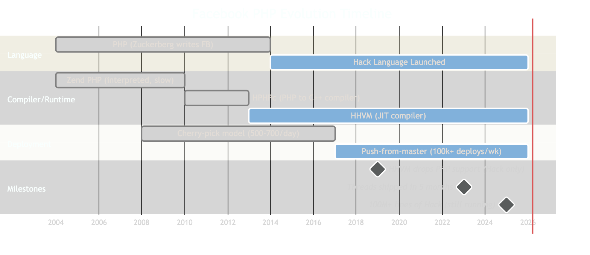
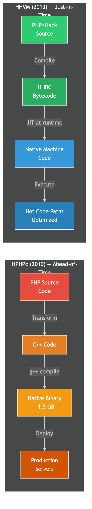
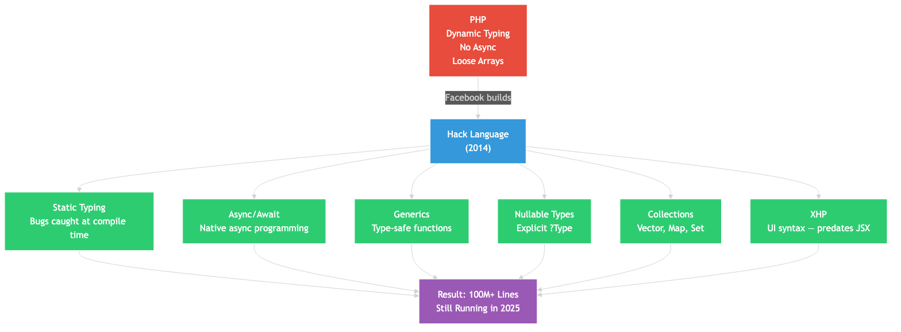

# How Facebook Serves 2 Billion Users from a PHP Monolith

> Everyone says "rewrite it in microservices." Facebook said "make PHP faster." They were right.

## The Problem: PHP at Facebook's Scale

In 2004, Mark Zuckerberg wrote Facebook in PHP. It was the fastest way to build a web app — write some PHP, hit refresh, see the result. No compilation, no build steps.

By 2009, Facebook had **300 million users** and a PHP codebase that was growing out of control. PHP (Zend engine) was interpreted — slow, memory-hungry, and not designed for this kind of scale.

The obvious answer? Rewrite it. Java, C++, Go, Erlang — pick a "real" language and start over. Or break it into microservices.

Facebook did **neither**.

## The Wrong Way: "Just Rewrite It"

Here's the thing about rewrites at Facebook's scale:

- The codebase was already **millions of lines** of PHP
- **Thousands of engineers** knew PHP and shipped features daily
- A rewrite would freeze feature development for months (or years)
- Distributed systems (microservices) introduce network latency, partial failures, and debugging nightmares
- PHP's "shared-nothing" architecture (each request starts fresh, no shared state) actually **eliminates entire classes of concurrency bugs**

Keith Adams, Facebook's founding HHVM engineer (later Slack's Chief Architect), argued that PHP's shared-nothing model is a **feature, not a bug** — it makes horizontal scaling trivial.

So instead of rewriting, Facebook took a different approach: **make PHP fast**.

## Solution 1: HPHPc — The PHP-to-C++ Compiler (2010)

In February 2010, Facebook open-sourced **HipHop for PHP (HPHPc)** — a source-to-source compiler that transformed PHP code into optimized C++, then compiled it with g++ into a native binary.

**The results were dramatic:**

| Metric | Improvement | Source |
|--------|------------|--------|
| CPU usage | **~50% reduction** on web servers | [Engineering at Meta, 2010](https://engineering.fb.com/2010/02/02/web/hiphop-for-php-move-fast/) |
| Throughput | **Up to 6x** over Zend PHP | [Wikipedia — HipHop for PHP](https://en.wikipedia.org/wiki/HipHop_for_PHP) |
| Request speed | **2.5x faster** than Zend PHP | [Engineering at Meta, Aug 2010](https://engineering.fb.com/2010/08/13/web/hiphop-for-php-six-months-later/) |

HPHPc powered over **90%** of Facebook's web traffic at its peak.

**But it had a critical limitation:** it required ahead-of-time compilation. The entire PHP codebase had to be compiled into one giant C++ binary. You couldn't just edit a PHP file and refresh the page anymore. Development slowed down.

## Solution 2: HHVM — The JIT Compiler (2013)

In Q1 2013, Facebook replaced HPHPc with the **HipHop Virtual Machine (HHVM)** — a JIT (Just-In-Time) compiler.

Instead of ahead-of-time compilation, HHVM:
1. Compiles PHP/Hack to **HHBC** (HipHop Bytecode)
2. Runs the bytecode through a JIT compiler at runtime
3. Converts hot code paths to **native machine code** on the fly

**Performance gains over vanilla PHP 5.2:**

| Metric | Improvement | Source |
|--------|------------|--------|
| Web request throughput | **Over 9x increase** | [HHVM GitHub](https://github.com/facebook/hhvm) |
| Memory consumption | **Over 5x reduction** | [HHVM GitHub](https://github.com/facebook/hhvm) |
| vs HPHPc (Dec 2013) | **~15% faster** | [Wikipedia — HHVM](https://en.wikipedia.org/wiki/HHVM) |

The key advantage: developers could edit code and test immediately — no waiting for a full recompile. Move fast was back.

**2016 JIT Redesign:** Facebook rebuilt the JIT to use profiling-guided optimizations, compiling larger code regions for better performance. ([Engineering at Meta, 2016](https://engineering.fb.com/2016/09/22/networking-traffic/redesigning-the-hhvm-jit-compiler-for-better-performance/))

**2021 Jump-Start:** A technique to seed a new server's JIT cache with compiled code from a warmed server, reducing HHVM warm-up overhead by **54.9%**. ([Engineering at Meta, 2021](https://engineering.fb.com/2021/03/03/developer-tools/hhvm-jump-start/))

## Solution 3: Hack — Facebook's Own Language (2014)

On March 20, 2014, Facebook launched **Hack** — a new programming language that runs on HHVM and interoperates seamlessly with PHP.

Hack looks like PHP but adds what PHP lacked:

| Feature | What It Solves |
|---------|---------------|
| **Static typing** | Catch type errors at compile time, not production |
| **Async/Await** | Native async programming without callback hell |
| **Generics** | Type-safe collections and functions |
| **Nullable types** | Explicit `?Type` — no more null pointer surprises |
| **Collections** | Type-safe `Vector`, `Map`, `Set` (replacing PHP's loose arrays) |
| **XHP** | XML-like UI syntax (predates React's JSX) |

Hack is **gradually typed** — dynamically typed code can coexist with statically typed code. This let Facebook migrate **incrementally**, file by file, without a big-bang rewrite.

**The PHP Divergence:** When PHP 7 came out in 2015 with massive performance improvements, HHVM's value was no longer "faster PHP" — it was the Hack type system and async support. In 2019, HHVM 4.0 dropped PHP support entirely. HHVM now runs **only Hack**.

## The Deployment Challenge: Shipping a Monolith at Scale

How do you deploy a monolith with **100+ million lines of code** to production multiple times a day?

### Early Days (Pre-2016): Cherry-Pick Model
- Engineers cherry-picked changes from master into release branches
- **500-700 cherry-picks per day**
- Weekly push contained up to **10,000 diffs**
- 3 pushes per day on workdays

### Modern System (2017+): Quasi-Continuous Deployment
In April 2017, Facebook completed a transition to **push-from-master** — deploying directly from the main branch.

The process:
1. Code passes automated tests
2. Deployed to **internal users** (Facebook employees)
3. Rolled to **canary** (2% of production)
4. Rolled to **full production**
5. **Tens to hundreds of diffs** pushed every few hours

The compiled binary is **~1.5 GB** and distributed to servers via **BitTorrent** (using cluster and rack affinity to minimize network traffic).

Facebook's unified CD system, **Conveyor**, handles **100,000+ deployments per week** across all services. ([At Scale Conference](https://atscaleconference.com/conveyor-continuous-deployment-at-facebook/))

## Current State (2025): Still a Monolith

As of May 2025, Meta's Web Foundation team confirms that Meta's **monolithic web tier still runs Hack on HHVM**. ([Engineering at Meta, May 2025](https://engineering.fb.com/2025/05/20/web/metas-full-stack-hhvm-optimizations-for-genai/))

The monolith, called **"WWW"** internally, is now **100+ million lines of Hack code**.

Meta's architecture is a **hybrid** — monolithic core (WWW in Hack) with service-oriented components for specific features, plus backend services in C++, Python, and Rust.

**Proof it works:** Meta shipped **Threads** (150+ million users) in just **5 months** by forking Instagram's monolithic architecture. ([InfoQ, April 2024](https://www.infoq.com/news/2024/04/meta-threads-instagram-5-months/))

## The Lesson

Facebook didn't fight their monolith. They made it **faster** (HPHPc to HHVM), **safer** (Hack's type system), and **deployable** (quasi-continuous delivery).

1. **Don't rewrite what you can optimize** — HPHPc gave 6x throughput by compiling PHP to C++
2. **Shared-nothing architecture scales** — each PHP request is independent, horizontal scaling is trivial
3. **Invest in tooling** — custom compiler, custom language, custom deployment
4. **Gradually migrate** — Hack's gradual typing let them migrate incrementally, not all at once
5. **Microservices aren't free** — distributed systems add latency, complexity, and debugging overhead

Your startup probably doesn't need microservices. Facebook serves 2 billion users without them.

## The Evolution at a Glance

| Year | Event | Impact |
|------|-------|--------|
| 2004 | Facebook written in PHP | Fast iteration, "move fast" |
| 2010 | HPHPc open-sourced | 50% CPU reduction, 6x throughput |
| 2013 | HHVM replaces HPHPc | 9x throughput, dev-friendly JIT |
| 2014 | Hack language launched | Static typing, async, generics |
| 2017 | Push-from-master deployment | Quasi-continuous, 100k+ deploys/week |
| 2019 | HHVM drops PHP support | Full commitment to Hack |
| 2025 | Monolith still in production | 100M+ lines of Hack, optimized for GenAI |

## References

- [HipHop for PHP: Move Fast — Engineering at Meta (2010)](https://engineering.fb.com/2010/02/02/web/hiphop-for-php-move-fast/)
- [HipHop for PHP: Six Months Later — Engineering at Meta (2010)](https://engineering.fb.com/2010/08/13/web/hiphop-for-php-six-months-later/)
- [The HipHop Virtual Machine — Engineering at Meta (2011)](https://engineering.fb.com/2011/12/09/open-source/the-hiphop-virtual-machine/)
- [Hack: A New Programming Language for HHVM — Engineering at Meta (2014)](https://engineering.fb.com/2014/03/20/developer-tools/hack-a-new-programming-language-for-hhvm/)
- [Rapid Release at Massive Scale — Engineering at Meta (2017)](https://engineering.fb.com/2017/08/31/web/rapid-release-at-massive-scale/)
- [HHVM Jump-Start — Engineering at Meta (2021)](https://engineering.fb.com/2021/03/03/developer-tools/hhvm-jump-start/)
- [Meta's Full-stack HHVM Optimizations for GenAI — Engineering at Meta (2025)](https://engineering.fb.com/2025/05/20/web/metas-full-stack-hhvm-optimizations-for-genai/)
- [Keith Adams: Taking PHP Seriously — InfoQ (2013)](https://www.infoq.com/presentations/php-history/)
- [Facebook PHP with Keith Adams — SE Daily (2019)](https://softwareengineeringdaily.com/2019/07/15/facebook-php-with-keith-adams/)
- [Meta Shipped Threads in 5 Months — InfoQ (2024)](https://www.infoq.com/news/2024/04/meta-threads-instagram-5-months/)
