# Your First PR Will Get Rejected. Here's Why (And What Seniors Actually Want)

Your first pull request at your new job WILL get rejected. Not because your code is wrong — but because you missed what seniors actually review. Day 3 at your new job. You spent 6 hours writing clean code. All tests pass locally. You push your branch, open a pull request, add a reviewer, and go home feeling accomplished.

Next morning: 47 comments. Red dots everywhere. "Rename this." "Handle this edge case." "Why no test for this path?" "This commit message tells me nothing." "Where's the Jira link?"

Your ego? Destroyed. But here's the thing — your code probably *worked*. The function did what it was supposed to do. The bug was fixed. The feature was functional. So why 47 comments?

Because "does it work?" is roughly **10% of what a senior engineer evaluates during code review**. The other 90% is everything you were never taught in college — naming, error handling, edge cases, test quality, commit hygiene, and PR context. This article breaks down exactly what seniors look for, why they look for it, and gives you a concrete 5-point checklist to follow before every PR submission.

---

## The Problem — Why Working Code Still Gets Rejected

Here's the mental model most freshers have about code review:

```
Code works → Push → Get approved → Merge → Done
```

Here's what actually happens:

```
Code works → Push → 47 comments → Fix → Re-push → 12 more comments 
→ Fix → Re-push → "One more thing" → Fix → Approved → Squash merge
```

The gap between these two models is the **readability gap**. Your code runs correctly on a machine, but it fails the human review — the part where another engineer has to read, understand, maintain, and extend your code six months from now.

Google's engineering practices documentation — one of the most cited references for code review standards — explicitly states that **readability and maintainability are the primary goals of code review**, not correctness. Correctness is what tests and CI are for. Code review is for humans.

A 2013 study by Microsoft Research (Bacchelli & Bird, "Expectations, Outcomes, and Challenges of Modern Code Review") analyzed thousands of code reviews at Microsoft and found that the most frequent review feedback fell into these categories:

| Category | % of All Comments |
|----------|------------------|
| Code improvements (readability, style, naming) | 28% |
| Defect finding (actual bugs) | 14% |
| Knowledge transfer | 20% |
| Alternative solutions | 12% |
| Documentation/comments | 10% |
| Other | 16% |

Notice: **actual bug finding is only 14%** of review comments. The majority — readability, knowledge transfer, documentation — are about making the code better for *humans*, not for the compiler.

> **In short:** Code review isn't about checking if your code works. It's about checking if another human can read, understand, and maintain it.

---

## What Seniors Actually Review — The 5 Dimensions


*The five dimensions of code review — each one matters independently. Scoring low on any single dimension triggers a "request changes" review.*

Think of code review as a radar chart with 5 axes. Your PR gets scored on each one independently. Even if 4 are perfect, one low score triggers a "request changes" review. Here are the 5 dimensions, in order of how frequently they trigger review comments.

---

### 1. Naming Conventions — "Can I Read This Without Asking You?"

This is the #1 source of review comments for freshers. Not because naming is hard conceptually, but because freshers underestimate how much names matter to someone reading the code for the first time.

**The test:** Can a stranger read this variable/function name and understand what it does without reading the implementation?

**Bad naming (what freshers write):**
```python
def process(d):
    for i in d:
        if i['s'] == 'active':
            r.append(i)
    return r
```

**Good naming (what gets approved):**
```python
def filter_active_users(users: list[dict]) -> list[dict]:
    active_users = []
    for user in users:
        if user['status'] == 'active':
            active_users.append(user)
    return active_users
```

The second version has zero ambiguity. Every variable name tells you exactly what it holds. Every function name tells you exactly what it does. A reviewer reading this for the first time understands it immediately.

**Common naming mistakes freshers make:**

| Mistake | Example | Fix |
|---------|---------|-----|
| Single-letter variables (outside loops) | `d`, `r`, `x` | `users`, `result`, `count` |
| Generic names | `data`, `info`, `handler`, `manager` | Be specific: `user_data`, `payment_info` |
| Boolean without prefix | `flag`, `check` | `is_active`, `has_permission`, `should_retry` |
| Abbreviations | `usr`, `msg`, `btn` | `user`, `message`, `button` |
| Verb confusion | `getUser()` returns list | `listUsers()` or `fetchUsers()` |

**The rule seniors follow:** If a variable name requires a comment to explain it, the name is wrong. The name IS the comment.

> **In short:** Name things like someone will read your code at 2 AM during an incident. Because they will.

---

### 2. Error Handling — "What Happens When Things Go Wrong?"

The second most common review feedback: "What if this fails?" Freshers write the happy path — the flow where everything works perfectly. Seniors immediately think about the unhappy paths.

**What freshers write:**
```python
def get_user_profile(user_id: str) -> dict:
    response = requests.get(f"https://api.example.com/users/{user_id}")
    return response.json()
```

**What seniors expect:**
```python
def get_user_profile(user_id: str) -> dict | None:
    try:
        response = requests.get(
            f"https://api.example.com/users/{user_id}",
            timeout=5,
        )
        response.raise_for_status()
        return response.json()
    except requests.Timeout:
        logger.warning(f"Timeout fetching user {user_id}")
        return None
    except requests.HTTPError as e:
        logger.error(f"HTTP error fetching user {user_id}: {e.response.status_code}")
        return None
    except requests.RequestException as e:
        logger.error(f"Request failed for user {user_id}: {e}")
        return None
```

The difference is dramatic. The fresher's version will crash the entire request if the API is down, returns a 500, or times out. The senior's version handles each failure mode specifically, logs useful context, and returns a safe fallback.

**The three questions seniors ask about every external call:**

1. **What if it times out?** — Always set explicit timeouts. Default timeouts are usually infinite or too long.
2. **What if it returns an error?** — Check status codes. A 404 and a 500 mean very different things.
3. **What if it returns unexpected data?** — Validate the shape of the response before using it.

> **In short:** Seniors don't review the happy path — they review the failure modes. Every external call, file operation, and database query needs an error handling strategy.

---

### 3. Edge Cases & Test Coverage — "Did You Think About the Weird Inputs?"

Edge cases are the inputs you didn't think about. The empty list. The null user. The string with special characters. The concurrent request. The leap year. The timezone at midnight UTC.

**What freshers miss:**

```python
def calculate_average(scores: list[int]) -> float:
    return sum(scores) / len(scores)
```

A reviewer immediately sees: **what if `scores` is empty?** Division by zero. The function crashes. This is a 30-second fix, but it shows the reviewer that you didn't think about failure modes.

```python
def calculate_average(scores: list[int]) -> float:
    if not scores:
        return 0.0
    return sum(scores) / len(scores)
```

**The edge case checklist seniors run mentally:**

| Input Type | Edge Cases to Check |
|-----------|-------------------|
| List/Array | Empty, single element, very large, duplicates |
| String | Empty, whitespace only, special characters, unicode, very long |
| Number | Zero, negative, very large, decimal precision |
| Object/Dict | Missing keys, null/None values, extra unexpected fields |
| Date/Time | Midnight, DST transitions, leap years, timezone boundaries |
| API Response | Timeout, 4xx, 5xx, empty body, malformed JSON |
| Database | No rows found, duplicate key, connection lost |
| Concurrency | Race condition, double submission, stale read |

**Test coverage is the proof.** It's not enough to handle edge cases — you need tests that prove they're handled. Seniors look at your tests to see:

1. Does the test actually test the function's behavior, or does it just assert `True == True`?
2. Is the unhappy path tested, or only the happy path?
3. Are the test names descriptive? `test_1` tells nothing. `test_empty_list_returns_zero` tells everything.

```python
# Bad test — what does this even prove?
def test_average():
    assert calculate_average([1, 2, 3]) == 2.0

# Good test suite — covers behavior + edge cases
def test_average_with_multiple_scores():
    assert calculate_average([1, 2, 3]) == 2.0

def test_average_with_empty_list_returns_zero():
    assert calculate_average([]) == 0.0

def test_average_with_single_score():
    assert calculate_average([5]) == 5.0

def test_average_with_negative_scores():
    assert calculate_average([-1, -2, -3]) == -2.0
```

> **In short:** Every function has at least 3 edge cases you didn't think about. Your tests should prove you thought about them.

---

### 4. Commit Messages & Git History — "Can I Understand the Change from the Git Log?"

Your commit history tells a story. Seniors read it to understand *why* changes were made, not just *what* changed. A clean commit history means a reviewer can understand the context of each change without asking you.

**What freshers commit:**
```
fix bug
update code
final changes
fixes
WIP
asdfgh
```

**What gets approved:**
```
fix: handle empty cart in checkout flow

Previously, submitting an empty cart returned a 500 error because the
total calculation assumed at least one item. Now returns a 400 with
a clear error message.

Closes #1234
```

**The anatomy of a good commit message:**

```
<type>: <what changed> (50 chars max for first line)

<why it changed — 2-3 sentences explaining the motivation>

<reference to ticket/issue>
```

Common types: `fix:`, `feat:`, `refactor:`, `test:`, `docs:`, `chore:`

**Why this matters beyond code review:**

- `git blame` shows commit messages next to every line. "asdfgh" next to a critical line is useless. "fix: prevent race condition in payment deduction" is gold.
- `git log` becomes the changelog. Product managers, oncall engineers, and future developers use it to understand what changed and why.
- `git bisect` uses commits to find which change introduced a bug. If one commit contains 47 unrelated changes, bisect is useless.

**The one-commit-per-logical-change rule:**

Each commit should represent exactly one logical change. If you renamed a variable AND fixed a bug AND added a feature, that's 3 commits, not 1. This makes rollback safe — you can revert the bug fix without losing the rename.

> **In short:** Your commit messages are documentation that lives forever in the git history. Write them like someone will read them during a 2 AM incident — because they will.

---

### 5. PR Description & Context — "Why Does This Change Exist?"

The PR description is the first thing a reviewer reads. It sets the context for everything that follows. Without it, the reviewer has to reverse-engineer *why* you made each change by reading the diff — which is slow, frustrating, and error-prone.

**What freshers submit:**

```
Title: Fix bug
Description: (empty)
```

**What gets approved:**

```
Title: Fix empty cart 500 error in checkout flow

## What
Handle the edge case where a user submits an empty cart, which
previously caused a 500 error in the checkout endpoint.

## Why
3 users reported seeing a generic error page when clicking "Checkout"
with an empty cart. The root cause was a division-by-zero in the
total calculation, which assumed at least one cart item.

## How
- Added an empty cart check at the start of the checkout handler
- Returns a 400 with message "Cart is empty" instead of crashing
- Added unit test for empty cart edge case

## Testing
- [x] Unit test: `test_empty_cart_returns_400`
- [x] Manual test: empty cart → 400 response ✓
- [x] Existing tests pass

## Related
- Closes #1234
- Slack thread: #checkout-bugs
```


*The structure of a pull request description that gets approved on the first review.*

**The 4 sections every PR description needs:**

1. **What** — What did you change? One paragraph.
2. **Why** — Why was this change needed? Link to the ticket, user report, or metric.
3. **How** — How did you solve it? Bullet points of the approach.
4. **Testing** — How did you verify it works? Manual steps + automated tests.

**Why screenshots matter:** For any UI change, before/after screenshots are mandatory. A reviewer can't run your branch locally for every review — screenshots let them verify the visual change instantly.

> **In short:** A good PR description saves the reviewer 30 minutes of context-gathering. It's not extra work — it's the difference between a 1-hour review and a 1-day review.

---

## End-to-End: Your PR's Journey from Push to Merge



*The full journey of a pull request from your IDE to the main branch. Most freshers only think about the first 2 steps.*

Let's trace a single PR through the entire code review pipeline. This is the journey every change makes, from your local machine to the main branch.

### Step 1: You Write the Code
You pick up a Jira ticket, create a feature branch (`feat/empty-cart-check`), write the code, and run tests locally. Everything passes.

### Step 2: You Push and Open the PR
You push your branch and open a pull request. You add the PR title, description (with What/Why/How/Testing sections), and assign 1-2 reviewers.

### Step 3: CI Runs
The CI pipeline runs automatically — linting, type checking, unit tests, integration tests, security scans. If CI fails, fix it before requesting review. Seniors won't review code that doesn't pass CI.

### Step 4: Reviewer Reads the PR
The reviewer starts with the PR description (context), then reads the diff file by file. They're checking the 5 dimensions: naming, error handling, edge cases, tests, commit quality.

### Step 5: Comments Come In
The reviewer leaves comments — inline suggestions, questions, and "request changes." This is NOT an attack. Each comment is a learning opportunity. The average Google CL (changelist) gets 4 rounds of review comments before approval.

### Step 6: You Address Comments
For each comment: either make the fix (and push a new commit), or reply explaining why you disagree (with evidence). Never ignore a comment. Never silently skip one.

### Step 7: Re-review
The reviewer checks your fixes. If everything looks good → "Approved." If not → more comments. This cycle repeats until the reviewer is satisfied.

### Step 8: Squash Merge
Once approved, you squash merge into main. The squash combines your 7 "fix review comment" commits into one clean commit with a proper message.

> **In short:** A PR isn't done when the code works. It's done when a human reviewer says "I trust this code enough to let it run in production."

---

## The 5-Point Checklist Before Hitting Submit


*Follow this checklist before every single PR. It takes 10 minutes and saves hours of back-and-forth.*

Before you click "Create Pull Request," run through these 5 checks. This takes 10 minutes and saves hours of review ping-pong.

### ✅ 1. Self-Review Your Own Diff

Open the diff view (GitHub "Files changed" tab) and read every line as if someone else wrote it. You will catch:
- Leftover `console.log` or `print` statements
- Commented-out code you forgot to remove
- A variable named `temp` that should be named `user_session`
- A TODO you forgot to resolve
- An import you added but never used

**The mindset shift:** Don't review as the author ("I know what I meant"). Review as a stranger ("What does this code tell me?").

### ✅ 2. Run Tests Locally

Don't rely on CI to catch failures. Run your tests locally:

```bash
# Python
pytest -v

# JavaScript/TypeScript
npm test

# Go
go test ./...

# Java
mvn test
```

If a test fails locally, it'll fail in CI too — and your reviewer will see a red CI badge before even reading your code. First impressions matter.

### ✅ 3. Small, Focused Commits

Each commit should be one logical change. Split large changes into a stack of small commits:

```
good:
  fix: validate empty cart before checkout
  test: add empty cart edge case tests
  refactor: extract cart validation to separate module

bad:
  everything
```

**The SmartBear study on code review effectiveness** found that reviews of 200-400 lines of code catch the most defects. Reviews over 400 lines see a dramatic drop in defect detection — reviewers start skimming. Keep your PRs small.

### ✅ 4. Write a PR Description with Context

Fill in the What/Why/How/Testing template. Add screenshots for UI changes. Link the ticket. This isn't bureaucracy — it's empathy for the reviewer's time.

### ✅ 5. Link the Ticket

Every PR should trace back to a ticket (Jira, Linear, GitHub Issue). The link gives the reviewer business context — *why* this change exists, who requested it, and what the acceptance criteria are.

> **In short:** This checklist is your quality gate. Treat it like a pre-flight checklist — skip one step and the flight gets delayed (your merge gets delayed).

---

## Why This System Works — The Hidden Value of Code Review

Code review isn't just quality control. It's three things at once:

### 1. Knowledge Transfer
When a senior leaves 47 comments on your PR, they're teaching you every engineering principle they learned over 5+ years. Each comment is a micro-lesson. By your 20th PR, you'll have internalized patterns that took them years to learn.

### 2. Collective Code Ownership
In a team, no single person "owns" a file. Everyone reviews everyone's code. This means any engineer can debug, modify, or extend any part of the codebase. Code review is how this shared knowledge is built.

### 3. Defect Prevention
Bugs caught in code review are 10-100x cheaper to fix than bugs caught in production. A reviewer spotting a missing null check takes 30 seconds. The same bug in production causes an incident, an investigation, a post-mortem, and a hotfix — hours or days of engineer time.


*The cost multiplier of fixing bugs at each stage. Code review is the cheapest place to catch defects.*

### How to Handle Feedback Gracefully

1. **Don't take it personally.** The reviewer is reviewing the code, not you. "This variable name is confusing" means the name needs work — not that you're a bad engineer.
2. **Say thank you.** A reviewer spending 30 minutes on your PR is investing their time in your growth. Acknowledge it.
3. **Ask questions.** If a comment doesn't make sense, ask: "Could you explain why this approach is better?" Every question is an opportunity to learn.
4. **Disagree with evidence.** If you believe your approach is correct, explain why with data, documentation, or examples. "I chose X because the docs recommend it for this use case — link."
5. **Never ignore comments.** Reply to every single one. "Done" for fixes. "Acknowledged, will fix in follow-up" for out-of-scope items.

> **In short:** Your first rejected PR isn't a failure. It's day one of becoming a real engineer. Every comment is a lesson. Every rejection is an upgrade.

---

## References

1. [Google Engineering Practices — How to do a code review](https://google.github.io/eng-practices/review/) — Google's public guide to code review expectations, the gold standard.
2. Bacchelli, A., & Bird, C. (2013). "Expectations, Outcomes, and Challenges of Modern Code Review." *Proceedings of the 35th International Conference on Software Engineering (ICSE)*. Microsoft Research. — The most cited study on what code reviewers actually focus on.
3. [SmartBear — Best Practices for Peer Code Review](https://smartbear.com/learn/code-review/best-practices-for-peer-code-review/) — Data-backed findings on optimal review size (200-400 LOC) and review speed.
4. [GitHub Octoverse 2024 — Developer Productivity](https://github.blog/news-insights/octoverse/octoverse-2024/) — Annual data on pull request patterns, review times, and merge rates across millions of repositories.
5. [Conventional Commits Specification](https://www.conventionalcommits.org/) — The standard for structured commit messages used by thousands of open-source projects.
6. [How Google Does Code Review — Michaela Greiler](https://www.michaelagreiler.com/code-reviews-at-google/) — Deep dive into Google's CL review process, approval workflows, and readability reviews.
7. [The Art of Readable Code — Dustin Boswell & Trevor Foucher](https://www.oreilly.com/library/view/the-art-of/9781449318482/) — The definitive book on naming, simplicity, and writing code for humans.
8. [Write Better Commit Messages — freeCodeCamp](https://www.freecodecamp.org/news/how-to-write-better-git-commit-messages/) — Practical guide to commit message format, types, and examples.

---

#codereview #pullrequest #firstjob #softwareengineer #coding #fresher #developer #careeradvice #programming #tech #systemdesign #interview
