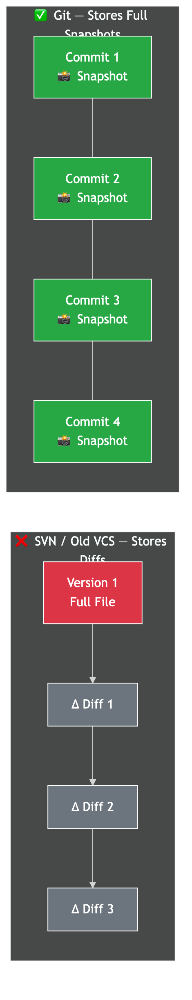
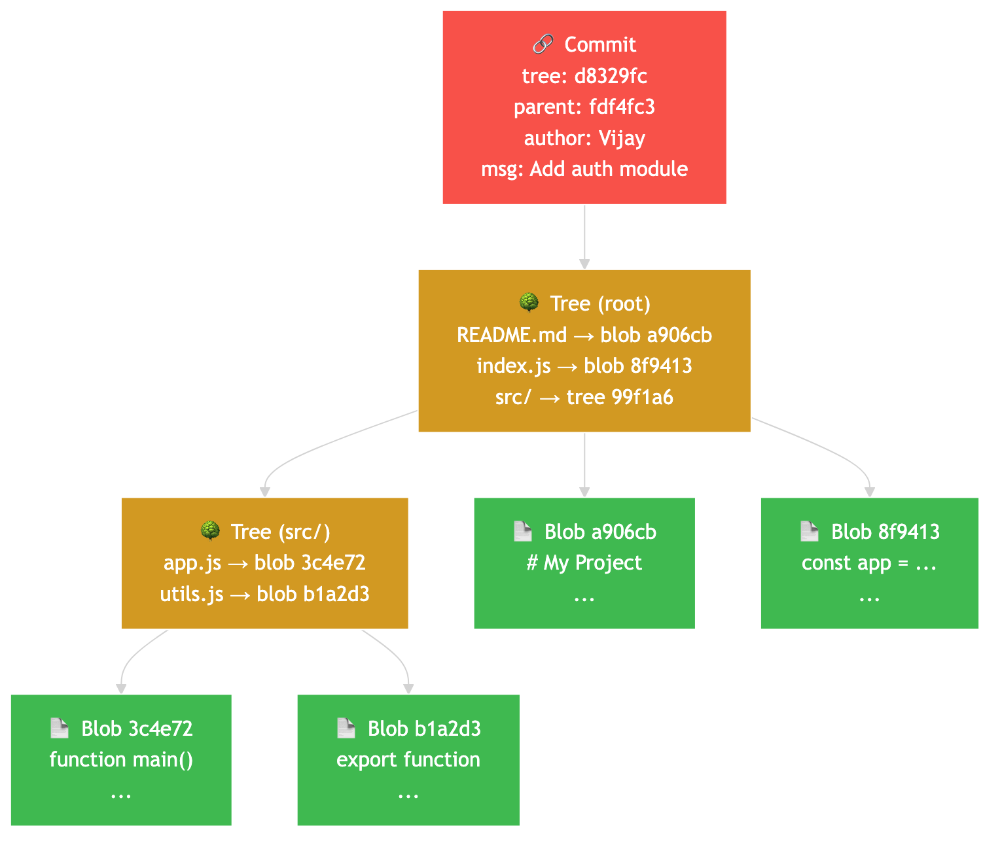
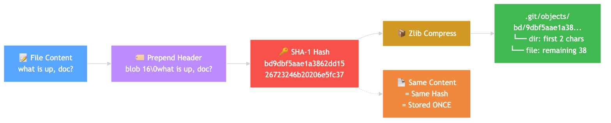
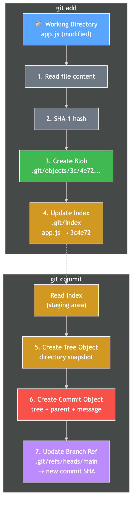
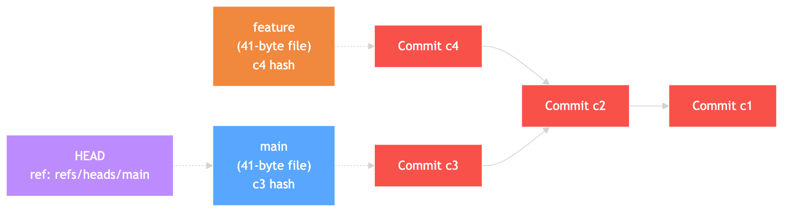

# How Git Actually Works Under the Hood — Blobs, Trees, Commits, and a Content-Addressable Filesystem

## The Hook

You use Git every day. You `add`, `commit`, `push`, `pull`. But here's something most developers don't know — **Git is NOT a version control system.** At its core, Git is a **content-addressable filesystem** — a key-value store where the key is a SHA-1 hash of the content and the value is the content itself. Version control is built on top of that.

Understanding Git's internals changes how you think about every command you type. Let's open the hood.

---

## The Myth: "Git Stores Diffs"

Most developers believe Git stores **differences** between file versions. That's how SVN and older systems worked — you store the original file, then a series of patches (diffs) to reconstruct each version.

**Git does NOT work this way.**

Git stores **full snapshots**. Every commit captures the complete state of your project at that moment — not just what changed. The official Pro Git book explicitly states this distinction.

"But wait — wouldn't that waste massive storage?" That's where Git's genius comes in. It uses **content addressing** and **deduplication** to make snapshots almost as efficient as diffs.



---

## The 4 Git Object Types

Everything in Git is an **object**. There are exactly **4 types**:

### 1. Blob (Binary Large Object)

A blob stores **file content only** — no filename, no permissions, no metadata. Just raw data.

- Identified by SHA-1 hash of: `blob <size-in-bytes>\0<content>`
- Two files with identical content (even different names) = **one blob**
- The blob has no idea what its filename is — the tree object stores that

### 2. Tree

A tree stores a **directory listing** — filenames, permissions, and pointers to blobs or other trees (subdirectories).

```
100644 blob a906cb2a...  README.md
100644 blob 8f941393...  index.js
040000 tree 99f1a6d1...  src/
```

Each entry has:
- **Mode** — `100644` (normal file), `100755` (executable), `040000` (subdirectory)
- **Type** — blob or tree
- **SHA-1 hash** — pointer to the blob/tree
- **Filename**

### 3. Commit

A commit points to exactly **one tree** (the root directory snapshot) and contains metadata:

```
tree d8329fc1cc938780ffdd9f94e0d364e0ea74f579
parent fdf4fc3344e67ab068f836878b6c4951e3b15f3d
author Vijay <vijay@example.com> 1243040974 +0530
committer Vijay <vijay@example.com> 1243040974 +0530

Add authentication module
```

- First commit has **no parent**
- Merge commits have **multiple parents**
- The tree = complete project snapshot at that moment

### 4. Tag (Annotated)

Created by `git tag -a`. Contains: object hash, type, tag name, tagger info, and a message. Lightweight tags (`git tag`) are just reference files (like branches) — they don't create a tag object.



---

## SHA-1 Content Addressing — How Git Stores Everything

Git is a **content-addressable filesystem**. This means: the storage location of every object is determined by its content.

### The Hash Formula

```
SHA-1( "<type> <size>\0<content>" )
```

Where:
- `<type>` = "blob", "tree", "commit", or "tag"
- `<size>` = byte count of content (as ASCII digits)
- `\0` = null byte separator
- `<content>` = the raw content

### Worked Example (from official Git docs)

```ruby
content = "what is up, doc?"
header  = "blob 16\0"
store   = "blob 16\0what is up, doc?"
sha1    = SHA1(store) → "bd9dbf5aae1a3862dd1526723246b20206e5fc37"
```

The object is then **zlib-compressed** and stored at:

```
.git/objects/bd/9dbf5aae1a3862dd1526723246b20206e5fc37
              ^^
         first 2 chars = directory name
              remaining 38 chars = filename
```

### Why This Enables Deduplication

Same content → same SHA-1 → same storage location → **stored only once**.

- `README.md` and `COPY_OF_README.md` with identical content = **one blob**
- Renaming a file does NOT create a new blob (only the tree changes)
- Across 100 commits, if a file doesn't change, all 100 trees point to the **same blob**

This is why Git stores full snapshots without wasting space.



---

## What Actually Happens When You Run `git add` and `git commit`

### `git add <file>` — Step by Step

1. Git reads the file content
2. Computes SHA-1: `SHA-1("blob <size>\0<content>")`
3. Compresses with zlib, writes to `.git/objects/XX/YYYY...` (a new **blob**)
4. Updates the **index** (`.git/index`) — a binary file that maps filenames → blob SHAs
5. The index = the staging area = what will go into the next commit

### `git commit` — Step by Step

1. Reads the index (staging area)
2. Creates **tree objects** — one for each directory level, bottom-up
3. Creates a **commit object** pointing to the root tree, with:
   - Parent commit SHA (from current HEAD)
   - Author/committer info + timestamps
   - Commit message
4. Updates the current branch ref (e.g., `.git/refs/heads/main`) to point to the new commit
5. HEAD still points to the branch, which now points to the new commit

### The Analogy

Think of it as a **Polaroid camera**:
- `git add` = arranging items on a table (staging area)
- `git commit` = taking the photo (immutable snapshot)
- The photo is labeled with a unique fingerprint (SHA-1) and filed in `.git/objects`



---

## Branches Are Just 41-Byte Text Files

This is the most mind-blowing Git fact for most developers.

### A branch is literally a text file containing one commit hash

```bash
$ cat .git/refs/heads/main
1a410efbd13591db07496601ebc7a059dd55cfe9
```

That is the **entire branch**. 40 characters (SHA-1 hash) + 1 newline = 41 bytes.

Creating a branch = creating a 41-byte file. Almost zero cost.

### HEAD — The "You Are Here" Pin

`.git/HEAD` is a **symbolic reference** pointing to the current branch:

```
ref: refs/heads/main
```

In detached HEAD state, it contains a raw SHA-1 hash instead.

### What Happens on `git commit`

1. Creates a new commit object (parent = current branch tip)
2. Writes the new commit's SHA into the branch file (e.g., `.git/refs/heads/main`)
3. The branch pointer **moves forward** — that's literally all a commit does to the branch



---

## The Commit DAG (Directed Acyclic Graph)

Commits don't form a chain — they form a **graph**.

- **Directed** — each commit points to its parent(s), edges go backward in time
- **Acyclic** — cycles are cryptographically impossible (a commit's SHA depends on its parent's SHA; creating a cycle would require a commit to include its own future hash)
- **Graph** — merge commits have multiple parents, creating branches and merges

This is why `git log` can traverse the entire history without infinite loops, and `git merge-base` can find the common ancestor of any two branches.

---

## Packfiles — How Git Compresses at Scale

Loose objects (individual files in `.git/objects`) work fine for small repos. But for the **Linux kernel** (10+ million Git objects) or **Microsoft Windows repo** (~300 GB, 3.5 million files), storing millions of individual compressed files would be inefficient.

### How Packfiles Work

1. `git gc` (garbage collection) triggers packing
2. Git identifies objects that are **similar in name and size**
3. Stores the **most recent version in full** (base object)
4. Stores **older versions as deltas** — instructions to reconstruct from the base

### Real Numbers (from official Git docs)

| Version | Raw Size | Packed Size | How |
|---------|----------|-------------|-----|
| Version 2 (latest) | 22,054 bytes | 5,799 bytes | Full object (base) |
| Version 1 (older) | ~22K | **9 bytes** | Delta from V2 |

A 22K file stored as a **9-byte delta**. That's the power of packfiles.

From GitHub's engineering blog: Git's own root tree at v2.37.0 is 19,388 bytes uncompressed, but as a delta from the previous version, it's only **50 bytes**.

### Large Repo Stats

| Repository | Git Objects | Size | Notable |
|-----------|-------------|------|---------|
| Linux kernel (6.9) | **10+ million** | ~4.5 GB | First kernel to surpass 10M objects |
| Microsoft Windows | ~40M commits+trees | **~300 GB** | Largest Git repo on the planet |
| Linux (2024) | 87,235 files | 39.8M lines | 75,314 commits in one year |

---

## The `.git` Directory — Your Entire Repository

```
.git/
├── HEAD              ← Points to current branch (e.g., ref: refs/heads/main)
├── objects/          ← ALL blobs, trees, commits, tags
│   ├── pack/         ← Packfiles (.pack + .idx)
│   ├── info/         ← Metadata
│   └── ab/cdef...    ← Loose objects (first 2 SHA chars = dir)
├── refs/
│   ├── heads/        ← Local branches (main, feature-x)
│   ├── tags/         ← Tags (v1.0, v2.0)
│   └── remotes/      ← Remote-tracking branches (origin/main)
├── index             ← Staging area (binary file)
└── config            ← Repository config
```

### Useful Inspection Commands

```bash
git cat-file -t <sha>     # Show object type (blob/tree/commit/tag)
git cat-file -p <sha>     # Pretty-print object content
git cat-file -s <sha>     # Show object size in bytes
git hash-object <file>    # Compute SHA-1 without storing
git verify-pack -v .git/objects/pack/pack-*.idx  # Inspect packfile
```

---

## Common Misconceptions

| Myth | Reality |
|------|---------|
| "Git stores diffs" | Git stores **full snapshots**. Packfile deltas are a storage optimization, not the model. |
| "Branches are copies of code" | A branch is a **41-byte file** with a commit hash. Creating one is free. |
| "Commits store changes" | A commit stores a **pointer to a tree** (full snapshot). Git *computes* diffs on the fly. |
| "Pull requests are a Git feature" | PRs are a **hosting platform feature** (GitHub/GitLab), not part of Git itself. |
| "Deleting a branch deletes commits" | Only removes the pointer. Commits exist in objects until garbage collected (~90 days for unreachable). |
| "SHA-1 is for security" | Git uses SHA-1 for **data integrity**, not cryptographic security. SHA-256 transition is underway. |

---

## Fun Facts

- **Linus Torvalds created Git in April 2005** to manage Linux kernel development after the BitKeeper license was revoked
- The name "git" is British slang for an unpleasant person — Torvalds joked he names projects after himself
- A branch is cheaper than a variable in most programming languages (41 bytes vs 8 bytes for a pointer — but the branch does infinitely more)
- Git doesn't track renames — it **detects** them by comparing blobs between trees

---

## Summary

| Concept | What It Actually Is |
|---------|-------------------|
| Blob | File content only (no name) |
| Tree | Directory listing (names → blob/tree pointers) |
| Commit | Snapshot pointer (tree + parent + metadata) |
| Branch | 41-byte text file (one commit hash) |
| HEAD | Pointer to current branch |
| SHA-1 | Content → address (same content = same address = stored once) |
| Packfiles | Delta-compressed bundles for large-scale efficiency |

**Git is not magic — it's elegant engineering built on a simple idea: address everything by its content, and the rest follows.**

---

## References

- [Git - Git Objects (official Pro Git book)](https://git-scm.com/book/en/v2/Git-Internals-Git-Objects)
- [Git - Packfiles (official Pro Git book)](https://git-scm.com/book/en/v2/Git-Internals-Packfiles)
- [Git - Git References (official Pro Git book)](https://git-scm.com/book/en/v2/Git-Internals-Git-References)
- [GitHub Blog - Git's Database Internals I: Packed Object Store](https://github.blog/open-source/git/gits-database-internals-i-packed-object-store/)
- [GitHub Blog - Measuring the Many Sizes of a Git Repository](https://github.blog/2018-03-05-measuring-the-many-sizes-of-a-git-repository/)
- [The Largest Git Repo on the Planet (Microsoft DevBlogs)](https://devblogs.microsoft.com/bharry/the-largest-git-repo-on-the-planet/)
- [Linux 6.9: First to Top 10M Git Objects (The Register)](https://www.theregister.com/2024/03/11/linux_6_8_arrives/)

---

*#git #gitinternals #systemdesign #softwaredevelopment #coding #tech #versioncontrol #sha1 #datastructures #softwareengineering*
