# HTTP Just Got a New Method: QUERY (RFC 10008)

**HTTP just got its first genuinely new method in years — a GET that can finally carry a request body. It's called QUERY, and it was published as RFC 10008 in June 2026.**

If you have ever written a `POST /search` endpoint, this is for you. Every search API you have ever built quietly lied to the server: it told an infrastructure layer that a *read* was a *write*. QUERY is the method that was missing for that job — safe and idempotent like GET, but able to send a full request body like POST.

This is not a hack or a library. It is a real, IETF Standards-Track method (Proposed Standard), co-authored by engineers at Cloudflare and Akamai — two of the biggest CDN companies on the planet. The internet-draft that became it was literally named `draft-ietf-httpbis-safe-method-w-body` — "safe method with a body." It had been in the works for roughly seven years. The "finally" framing is earned.

In this breakdown we will trace exactly *why* HTTP needed this, *how* QUERY works down to its cache key, *when* you should reach for it, and — just as important — *when you still can't*.

> **In short:** QUERY is a new HTTP method that behaves like a GET (safe, idempotent, cacheable) but carries a request body like POST — purpose-built for search and complex read queries.

---

## The Problem: Reads That Need a Body

Think about what a search request actually is. You send a bunch of filters — maybe a nested JSON query, a geo polygon, a list of facets — and you get back matching results. You don't change anything on the server. Run it once or run it a hundred times, the server state is identical.

In HTTP terms, that means a search is **safe** (no state change) and **idempotent** (repeating it has no extra effect). Those are exactly the properties of a `GET`. So search *should* be a GET.

There's just one problem: a GET can't reliably carry a body.

### Why GET-with-a-body is broken

The HTTP core spec (RFC 9110 §9.3.1) is blunt about it. Content in a GET request has **"no generally defined semantics,"** and sending one "might lead some implementations to reject the request and close the connection because of its potential as a request smuggling attack."

That's not just spec pedantry. In the real world:

- Some proxies and servers **reject** a GET with a body outright.
- Some **silently strip** the body before forwarding — your carefully built query vanishes mid-flight.
- Caches key only on the **URL**, so they would ignore the body entirely and could serve a wrong cache hit.
- A body on GET is a known **HTTP request-smuggling** vector, because a front-end proxy and a back-end server can disagree about where the body ends.

So GET-with-a-body was never interoperable. You cannot ship it across the messy reality of proxies, CDNs, WAFs, and gateways that sit between your client and your server.

### Why the URL isn't enough either

"Fine," you say, "I'll just put the filters in the query string: `GET /search?q=...`."

That works — until it doesn't. There is no limit in the HTTP spec itself, but every layer in the path imposes one in practice:

- Browsers and older Internet Explorer capped URLs around **2,083 characters**.
- IIS defaults to a **2,048-byte** query string and **4,096-byte** URL.
- Many servers and proxies cap request **headers** at around **8 KB** total.

A rich search — nested boolean filters, aggregations, a polygon of coordinates — blows past that instantly. When it does, the server doesn't return your results — it returns **`414 URI Too Long`**, a dedicated HTTP status for exactly this failure. And URL-encoding deeply structured JSON is ugly, lossy, and painful to debug.

> **In short:** Search is semantically a read, but reads have nowhere to put a large structured body — GET forbids it and the URL is too small.

---

## The Workaround Everyone Uses: POST /search

So the whole industry converged on the same hack: send search as a `POST` with a JSON body.

It works everywhere, because POST bodies are universally supported. But it is **semantically a lie**, and that lie has real costs:

- **POST is not safe.** The server is told this request may change state, so no layer treats it as a read.
- **POST is not idempotent.** A proxy or client can't safely auto-retry it after a timeout — a retry might be interpreted as a second action.
- **POST is not cacheable** in practice. Even though the spec allows POST caching with explicit freshness headers, virtually no cache does it. So you lose HTTP-level caching entirely and rebuild it yourself with Redis or CDN-specific rules.

Elasticsearch is the textbook example. Its `_search` endpoint accepts **both** `GET /_search` and `POST /_search` with the query DSL in the body — and Elastic explicitly recommends POST *"because GET requests with a body are problematic for some proxies."* Body size is governed by `http.max_content_length` (default 100 MB), sidestepping URL limits entirely. That is the exact "we want GET semantics but need a body" case, solved the only way it could be at the time.

GraphQL has the same wound. Every GraphQL query is read-only by design, yet it goes over POST — so teams lose HTTP caching and safe retry, then bolt on persisted queries and CDN-specific POST-caching rules to claw some of it back.



*GET is safe + idempotent but can't carry a body. POST carries a body but is neither safe nor cacheable. QUERY sits exactly at the intersection.*

> **In short:** `POST /search` works but tells every proxy, cache, and retry layer that your read is a write — you lose caching and safe retries as the price.

---

## A Quick Refresher: HTTP Method Properties

To understand where QUERY fits, you need the three properties every HTTP method is judged on:

- **Safe** — the request is read-only; it does not change resource state.
- **Idempotent** — making the request N times has the same effect as making it once.
- **Cacheable** — the response can be stored and reused for later requests.

Here is the full landscape, verified against MDN and RFC 9110, with QUERY added:

| Method | Safe | Idempotent | Cacheable | Req body | Purpose |
|--------|:----:|:----------:|:---------:|:--------:|---------|
| **GET** | ✅ | ✅ | ✅ | ❌ | Read a resource |
| **HEAD** | ✅ | ✅ | ✅ | ❌ | GET headers only |
| **POST** | ❌ | ❌ | ⚠️ rare | ✅ | Create / process / catch-all |
| **PUT** | ❌ | ✅ | ❌ | ✅ | Replace resource |
| **PATCH** | ❌ | ❌ | ⚠️ rare | ✅ | Partial update |
| **DELETE** | ❌ | ✅ | ❌ | ⚠️ | Remove resource |
| **OPTIONS** | ✅ | ✅ | ❌ | ⚠️ | Discover methods / CORS |
| **TRACE** | ✅ | ✅ | ❌ | ❌ | Loopback diagnostic |
| **CONNECT** | ❌ | ❌ | ❌ | ❌ | TCP tunnel (HTTPS proxy) |
| **QUERY** 🆕 | ✅ | ✅ | ✅ | ✅ | Safe, idempotent read **with a body** |

Two traps worth memorizing, because interviewers love them:

- **All safe methods are idempotent, but not vice versa.** PUT and DELETE are idempotent but *not* safe — they change state.
- **PATCH is not guaranteed idempotent**, unlike PUT. A patch that says "append an item" changes state every time you call it.

Look at the QUERY row again. It is the **only** method that is safe **and** idempotent **and** cacheable **and** carries a body. That combination never existed before. That is the entire point.



*Every HTTP method mapped across its four properties. QUERY is the first to light up all four at once.*

> **In short:** QUERY is the only HTTP method that is simultaneously safe, idempotent, cacheable, and body-carrying.

---

## How QUERY Actually Works

Per RFC 10008, a QUERY request asks the server to **process the enclosed request content** in a **safe and idempotent** manner and respond with the result. In plain terms: the query goes in the body, the server runs it, you get results back — and because it's declared safe and idempotent, every infrastructure layer is *allowed* to cache it and safely retry it.

A QUERY request looks like this:

```http
QUERY /products HTTP/1.1
Host: api.example.com
Content-Type: application/json
Accept: application/json

{
  "filter": { "category": "laptops", "price": { "lte": 80000 } },
  "sort": [{ "rating": "desc" }],
  "size": 20
}
```

Notice `Content-Type` is present. The spec says servers **MUST** fail the request if the `Content-Type` field is missing or inconsistent with the content — the body is effectively required, and it must be self-describing.

### The clever part: a content-aware cache key

Here is the detail that makes QUERY genuinely different from GET, and the part most explainer posts get wrong.

A normal GET cache keys on the **URL alone**. Same URL → same cache entry. That's why GET can't have a body: the cache would ignore it.

QUERY fixes this at the spec level. RFC 10008 states the cache key **MUST incorporate the request content** (and related metadata like `Content-Type`) — not just the URI. So:

- `QUERY /products` with body A → cache entry A
- `QUERY /products` with body B → a **different** cache entry B

Same URL, different bodies, different cached results. The body is part of the identity of the request. *That* is what lets a body-carrying method still be cacheable — something a GET-with-a-body could never achieve.



*Unlike GET, a QUERY cache key includes a hash of the request body — two different query bodies to the same URL are two different cache entries.*

### Handing back a cacheable, GET-able result

QUERY also defines how a server can point you at the *results* as their own resource, so you can bookmark or re-fetch them with a plain GET:

- **`Content-Location`** header — identifies a resource that corresponds to the results of this query.
- **`Location`** header — assigns a URI to an equivalent resource, so a client can "repeat the query operation just performed without resending the query content" via a normal GET.
- **Redirects** work the usual way: 301/308 permanent, 302/307 temporary, and **303 (See Other)** signals the query can instead be accomplished with a GET retrieval.

> **In short:** QUERY sends the query in the body, requires a `Content-Type`, and — critically — builds the cache key from the body itself, so a body-carrying method can finally be cached correctly.

---

## End-to-End: A Search Request Over QUERY

Let's trace one request through the whole stack to see where the wins land.

1. **Client** builds a JSON search body and sends `QUERY /products` with `Content-Type: application/json`.
2. **CDN / cache** computes a cache key from the URL **plus** the body. On a cache **hit**, it returns the stored results immediately — no origin round-trip. This is the part POST could never do.
3. On a **miss**, the request is forwarded to the **origin server**, which recognizes QUERY as safe + idempotent, runs the search, and returns results — optionally with a `Content-Location` pointing at the result resource.
4. The **cache** stores the response against the content-aware key for next time.
5. If the network hiccups and the response is lost, a proxy or client can **safely auto-retry**, because idempotency guarantees a repeat won't cause a second side effect.



*A QUERY request travels client → CDN (content-aware cache lookup) → origin. Cache hits skip the origin entirely; failures retry safely.*

Compare that to `POST /search`: step 2 never happens (no caching), and step 5 is unsafe (no idempotency). QUERY reclaims both, for free, just by using the semantically correct method.

> **In short:** With QUERY, a search can be served straight from the CDN cache on a hit and safely retried on failure — two things POST-based search structurally cannot do.

---

## When to Use QUERY

Reach for QUERY when **all three** are true: the operation is a read, it needs a structured or large body, and you want caching or safe retries. Concretely:

- **Search / filter APIs** — Elasticsearch-style DSL, faceted search, aggregation pipelines. The canonical use case.
- **GraphQL reads** — read-only queries that today lose caching by riding POST.
- **Large or nested filter payloads** — anything that overflows the ~2 KB URL wall or is ugly to URL-encode.
- **Geo / analytical queries** — polygons, multi-condition filters, report parameters.

### When NOT to use it (yet)

This is the honest part, and the part your senior engineer will check you on.

QUERY is a **Proposed Standard**, not a universally shipped feature. Every layer in the request path — proxy, gateway, WAF, CDN, framework — has to recognize it, and a lot of them don't yet:

- **Browsers:** `fetch()` will accept `'QUERY'` as a method string and send it, but there is **no native special handling** — no automatic caching — and cross-origin QUERY is **not** CORS-safelisted, so it triggers a preflight.
- **CDNs:** Cloudflare and Akamai co-authored the RFC, so CDN cache-key support is likely to arrive *earlier* than most framework support — but most current CDNs still treat QUERY as unknown and pass it through **without caching**.
- **Servers/frameworks (as of 2026, evolving fast):** Node.js parses QUERY server-side, Go supports it server-side, .NET 10 can use it, and Rails is actively evaluating adoption. Verify against each project's changelog before you depend on a version.
- **The killer:** corporate firewalls and legacy middleware with **method allowlists** will reject an unknown method outright.

The right mental model is **PATCH**. PATCH was standardized in 2010 (RFC 5789) and still took years to become safe to depend on everywhere. QUERY is on the same slow-burn path. Treat it as "adopt progressively behind a POST fallback," not "rip out all your POST /search endpoints tomorrow."



*QUERY only works end-to-end if every hop — proxy, WAF, CDN, framework — understands it. Any legacy layer with a method allowlist breaks the chain.*

> **In short:** Use QUERY for cacheable, body-carrying reads like search and GraphQL — but keep a POST fallback, because full path support (proxies, WAFs, browsers) is still years out.

---

## GET vs POST vs QUERY — The Decision

| | GET | POST /search | **QUERY** |
|---|:---:|:---:|:---:|
| Safe (read-only) | ✅ | ❌ | ✅ |
| Idempotent (safe retry) | ✅ | ❌ | ✅ |
| Cacheable | ✅ | ⚠️ almost never | ✅ (body in key) |
| Carries a body | ❌ | ✅ | ✅ |
| Handles large queries | ❌ URL limit | ✅ | ✅ |
| Universally supported today | ✅ | ✅ | ❌ emerging |



*GET wins on support but can't carry a body. POST carries a body but loses caching and safe retries. QUERY wins on semantics — and just needs the ecosystem to catch up.*

The takeaway: QUERY is not "GET with a body" and it's not "a nicer POST." It is its own method that finally closes a gap open since the beginning of HTTP — a **safe, idempotent, cacheable read that carries a body**. The semantics are right today. The ecosystem support is the only thing you're waiting on.

> **In short:** QUERY wins on correctness on every axis; the only column POST and GET still win is "supported everywhere right now" — and that gap closes a little more every month.

---

## References

1. RFC 10008 — The HTTP QUERY Method (RFC Editor): https://www.rfc-editor.org/rfc/rfc10008.html
2. RFC 10008 — IETF Datatracker: https://datatracker.ietf.org/doc/rfc10008/
3. `draft-ietf-httpbis-safe-method-w-body` — draft history: https://datatracker.ietf.org/doc/draft-ietf-httpbis-safe-method-w-body/
4. RFC 9110 — HTTP Semantics, §9.3.1 GET (body has "no generally defined semantics"): https://datatracker.ietf.org/doc/html/rfc9110
5. Kreya — The new HTTP QUERY method explained: https://kreya.app/blog/new-http-query-method-explained/
6. byteiota — RFC 10008: HTTP QUERY method ends the POST workaround: https://byteiota.com/rfc-10008-http-query-method-ends-the-post-workaround/
7. MDN — HTTP request methods (safe / idempotent / cacheable table): https://developer.mozilla.org/en-US/docs/Web/HTTP/Reference/Methods
8. Elasticsearch — Search API (GET vs POST with body): https://www.elastic.co/docs/api/doc/elasticsearch/operation/operation-search
9. Baeldung — Why an HTTP GET Shouldn't Have a Body: https://www.baeldung.com/cs/http-get-with-body
10. WHATWG Fetch — QUERY method integration issue #1938: https://github.com/whatwg/fetch/issues/1938
11. Node.js — QUERY method support issue #51562: https://github.com/nodejs/node/issues/51562
12. RFC 5789 — PATCH Method for HTTP (the adoption-curve analogy): https://www.rfc-editor.org/rfc/rfc5789

---

#systemdesign #softwareengineer #coding #http #webdev #api #backend #restapi #programming #networking #distributedsystems #techexplained
