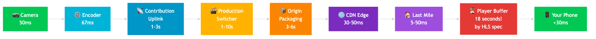
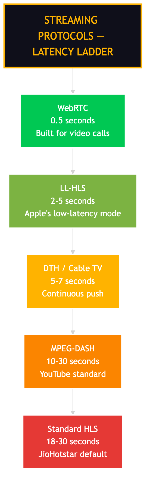
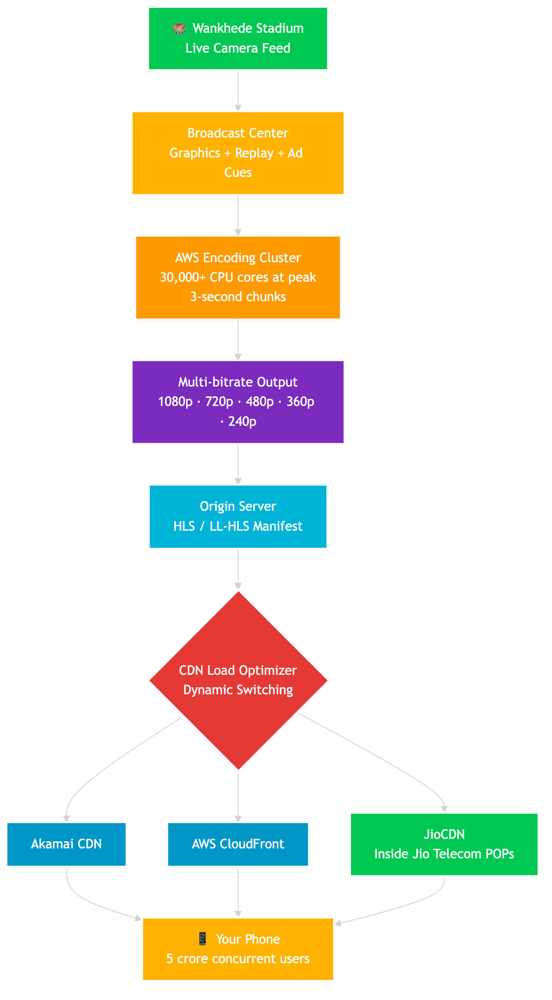

# Why Your Neighbor Cheers 5 Seconds Before You — The IPL Streaming Latency Gap

Your neighbor on cable TV is screaming "SIX!" while your phone is still showing the bowler running in. Same match. Same over. Different reality.

This isn't a bug. It's not your wifi. It's not even JioHotstar being lazy. The 5 to 30 second gap between your phone and your neighbor's TV is **a deliberate engineering trade-off** — one that lets 5 crore people watch the same match at the same time without anyone's screen freezing.

Here's how it actually works.

---

## The Problem: Two Paths, Two Speeds

Your neighbor's TV gets the match through a satellite (DTH) or cable. Your phone gets it through the internet (streaming). Both start from the same camera at the stadium. But the path each one takes is completely different.

| Medium | Typical Latency |
|---|---|
| Over-the-air TV | sub-second to 2 seconds |
| Cable TV | 3 to 6 seconds |
| **DTH (Tata Sky, Airtel, Dish)** | **5 to 7 seconds** |
| **Standard streaming (HLS)** | **15 to 30 seconds** |
| **Low-Latency HLS (LL-HLS)** | **2 to 5 seconds** |
| **WebRTC (real-time)** | **<500 milliseconds** |

> **Counter-intuitive fact:** The geostationary satellite hop is only about **250 milliseconds** round-trip. Satellite physics is *not* the slow part of DTH. The 5 to 7 seconds is encoding, multiplexing, and your set-top box decoding.

So the question isn't "why is satellite slow?" — it's "**why is internet streaming slower than satellite?**"

---

## The Wrong Mental Model: "It's Just Network"

Most people assume streaming is slow because the data has to travel further over the internet. That's wrong.

A packet from a Mumbai CDN edge node to your phone in Delhi takes about 30-50 milliseconds. That's not the bottleneck.

The real bottleneck is the **player buffer + segment packaging**, and it's there *on purpose*.

---

## The Real Architecture: Glass-to-Glass Pipeline

Here's the full journey from the camera lens at Wankhede Stadium to your phone screen.

### Stage 1: Camera Capture (~50 ms)
The camera sensor captures the frame. Image signal processor adds 30-50 ms. Some cameras add 150-200 ms.

### Stage 2: Encoder (~67 ms to several seconds)
The raw video is huge. A 4K signal at 60fps uncompressed is several gigabytes per minute. The encoder compresses it using H.264, H.265 or AV1 codecs. Standard latency: ~67 ms. Hardware low-latency encoders: 5-30 ms.

### Stage 3: Contribution Uplink (1-3 seconds)
Pro broadcast contribution links over fiber or SRT add 1-3 seconds. This is the link from the stadium to the broadcast center.

### Stage 4: Production / Switcher / Graphics (1-10 seconds)
The broadcast center adds graphics (score overlay, replays, ad cues) and switches between camera angles. Replay buffers can add 5-10 seconds depending on the production setup.

### Stage 5: Origin Packaging (2-6 seconds)
Here's where it gets interesting for streaming. The video gets cut into **HLS segments** — 6-second chunks (Hotstar uses 3-second chunks). One full segment must be written before it can be published. So the very first segment alone adds 3-6 seconds of latency.

### Stage 6: CDN Distribution (~tens of ms)
The segment hops from the origin server to CDN edge nodes near you. Inside India, this is typically 30-50 ms. JioHotstar takes this further — they have **JioCDN** nodes co-located inside Jio telecom POPs. The data is literally sitting in your ISP's basement before you ask for it.

### Stage 7: Last-Mile ISP Delivery (a few ms to ~50 ms)
From the edge node to your phone. Varies by ISP, peering, and network condition.

### Stage 8: Player Buffer (THE BIG ONE: 18+ seconds)
This is where the bulk of the latency lives — and it's 100% intentional.

Apple's HLS specification (RFC8216bis-16) literally says clients should start playback **3 segments behind the live edge**. With Apple's recommended 6-second segment, that's **18 seconds of latency baked in by spec**, before you add anything else.

### Stage 9: Decode + Display (~20-30 ms)
Decoder unpacks the compressed video. The display shows the frame at the next refresh interval. ~20-30 ms total.

> **The math:** Camera to phone in a "well optimized" sub-second pipeline = 200-500 ms. Camera to phone in a typical HLS pipeline = **18 to 30 seconds**. The biggest chunk is NOT network. It's the player buffer + segment packaging.

---

## Why The Buffer Is Huge On Purpose

This is the most counter-intuitive part. The 18+ second buffer in your player is the secret to making 5 crore people watch the same match without anyone's screen freezing.

### The Trade-off: Smoothness vs Latency

Every streaming player has a buffer — a few seconds of video that's already downloaded but not yet shown. The buffer absorbs network problems.

| Buffer Size | Latency | Smoothness |
|---|---|---|
| 1-3 seconds (small) | LOW (great!) | Bad — any network blip = freeze |
| 6-10 seconds (medium) | Medium | Good — survives small blips |
| 18-30 seconds (huge) | HIGH (annoying) | Excellent — survives major blips |

A 30-second buffer is what lets your cousin in Patna watch the IPL final on rural 4G **without freezing every 30 seconds**.

Industry rule of thumb: limiting the buffer to less than 3 seconds "jeopardizes the user experience with regular rebuffering."

---

## The Streaming Protocols Compared

There are several ways to deliver live video. Each one trades latency for reliability differently.

### HLS (Apple HTTP Live Streaming) — 15 to 30 seconds
The standard. Used by everyone for big live events including JioHotstar. Reliable, cache-friendly, works on every device. Slow because of segment size + buffer rule.

### LL-HLS (Low-Latency HLS) — 2 to 5 seconds
Apple's answer to the latency problem. Uses 200-500 millisecond "partial segments" inside the larger segment. JioHotstar uses this for IPL.

### MPEG-DASH — 10 to 30 seconds
Same architecture as HLS. Slightly more flexible. Used by YouTube, Netflix.

### LL-DASH / CMAF Chunked Transfer — 3 to 5 seconds
Uses HTTP/1.1 chunked encoding to ship sub-segment chunks before a full segment is closed.

### WebRTC — Less than 500 milliseconds
Sub-second, near-real-time. Built for video calls, not broadcast.

> **Why nobody uses WebRTC for IPL:** WebRTC is built for peer-to-peer (Google Meet, Zoom, video calls). It performs best with **fewer than 50 viewers per server node**. Scaling it to 5 crore concurrent viewers needs a custom CDN — costs explode linearly with viewers, while HLS over CDN scales logarithmically because edge caches serve millions from the same file.

---

## How JioHotstar Actually Does It

Disney+ Hotstar (now JioHotstar) has hit some incredible numbers. The 2024 IPL final peaked at **63 million concurrent viewers** (per JioStar CTO Akash Saxena). The 2025 ICC Champions Trophy final hit **65.2 million** — the highest live-streamed event ever recorded.

Here's how the architecture handles that.

### The Stack (verified from Hotstar engineering blogs)

- **Cloud:** AWS primary. IPL 2019 used 8,000 CPU cores baseline, scaling up to 30,000+ cores during peak overs.
- **Encoding:** Raw video gets cut into **3-second chunks** (smaller than the standard 6-second HLS chunk), then parallelized across hundreds of servers, encoded to multiple resolutions: 1080p / 720p / 480p / 360p / 240p.
- **CDN:** Multi-CDN strategy — Akamai, CloudFront, and JioCDN. An in-house **CDN load optimizer** dynamically switches between them based on cost and performance.
- **JioCDN:** Proprietary last-mile CDN with edge nodes deployed *inside* Jio telecom POPs — the ultimate proximity-first strategy.
- **Protocol:** HLS with LL-HLS optimizations.

### Step-Based Auto-Scaling

Hotstar doesn't use linear auto-scaling. They scale in **steps** — when concurrent traffic hits 10 million, they instantly provision capacity for 15 million. The reason is simple: linear auto-scaling can't react fast enough during a wicket or a six. By the time AWS spins up new instances, the surge is already over.

### Panic Mode (The Jettison Protocol)

When the system is overloaded — say a wicket falls in a India-Pakistan match and 20 million people refresh at once — Hotstar's panic mode kicks in. Non-essential services get killed: recommendations, watch history, personalized feed, even the chat overlay. Anything to keep the **video player** alive.

It's the streaming equivalent of an airline dumping luggage to keep the plane in the air.

---

## The Real Latency JioHotstar Delivers

Here's the honest version. Hotstar doesn't publish exact official latency numbers, but multiple sources triangulate to:

- **Best case (premium connection, optimized stream):** ~5 seconds behind broadcast TV
- **Typical experience:** 15 to 45 seconds behind DTH
- **Worst case (with personalized ad insertion):** 4 to 5 minutes behind, in some cases

> The 5-second number comes from a secondary blog (TO THE NEW), not Hotstar's official engineering team. The 15-45 second number comes from user reports across forums.

So when you see your neighbor cheer first — that's not bad engineering. That's the price of:

1. Letting 5 crore people watch the same match
2. On bad networks (rural 4G included)
3. Without the player freezing
4. While dynamically inserting personalized ads
5. While running on commodity HTTP infrastructure

---

## The Senior Engineer Insight

Most people think "low latency" is always better. Senior engineers know it's a trade-off, not a goal.

The most impressive thing about IPL streaming isn't that it's fast. It's that **it's slow in exactly the right places**. The 30-second buffer is engineering discipline — sacrificing a metric the user doesn't really care about (latency vs neighbor's TV) to deliver the metric they actually care about (smooth, uninterrupted playback).

> **The lesson:** When designing for scale, the hard part isn't picking the best technology. It's picking the right trade-offs. Streaming chose buffer over latency. DTH chose continuous push over flexibility. Both are correct for their own constraints.

---

## Quick Math Cheat-Sheet

| Stage | Time Added |
|---|---|
| Camera capture | ~50 ms |
| Encoder (standard) | ~67 ms |
| Contribution uplink | 1-3 seconds |
| Production / switcher | 1-10 seconds |
| Origin packaging (one HLS segment) | 3-6 seconds |
| CDN distribution | 30-50 ms |
| Last-mile ISP | 5-50 ms |
| **Player buffer (3 segments × 6s)** | **18 seconds** |
| Decode + display | 20-30 ms |
| **Total typical HLS** | **18-30 seconds** |
| **Total LL-HLS (Hotstar best case)** | **~5 seconds** |
| **Total WebRTC (theoretical)** | **<500 ms** |

---

## References

- **Mux — Low Latency Video Streaming Guide:** https://www.mux.com/articles/low-latency-video-streaming-a-complete-guide-with-definitions-examples-and-more
- **Get Stream — Low Latency Video Streaming:** https://getstream.io/blog/low-latency-video-streaming/
- **Apple LL-HLS Explained (AWS Blog):** https://aws.amazon.com/blogs/media/alhls-apple-low-latency-http-live-streaming-explained/
- **Wowza — CMAF Chunked Transfer:** https://www.wowza.com/blog/low-latency-cmaf-chunked-transfer-encoding
- **OvenMediaEngine — Rethinking HLS:** https://medium.com/@OvenMediaEngine/rethinking-hls-is-it-possible-to-achieve-low-latency-streaming-with-hls-9d00512b3e61
- **Broadpeak — Streaming Cricket at Scale (JioStar CTO interview):** https://broadpeak.tv/blog/streaming-cricket-at-scale-lessons-from-jiostar
- **ByteByteGo — How Disney Hotstar (now JioHotstar):** https://blog.bytebytego.com/p/how-disney-hotstar-now-jiohotstar
- **Scale Your App — Hotstar 10.3M Concurrent Users Architecture:** https://scaleyourapp.com/how-hotstar-scaled-with-10-3-million-concurrent-users-an-architectural-insight/
- **TO THE NEW — Live Streaming Latency:** https://www.tothenew.com/blog/live-streaming-latency-how-ott-platforms-handle-real-time-broadcasts/
- **AWS Media Blog — ABR vs Broadcast Latency:** https://aws.amazon.com/blogs/media/part-3-how-to-compete-with-broadcast-latency-using-current-adaptive-bitrate-technologies/
- **LiveKit — WebRTC vs HLS Live Streaming:** https://blog.livekit.io/webrtc-vs-hls-livestreaming/
- **Ant Media — WebRTC Scalability:** https://antmedia.io/webrtc-scalability/

## Hashtags

#systemdesign #softwareengineer #iplstreaming #ipl2026 #jiohotstar #livestreaming #hls #webrtc #cdn #videostreaming #engineering #techreel
