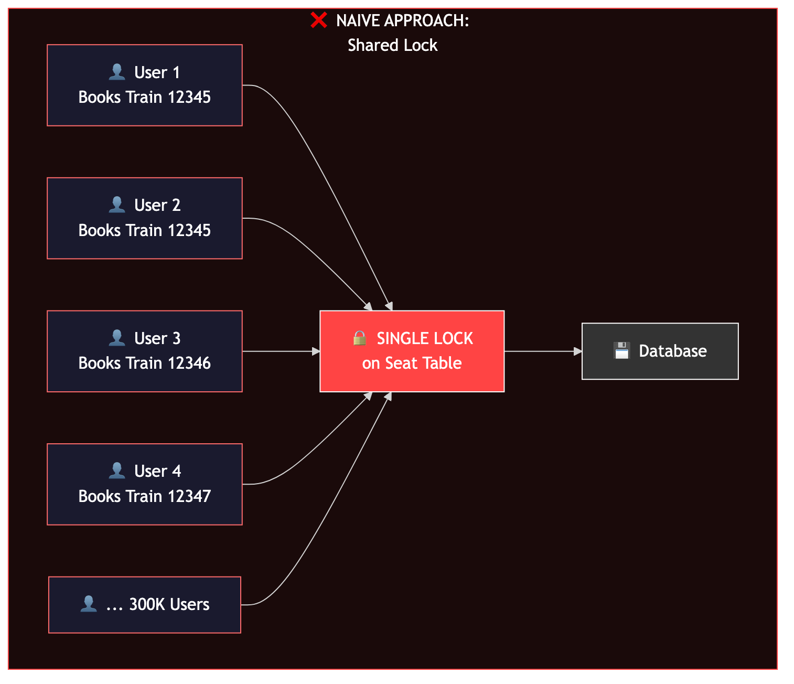
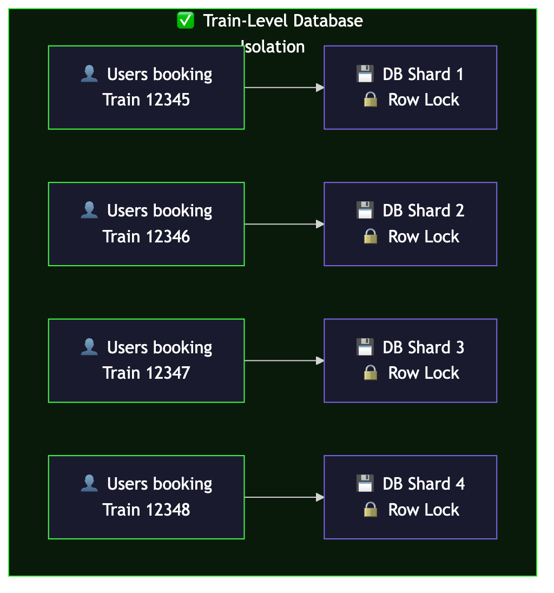
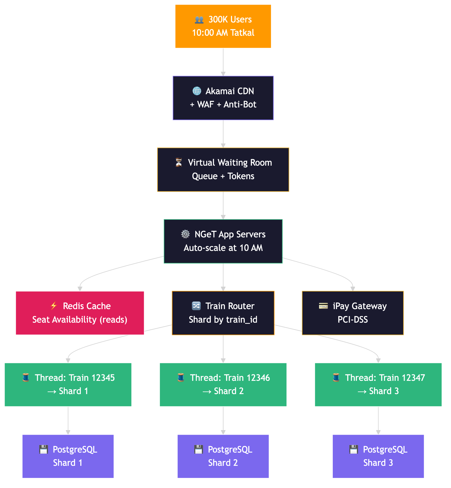

# How IRCTC Handles 30,155 Tickets in 1 Minute — The Architecture Behind India's Busiest Booking System

Every morning at 10:00 AM sharp, 300,000 people hit the IRCTC website at the exact same second. Same trains. Same seats. Same desperation. And yet, the system processes **30,155 tickets in a single minute** without double-booking a single berth.

How? The answer involves train-level database isolation, pessimistic row locking, scheduled pre-scaling, and an architecture that's been battle-tested by the largest ticket rush on the planet.

## The Numbers That Make This Insane

| Metric | Number |
|--------|--------|
| Peak tickets per minute | **30,155** (March 12, 2025 at 10:01 AM) |
| Peak tickets per hour | **1,85,513** (March 21, 2024 — Tatkal rush) |
| Daily tickets processed | **18.4 lakh (1.84 million)** |
| Peak concurrent users | **3,00,000** |
| Enquiries per second | **3,000** |
| Train categories | 7 passenger types, 72 coach types, 7 classes, 40+ quotas |

That's not a booking system — it's a war zone. And every battle happens in a 2-minute window.

## The Wrong Way: Shared Locks = Instant Death



Picture the naive approach: 10,000 users booking the same train at 10:00 AM. You'd put a lock on the seat table, right?

**Problem:** A single shared lock means every booking request waits in line. If one payment takes 15 seconds (and it will), every other user is blocked. With 300K concurrent users, you'd have a queue stretching to infinity. The system would collapse in seconds.

This is the classic **race condition** every system designer fears at scale.

## The Real Solution: Train-Level Database Isolation



Here's how booking systems at this scale prevent double-bookings — based on common patterns used in high-throughput reservation systems:

**Each train's booking data is isolated at the database level.**

Based on common patterns at this scale, booking requests for Train 12345 are routed to a dedicated database shard. Train 12346 has its own shard. No contention between trains. Within a train's shard, the database uses **row-level pessimistic locking** (`SELECT ... FOR UPDATE`) to ensure:

- **Zero double-bookings** — the row is locked while a booking is being processed
- **Zero cross-train contention** — each train's data is isolated in its own shard
- **ACID guarantees** — the database engine handles concurrency, not application code
- **Perfect isolation** — a slow booking on Train 12345 cannot block bookings on Train 12346

Think about it: with ~5,000 trains running daily, each train's bookings are isolated in their own database shard. Massive parallelism at the train level, database-enforced serialization at the seat level.

### Why Pessimistic Locking > Optimistic Locking Here

In most systems, we prefer optimistic locking for better throughput. But in a **booking system where correctness > throughput**, pessimistic locking is the right trade-off:

- No optimistic locking failures (which require retries, wasting user time)
- The seat is locked while you pay — no "sorry, seat gone" after filling forms
- Fewer rollbacks = less wasted computation under extreme load

**Note:** IRCTC has not publicly documented their exact database technology or internal architecture. The patterns described here (sharding, row-level locking, ACID transactions) are based on how high-throughput reservation systems are commonly built at this scale.

## The Seat Allocation Algorithm: Segment-Based Locking

Here's where it gets really interesting. A seat on Train 12345 from Delhi to Chennai can be reused:

- Passenger A books Delhi → Jaipur (seat 42)
- After Jaipur, seat 42 becomes available again
- Passenger B books Jaipur → Mumbai (same seat 42)

To handle this, IRCTC uses a **StationToSeatMapping** table:

```
| TrainID | SeatID | StationSegment | Status    |
|---------|--------|----------------|-----------|
| 12345   | 42     | DEL-JAI        | BOOKED    |
| 12345   | 42     | JAI-BOM        | AVAILABLE |
| 12345   | 42     | BOM-CHE        | AVAILABLE |
```

When you book Delhi → Mumbai, the system locks ALL segments between your origin and destination for that seat. This is **pessimistic locking** — chosen over optimistic locking because:

1. In a booking system, a failed optimistic lock = "Sorry, seat gone. Try again." Terrible UX.
2. Pessimistic locking guarantees the seat is yours once you start payment.
3. Fewer rollbacks = less wasted computation under extreme load.

## The Full Architecture



### Layer 1: CDN + WAF + Virtual Waiting Room

Before any request hits the server:
- **CDN** caches static assets (UI, JS, CSS, images)
- **Web Application Firewall** blocks malicious traffic, bot scripts, and automated booking tools
- **Virtual waiting room** queues users during peak — you see "Waiting for your turn..." at 10 AM. This prevents thundering herd from hitting the backend.
- **CAPTCHA + OTP** verification at registration to block bots

### Layer 2: Application Servers (Auto-Scaling)

The NGeT (Next Generation e-Ticketing) system launched April 28, 2014, replacing the legacy system:

| Metric | Before NGeT (2014) | After NGeT | Today |
|--------|-------------------|------------|-------|
| Tickets/minute | 2,000 | 7,200 → 15,000 | **30,000+** |
| Concurrent connections | 40,000 | 120,000 | **300,000** |
| Enquiries/second | 1,000 | 3,000 | **3,000+** |

The critical insight: **IRCTC likely pre-scales capacity before 10:00 AM and 11:00 AM** (Tatkal AC and Tatkal Sleeper windows). Since peak load is entirely predictable, scheduled pre-scaling is more reliable than reactive auto-scaling (which has lag).

After Tatkal hours, capacity can scale back down. This pattern — scaling based on known schedules rather than reactive metrics — is standard for systems with predictable traffic spikes.

### Layer 3: Caching Layer (Read/Write Separation)

**Problem:** 300K users checking seat availability simultaneously. If every request hits the database, it's game over.

**Solution:** Based on common patterns at this scale, an in-memory caching layer (likely Redis or similar) caches seat availability for read traffic.
- User checks "seats available on Train 12345?" → cache answers (microseconds)
- User actually books a seat → goes to the database (routed to the train's shard, row-level lock acquired)
- After a successful booking, cache is invalidated for that train

This separation means **reads scale independently from writes**. The vast majority of traffic is reads (checking availability). Only a small fraction is actual bookings.

### Layer 4: Database (Sharding + Row-Level Locking)

Based on common patterns at this scale:
- **Horizontal sharding by train_id** — each train's booking data is isolated on a dedicated shard
- **Row-level pessimistic locking** (`SELECT ... FOR UPDATE`) — locks the seat rows while a booking is in progress
- **ACID transactions** — the database engine guarantees no double-booking, not application-level threading
- **No cross-shard transactions needed** — each train is fully independent, making sharding straightforward

**Note:** The exact database technology used by IRCTC/CRIS is not publicly documented. The CONCERT system uses distributed databases across 5 data centers, but the specific RDBMS has not been officially disclosed.

### Layer 5: Payment Gateway Integration

Under extreme load, payment failures are the biggest UX killer. IRCTC handles this with:

- **35-second minimum booking time** — prevents race conditions in payment processing
- **Automatic refund within 3 working days** for failed transactions
- **Hold-then-confirm pattern**: seat is held (pessimistically locked) while payment processes. If payment fails, seat is released back.

### Tatkal-Specific Restrictions (Anti-Abuse)

| Rule | Limit |
|------|-------|
| Tatkal tickets per user ID (10 AM - 12 PM) | **Max 2** |
| Tatkal tickets per session | **Max 1** |
| Tatkal tickets per IP address | **Max 2** |
| Total tickets per user per month | **Max 10** |
| Concurrent logins per account | **1 only** |

These aren't just rules — they're load limiters. Each restriction reduces the effective concurrent load on the system.

## The CONCERT Backbone: 5 Data Centers

Under IRCTC sits the CONCERT system — **Country-wide Network for Computerized Enhanced Reservation and Ticketing** — maintained by CRIS (Centre for Railway Information Systems).

5 data centers across India: **New Delhi, Mumbai, Kolkata, Chennai, and Secunderabad**. Each runs distributed databases.

**Battle-tested resilience:** In 2019, a fire destroyed the Kolkata data center. The Secunderabad team took over all 1,100+ terminals across 15 eastern and north-eastern states. Railways services and revenues were NOT affected. Zero downtime for users.

That's what geographic redundancy looks like in practice.

## The Evolution: From 29 Tickets/Day to 18 Lakh/Day

| Year | Milestone |
|------|-----------|
| 2002 | IRCTC launches — 29 tickets booked on Day 1 |
| 2005 | Online booking picks up — thousands/day |
| 2014 | NGeT launches — 7,200 tickets/min, 120K concurrent |
| 2015 | Upgraded — 15,000 tickets/min, 300K concurrent |
| 2025 | **30,155 tickets/min**, 18.4 lakh tickets/day |

From 29 to 18,40,000 tickets per day. That's a **63,000x scale increase** in ~20 years.

## System Design Lessons

### 1. Isolate by Entity + Use Pessimistic Locking When Correctness Matters
For booking/financial systems, isolate each entity (train/stock/account) at the database level using sharding + row-level pessimistic locking. The database engine handles concurrency, not application code. This eliminates double-bookings while allowing massive parallelism across entities.

### 2. Pre-Scale When You Know Peak Time
If your load is predictable (Tatkal at 10 AM, Black Friday, IPL match), schedule capacity scaling BEFORE the spike. Reactive auto-scaling has lag and may not respond fast enough for sudden traffic surges.

### 3. Separate Reads from Writes
99% of traffic is reads (seat availability). 1% is writes (actual bookings). Cache the reads aggressively, optimize the writes for correctness.

### 4. Shard by the Natural Entity
Train_id is the natural partition key. Each train is independent — no cross-train transactions needed. Sharding becomes trivial.

### 5. Pessimistic Locking for User-Facing Booking
Optimistic locking = "Sorry, try again." Pessimistic locking = "This seat is yours while you pay." For booking UX, pessimistic wins.

### 6. Geographic Redundancy Saves Lives
The Kolkata fire proved it. 5 data centers across India. Zero downtime during a data center fire. That's the payoff.

---

## References

- [IRCTC System Design — GetSDEReady](https://getsdeready.com/irctc-system-design/)
- [How IRCTC Handles Crores of Users — Medium](https://medium.com/thesystemdesign/how-irctc-handles-crores-of-users-during-tatkal-booking-f5209531c5cd)
- [IRCTC New Servers — CIO India](https://www.cio.com/article/218286/how-irctc-s-new-servers-make-bookings-and-enquiries-easier.html)
- [IRCTC Official Statistics](https://www.irctc.com/internet-ticketing.php)
- [From 29 Tickets to 13 Lakh — Factly](https://factly.in/irctc-improvements-from-9-tickets-booked-in-a-day-to-13-lakh-tickets-irctc-has-come-a-long-way/)
- [Ministry of Railways PIB Release](https://www.pib.gov.in/newsite/PrintRelease.aspx?relid=134603)
- [IRCTC Seat Allocation Algorithm — Medium](https://medium.com/@hariv.krish47/indian-railway-reservation-system-algorithm-part-1-625961a470dc)
- [Indian Railways PRS CONCERT System — IndiaRailInfo](https://indiarailinfo.com/faq/post/how-are-computerized-reservations-done-what-do-the-abbreviations-concert-prs-impress-poet-and-uts-stand-for-indianrail-indian-railway-irctc-enquiry/466)
- [CRIS Recovers Data After Kolkata Fire — The Hans India](https://www.thehansindia.com/news/cities/hyderabad/cris-recovers-data-lost-in-fire-at-kolkata-rail-booking-centre-677085)

---

*Follow @techvijayforyou for more system design breakdowns.*
