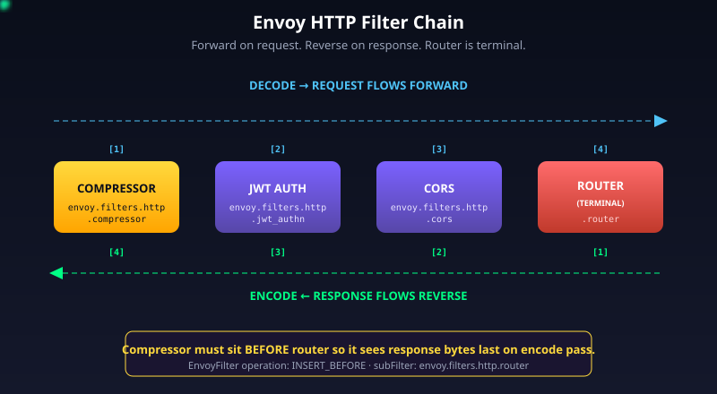
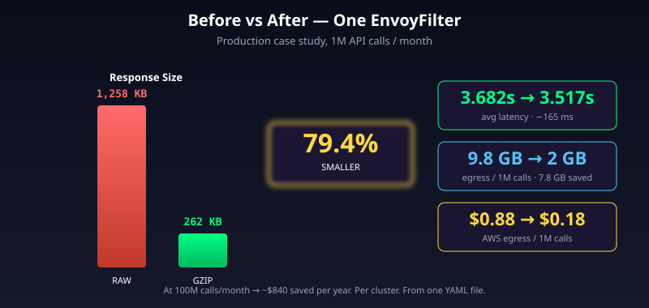

# One YAML File Cut a 1.2 MB API Down to 262 KB — The Istio Gzip Story

You wrote a clean REST API. The endpoint returns a JSON list of orders. The payload is 1,258 KB. You ship it, it works, the dashboard turns green. Six months later the AWS bill grows, the p99 latency drifts up, and somewhere in Bangalore a user on a 4G connection waits 4 seconds for a screen that should load in 1.

Now imagine fixing all of that without touching a single line of application code. No new gzip middleware, no `Content-Encoding` header in your handlers, no library bump. You write **one Kubernetes YAML file**, apply it to the `istio-system` namespace, and your APIs come out **79.4% smaller**.

That's the case study Vijay Rauniyar published — a real production rollout where a single Istio `EnvoyFilter` cut response sizes from 1,258 KB to 262 KB, dropped average latency from 3.682s to 3.517s, and saved 7.8 GB of egress traffic per million calls. At 100 million calls a month, the AWS bill alone goes down ~$840 a year. Not life-changing money, but free money — the kind that pays for itself the moment you `kubectl apply`.

This article unpacks **how that one YAML file works under the hood**: where Istio's ingress gateway sits, what the Envoy compressor filter does on every response, why the filter has to be inserted *before* the router (and what breaks if you do it the other way), how `gzip` actually competes with `brotli` and `zstd` in 2026, and which gotchas will bite you the first time you turn it on in production.

---

## The Problem — JSON Is Lying to You About Its Size

A typical REST response in 2026 looks like this:

```json
{
  "orders": [
    {"id": "ord_8f2a", "customer": "user_29", "amount": 49.99, "status": "shipped", ...},
    ...
  ]
}
```

A 1,258 KB response is not unusual — it's a list endpoint with 200 nested orders, each carrying customer data, line items, fulfillment metadata. Every JSON key (`"customer"`, `"status"`, `"amount"`) is repeated for every record. Every field is human-readable text. JSON is a self-describing format — that's its strength as a developer experience and its weakness on the wire.

When that 1,258 KB blob ships from your service in `ap-south-1`, here's what it actually costs:

| Metric | Per request | Per million |
|---|---|---|
| Bytes over the network | 1,258 KB | 9.8 GB |
| AWS egress at $0.09/GB | $0.000113 | **$0.88** |
| RTT impact (3G, 1 Mbps cellular) | +10 s | — |
| TCP segments (1,460 byte MSS) | 862 | 862 million |

That AWS number is from the official EC2 pricing page (us-east-1 / ap-south-1, first 10 TB/month tier — both regions price internet egress identically at $0.09/GB). Cross-AZ traffic is separate at $0.01/GB each direction. Multiply 9.8 GB by all your services, all your replicas, all your geographies — you start to see the bill.

The naive fix is "let's add gzip middleware to every service." This works, kind of, but every team has to ship the change, every service spends CPU on compression, and every framework's compression behaviour subtly differs (`Content-Length` handling, streaming responses, `ETag` weakening — pick your favourite).

There's a smarter place to do it.

> **In short:** A 1.2 MB JSON response over a million calls costs about a dollar in egress and a noticeable chunk of latency on slow networks — and the cleanest place to fix it is *not* in your application code.

---

## The Architecture — Where the Compression Actually Happens

In an Istio service mesh, every request entering your cluster passes through the **Istio Ingress Gateway**. That gateway is an Envoy proxy running as a Kubernetes Deployment with a service of type `LoadBalancer` in front of it. Every response leaving the cluster passes through it on the way out.

That makes it the natural compression chokepoint. One proxy, one config, every API.



The components you need to know:

- **Client** — browser, mobile app, or another internal service. Sends `Accept-Encoding: gzip, br, zstd` in its request.
- **Istio Ingress Gateway** — the Envoy proxy at the edge. This is where the compressor filter runs.
- **Envoy HTTP filter chain** — an ordered pipeline of small filters that mutate every request and response. The compressor is one of them.
- **Service mesh sidecars** — optional Envoy sidecars next to each pod for east-west traffic. Compression at the *edge* gateway is enough for north-south (client-facing) APIs.
- **Application service** — your unmodified Spring Boot / Express / Go service. It has no idea compression is happening.

The flow is simple: request comes in, gets routed to the right service, the service responds with raw uncompressed JSON, Envoy compresses on the way out, the client decompresses transparently because every modern HTTP client does this automatically.



> **In short:** Compression at the Istio Ingress Gateway means one configuration covers every API in your cluster, and your application code stays untouched.

---

## Component 1 — Envoy's HTTP Filter Chain

To understand *why* the compressor goes where it goes, you have to understand how Envoy processes a request internally.

Every HTTP request that hits Envoy passes through an ordered list of **filters**. Filters are small composable units — a rate limiter, a JWT auth filter, a CORS filter, a router, a compressor. You declare them in order, and Envoy invokes them in two passes:

- **Decode pass (request, downstream → upstream):** filters run in declared order — `A → B → C → router`.
- **Encode pass (response, upstream → downstream):** filters run in **reverse** order — `router → C → B → A`.

The `envoy.filters.http.router` is special. It's a **terminal filter** — it does the actual upstream call and produces the response. Per the Envoy architecture docs, the last configured filter has to be a terminal filter. So your chain has to look like:

```
[ compressor ]  →  [ jwt_auth ]  →  [ cors ]  →  [ router ]   ← terminal
```

On the response, that runs in reverse:

```
router (produces response) → cors → jwt_auth → compressor → wire
```

The compressor sees the bytes *after* the router has fetched them from upstream and *before* they leave Envoy. That's exactly where you want compression — right before the wire.



If you accidentally insert the compressor *after* the router, Envoy refuses to start with `terminal filter named envoy.filters.http.router must be the last filter in a http filter chain`. So the rule is mechanical: in your `EnvoyFilter`, you patch with `INSERT_BEFORE` and the `subFilter.name` is `envoy.filters.http.router`.

> **In short:** Envoy runs filters forwards on the request and backwards on the response, with the router as the terminal filter — the compressor must sit immediately before the router so it sees the response bytes last.

---

## Component 2 — The Envoy Compressor Filter Decision Tree

The compressor doesn't compress every response. It has a strict gate. Per the official Envoy docs (`compressor_filter.proto.html`), Envoy skips compression when **any** of these conditions hits:

**Request side:**
1. The client did not send an `Accept-Encoding` header
2. `Accept-Encoding` lists `identity` only, or sets the encoding's `q=0`
3. A different encoding has higher `q-weight` (gzip vs brotli stacking — Envoy resolves via a per-request `CompressorRegistry`)

**Response side:**
4. `Content-Encoding` already set (upstream pre-compressed it)
5. `Cache-Control: no-transform` present
6. `Content-Type` not in your allowlist
7. `Content-Length < min_content_length` (default 30 bytes — recommended 256)
8. Response status code is in `uncompressible_response_codes` (empty by default)
9. `disable_on_etag_header: true` AND a strong `ETag` is present

If a single check fails, Envoy passes the response through untouched.



The two most important checks in production are **`min_content_length`** and the **`Content-Type` allowlist**.

Why does the size matter? gzip's wire format has a fixed framing overhead — a 10-byte header (RFC 1952) plus an 8-byte trailer plus a few bytes of deflate block header. That's ~24 bytes of pure overhead before any actual compression starts. For a tiny 50-byte response (`{"status":"ok"}`), gzip frequently produces output **larger than the input**. The community-standard floor is **256 bytes** — by that size, even poorly-compressing JSON nets a positive ratio.

Why does `Content-Type` matter? Already-compressed payloads (JPEG, PNG, MP4, application/octet-stream) cannot be compressed further — gzip will spend CPU and produce output that's *bigger* by ~0.1%. The default allowlist is `application/json`, `application/javascript`, `application/xhtml+xml`, `text/html`, `text/css`, `text/plain`, `text/xml`, `image/svg+xml`. If your service mislabels a JPEG as `text/plain`, Envoy will gzip it and waste CPU. Lock your `Content-Type` headers down at the application layer.

> **In short:** The compressor filter is a strict gate — it only compresses responses where the client asked for it, the upstream didn't already compress, the body is large enough to win, and the content type is text-shaped.

---

## Component 3 — The gzip Library Knobs

When the gate passes, Envoy hands the response to its compressor library. For gzip, the proto exposes four levers:

```yaml
compressor_library:
  name: text_optimized
  typed_config:
    "@type": type.googleapis.com/envoy.extensions.compression.gzip.compressor.v3.Gzip
    memory_level: 5            # 1-9, default 5
    compression_level: DEFAULT_COMPRESSION   # BEST_SPEED=1, DEFAULT=6, BEST_COMPRESSION=9
    window_bits: 12            # 9-15, default 12 (4KB window)
    chunk_size: 4096           # output buffer size
```

These map directly to zlib's `deflateInit2()` parameters:

| Knob | Range | Default | What it controls | RAM cost |
|---|---|---|---|---|
| `compression_level` | 1 (speed) → 9 (best) | 6 | CPU/ratio trade. Level 9 ≈ 3-5% smaller than 6 at much higher CPU | Same |
| `memory_level` | 1 → 9 | 5 | Internal hash table size for deflate | Doubles with each step |
| `window_bits` | 9 → 15 | 12 | Sliding window size — 12 = 4KB, 15 = 32KB | `2^(window_bits)` bytes per stream |
| `chunk_size` | any | 4096 | Output buffer flushed per write | Linear |

The Medium case study runs at `memory_level: 9` and `compression_level: BEST_COMPRESSION`. That's the maximum-ratio setting and it's the reason they hit 79% reduction. The cost is real — at level 9 the compressor's CPU usage can run 4-6× higher per byte than at level 1 (Cloudflare benchmarks show Brotli quality 9 at 8.8 MB/s vs zlib level 8 at 43.1 MB/s on the same hardware — gzip 9 sits between).

For most production deployments, **`compression_level: DEFAULT_COMPRESSION` (level 6)** is the sweet spot. You give up 3-5% ratio in exchange for ~3-4× less CPU. Below level 6 the ratio drops fast; above it the CPU climbs fast.

The memory math (from the zlib manual): each active stream uses roughly `2^(window_bits+2) + 2^(memory_level+9)` bytes. At gzip defaults (12, 5): ~16 KB + ~16 KB = **32 KB per concurrent request**. At maxed-out (15, 9): ~128 KB + ~256 KB = **384 KB per stream**. On an Istio ingress gateway pod handling 5,000 concurrent requests, that's the difference between 160 MB and 1.9 GB of pure compression buffer memory.

> **In short:** `compression_level: 6` and `memory_level: 5` are the production sweet spot — push to 9 only if you have CPU and RAM to burn and you're optimising bandwidth at all costs.

---

## Component 4 — The Istio EnvoyFilter CRD

Now the actual YAML. Istio doesn't expose Envoy's compressor as a first-class API — there's no `Compression` CRD. You declare it via the `EnvoyFilter` CRD, which is Istio's escape hatch for any Envoy config Istio's higher-level CRDs don't cover.

Here's the canonical pattern, applied to the `istio-system` namespace where the ingress gateway pod runs:

```yaml
apiVersion: networking.istio.io/v1alpha3
kind: EnvoyFilter
metadata:
  name: ingressgateway-compressor
  namespace: istio-system
spec:
  workloadSelector:
    labels:
      istio: ingressgateway
  configPatches:
  - applyTo: HTTP_FILTER
    match:
      context: GATEWAY
      listener:
        filterChain:
          filter:
            name: envoy.filters.network.http_connection_manager
            subFilter:
              name: envoy.filters.http.router
    patch:
      operation: INSERT_BEFORE
      value:
        name: envoy.filters.http.compressor
        typed_config:
          "@type": type.googleapis.com/envoy.extensions.filters.http.compressor.v3.Compressor
          response_direction_config:
            common_config:
              min_content_length: 256
              content_type:
                - application/json
                - application/javascript
                - text/html
                - text/css
                - text/xml
                - text/plain
            disable_on_etag_header: false
          request_direction_config:
            common_config:
              enabled:
                default_value: false
                runtime_key: request_compressor_enabled
          compressor_library:
            name: text_optimized
            typed_config:
              "@type": type.googleapis.com/envoy.extensions.compression.gzip.compressor.v3.Gzip
              memory_level: 9
              compression_level: BEST_COMPRESSION
              window_bits: 12
              chunk_size: 4096
```

Read it field by field:

- **`workloadSelector.labels.istio: ingressgateway`** — applies the patch only to pods labelled as the ingress gateway. Without this, Istio applies it to every Envoy in the mesh (every sidecar), which you don't want.
- **`applyTo: HTTP_FILTER`** — patches the HTTP filter chain inside the HTTP Connection Manager.
- **`context: GATEWAY`** — restricts the patch to gateway listeners (vs sidecar listeners).
- **`subFilter.name: envoy.filters.http.router`** — anchors the patch relative to the router filter.
- **`operation: INSERT_BEFORE`** — places the new filter immediately before the router. Anything else (`INSERT_AFTER`, `REPLACE`) breaks the terminal-filter rule we covered earlier.
- **`response_direction_config`** — turns response compression on (this is the default direction).
- **`request_direction_config.common_config.enabled.default_value: false`** — explicitly disables request-body compression. Request compression exists (you'd use it for clients uploading large JSON to Envoy), but it requires the upstream to accept gzip, so it's off by default.

Apply with `kubectl apply -f compressor.yaml`. Istio's pilot will hot-reload the gateway config — no pod restart needed. The change is live in 5-10 seconds.

> **In short:** The `EnvoyFilter` CRD lets you inject any Envoy filter into Istio's data plane — for compression, you target the gateway workload, anchor before the router filter, and configure the gzip library at the level you want.

---

## End-to-End Walk-Through — One Request, Compressed

Trace a single request through the system:

1. **Client → Internet → AWS Network Load Balancer.** Browser issues `GET /api/orders` with `Accept-Encoding: gzip, br, zstd` (Chrome 123+ defaults).
2. **NLB → Istio Ingress Gateway pod.** The pod's main container is `istio-proxy` running Envoy 1.30+.
3. **Envoy receives the request.** It runs the decode chain: TLS terminator, JWT validator, the **compressor filter (on decode this is a no-op for response compression)**, the router filter.
4. **Router invokes the upstream.** It picks the backend service via Istio's destination rules and forwards the request to your application pod.
5. **Application returns 1,258 KB of JSON** with `Content-Type: application/json`, `Content-Length: 1287424`.
6. **Encode pass starts.** Envoy walks filters in reverse — router → JWT → **compressor**.
7. **Compressor runs the 9 checks.** `Accept-Encoding` has gzip ✓. `Content-Type: application/json` is in the allowlist ✓. `Content-Length` 1287424 ≥ 256 ✓. `Cache-Control` doesn't have `no-transform` ✓. No existing `Content-Encoding` ✓. Pass.
8. **Compressor adds headers.** `Content-Encoding: gzip`. Strips `Content-Length` (final size unknown). Adds `Transfer-Encoding: chunked`. Adds `Vary: Accept-Encoding`.
9. **deflate stream starts.** Envoy reads from upstream in 4 KB chunks, feeds them through zlib at level 9 with a 4 KB window, writes compressed output to the wire. The output stream is incrementally chunked — the client starts receiving compressed bytes before the upstream is even done.
10. **Client receives 262 KB.** `Content-Encoding: gzip` tells the browser to inflate. The HTTP layer of the browser inflates transparently; the application JavaScript sees the original 1,258 KB JSON.

Total compression overhead: ~2 ms on the gateway (per the Medium case study at `memory_level: 9`). Total network time saved: 165 ms on average — because compressing 1 MB takes a few ms but transferring 1 MB takes much longer on real-world cellular links.

> **In short:** The full compression cycle adds ~2 ms of CPU at the gateway and saves 100s of ms of network time — net-positive on every plausible network condition.

---

## gzip vs brotli vs zstd — Which One to Pick

Envoy supports all three. The choice depends on your client mix.



**Cloudflare's production benchmark, billions of real HTML/CSS/JS requests (2024):**

| Algorithm | Compression ratio | Avg compress time | Browser support |
|---|---|---|---|
| gzip default | 2.56:1 | 0.872 ms | Universal (since forever) |
| zstd level 3 | **2.86:1** | **0.848 ms** | Chrome 123+ (Mar 2024), Firefox 126+ (Jun 2024), Safari 26.3 (2025) |
| brotli level 4 | **3.08:1** | 1.544 ms | Chrome 50+ (2016), Firefox 44+, Safari 11+ |

For a 1 MB JSON response, the ratios extrapolate to:
- gzip-6: ~390 KB
- gzip-9: ~370 KB (only ~5% smaller than 6 at 3-4× CPU)
- brotli-6: ~325 KB
- zstd-3: ~350 KB

**Decision matrix:**

| If your clients are... | Pick |
|---|---|
| Mixed (browsers, old mobile apps, curl, internal services) | **gzip** — universal, safe |
| All modern browsers (Chrome/Firefox/Safari 11+) | **brotli** — best ratio for static text |
| Modern browsers AND you need throughput | **zstd** — best ratio-per-CPU-ms |
| Server-to-server only with a known client | **zstd** — fastest at high ratios |

In Envoy you can stack all three — multiple compressor filters, one per algorithm — and let `Accept-Encoding` `q-weight` decide. The downside is configuration complexity and you'll thrash the same response through multiple compressor decision trees per request.

For most teams, **gzip is the right default**. Switch to brotli/zstd when you've measured and need the extra 10-15%.

> **In short:** gzip is the safe universal default, brotli wins on ratio for static text, zstd wins on ratio-per-CPU — pick gzip first, optimise to the others only if measurements demand it.

---

## Production Gotchas — What Will Bite You

A short list of failure modes that don't show up in the docs:

**1. The 256-byte threshold matters more than you think.** Default `min_content_length` is 30 bytes (Envoy proto default). A health check returning `{"status":"ok"}` (16 bytes) gzipped becomes ~36 bytes — *bigger* than the input. Always set this to 256 or higher.

**2. `Vary: Accept-Encoding` cache poisoning.** Envoy adds this header automatically. But if a CDN or HTTP cache sits *in front of* Envoy and ignores `Vary`, it can serve gzip bytes to a client that requested `identity` — which crashes the parser. Always terminate compression at the same layer that terminates caching, or pre-compress at the origin.

**3. Already-compressed payloads.** If a service mislabels a JPEG as `text/plain`, the compressor will gzip the JPEG, spending CPU to grow the payload by 0.1%. Lock your `Content-Type` headers at the application layer; the allowlist is your safety net.

**4. ETag handling.** Envoy weakens strong ETags when it compresses (turns `"abc"` into `W/"abc"`) because the response bytes have changed. If your client validates against the strong form, set `disable_on_etag_header: true`.

**5. Streaming responses.** Compressor handles `Transfer-Encoding: chunked` correctly — it strips `Content-Length` from compressed responses because final size is unknown until end-of-stream. But if a downstream filter expects a known content length (rare in 2026), you'll hit ordering bugs.

**6. HTTP/2 trailers.** The compressor flushes the deflate stream before trailers. Don't pair it with filters that rewrite trailers between compressor and router — you'll lose data.

**7. Memory under load.** At `memory_level: 9` and 5,000 concurrent requests, you're using ~2 GB of pure compression buffer per gateway pod. Match your memory limits to your concurrency × per-stream cost.

**8. CPU at level 9.** The Medium case study shows level 9 working — but they measured. Don't blindly copy `BEST_COMPRESSION`; benchmark your traffic. For most production, level 6 (the default) is the right choice.

> **In short:** The defaults are conservative for a reason — push past them only with measurements, and watch for `Vary` cache poisoning and `Content-Type` mislabels in particular.

---

## Why This Architecture Wins — Trade-Offs



| Metric | App-level gzip | Per-service middleware | **Gateway compression** |
|---|---|---|---|
| Code changes | Per service | Per service | **Zero** |
| Deploy risk | Service-by-service | Service-by-service | **One YAML, hot reload** |
| CPU cost | Spread across services | Spread across services | Concentrated at gateway |
| Tunability | Different per framework | Different per service | **One config, one tuning point** |
| Headers handled | Framework-dependent | Framework-dependent | **Standard, RFC-compliant** |
| Streaming response support | Framework-dependent | Framework-dependent | **Native (chunked)** |
| `ETag` weakening | Manual | Manual | **Automatic** |
| Per-content-type allowlist | Manual | Manual | **Built-in** |
| Bandwidth savings | Same | Same | Same |

The trade-off is concentration of CPU. In gateway compression, all your compression CPU lives in the ingress gateway pods. If you're already CPU-constrained there (TLS termination, JWT validation, auth checks all live in the same proxy), you'll need to scale the gateway. The Medium case study notes ~2 ms of overhead per request at level 9 — at 1,000 RPS that's 2 cores of pure compression time. Plan accordingly.

For comparison: **Discord** rolled out zstd over WebSockets in April 2024 and reduced gateway bandwidth by ~40% cluster-wide. **LinkedIn** rolled out brotli for HTTP responses in 2017 and saw +6-6.5% feed page-load improvement in India specifically — where slow networks dominate. **Cloudflare** ships zstd to free-tier customers since October 2024 with ~11% smaller files vs gzip at comparable speed. The gains are real and reproducible.

> **In short:** Gateway compression centralises the cost and the configuration, ships in one YAML, saves the same bandwidth as middleware, and concentrates CPU on the gateway pods — scale them accordingly.

---

## What to Steal from This for Your Cluster

If you're running Istio and you haven't enabled gateway compression yet:

1. **Audit your top 10 endpoints by response size.** `kubectl logs` your gateway, look for big `Content-Length` values. Anything > 50 KB is a candidate.
2. **Verify they're text-shaped.** JSON, HTML, plaintext logs, SVG — yes. Images, video, binary protobuf — no.
3. **Apply the EnvoyFilter above with `compression_level: DEFAULT_COMPRESSION`** (level 6, not 9). Always start at the safe default.
4. **Set `min_content_length: 256`.** Don't rely on the 30-byte default.
5. **Lock down `Content-Type` headers in your services.** This is your protection against compressing already-compressed payloads.
6. **Watch the gateway pod's CPU and memory.** Compare 24 hours before vs after. If CPU climbs more than 10-15%, scale the gateway replicas.
7. **Measure user-visible latency.** Use real network conditions — 4G or simulated 1 Mbps. The savings show up most on slow networks.
8. **Only then consider brotli or zstd.** Measure first.

A 79% reduction is the upper end — your mileage will be 50-75% for typical JSON, less for already-dense payloads, more for heavily-repetitive lists.

---

## References

1. [Vijay Rauniyar — How We Reduced API Response Size by 79% with Istio GZIP Compression (Medium, 2025)](https://medium.com/@vijayrauniyar1818/how-we-reduced-api-response-size-by-79-with-istio-gzip-compression-f57cfdd7cfd9) — the source case study
2. [Envoy Compressor filter reference](https://www.envoyproxy.io/docs/envoy/latest/configuration/http/http_filters/compressor_filter)
3. [Envoy Compressor proto v3](https://www.envoyproxy.io/docs/envoy/latest/api-v3/extensions/filters/http/compressor/v3/compressor.proto)
4. [Envoy Gzip compressor proto](https://www.envoyproxy.io/docs/envoy/latest/api-v3/extensions/compression/gzip/compressor/v3/gzip.proto)
5. [Envoy HTTP filters architecture overview](https://www.envoyproxy.io/docs/envoy/latest/intro/arch_overview/http/http_filters)
6. [Istio EnvoyFilter CRD reference](https://istio.io/latest/docs/reference/config/networking/envoy-filter/)
7. [Cloudflare — New compression standards rolling out (zstd benchmarks)](https://blog.cloudflare.com/new-standards/)
8. [Cloudflare — Results experimenting with Brotli](https://blog.cloudflare.com/results-experimenting-brotli/)
9. [Discord — How Discord Reduced Websocket Traffic by 40% (zstd case study)](https://discord.com/blog/how-discord-reduced-websocket-traffic-by-40-percent)
10. [LinkedIn — Boosting Site Speed Using Brotli Compression](https://www.linkedin.com/blog/engineering/optimization/boosting-site-speed-using-brotli-compression)
11. [RFC 1952 — GZIP File Format Specification](https://www.rfc-editor.org/rfc/rfc1952)
12. [AWS EC2 On-Demand Pricing — Data Transfer](https://aws.amazon.com/ec2/pricing/on-demand/)
13. [Karl Stoney — Enabling gzip compression with EnvoyFilter](https://karlstoney.com/enabling-gzip-compression-with-envoyfilter/)
14. [Can I Use — zstd content-encoding](https://caniuse.com/zstd) and [brotli](https://caniuse.com/brotli)

---

## Hashtags

#systemdesign #softwareengineer #coding #istio #kubernetes #envoy #servicemesh #performance #aws #devops #microservices #api
