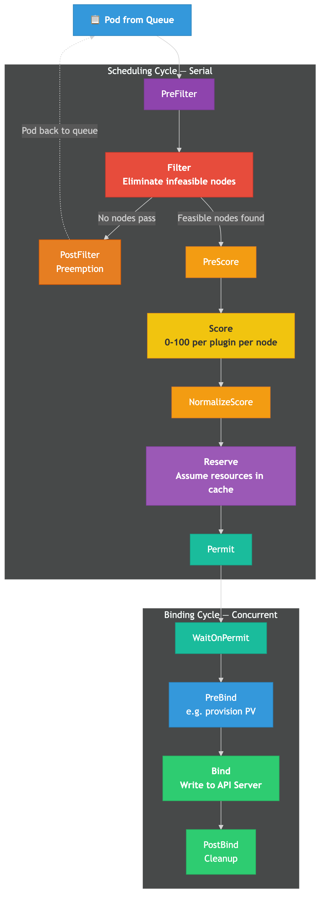
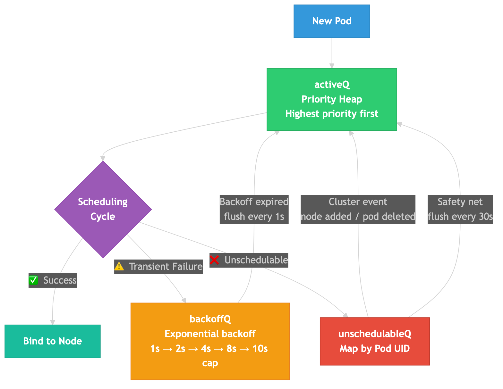
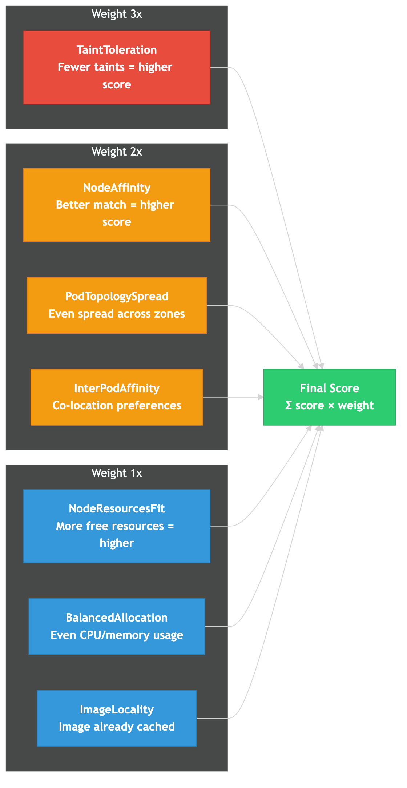

# How the Kubernetes Scheduler Decides Where Your Pod Runs

> **"kubectl apply likhte ho — aur pod kahi pe land hota hai. Lekin K8s randomly node nahi choose karta. Har node ko ek math formula se score milta hai."**

## The Naive Understanding

Most developers think of scheduling like this:

1. Pod created
2. K8s picks a node (somehow)
3. Pod runs


This mental model skips the most interesting part — the "somehow." The scheduler runs a sophisticated two-phase pipeline: **Filter then Score**. Every single pod goes through this pipeline before landing on a node.

## The Real Pipeline — Two Cycles

The scheduler runs an infinite loop. Each iteration processes **one pod** and is split into two phases:

### Scheduling Cycle (Serial)

Only one scheduling cycle runs at a time. This is because it mutates the scheduler's in-memory cache.

```
Pod from Queue
  → PreFilter    (per-pod preprocessing, can reject early)
  → Filter       (eliminate nodes that can't run the pod)
  → PostFilter   (ONLY if no node passes — triggers preemption)
  → PreScore     (generate shared state for scoring)
  → Score        (each plugin scores each node 0-100)
  → NormalizeScore
  → Reserve      (optimistically "assume" resources)
  → Permit       (approve / deny / wait)
```

### Binding Cycle (Concurrent)

Can run in parallel with the next scheduling cycle — it's just an API call.

```
  → WaitOnPermit
  → PreBind      (e.g., provision PV)
  → Bind         (write binding to API server)
  → PostBind     (cleanup/notifications)
```



**Key insight:** Scheduling cycles are serial. Binding cycles are concurrent. This is because the Reserve step mutates the scheduler cache (the "assume" step), and running two scheduling cycles concurrently could lead to double-booking the same resources.

Source: [Scheduling Framework | Kubernetes](https://kubernetes.io/docs/concepts/scheduling-eviction/scheduling-framework/)

## The Three Queues

Before a pod enters the scheduling cycle, it waits in one of three queues:

| Queue | Purpose | Data Structure |
|---|---|---|
| **activeQ** | Ready to schedule, sorted by priority | Heap (highest priority first) |
| **backoffQ** | Failed recently, waiting for backoff | Heap (sorted by backoff expiry) |
| **unschedulableQ** | Genuinely unschedulable | Map (keyed by pod UID) |



### Flow Between Queues

1. New pods enter **activeQ**
2. Scheduling fails with transient error → **backoffQ** (exponential: 1s, 2s, 4s, 8s... capped at **10s**)
3. Scheduling fails because pod is genuinely unschedulable → **unschedulableQ**
4. Cluster event happens (node added, pod deleted) → unschedulableQ pods move back to **activeQ**

Two background goroutines keep things moving:
- **flushBackoffQCompleted** — runs every **1 second**, moves expired backoff pods to activeQ
- **flushUnschedulableQLeftover** — runs every **30 seconds**, moves stuck pods back to activeQ as a safety net

Source: [kubernetes/community scheduler_queues.md](https://github.com/kubernetes/community/blob/master/contributors/devel/sig-scheduling/scheduler_queues.md)

## Phase 1: Filter — Who Can Run This Pod?

The Filter phase is binary: each node either passes or fails. The scheduler checks:

- **Sufficient resources?** — CPU and memory requests fit within node's allocatable
- **Tolerates taints?** — Pod has tolerations matching node's taints
- **Node selector match?** — Labels match the pod's nodeSelector/nodeAffinity
- **Port available?** — HostPort not already in use
- **Volume constraints?** — PVC zone matches, max volume limit not exceeded
- **Pod affinity/anti-affinity?** — Topology constraints satisfied
- **Node ready?** — Node is in Ready state and not cordoned
- **Max pods?** — Node hasn't hit maxPods limit (default 110)

If 50 nodes exist and only 12 pass all filters — the other 38 are eliminated.

**Performance optimization:** For large clusters, K8s doesn't score ALL feasible nodes. The `percentageOfNodesToScore` parameter controls this — for a 5,000-node cluster, the default is ~10%. Once enough feasible nodes are found, it stops filtering and moves to scoring.

Source: [Scheduler Performance Tuning | Kubernetes](https://kubernetes.io/docs/concepts/scheduling-eviction/scheduler-perf-tuning/)

## Phase 2: Score — Who's the BEST Fit?

Each surviving node gets a score from **0 to 100** from each scoring plugin. The final score is a weighted sum:

```
Final Score = Σ (plugin_score × plugin_weight)
```

### Default Scoring Plugins and Weights

| Plugin | What It Scores | Weight |
|---|---|---|
| **TaintToleration** | Fewer taints to tolerate = higher score | **3** |
| **NodeAffinity** | Better affinity match = higher score | **2** |
| **PodTopologySpread** | Better spread across zones/nodes | **2** |
| **InterPodAffinity** | Satisfies pod affinity preferences | **2** |
| **NodeResourcesFit** | More available resources = higher score (LeastAllocated default) | **1** |
| **NodeResourcesBalancedAllocation** | Balanced CPU/memory usage | **1** |
| **ImageLocality** | Container image already cached on node | **1** |



**TaintToleration has the highest weight (3x)** — the scheduler strongly prefers nodes where the pod doesn't need to "tolerate" anything. Makes sense: a node without relevant taints is a cleaner fit.

**NodeResourcesFit** has three strategies:
- **LeastAllocated** (default) — spread workloads across nodes
- **MostAllocated** — bin-pack into fewer nodes (save costs)
- **RequestedToCapacityRatio** — custom curve mapping utilization to score

**Highest total score wins.** Ties are broken randomly.

Source: [Scheduler Configuration | Kubernetes](https://kubernetes.io/docs/reference/scheduling/config/)

## What If No Node Passes? — Preemption

When zero nodes pass the Filter phase, **PostFilter** fires and the default preemption plugin kicks in:

1. For each node, simulate: "If I remove all lower-priority pods, does this pod fit?"
2. Pick the node requiring the **fewest** and **lowest-priority** evictions
3. Respect PodDisruptionBudgets on a best-effort basis
4. Set `pod.status.nominatedNodeName` to chosen node
5. Gracefully terminate victim pods (they get their terminationGracePeriodSeconds)
6. Pod goes back to queue — retries when victims finish terminating

**Important:** The preempting pod is NOT guaranteed to land on the nominated node. If a better node opens up in the meantime, it goes there instead.

### Built-in PriorityClasses

| Class | Priority Value | Can Be Preempted? |
|---|---|---|
| `system-node-critical` | 2,000,001,000 | No |
| `system-cluster-critical` | 2,000,000,000 | No |
| Custom classes | Any integer | Configurable via `preemptionPolicy` |

Source: [Pod Priority and Preemption | Kubernetes](https://kubernetes.io/docs/concepts/scheduling-eviction/pod-priority-preemption/)

## Scheduling Profiles — Multiple Schedulers in One

A single kube-scheduler instance can run **multiple scheduling profiles**, each with a unique name and different plugin configurations:

```yaml
apiVersion: kubescheduler.config.k8s.io/v1
kind: KubeSchedulerConfiguration
profiles:
  - schedulerName: default-scheduler
    plugins:
      score:
        enabled:
          - name: NodeResourcesFit
            weight: 1
  - schedulerName: batch-scheduler
    plugins:
      score:
        enabled:
          - name: NodeResourcesFit
            weight: 1
          - name: ImageLocality
            weight: 5
```

Pods select a profile via `.spec.schedulerName`. **Constraint**: all profiles must share the same `queueSort` plugin because there's only one pending-pods queue.

## Performance Numbers

| Metric | Value |
|---|---|
| Scheduling algorithm latency (p50) | ~23ms |
| Scheduling algorithm latency (p99) | ~40ms |
| Throughput (optimized, 1,000 nodes) | ~16 pods/sec |
| Pod startup latency (p99, 1,000 nodes) | < 3 seconds |
| Default maxPods per node | 110 |
| Backoff cap | 10 seconds |
| Unschedulable flush interval | 30 seconds |

Source: [Scheduler Performance Tuning | Kubernetes](https://kubernetes.io/docs/concepts/scheduling-eviction/scheduler-perf-tuning/), [1000 Nodes and Beyond | Kubernetes Blog](https://kubernetes.io/blog/2016/03/1000-nodes-and-beyond-updates-to-kubernetes-performance-and-scalability-in-12/)

## Why Your Pod Is Stuck Pending

| Symptom | Likely Cause | Fix |
|---|---|---|
| `Insufficient cpu` / `Insufficient memory` | Requests exceed allocatable | Scale up nodes or reduce requests |
| `untolerated taint {key:NoSchedule}` | Node taint without matching toleration | Add toleration or remove taint |
| `didn't match node affinity/selector` | Wrong labels on nodes | Fix nodeSelector or label nodes |
| `unbound immediate PersistentVolumeClaims` | PVC waiting for PV | Check StorageClass and PV provisioner |
| `node(s) were not ready` | Node in NotReady state | Check kubelet, node resources |
| `node(s) were unschedulable` | Node cordoned | Uncordon or use different node |
| `too many pods` | Node hit maxPods (default 110) | Increase maxPods or add nodes |

**Debug command:** `kubectl describe pod <name>` → look at Events for `FailedScheduling` reason.

## Summary

| Stage | What Happens |
|---|---|
| Queue | Pod enters activeQ, sorted by priority |
| PreFilter + Filter | Eliminate nodes that can't run the pod |
| PreScore + Score | Score remaining nodes (0-100) with weighted plugins |
| Reserve | Optimistically reserve resources in scheduler cache |
| Bind | Write binding to API server |
| Preemption | If no node passes → evict lower-priority pods |

The scheduler is a **plugin-based pipeline**. Every extension point (PreFilter, Filter, Score, etc.) is a plugin. You can write custom plugins, configure weights, and even run multiple scheduling profiles on a single scheduler instance.

The entry point in source code is `pkg/scheduler/schedule_one.go` — the `scheduleOne` function that orchestrates the full pipeline for each pod.

## References

- [Scheduling Framework | Kubernetes](https://kubernetes.io/docs/concepts/scheduling-eviction/scheduling-framework/)
- [kube-scheduler | Kubernetes](https://kubernetes.io/docs/concepts/scheduling-eviction/kube-scheduler/)
- [Scheduler Configuration | Kubernetes](https://kubernetes.io/docs/reference/scheduling/config/)
- [Scheduler Performance Tuning | Kubernetes](https://kubernetes.io/docs/concepts/scheduling-eviction/scheduler-perf-tuning/)
- [Pod Priority and Preemption | Kubernetes](https://kubernetes.io/docs/concepts/scheduling-eviction/pod-priority-preemption/)
- [Scheduling Queues | kubernetes/community](https://github.com/kubernetes/community/blob/master/contributors/devel/sig-scheduling/scheduler_queues.md)
- [KEP-624: Scheduling Framework](https://github.com/kubernetes/enhancements/blob/master/keps/sig-scheduling/624-scheduling-framework/README.md)
- [1000 Nodes and Beyond | Kubernetes Blog](https://kubernetes.io/blog/2016/03/1000-nodes-and-beyond-updates-to-kubernetes-performance-and-scalability-in-12/)

## Hashtags

#kubernetes #k8s #scheduler #systemdesign #softwareengineer #devops #containerorchestration #coding #cloudcomputing #techvijayforyou #kubescheduler #pods
