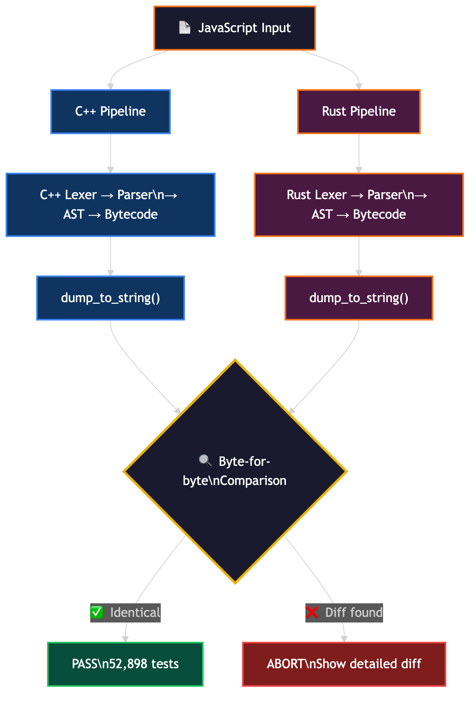

# How Ladybird Ported 25,000 Lines of C++ to Rust in 2 Weeks Using AI — Zero Regressions

## The Hook

25,000 lines of C++. Converted to Rust. In 14 days. Zero test failures across 52,898 tests. And along the way, the AI found bugs in the original C++ code that humans had missed for years.

This is the story of how the Ladybird browser team used Claude Code and OpenAI Codex to do what would have taken months — manually — in just two weeks.

## Why This Matters

Rewriting code from one language to another is one of the most painful things in software engineering. It's slow, error-prone, and usually breaks things. The industry rule of thumb has always been: **don't rewrite, refactor**.

But Ladybird just proved that AI-assisted translation — with the right verification system — can compress months of migration into weeks, with *better* correctness than the original.

## Background: Ladybird's Language Journey

Ladybird is an independent, open-source web browser built from scratch — no Chromium, no WebKit, no Gecko underneath. The entire engine is original code, started by Andreas Kling (creator of SerenityOS).

### 2024: Rust Rejected

When the team first evaluated Rust in 2024, they rejected it. The reason?

> "It's not great at C++ style OOP. The web platform object model inherits a lot of 1990s OOP flavor — garbage collection, deep inheritance hierarchies, and so on. Rust's ownership model is not a natural fit for that."
> — Andreas Kling

Fair point. The DOM, layout engine, and rendering pipeline are deeply object-oriented — exactly where Rust's ownership model fights you.

### 2024–2025: The Swift Experiment

Instead of Rust, Ladybird bet on Swift as their C++ replacement. Swift had better OOP support, automatic reference counting, and Apple's backing.

It didn't work out.

> "The C++ interop never quite got there, and platform support outside the Apple ecosystem was limited."

The Swift experiment cost roughly **a year of development time**. On February 19, 2026 — just four days before the Rust announcement — Ladybird officially abandoned Swift.

### 2026: Why Rust Won This Time

What changed? Three things:

1. **Smarter target selection** — Instead of porting the DOM/layout engine (where deep OOP is required), they chose LibJS's source-to-bytecode pipeline — a self-contained, functional subsystem where Rust's strengths shine.

2. **AI made the mechanical work feasible** — What would have taken multiple months of tedious line-by-line translation was compressed to weeks using Claude Code and Codex.

3. **test262 gave them a correctness oracle** — The ECMAScript conformance suite (52,898 tests) provided an objective way to verify every translation decision.

## What Got Ported: The LibJS Pipeline

LibJS is Ladybird's JavaScript engine. The team ported the source-to-bytecode pipeline — four self-contained components:

| Component | Role | Why It's Portable |
|-----------|------|-------------------|
| **Lexer** | Tokenizes JavaScript source text into tokens | Pure function: text in → tokens out |
| **Parser** | Builds Abstract Syntax Tree from tokens | Tree construction, no GC dependency |
| **AST** | Structured representation of the program | Data structure definitions |
| **Bytecode Generator** | Compiles AST into executable bytecode | Transformation logic, clear output format |

These were specifically chosen because:
- They're **isolated** from the rest of the browser engine (no DOM, no layout, no rendering)
- Each stage has **clearly defined inputs and outputs** — you can compare C++ output vs Rust output byte-for-byte
- They're **exhaustively tested** by test262 (the ECMAScript specification conformance suite)

What was NOT ported: the interpreter/runtime, garbage collector, and DOM bindings. Those stay in C++ for now.

## The Wrong Way: Big-Bang Rewrite

The traditional approach to a language migration is a big-bang rewrite:

1. Freeze the old codebase
2. Rewrite everything in the new language
3. Test exhaustively
4. Switch over

This approach fails for three reasons:

- **Feature freeze kills velocity** — Your browser can't stop evolving for months
- **No incremental verification** — You only know if it works at the end
- **Compounding errors** — One early architectural mistake cascades through everything

Firefox has been incrementally moving components from C++ to Rust for years. Chromium similarly has Rust in its codebase. Neither did a big-bang rewrite.

## How They Actually Did It: AI-Assisted Incremental Translation

### The AI Workflow

Andreas Kling used Claude Code and OpenAI Codex together. Here's the key quote:

> "I used Claude Code and Codex for the translation. This was human-directed, not autonomous code generation."

The process:

1. **Human decides what to port** — Kling chose the order: lexer → parser → AST → bytecode generator (each stage provides a foundation for the next)
2. **Hundreds of small prompts** — Not one big "convert this file." Instead, targeted prompts for specific classes, methods, and control flow blocks
3. **Multiple adversarial review passes** — After AI translation, different AI models reviewed the generated code for mistakes and bad patterns
4. **Human validation** — Structural fidelity and output identity confirmed by Kling

### What AI Did Well
- Translated C++ class definitions, method bodies, and control flow into Rust
- Handled mechanical conversion of pointer arithmetic, reference counting, and variant types
- Produced 25,000 lines within two weeks

### What AI Couldn't Do
- **Architecture decisions** — Which components to port, in what order, how they coexist with C++
- **FFI boundary design** — The C FFI layer (`RustIntegration.cpp/h`) required human design
- **Build system integration** — Corrosion/CMake bridge for Rust compilation
- **Verification infrastructure** — The lockstep comparison mode (see below)
- **Bug triage** — When outputs diverged, humans had to determine which side was wrong

## The Verification System: Lockstep Mode

This is the most clever part of the entire approach.

The team built a dual-pipeline verification system controlled by environment variables:

| Variable | Effect |
|----------|--------|
| `LIBJS_CPP` | Forces C++ pipeline only (Rust disabled) |
| `LIBJS_COMPARE_PIPELINES=1` | Runs both pipelines simultaneously in "lockstep mode" |

In lockstep mode, every JavaScript input goes through BOTH the C++ and Rust pipelines. The system compares output at every stage — tokenization, AST construction, and bytecode generation. **Any difference causes an immediate abort with a detailed diff.**

The correctness bar: **byte-for-byte identical output** from both pipelines on every test input. Not approximate. Not "close enough." Exact match.

### The `dump_to_string()` Method

To enable comparison, the team added `dump_to_string()` methods to both C++ and Rust AST/bytecode representations. This produces a text representation that can be diffed character-by-character.

## The Numbers

| Metric | Value |
|--------|-------|
| Lines of Rust generated | ~25,000 (20,000 excluding comments) |
| Time taken | ~2 weeks |
| Estimated manual time | Multiple months |
| test262 tests passed | 52,898 |
| test262 regressions | **0** |
| Ladybird regression tests | 12,461 |
| Ladybird regression failures | **0** |
| Performance regressions | **0** |
| Prompts used | Hundreds of small prompts |

## The Plot Twist: AI Found Bugs in the C++ Code

Here's the most unexpected outcome. Making the Rust and C++ outputs identical forced the team to fix **seven latent bugs** in the original C++ implementation:

### 1. Non-Deterministic HashMap Iteration
Local variable index assignments iterated HashMap keys in unspecified order. The bytecode output was non-deterministic — sometimes it produced different bytecode for the same input. Fixed by using sorted key processing.

### 2. Non-Deterministic Register Allocation
The register allocator selected whichever free register happened to be at the end of the free list, rather than always choosing the lowest-numbered free register. This meant the same code could produce different register assignments on different runs.

### 3. Exponent Consumption Bug (Lexer)
The C++ lexer used short-circuit evaluation that skipped `consume_exponent()` when a token was already flagged as invalid. Input like `1._1e2` would not have the exponent consumed — it would be lexed as separate tokens. This was a spec violation hiding in plain sight.

### 4. Property Identifier Scope Leak
Property key identifiers were being registered in the scope collector during parsing, conflating them with variable references. Properties aren't variables — they shouldn't appear in scope analysis.

### 5. `using` Declaration in For-Loop Bug
`using` declarations in for-loop init clauses were not registered in the scope collector at all.

### 6. Arrow Function Scope Flag Leak
When the parser speculatively attempted to parse an arrow function and encountered `this` in a default parameter, `uses_this` flags were propagated up to ancestor scopes. If the parse attempt subsequently failed, these flags were left dirty — polluting scope analysis for the parent function.

### 7. Global Identifier Optimization Misapplication
A global identifier optimization was incorrectly applied to functions created with `new Function()`. Dynamic function creation shouldn't receive static optimizations.

These bugs had been in the codebase for a long time. The requirement of byte-for-byte identical output between C++ and Rust forced every non-determinism and edge case to the surface.

As Simon Willison noted:
> "Agentic engineering becomes much more of a safe bet when you have an existing trusted reference implementation for comparison, comprehensive conformance testing, and clear, measurable success criteria."

## The "Translated from C++" Problem

Kling is upfront about the code quality:

> "The code has a strong 'translated from C++' vibe because it is translated from C++."

Example: manual `drop()` calls are used to enforce register reuse ordering so that bytecode output matches C++ exactly. This is intentionally non-idiomatic Rust — the priority was correctness, not beauty.

The plan: once the C++ pipeline is retired and the lockstep comparison is no longer needed, the Rust code will be rearchitected into idiomatic patterns.

## Build System Integration

The Rust pipeline compiles via **Corrosion** (the CMake-Cargo bridge) and links into LibJS as a static library:

- Enabled by default on non-Windows platforms via the `ENABLE_RUST` CMake flag
- Windows requires additional linker flags: `kernel32 ntdll Ws2_32 userenv`
- C++ calls Rust through a C FFI layer (`RustIntegration.cpp/h`)

## What This Means for the Industry

### 1. AI-Assisted Migration Is Real — With Conditions
The conditions that made this work:
- **Strong test coverage** (test262 = 52,898 tests)
- **Self-contained subsystem** (no deep coupling to the rest of the codebase)
- **Clear input/output contracts** (text → tokens → AST → bytecode)
- **Human-directed prompts** (not autonomous agent running wild)
- **Adversarial review** (multiple AI models checking each other's work)

Without these conditions — especially the test suite — this approach would be far riskier.

### 2. The Sweet Spot for AI Translation
AI excels at: lexers, parsers, serializers, data transformers — things with clear specifications and testable outputs.

AI struggles with: architectural decisions, GC integration, deep OOP hierarchies, concurrent state management.

### 3. Migration Finds Bugs
The side-effect of demanding exact output parity is that you expose every hidden non-determinism and edge case in the original codebase. Seven bugs in mature C++ code — that's significant.

## Community Reactions

**Positive:**
- "Translated-from-C++ Rust is totally fine as a starting point. The Rust compiler still catches whole classes of memory bugs even if the code reads a bit weird."
- "The adversarial model of having an LLM's output reviewed by a different LLM is a great addition to a strong test suite."

**Skeptical:**
- "The impedance mismatch between C++ idioms and non-idiomatic Rust could create a cognitive bottleneck that stifles code evolution."
- "This approach works dramatically better where there is very tight test coverage. Broader Ladybird modules lack test262-equivalent coverage."

Both sides make valid points. The approach is powerful but not universally applicable.

## Summary

| What | Detail |
|------|--------|
| **Who** | Ladybird browser (Andreas Kling) |
| **What** | Ported LibJS source-to-bytecode pipeline from C++ to Rust |
| **How** | Claude Code + Codex, hundreds of small prompts, human-directed |
| **Scale** | 25,000 lines of Rust in ~2 weeks |
| **Verification** | Lockstep dual-pipeline, byte-for-byte identical output |
| **Test coverage** | 52,898 test262 tests + 12,461 regression tests, 0 failures |
| **Bonus** | Found and fixed 7 latent C++ bugs |
| **What's next** | Incremental porting of more subsystems; C++ remains for DOM/layout |

The takeaway: AI doesn't replace engineering judgment. But when you pair it with strong test coverage, clear specifications, and human direction — it compresses months into weeks while actually improving code quality.

## References

- [Ladybird: Adopting Rust, with help from AI](https://ladybird.org/posts/adopting-rust/) — Official announcement
- [Ladybird indie web browser flutters toward Rust — The Register](https://www.theregister.com/2026/02/23/ladybird_goes_rusty/)
- [LibJS Rust PR #8104 — GitHub](https://github.com/LadybirdBrowser/ladybird/pull/8104)
- [Simon Willison's Analysis](https://simonwillison.net/2026/Feb/23/ladybird-adopts-rust/)
- [LWN.net — The Ladybird browser project shifts to Rust](https://lwn.net/Articles/1059812/)
- [test262 — ECMAScript Conformance Suite](https://github.com/nicolo-ribaudo/tc39-test262)

---

*Follow @techvijayforyou for more system design breakdowns.*

#systemdesign #rust #cpp #ai #ladybird #browser #programming #softwaredevelopment #claudecode #codegeneration #migration #webdev #coding #techcontent #developer
