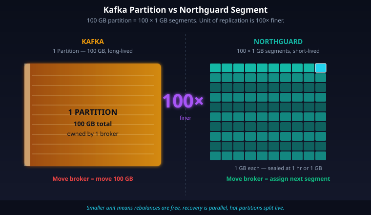
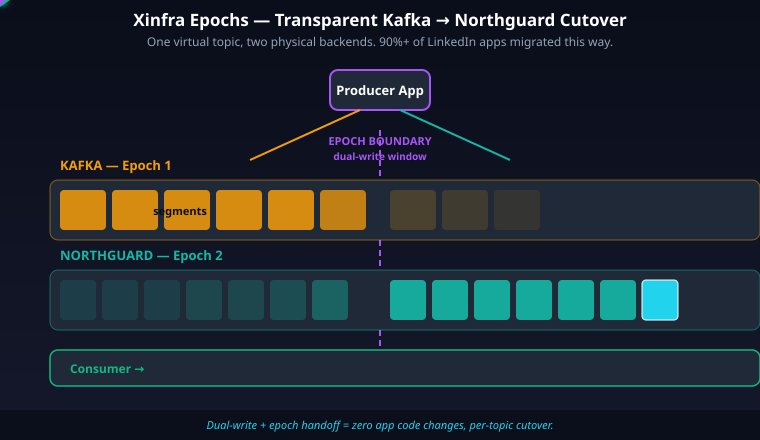

# LinkedIn Invented Kafka. In 2025, LinkedIn Replaced It.

LinkedIn built Apache Kafka in 2010. Every company you can name — Netflix, Uber, Airbnb, Stripe, half of your interviews — copied Kafka as the default for event streaming. Kafka became the word for "log."

Then in **June 2025**, LinkedIn's own engineering team — Onur Karaman and Wesley Wu — published a blog post that read like a quiet confession: *"We're replacing Kafka."* The new system is called **Northguard**. The migration layer that makes it transparent is called **Xinfra**.

This isn't a departure. It's a graduation. LinkedIn outgrew its own invention. At **32 trillion records a day, 17 petabytes a day, 400,000 topics across 150 clusters**, the partition model that made Kafka famous turned into the ceiling that made Kafka impossible. Rebalances took forever. Brokers couldn't be added without moving terabytes. A single slow consumer stuck a whole partition.

Northguard throws out the partition. It replaces it with something **100× more granular** — a 1 GB segment that lives for one hour, then seals itself. And thanks to the Xinfra client library, **90%+ of LinkedIn applications** have already moved, without touching a single line of their app code. This is the story of how you migrate foundational infrastructure at trillion-scale — and the blueprint for every team that will face the same wall.

> **In short:** Kafka's partition is a coarse, long-lived unit. Northguard's segment is a fine, short-lived unit. Everything else follows from that one change.

---

## The Problem — Why Kafka's Partition Model Hit a Wall

Kafka's core abstraction is the **partition**. A partition is an append-only log. It is, simultaneously, the unit of three very different things:

1. **Ordering** — records in a partition are strictly ordered.
2. **Replication** — a partition is replicated across N brokers. One is the leader, the rest are ISR (in-sync replicas).
3. **Consumer parallelism** — one partition maps to at most one consumer inside a consumer group.

For most teams, this simplicity is Kafka's gift. For LinkedIn at 32 trillion records a day, that coupling became a cage.

### The partition ceiling is real

Confluent's own guidance caps a healthy Kafka broker at **around 4,000 partitions**, and a cluster at **low tens of thousands** for availability-sensitive workloads. The original ZooKeeper-backed metadata layer started breaking around **200,000 partitions per cluster**. KRaft — Kafka's newer ZK-free metadata protocol — has been tested up to **2 million partitions**, but even that is a test-bench number.

LinkedIn's 2024 reality: **7 trillion messages/day, 4,000+ brokers, 100,000+ topics, 7 million partitions**. They had already bumped into the wall. By 2025 they were at 32 trillion records/day and 400K topics — roughly **4.5× growth in a year**.

The reason you can't just "add more partitions" is the controller. In legacy Kafka, every metadata operation went through ZooKeeper. LinkedIn published the numbers: *"if there are 10,000 partitions in the Kafka cluster and initializing the metadata from ZooKeeper takes 2 ms per partition, this can add 20 more seconds to the unavailability window"* during controller failover. Twenty seconds of global metadata stall is the difference between a hiccup and a page.

LinkedIn had to build **TopicGC** just to garbage-collect unused topics because *"unused topics can generate extra metadata that makes the controller initialization slower and threaten Kafka availability, with issues arising when the ZooKeeper response is larger than 1MB."* TopicGC deleted ~20% of topics and improved produce/consume performance by 30%+. That's a company writing new systems to stop Kafka from choking on its own metadata.

### Rebalancing is a stop-the-world event

The classic Kafka consumer rebalance is eager: *"All consumers revoked their partitions, a leader computed a new assignment, and partitions were redistributed before processing could resume."* KIP-429 (cooperative rebalancing, Kafka 2.4) and KIP-848 (async rebalance, Kafka 4.0) softened this, but the underlying pattern — a group coordinator centrally reshuffles partitions across consumers — remains.

At LinkedIn scale, adding a broker meant a multi-hour partition reassignment. Losing one meant re-replicating terabytes of data. As LinkedIn put it in the Northguard blog: *"new brokers remained unutilized until logs manually reassigned"* — forcing them to build **Cruise Control** as an external rebalancer. Again: another system just to compensate for Kafka's coarseness.

### The slow consumer problem

Because exactly one consumer reads from a partition, **one slow consumer stalls the entire partition**. Gunnar Morling put it cleanly: *"The default Kafka consumer is only single-threaded, so it can only process records sequentially... if a given message can't be consumed for whatever reason, or if it just takes very long to do so, that consumer can't easily move beyond that message."*

The standard fix is to pre-create more partitions. But partitions can only be added, never removed, and re-partitioning a keyed topic breaks the key-to-partition mapping. You are locked in at topic-creation time.

### Did KRaft fix this?

KRaft helps — a lot — with metadata. ZooKeeper is gone. Controller failover dropped from seconds to milliseconds. Partition ceilings went from 200K to a tested 2M. OSO's engineering team documented *"at least 10x scalability improvements in terms of the amount of metadata."*

But **KRaft did not fix the partition model itself**. The partition is still the unit of replication, ordering, and parallelism. You still can't shrink partitions. You still have one consumer per partition. You still rebalance the whole group when anything changes.

LinkedIn's blog says the quiet part out loud: Northguard *"eliminates Kafka's single-controller and partition-based limitations."* KRaft killed the single controller. Northguard kills the partition.

> **In short:** Kafka's partition couples ordering, replication, and parallelism into one coarse, long-lived unit. At LinkedIn's scale, every one of those couplings became a ceiling — and KRaft only fixed the metadata half.

---

## Architecture Overview — Northguard's Four-Layer Design

Northguard is written in **C++**. LinkedIn has not publicly stated the reason for the language choice — the blog doesn't address it. Community inference points to eliminating JVM garbage collection pauses, tighter Direct I/O control, and seamless integration with RocksDB (already C++), but none of that is officially confirmed.

At a high level, Northguard has four layers that together replace the monolithic Kafka broker.



*Producers and consumers talk to the Xinfra client, which routes to Northguard brokers. DS-RSM shards the metadata across many Raft groups. The fps-store handles on-disk segments with Direct I/O + RocksDB sparse index.*

**The four layers:**

| Layer | Kafka equivalent | What's different |
|---|---|---|
| **Client / API** | Kafka clients | Xinfra client — Pub/Sub-agnostic, abstracts Kafka *and* Northguard behind one API |
| **Data plane** | Broker + partition + ISR | Segment-based with range routing, fsync-on-all-replicas |
| **Metadata plane** | KRaft quorum controller | DS-RSM — sharded Raft state machines across vnodes |
| **Storage** | Page cache + `.log` + `.index` per partition | fps-store — Direct I/O, one file per segment, RocksDB sparse index |

And the data model is inverted from Kafka's:

```
Record    →  key + value + headers (the message)
Segment   →  unit of replication — sealed at 1 GB or 1 hour
Range     →  contiguous keyspace slice — can split/merge live
Topic     →  set of ranges that cover the full keyspace
```

In Kafka, a topic is a fixed set of partitions. In Northguard, a topic is a dynamic set of ranges, each made of many short-lived segments. That shift is the entire point.

> **In short:** Northguard replaces Kafka's single-broker-owns-a-partition model with four decoupled layers — client abstraction, segment-based data plane, sharded Raft metadata, and Direct-I/O storage.

---

## Segments — The 1 GB, 1-Hour Unit That Changes Everything

The segment is the hero of this story. In Kafka, a partition is a long-lived log. It can grow for days. It's always assigned to the same broker (plus replicas). When you rebalance, you move the partition — terabytes over the wire.

In Northguard, a segment is sealed and retired when **any one** of these fires:

1. It reaches **1 GB** of data.
2. It has been active for **1 hour**.
3. A replica fails.

After sealing, the segment becomes immutable. A new active segment is created — and crucially, **the new segment can be assigned to a different broker**. LinkedIn's blog says it plainly: *"No need to move existing data onto new brokers. New brokers organically start becoming segment replicas of new segments."*

Think about what this means:

- **Adding a broker** used to require moving partitions (TB-scale). Now new brokers just get the *next* segments. Zero data movement.
- **Broker failure recovery** used to mean re-replicating whole partitions. Now you re-replicate 1 GB chunks, in parallel, across many surviving brokers.
- **Hot partitions** — the classic pain of Kafka keyed topics where one key dominates — are handled by **range splits**. When a range gets too hot, it splits into two. Existing sealed segments stay put; the split only affects the next active segment.



*A single 100 GB Kafka partition maps to 100 Northguard segments. The replication unit is literally 100× finer, which is where the "100× more granular" claim comes from.*

### Active vs sealed replication

Northguard uses two different replication protocols depending on segment state:

- **Active segments** use a *sessionized streaming protocol* — records flow from leader to follower using record offsets, similar in spirit to Kafka's ISR stream but at segment granularity.
- **Sealed segments** reuse the *consume protocol itself* between two brokers. A follower replicating a sealed segment is indistinguishable, at the wire level, from a consumer reading it. This is elegant — one protocol, two purposes.

And unlike Kafka, which batches fsyncs lazily (Kafka's default is roughly 10 seconds or 20,000 records), Northguard **fsyncs on all replicas before acknowledging a produce**. Configurable thresholds are around **10 ms, 20k records, or 10 MB** — whichever hits first. The durability floor is higher, and the ack latency is tighter.

```cpp
// Conceptual: produce ack policy (not real Northguard code)
if (all_replicas_fsynced(segment_id, record_offset)) {
  ack_producer(record_offset);
} else if (time_since_last_batch_ms > 10 ||
           records_in_batch > 20000 ||
           bytes_in_batch > 10_000_000) {
  force_fsync_all_replicas();
  ack_producer();
}
```

> **In short:** A segment is small enough that moving it is free, short-lived enough that the data plane self-balances, and immutable once sealed — so rebalancing is just "assign the next segment somewhere else."

---

## Ranges — Dynamic Keyspace, Not Static Partitions

A Kafka topic has N partitions, decided at creation time. Increase only, never decrease. Re-partitioning breaks key affinity. Every Kafka team learns this the hard way.

A Northguard topic has **ranges**. A range is a contiguous slice of the keyspace — like `A→D`, `D→M`, `M→Q`. Each range is backed by a stream of segments. Critically, ranges can **split and merge live**:

- Too hot? Split `A→D` into `A→C` and `C→D`.
- Too cold? Merge adjacent ranges.
- All without breaking ordering within a range (the Kafka equivalent of per-partition ordering).

This is the same principle BigTable uses for tablets and DynamoDB uses for its partitions. LinkedIn applied it to log storage. Ranges are the dynamic-parallelism knob that Kafka never had.

Consumers subscribe to ranges. Because ranges split and merge dynamically, consumer parallelism scales without the Kafka ceiling. And Northguard **inverts the consumer flow control model** — instead of Kafka's pull-and-poll, Northguard is push-based: the client advertises how much it can accept, the broker streams it data. Slow consumers self-throttle; they don't stall a whole partition.

> **In short:** Ranges give you Kafka's per-partition ordering with BigTable's dynamic sharding. No more static partition count, no more "we should have created 1024 instead of 32."

---

## DS-RSM — Sharding Raft Itself

Kafka (in KRaft mode) has **one** Raft-backed controller that owns all cluster metadata. Northguard has **many**.

**DS-RSM** stands for **Dynamically-Sharded Replicated State Machine**. It's a collection of **vnodes** arranged on a consistent-hash ring (LinkedIn's blog says 128+ vnodes). Each vnode is itself a Raft-backed replicated state machine with its own leader (called a **coordinator**). Metadata is partitioned across vnodes by hash:

- **Topic-level metadata** is hashed by topic name.
- **Range- and segment-level metadata** is hashed by range ID.

Failure detection uses **SWIM**, the gossip protocol behind HashiCorp Serf and Consul. No single controller, no central bottleneck.


*128+ vnodes, each running its own Raft group. Topic metadata hashes into one vnode; range metadata hashes into another. Losing a coordinator only affects one shard of metadata, not the whole cluster.*

LinkedIn's own comparison table makes the contrast obvious:

| Dimension | Kafka (KRaft) | Northguard (DS-RSM) |
|---|---|---|
| Controllers | 1 | 128+ coordinators |
| Replicated state machines | 1 | 128+ sharded RSMs |
| Failure blast radius | Cluster-wide metadata stall | One vnode's shard of metadata |
| Scaling strategy | Vertical (bigger controller) | Horizontal (more vnodes) |

This is the piece that makes Northguard "decentralized" in a way KRaft isn't. KRaft removed ZooKeeper but kept the single-controller idea. Northguard shards the controller.

> **In short:** Kafka has one Raft group running the whole cluster. Northguard has 128+ tiny Raft groups, each responsible for a slice of metadata. Metadata ops scale horizontally now.

---

## fps-store — Direct I/O, RocksDB, and One File Per Segment

Kafka's storage layer leans on the Linux page cache. Each partition lives in a directory of `.log` + `.index` + `.timeindex` files. It works well, but it's indirect — the OS decides what's cached, and at 17 PB/day you'd rather decide yourself.

Northguard's default storage backend is **fps-store**. Key design choices:

- **Write-Ahead Log (WAL)** for crash recovery.
- **One file per segment** — not one file per partition. Since segments are small and immutable, the filesystem metadata stays bounded.
- **Direct I/O** — bypasses the OS page cache entirely. Northguard's own code manages caching because it knows the consume-pattern (sequential sweep of active segment, random seek into sealed segments).
- **Sparse index in RocksDB** — the key → byte-offset index isn't baked into the log file like Kafka's `.index`. It lives in RocksDB, which already knows how to do SSTables, compaction, and block cache.

The storage layer is **pluggable**. fps-store is the default, but Northguard doesn't hard-code it. Whether there's a built-in tiered path to object storage (S3 etc.) is **not publicly documented** — the blog frames durability as "bounded by cluster disk capacity," implying today's design scales horizontally across local disk rather than tiering out. If tiered storage exists, LinkedIn hasn't published it.

> **In short:** fps-store trades the OS page cache for app-managed Direct I/O + RocksDB. Smaller files, smarter caching, no surprises from `vm.swappiness`.

---

## Xinfra — The Virtualization Layer That Made Migration Invisible

Northguard is the new engine. **Xinfra** is the trick that let LinkedIn replace the engine without asking any application team to change their code. This is the most transferable lesson in the whole story.

Pronounced **"ZIN-frah"**, Xinfra is two things:

1. A **client library** (Xinfra client) with a Pub/Sub-agnostic API.
2. A **metadata service** (xinfra-metadata-service) that tracks where each virtual topic physically lives.

Applications at LinkedIn no longer use the Kafka client SDK. They use the Xinfra client, which exposes operations like "produce to a topic," "subscribe by shard assignment," and "subscribe by consumer-group management." Under the hood, Xinfra routes to either Kafka or Northguard based on what the metadata service says.

Crucially, Xinfra is **not** a Kafka wire-protocol emulator. LinkedIn did not build a Kafka-protocol shim on Northguard. InfoQ quotes LinkedIn directly: *"Given the protocol difference between Kafka and Northguard and the intensive use of Kafka at LinkedIn, migration is highly challenging."* The abstraction lives above both protocols, not between them.

### Epochs — the mechanism that makes a topic dual-homed

A Xinfra topic has **epochs**. Each epoch captures a slice of the topic's physical history. A single logical topic can have:

- Epoch 1 → on Kafka cluster X
- Epoch 2 → on Northguard cluster Y

Consumers read *through* epochs. They can drain the tail of epoch 1 on Kafka, then pick up epoch 2 on Northguard, preserving logical ordering of the topic as a whole. The epoch boundary is where the physical backend changes; the application sees one continuous stream.



*A producer writes to both Kafka and Northguard during the handoff window. Consumers drain Kafka up to the epoch boundary, then continue on Northguard. The app sees one topic; the infra team flips the backend.*

### The migration choreography

LinkedIn's published flow:

1. **Producers migrate first.** During the handoff window, they **dual-write** to both Kafka and Northguard. If Northguard misbehaves, rollback is trivial — flip a metadata flag.
2. **Consumers migrate next.** They read across the epoch boundary. Ordering holds because the epoch sequence is total.
3. **Dual writes turn off** once the new backend is stable.
4. Repeat, per topic.

Offset tracking across the handoff isn't done with offset translation — it's sidestepped. **Checkpoints** are stored centrally:

- **Vitess (sharded MySQL)** with a coalescing buffer = the durable checkpoint store.
- **Couchbase** = low-latency cache.
- **MySQL** = virtual-to-physical topic map.
- **ZooKeeper** = membership and leadership of the Xinfra metadata service itself.

That checkpoint store lets any consumer resume from a logical position without caring whether the underlying physical offset was Kafka's or Northguard's.

### The pattern, not just the product

Xinfra's deeper lesson is a pattern every big-tech team eventually reinvents: **own a client-side abstraction years before you need to migrate.** LinkedIn didn't just replace Kafka; they were *able* to replace Kafka because they'd already built the Xinfra abstraction. Uber did the same thing when they rewrote Schemaless's Python layer into Go behind a "Frontless" proxy (see *"How Uber deals with large Python monorepo"* on uber.com/blog). Meta did it when they swapped MySQL's storage engine to MyRocks via MySQL's storage-engine API.

The invariant: **the virtualization seam must exist before the migration starts**. If you wait until the migration to introduce the abstraction, every app team becomes a stakeholder. If the abstraction already exists, the infra team owns the migration end-to-end.

> **In short:** Xinfra is a client library and metadata service that versioned every topic into epochs. Apps kept talking to "a topic"; the infra team silently rolled that topic from Kafka to Northguard underneath.

---

## End-to-End Walk-Through — One Record From Produce to Consume

Let's trace a single record through the full stack.

1. **App calls produce.** `client.produce("user-actions", key="user-42", value=...)`. The client is an Xinfra client.
2. **Xinfra looks up the virtual topic.** The metadata service returns: *"user-actions is currently on Northguard cluster NG-prod-3, range M→Q, active segment seg-99."*
3. **Route to the segment leader.** The client connects to the broker currently hosting the active segment for range `M→Q`.
4. **Append and fsync.** The broker appends the record to its WAL, streams it to followers over the sessionized active-segment protocol, and waits for fsync acknowledgments from all replicas before ack'ing the producer — unless the 10 ms / 20k / 10 MB batch threshold fires first.
5. **Sparse index update.** RocksDB gets the key → byte-offset mapping for the sparse index.
6. **Seal when full.** When the segment hits 1 GB or 1 hour, it's sealed. The next active segment may be assigned to a different broker — self-balancing in real time.
7. **Consumer reads.** A downstream consumer subscribed to range `M→Q` gets pushed new records via the push-based streaming protocol. If it's slow, it advertises a smaller credit window; the broker pushes less.
8. **Sealed segment consume.** If the consumer lags back into a sealed segment, the same consume protocol works — sealed segments are just immutable logs served over the wire.
9. **Checkpoint.** The consumer's position is written to Vitess (via a coalescing buffer) and cached in Couchbase for lookups.

Now imagine the same trace on the day LinkedIn flips `user-actions` from Kafka to Northguard. The app code doesn't change. Step 2's metadata response flips mid-stream. The consumer drains Kafka up to the epoch boundary, then picks up Northguard. That's the entire user-visible story of a migration at 32 trillion records a day.



*One record, nine hops. The Xinfra client is the only thing the app sees; everything past that is reroutable at runtime.*

> **In short:** A record flows producer → Xinfra → segment leader → all replicas fsync → RocksDB sparse index → sealed → consumed. The magic is that the physical path can change per topic per day without the app noticing.

---

## Why This Architecture Wins — The Scorecard

LinkedIn's single hard public number: **"80%+ fewer clusters"** needed compared to Kafka. They haven't published specific rebalance-time, MTTR, or dollar numbers (yet). What they have published, in their own comparison table, is a set of design-level wins:

| Problem | Kafka (even with KRaft) | Northguard |
|---|---|---|
| Unit of replication | Partition (can be TB-scale, lives indefinitely) | Segment (≤ 1 GB, ≤ 1 hour) |
| Controller model | 1 Raft-backed controller | 128+ sharded Raft groups (DS-RSM) |
| Metadata ops | Scale vertically, bounded | Scale horizontally, per-vnode |
| Adding a broker | Rebalance partitions (TB of data movement) | No data movement — next segments land on new broker |
| Broker failure recovery | Re-replicate full partitions | Re-replicate 1 GB chunks in parallel |
| Hot partition | Manual re-partition, breaks key mapping | Dynamic range split, no key break |
| Load balancing | External rebalancer (Cruise Control) required | Balanced by design |
| Consumer parallelism | Capped at partition count | Scales with ranges; push-based flow control |
| Durability | Lazy fsync (10s / 20k records) | fsync-before-ack on all replicas (10ms / 20k / 10MB) |
| Cluster fragmentation at scale | 150 clusters at LinkedIn | Claim: 80%+ fewer clusters |
| Migration story | Rip-and-replace or dual-API | Xinfra client + epochs = transparent per-topic cutover |



*Five dimensions where Northguard wins by design. The partition-to-segment ratio is literally 100× for a 100 GB partition. Controller sharding is 128:1. Cluster count drops by 5× claimed.*

### Honest trade-offs

- **Northguard is not open source.** LinkedIn said they "will explore" open-sourcing. That's corporate for "maybe someday." If you're not LinkedIn, you can't run Northguard.
- **C++ instead of Java** narrows the contributor pool. (And the "why C++" rationale isn't publicly stated — flag: inferred, not documented.)
- **Xinfra's value is organizational**, not technical. If your ecosystem is two apps and one Kafka cluster, you don't need epochs and a virtualization layer. You need a better CI pipeline.
- **No public case study** names a specific LinkedIn app that migrated via Xinfra. We know "thousands of topics, including mission-critical ones" — but not which ones. This is usable as a reference architecture, not a copy-paste blueprint.

### What Northguard teaches every team

Even if you'll never run at 32 trillion records/day, there are three transferable lessons:

1. **Couple less.** Kafka's mistake was coupling three things — ordering, replication, parallelism — into one unit. Any system that couples three things into one will eventually need the same unbundling.
2. **Shard the controller.** Whenever you have "one X owns everything" — one leader, one scheduler, one controller — there's a cliff ahead. DS-RSM is the pattern for stepping past that cliff.
3. **Own the seam.** Build the client-side abstraction *years* before you need to migrate. Xinfra is the reason LinkedIn's migration was invisible; without it, the migration would have been a five-year all-hands disaster.

> **In short:** Northguard wins on granularity, sharding, and migration mechanics. It is a design-level rethink, not a tuning knob. And the lessons — decouple units, shard controllers, own your seams — apply far below LinkedIn scale.

---

## References

1. [LinkedIn Engineering — Introducing Northguard and Xinfra (Onur Karaman & Wesley Wu, June 2025)](https://www.linkedin.com/blog/engineering/infrastructure/introducing-northguard-and-xinfra)
2. [LinkedIn Engineering — How LinkedIn customizes Apache Kafka for 7 trillion messages/day](https://www.linkedin.com/blog/engineering/open-source/apache-kafka-trillion-messages)
3. [LinkedIn Engineering — TopicGC: cleaning up unused Kafka metadata](https://engineering.linkedin.com/blog/2022/topicgc_how-linkedin-cleans-up-unused-metadata-for-its-kafka-clu)
4. [InfoQ — LinkedIn Announces Northguard and Xinfra](https://www.infoq.com/news/2025/06/linkedin-northguard-xinfra/)
5. [Confluent — How to choose the number of topics/partitions in a Kafka cluster](https://www.confluent.io/blog/how-choose-number-topics-partitions-kafka-cluster/)
6. [Confluent — Apache Kafka supports 200K partitions per cluster](https://www.confluent.io/blog/apache-kafka-supports-200k-partitions-per-cluster/)
7. [Confluent — KIP-848 Consumer Rebalance Protocol](https://www.confluent.io/blog/kip-848-consumer-rebalance-protocol/)
8. [Confluent — KRaft metadata docs](https://docs.confluent.io/platform/current/kafka-metadata/kraft.html)
9. [Instaclustr — KRaft abandoning ZooKeeper, part 3: max partitions](https://www.instaclustr.com/blog/apache-kafka-kraft-abandons-the-zookeeper-part-3-maximum-partitions-and-conclusions/)
10. [Strimzi — Kafka segment retention internals](https://strimzi.io/blog/2021/12/17/kafka-segment-retention/)
11. [Conduktor — Kafka storage and log retention](https://www.conduktor.io/blog/understanding-kafka-s-internal-storage-and-log-retention)
12. [Gunnar Morling — KIP-932 Queues for Kafka](https://www.morling.dev/blog/kip-932-queues-for-kafka/)
13. [BigDATAwire — LinkedIn introduces Northguard (confirms C++)](https://www.hpcwire.com/bigdatawire/2025/06/25/linkedin-introduces-northguard-its-replacement-for-kafka/)
14. [Vu Trinh — The company that created Kafka is replacing it](https://vutr.substack.com/p/the-company-that-created-kafka-is)
15. [SiliconANGLE — LinkedIn introduces Northguard and Xinfra](https://siliconangle.com/2025/06/25/linkedin-introduces-northguard-xinfra-replace-kafka-scalable-log-storage/)

---

## Hashtags

#systemdesign #softwareengineer #coding #kafka #distributedsystems #linkedin #northguard #eventstreaming #backend #techvijayforyou
