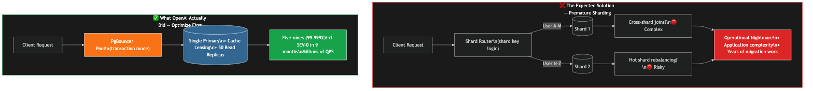
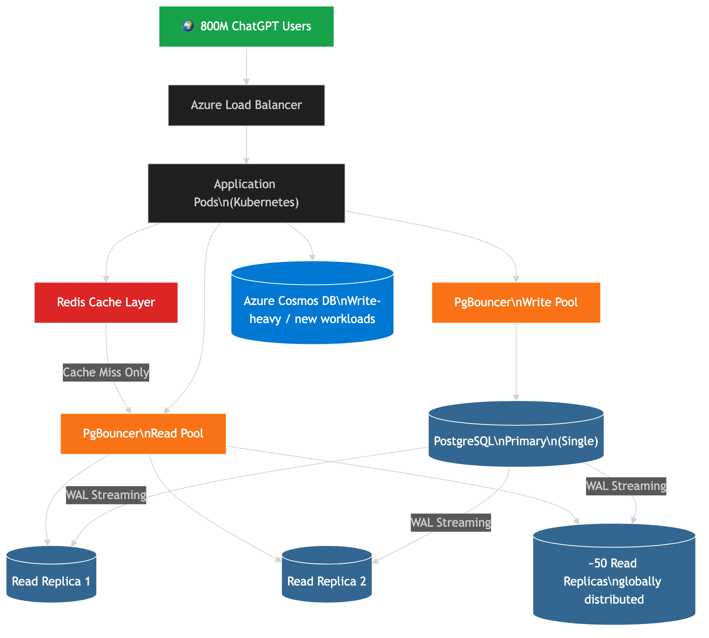
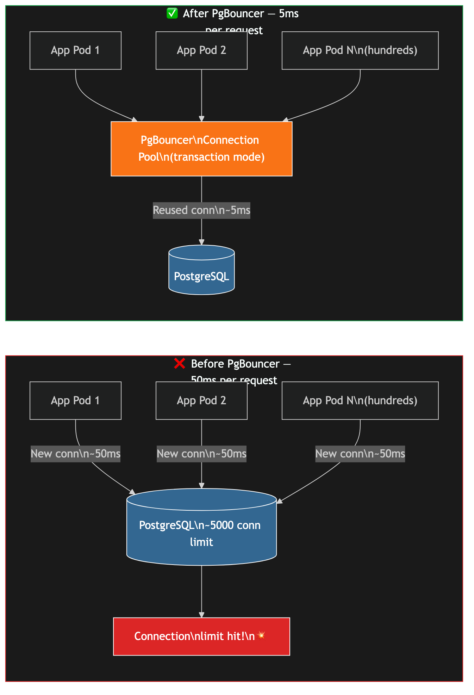
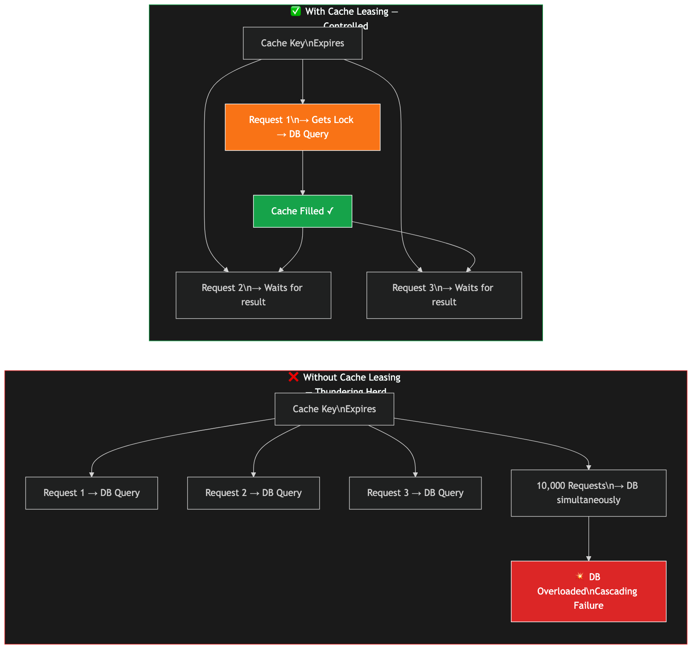

# How OpenAI Runs ChatGPT for 800 Million Users on a Single PostgreSQL Database

> **Published:** January 2026 | **Source:** OpenAI Engineering Blog (Bohan Zhang)
> **TLDR:** OpenAI serves 800 million ChatGPT users without application-level sharding, running a single PostgreSQL primary with ~50 globally distributed read replicas on Azure. The keys: PgBouncer connection pooling, cache leasing, aggressive write reduction, and strict schema governance.

---

## The Hook

You're building a product that reaches 800 million users. What database architecture would you reach for?

Most engineers immediately think: distributed database. Cassandra. DynamoDB. CockroachDB. Sharded PostgreSQL at the very least.

OpenAI didn't. They run ChatGPT — with 800 million users and millions of queries per second — on a **single PostgreSQL primary** with no application-level sharding.

And in the past 9 months, they've had exactly **one** PostgreSQL-related SEV-0 incident.

Here's how they did it.

---

## The Wrong Way First — What Most Teams Would Do

The intuitive answer when you hit database limits is horizontal scaling: shard your data across multiple primary databases, route writes by a shard key (user ID, region, etc.), and distribute the load.

This works. But it comes with severe costs:

- **Cross-shard joins** become impossible at the database level — you have to do them in application code, which is slower and harder to reason about
- **Schema changes** need to run on every shard, coordinated
- **Hot shards** — when one shard gets disproportionate traffic — require painful rebalancing
- **Distributed transactions** across shards are notoriously complex and error-prone

OpenAI's philosophy: **sharding is a last resort, not a first response.** Optimize everything else before you split your data.

---

## The Real Architecture

**Infrastructure (all VERIFIED from official OpenAI blog, author: Bohan Zhang):**

- **Single PostgreSQL primary** on Azure Database for PostgreSQL Flexible Server (managed, not self-hosted)
- **~50 read replicas** distributed globally
- **PgBouncer** connection poolers in front of both the primary and replicas
- **Redis** as a caching layer in front of PostgreSQL
- **Azure Cosmos DB** for write-heavy, shardable new workloads
- All running on **Kubernetes** with per-replica PgBouncer Kubernetes Deployments behind a Service

The cluster has maintained **five-nines availability (99.999%)** and handled a **>10x load increase** in 12 months.

---

## Problem 1: Connection Overhead — 50ms Per Request

PostgreSQL handles each client connection as a separate OS process. Each connection takes memory (~10MB), CPU, and setup time.

At scale with hundreds of Kubernetes pods each wanting their own connection pool, two things happen:

1. **Setup latency**: Establishing a new PostgreSQL connection takes ~50ms — significant overhead when requests should complete in tens of milliseconds total.
2. **Connection limit**: Azure Database for PostgreSQL caps connections at ~5,000. With hundreds of pods each holding pools, you hit this ceiling fast.

### Fix: PgBouncer in Transaction Pooling Mode

PgBouncer is a lightweight PostgreSQL connection pooler. Instead of each application pod opening its own connections to PostgreSQL, they all connect to PgBouncer, which maintains a small pool of real PostgreSQL connections and reuses them across requests.

**Mode: transaction pooling** — a connection is borrowed for the duration of a single transaction, then returned to the pool. This is the most efficient mode and allows many more application clients than active PostgreSQL connections.

**Deployment:** Each read replica gets its own PgBouncer Kubernetes Deployment with multiple PgBouncer pods, all behind a Kubernetes Service for load balancing.

**Result:** Connection overhead dropped dramatically — Bohan Zhang cited figures in the range of ~50ms → ~5ms (roughly 10x) in the official blog and HN discussion. Treat these as illustrative of the order-of-magnitude improvement, not guaranteed exact production SLAs.

---

## Problem 2: Thundering Herd — 10,000 Requests Hitting the DB at Once

When a cached key expires, every request that needs that data gets a cache miss simultaneously and tries to fetch from PostgreSQL. This is called a **thundering herd** (or cache stampede).

At OpenAI's request volume, a single cache key expiry could send tens of thousands of concurrent database queries for the same data — overwhelming the DB and causing cascading failures.

They also experienced a real cascading incident: a Redis outage caused a flood of direct PostgreSQL queries that severely stressed the database.

### Fix: Cache Leasing (Cache Locking)

When a cache key expires and a request gets a cache miss, only **one** request is granted a "lease" to fetch from the database and repopulate the cache. All other concurrent requests for that same key wait for the lease holder to complete.

The lease is time-bounded — if the holder fails, the lock expires and another request can try. This prevents thundering herd while maintaining resilience.

---

## Problem 3: Write Amplification and MVCC Bloat

PostgreSQL's MVCC (Multi-Version Concurrency Control) model works by never overwriting rows in place — every UPDATE creates a new row version and marks the old one as dead. Autovacuum must periodically reclaim these dead tuples.

At OpenAI's write volume:
- Tables and indexes suffered significant bloat
- Autovacuum ran continuously, competing for I/O with production traffic — what PostgreSQL experts call a **"vacuum death spiral"**
- The primary also streams its Write-Ahead Log (WAL) to ~50 replicas, consuming substantial network bandwidth and CPU

### Fixes Applied

**Lazy writes:** Deferring or batching non-critical writes to smooth traffic spikes rather than hitting the database at peak request rate.

**Backfill rate limiting:** When backfilling data for new features, the rate is deliberately throttled — spread across **weeks** rather than hours — to avoid I/O saturation.

**ORM query governance:** An incident where an ORM-generated join across **12 tables** caused CPU to spike during a traffic surge led to aggressive ORM review policies. Complex joins were replaced with raw SQL or moved to application-layer joins.

---

## Problem 4: Schema Changes That Can Take Down Production

In PostgreSQL, certain schema changes acquire an **Access Exclusive Lock** — blocking all reads and writes on the table for the duration of the change. At OpenAI's scale, even a brief lock can cause request queuing and cascading timeouts.

### Fixes Applied

Hard operational rules enforced on every schema change:

- **Schema changes abort if they take longer than 5 seconds** — they don't wait for the lock to be granted for extended periods
- **Full table rewrites are forbidden**
- **All index creation must use `CREATE INDEX CONCURRENTLY`** — builds the index without holding an access exclusive lock
- **Long-running queries over 1 second** must be optimized or moved to read replicas before shipping

They also identified a subtle PostgreSQL monitoring gap: sessions with `state='active'` and `wait_event='ClientRead'` can persist for hours and block autovacuum — but `idle_in_transaction_session_timeout` doesn't catch them because they don't appear "idle in transaction." They filed a bug/feature request with the PostgreSQL community to fix the semantics.

---

## Problem 5: Cascading Failures from Retries

When PostgreSQL slows down, application-level retries amplify the problem. A slow query causes a timeout → the client retries → two in-flight queries instead of one → further load → more timeouts → retry storm.

OpenAI's position: **retries are dangerous, not helpful**, at this scale. They implemented multi-layer rate limiting:

1. Application / endpoint level
2. PgBouncer connection pooler level
3. Network proxy level
4. Individual query digest level

Every layer is designed to shed load gracefully rather than amplify it.

---

## The Forward Strategy — What Comes Next

OpenAI is explicit that their current architecture has a ceiling and they're already building for what comes after:

**Policy: No new tables in the main PostgreSQL cluster.**
Any new feature that requires additional tables must use an alternative system. This freezes the Postgres footprint.

**Write-heavy, shardable workloads → Azure Cosmos DB.**
Workloads like audit logs and temporary state are migrated to Cosmos DB. Applications stitch data from both systems at the application layer.

**Cascading replication (in testing).**
Instead of all ~50 replicas streaming WAL directly from the primary, intermediate replicas would relay WAL downstream. This reduces primary CPU and network load and could enable scaling to 100+ replicas. Not yet in production — they're validating failover behavior with the Azure PostgreSQL team before rollout.

**OpenAI's requests to the PostgreSQL community:**
1. **Index disabling** — disable (not drop) an index to test alternate query plans safely
2. **Latency percentiles in `pg_stat_statements`** — currently only mean/stddev; they need P95/P99
3. **DDL audit log** — track schema changes (add/remove column) over time
4. **Fix `state='active'` + `wait_event='ClientRead'` semantics** — the session that can't be killed
5. **Better auto-tuning defaults** based on detected hardware

---

## The Numbers at a Glance

| Metric | Value | Source |
|--------|-------|--------|
| Users | 800 million | VERIFIED — Official blog |
| Architecture | Single primary, no app-level sharding | VERIFIED |
| Read replicas | ~50, globally distributed | VERIFIED |
| Infrastructure | Azure Database for PostgreSQL Flexible Server | VERIFIED (Bohan Zhang, HN) |
| QPS | Millions (exact number not disclosed) | VERIFIED (range) |
| p99 latency | Low double-digit milliseconds | VERIFIED |
| Availability | 99.999% (five-nines) | VERIFIED |
| PgBouncer impact | ~50ms → ~5ms connection overhead (reported ~10x, illustrative) | VERIFIED (cited by Bohan Zhang) |
| Load growth (12 months) | >10x | VERIFIED |
| SEV-0 incidents (Postgres) | 1 in ~9 months | VERIFIED |
| Schema change timeout | 5 seconds | VERIFIED |

> **Note:** The "~1 million QPS" figure that circulates online is NOT directly stated in the official blog. "Millions" is the actual disclosure. One HN commenter estimated ~40 replicas × ~25K QPS each ≈ 1M total — plausible math but not an official OpenAI number.

---

## The Real Lesson

This isn't a story about PostgreSQL being infinitely scalable. OpenAI is already planning their migration path.

The lesson is about **when to optimize vs. when to distribute**:

1. **Optimize connections first** (PgBouncer) — a single tool cut latency 10x
2. **Fix your cache layer** (leasing) — prevented an entire class of cascading failures
3. **Control your writes** (lazy writes, backfill throttling, ORM governance)
4. **Govern your schema** (strict DDL rules prevent accidental outages)
5. **Only then** consider sharding — and even then, migrate incrementally

The hard part of sharding isn't the database — it's every query, every join, every transaction in your application code that has to be rewritten to work across shards. That cost is often higher than the cost of staying on a single database and optimizing aggressively.

---

## References

- [Scaling PostgreSQL to power 800 million ChatGPT users — OpenAI](https://openai.com/index/scaling-postgresql/) (Author: Bohan Zhang, January 2026)
- [OpenAI Scales Single Primary PostgreSQL Instance to Millions of QPS — InfoQ](https://www.infoq.com/news/2026/02/openai-runs-chatgpt-postgres/)
- [Scaling PostgreSQL at OpenAI — Microsoft Tech Community](https://techcommunity.microsoft.com/blog/adforpostgresql/scaling-postgresql-at-openai-lessons-in-reliability-efficiency-and-innovation/4428483)
- [Scaling Postgres to the Next Level at OpenAI — Pigsty](https://pigsty.io/blog/db/openai-pg/) (includes conference talk details not in official blog)
- [HN Discussion — includes correction from Bohan Zhang (bohanoai)](https://news.ycombinator.com/item?id=44071418)
- [OpenAI's Postgres Architecture — SurrealDB](https://surrealdb.com/blog/openais-postgres-architecture-a-brilliant-fix-for-a-billion-dollar-mistake) (biased source — author discloses SurrealDB affiliation)

---

## Hashtags

#systemdesign #postgresql #softwareengineer #coding #databases #distributedsystems #openai #backendengineering #chatgpt #techincident
