# How QR Codes Actually Work — The Engineering Behind Every UPI Scan

Tumne abhi QR scan kiya, payment ho gayi. Rs 50 ke chai ya Rs 500 ke grocery ka bill — ek second mein settle. Lekin kya tumne kabhi socha — is chhoti si black-and-white image ke andar data aata kahaan se hai, aur ye kaam kaise karta hai?

Har din duniya bhar mein lagbhag **11 billion QR scans** hote hain. India mein akele March 2026 mein UPI ne **22.64 billion transactions** cross kiye — yaani **730 million per day**. Sab ke sab, ek chhoti si 2D image se shuru hote hain jo kisi deewar, receipt, ya phone screen pe chipki hui hai.

Is article mein hum QR code ke har layer ko khol ke dekhenge — finder patterns, alignment patterns, timing patterns, data modules, error correction — har cheez kyun hai, kaise banta hai, aur ek UPI payment ke time andar exactly kya ho raha hai. Simple English, real numbers, authoritative sources. Koi handwaving nahi.

Yeh article Medium-grade deep dive hai. Engineer ke liye jo samajhna chahta hai "how things actually work under the hood".

---

## The Problem — Why QR Codes Even Exist

1994. Toyota ki subsidiary **Denso Wave** mein engineer **Masahiro Hara** ke team ke saamne ek problem thi. Factory workers har din hazaaron barcodes scan kar rahe the — parts tracking, assembly lines, inventory. Barcodes mein ek serious limitation thi: wo sirf **20 alphanumeric characters** hold kar sakte the, aur Japanese Kanji characters encode nahi kar sakte the.

Naive solution? Ek aur barcode add kar do. Do kar do. Char kar do. Workers ka time waste, scanning slow, aur data density abhi bhi poor. Yeh scale pe kaam nahi karta.

Hara ki team ko chahiye tha ek symbology jo:
1. **100x zyada data** hold kare (hundreds of characters, not 20)
2. **Kanji + alphanumeric + numeric** sab encode kare
3. **Milliseconds mein scan** ho — factory floors mein speed critical hai
4. **Damage tolerant** ho — oil smudges, scratches, dirt ke baawjood kaam kare
5. **Kisi bhi angle se** scan ho — worker ko exact alignment ka time nahi hai

Hara ne do-dimensional encoding pe kaam shuru kiya. Inspiration aayi unexpected jagah se — apni lunch break mein **Go game** khelte waqt. Go ki board 19×19 grid hai, black aur white stones se bhari. Usi visual structure ne unhe dikhaya ki 2D grid mein black-white pattern use karke hazaaron bits ka data encode ho sakta hai. Naam pada **QR Code — Quick Response Code**. 1994 mein release.

Design goal throughout: **Quick**. Naam ka Q hi iska proof hai.

> **In short:** QR codes barcodes ke scale + speed problem ka solution hain — 2D encoding se 100x data, Reed-Solomon damage tolerance, aur any-angle detection.

---

## Architecture Overview — The 7 Functional Regions

Har QR code ke andar 7 distinct functional regions hote hain. Inmein se 6 **function patterns** hain — inka kaam hai scanner ko code locate, orient, aur decode karne mein help karna. Saatvaan region actual **data** hai.



_Ye animated diagram dikhata hai QR ke saare 7 regions — teen finder patterns (corners), alignment pattern (bottom-right), timing patterns (dotted line), format info (finder ke paas), version info (v7+ only), data modules (baaki sab), aur quiet zone (white border)._

| # | Region | Purpose | Size |
|---|--------|---------|------|
| 1 | **Finder patterns** (3) | Locate + orient the code | 7×7 modules each |
| 2 | **Alignment patterns** | Correct perspective distortion | 5×5 modules each |
| 3 | **Timing patterns** | Ruler for module counting | 1 module wide dotted line |
| 4 | **Format info** | Encode EC level + mask pattern | 15 bits, BCH-coded |
| 5 | **Version info** (v7+) | Encode QR version number | 18 bits, Golay-coded |
| 6 | **Data modules** | The actual payload | Remaining area |
| 7 | **Quiet zone** | White margin for detection | 4 modules wide |

Saara layout **ISO/IEC 18004:2024** standard mein precisely defined hai. Koi bhi QR scanner isi structure ko follow karta hai.



_Ye flow SVG dikhata hai ek scan ka complete journey — phone camera image capture → binary threshold → finder pattern detection (1:1:3:1:1 ratio match) → perspective correction via alignment patterns → module size computation via timing patterns → format info read (EC level + mask) → mask XOR applied → data codewords extracted → Reed-Solomon error correction → final payload decoded (like `upi://pay?...`)._

> **In short:** QR code ek engineered 2D data structure hai — 6 function patterns scanner ko geometry samajhne mein help karte hain, aur saatvaa region mein actual data baitha hota hai.

---

## 1. Finder Patterns — The 1:1:3:1:1 Magic

Har QR ke **3 corners** (top-left, top-right, bottom-left) mein ek badi square dikhti hai. Ye **finder patterns** hain. Har finder pattern **7×7 modules** ka hota hai, aur ye teen nested squares se bana hai:

- Outer: **7×7 black** square
- Middle: **5×5 white** square
- Inner: **3×3 black** square

### The 1:1:3:1:1 Ratio — Discovered by Scanning Magazines

Jab scanner camera se koi bhi line draw kare ek finder pattern ke beech se (horizontal, vertical, ya diagonal) — to pixel runs ka ratio hamesha aayega:

**black : white : black : white : black = 1 : 1 : 3 : 1 : 1**

Ye koi random design choice nahi hai. Hara ki team ne literally **days bitaaye magazines, newspapers, flyers, business forms, aur packaging ko scan karke** — ye dhundhne ke liye ki printed world mein **sabse kam occurring black-white ratio** kya hai.

Result: **1:1:3:1:1** — printed matter mein rarest ratio. Matlab agar scanner ko frame mein ye ratio mile, toh **99.9%+ chance** ke saath wo ek QR finder pattern hai, kuch aur nahi.

### How the Scanner Uses It

```
1. Camera captures frame → binary threshold (dark/light)
2. Scanner line-by-line scan karta hai looking for 1:1:3:1:1 pattern
3. Match mile → scanner horizontal + vertical + diagonal cross-check karta hai
4. 3 valid finder patterns confirmed → scanner ko QR ki location + orientation mil gayi
5. Missing 4th corner = orientation reference ("yeh bottom-right hai")
```

Pura detection process typically **<30 milliseconds** mein complete hota hai.



_Ye animated SVG dikhata hai scanning line ek finder pattern ke across travel karti hui, aur realtime mein 1:1:3:1:1 ratio segments light up hote hain. Ye exact mechanism hai jo scanner use karta hai to locate a QR._

### Quiet Zone — The Silent Killer

Every finder pattern ke around ek **1-module-wide white separator** mandatory hai, aur pure code ke around **4-module-wide quiet zone** (white margin). Without them, adjacent modules the 1:1:3:1:1 ratio ko corrupt kar dete hain. Many tutorials isko skip karte hain — production code tutorials dekhe bina follow mat karna.

> **In short:** Finder patterns ka 1:1:3:1:1 ratio printed matter ka rarest pattern hai — isi liye QR scanner 30ms mein, kisi bhi angle se, reliably QR detect kar leta hai.

---

## 2. Alignment Patterns — Correcting Perspective

Three finder patterns plane define karte hain, but jab QR camera se **angle pe photograph** ho ya **curved surface** pe ho (jaise packaging), toh grid beech mein "bow" hota hai. Finder patterns saamne ke 3 corners fix kar sakte hain, lekin beech ka area distort ho jaata hai.

**Solution:** extra fixed reference points. Alignment patterns **5×5 modules** ke hote hain — smaller than finder patterns (which are 7×7):

- Outer: 5×5 black
- Middle: 3×3 white
- Inner: 1×1 black center module

Scanner inke center modules ko known reference points ke taur pe use karke **perspective homography** compute karta hai — effectively the distorted image ko ek clean matrix mein resample karta hai.

### When Do Alignment Patterns Appear?

Depends on QR **version**:

| Version | Size | Alignment patterns |
|---------|------|-------------------|
| 1 | 21×21 modules | **NONE** (too small) |
| 2–6 | 25×25 to 41×41 | **1** (bottom-right only) |
| 7–13 | 45×45 to 69×69 | **6** |
| 40 | 177×177 | **46** |

Inki exact positions **ISO/IEC 18004 Annex E** mein ek lookup table mein defined hain. Version jitni badi, utne zyada alignment patterns — because bigger code = more potential for local warping.

### The Overlap Trick

Alignment patterns ka ek smart design choice — jab wo timing patterns ke raste mein aate hain, unke black/white modules hamesha **timing pattern ke modules ke saath match** karte hain. By design. No conflict, no special case. Elegant.

> **In short:** Alignment patterns 5×5 squares hain jo perspective/tilt correct karte hain — V1 mein none, V40 mein 46. Finder patterns macro orientation dete hain, alignment patterns local warp fix karte hain.

---

## 3. Timing Patterns — The Ruler

Do finder patterns ke beech mein **dotted line** dikhti hai — alternating black aur white modules. Iska name: **timing pattern**.

- **Horizontal timing pattern:** row 6 mein (0-indexed), top-left aur top-right finder patterns ke beech
- **Vertical timing pattern:** column 6 mein, top-left aur bottom-left finder patterns ke beech
- Hamesha **dark module se start aur end** hoti hai

### What It Does

Teen kaam:

1. **Module size calibration** — camera image mein ek module kitne pixels ka hai, ye timing pattern count karke pata chalta hai
2. **Version inference** (for V1-V6) — small QRs version info block nahi rakhte. Scanner timing pattern ke black/white transitions count karke version nikaalta hai
3. **Local resync** — agar finder-to-finder straight line thodi bhi warp ho, scanner timing pattern se re-align kar leta hai

### Why Row/Column 6?

Finder pattern 7 modules wide hai (indices 0–6). Plus 1-module separator. Toh row/column 6 finder ke exact edge pe sits, aur finder-to-finder ke beech cleanly run karti hai. Arbitrary number nahi — geometrically forced.

> **In short:** Timing patterns ek dotted ruler hain jo scanner ko module size aur version batati hain. Row 6 / column 6 pe sit karti hain by design, arbitrary nahi.

---

## 4. Format Information — The Critical 15 Bits

Format info **15 bits** hai jo scanner ko batata hai:
- **Error correction level** (L/M/Q/H)
- **Mask pattern number** (0-7)

Ye **most critical metadata** hai — without it, scanner pura code decode nahi kar sakta. Isliye **two complete copies** har QR mein hoti hain.

### Bit Layout

```
┌────────────┬───────────────────┬─────────────────────────────┐
│ 2 bits     │ 3 bits            │ 10 bits                     │
│ EC level   │ Mask pattern (0-7)│ BCH (15,5) error correction │
└────────────┴───────────────────┴─────────────────────────────┘
```

Final 15 bits ko ek **fixed mask `101010000010010`** ke saath XOR kiya jaata hai before writing. Reason: agar raw format info all-zeros ho, toh QR pe blank white strip dikhega — scanner ise confuse samjhega. XOR guarantee karta hai visible modules hamesha distinguishable hain.

### EC Level Encoding — The Common Bug

| Level | 2-bit code | Recovery |
|-------|-----------|----------|
| L (Low) | **01** | ~7% |
| M (Medium) | **00** | ~15% |
| Q (Quartile) | **11** | ~25% |
| H (High) | **10** | ~30% |

Note: levels **sequential nahi hain** (00, 01, 10, 11 order mein L, M, Q, H nahi hote). Ye bug writing a decoder by hand mein common hai.

### Why BCH (15,5)?

BCH code **up to 3 bit errors** correct kar sakta hai. Format info itna small hai ki Reed-Solomon (symbol-based) overkill hota. Bit-level BCH yahaan right choice hai — compact, robust.

### Two Copies

- **Copy 1:** Top-left finder ke neeche aur right edge ke saath
- **Copy 2:** Top-right finder ke neeche aur bottom-left finder ke right side

Agar ek copy physically damaged (torn, smudged), doosri save kar leti hai. Combined with BCH correction, format info **extremely robust** banta hai.

> **In short:** Format info 15 bits hai — EC level + mask pattern — BCH-coded aur **dono copies** mein store kiya jaata hai kyunki ye metadata critical hai, corrupt hone pe poora code unreadable ho jaata hai.

---

## 5. Data Encoding — Where Your UPI URL Lives

Finder, alignment, timing, format info — ye sab **function patterns** hain. Baaki saari jagah = **data region**. Yahaan actual payload baitha hota hai.

### Four Encoding Modes

| Mode | Characters | Max capacity (V40, L level) | Bits per char |
|------|-----------|---------------------------|---------------|
| **Numeric** | 0-9 only | 7,089 digits | 3.33 bits/digit |
| **Alphanumeric** | 0-9, A-Z, space, $%*+-./: | 4,296 chars | 5.5 bits/char |
| **Byte** | Arbitrary (ISO-8859-1 default) | 2,953 bytes | 8 bits/byte |
| **Kanji** | Shift-JIS double-byte | 1,817 chars | 13 bits/char |

Mode indicator (4 bits) tells decoder kaunsa mode use ho raha hai. Data mixed modes ho sakta hai — ek QR mein pehle numeric block, phir byte block, phir kanji block, sab chain karke.

### UPI QR — The Indian Reality

Real UPI QR mein byte mode mein encoded string kuch aisi hoti hai:

```
upi://pay?pa=vijay@okhdfcbank&pn=Vijay%20Gupta&am=500&cu=INR&tn=Chai
```

Fields:
- `pa` = payee VPA (like an email for money)
- `pn` = payee name
- `am` = amount (optional for static, mandatory for dynamic)
- `cu` = currency — **only INR accepted** (UPI protocol-level constraint)
- `tn` = transaction note

Static QRs (kirana wala's printed sticker) mein bas `pa` + `pn` hota hai. Dynamic QRs (Reliance counter, e-commerce checkout) mein `am` + `tid` bhi embed hota hai so amount locked ho jaata hai.



_Ye SVG dikhata hai Reed-Solomon error correction ka magic — 30% damaged QR (red modules = damaged) se ECC codewords automatically missing data reconstruct kar dete hain. Wahi math NASA ne Voyager ke saath use kiya tha._

### Zigzag Placement

Data bits physically place kaise hote hain? Scanner expect karta hai ek **specific traversal order**:

```
Start: bottom-right corner (MSB of last codeword)
Direction: upward, in vertical strips 2 modules wide
Zigzag: left-right within each strip
Top hit → flip direction → move down next strip
Skip: finder patterns, alignment, timing, format info, version info
```

Aur **interleaving** — data codewords aur ECC codewords block-interleaved hote hain. Kyun? Ek localized smudge ya tear ab **many blocks ke chhote parts** corrupt karta hai, not one block entirely. Each block thoda thoda damage dekhta hai, **all correctable**. Without interleaving, ek smudge one block ko wipe out kar sakta hai aur uski ECC capacity exceed kar deta hai.

> **In short:** Data 4 encoding modes (numeric/alphanumeric/byte/kanji) mein store hota hai, zigzag pattern mein bottom-right se shuru hoke, aur ECC codewords ke saath interleaved — taaki localized damage kabhi ek block poora destroy na kare.

---

## 6. Reed-Solomon Error Correction — The NASA-Grade Math

**Yeh QR codes ki superpower hai.** Why the 30% damage trick works.

### The 4 Levels

| Level | Recovery | Typical Use Case |
|-------|----------|------------------|
| L (Low) | ~7% | Clean environment, max data |
| M (Medium) | ~15% | Default for most generators |
| Q (Quartile) | ~25% | Industrial / factory |
| H (High) | ~30% | Logo-in-center, dirty environments |

Trade-off: higher EC level = **less data capacity** at same version. V40-L = 2,953 bytes; V40-H = only **1,273 bytes**. Roughly half.

### How It Works (Simplified)

Reed-Solomon codes operate in **Galois Field GF(256)** — each codeword ek byte hai jo ek polynomial coefficient ke jaise treat hota hai. ECC codewords ek generator polynomial ke through generate hote hain. Decoder, agar kuch codewords corrupt dekhe, polynomial division se original reconstruct kar leta hai.

Key property: **burst error tolerant**. Ek scratch jo 8 adjacent modules ko destroy kare = **1 symbol error** in Reed-Solomon terms (since each symbol = 1 byte = 8 bits). Same damage in a bit-level code like Hamming = 8 separate errors. Reed-Solomon gracefully handles contiguous damage — exactly the kind that happens in the real world.

### The Legendary Heritage

Reed-Solomon codes invented 1960 at **MIT Lincoln Laboratory** (Irving S. Reed + Gustave Solomon). First commercial mass deployment: **1982 Compact Discs** (CIRC — Cross-Interleaved Reed-Solomon Code). Since then:

- **DVDs** — RS-PC (Reed-Solomon Product Code)
- **NASA Voyager (1977-onwards)** — concatenated RS + convolutional codes. Voyager ke signal earth tak pahunchne tak itna weak ho jaata tha ki without RS, noise hi noise. RS ne signal reconstruct kiya — Uranus (1986), Neptune (1989), aur ab **interstellar space** (Voyager 1 still communicating from 24 billion km away)
- **DSL, WiMAX, DVB, data tape storage** — industry standard error correction

So when tum UPI QR scan karte ho aur 30% logo ke baawjood kaam karta hai — **wahi math hai** jo Voyager ke signals ko solar system ke edge se wapas laati hai. Literally.

### Why Center Logos Work

Logo covers ~10-20% of modules. Why level H? Because:
1. Level H = 30% codeword recovery budget
2. Three **finder patterns** (corners) clear rehne chahiye — scanner location ke liye critical
3. Timing + alignment patterns bhi clear chahiye
4. Center mein koi critical function pattern nahi hai — safest place to obscure
5. Interleaving ensures logo corrupts **small parts of many blocks**, not one block entirely
6. Each block sees recoverable damage → RS decoder reconstructs → scan works

No secret trick. Just elegant engineering + high EC level + careful placement.

> **In short:** Reed-Solomon wahi math hai jo Voyager se interstellar signal laata hai — QR codes mein 30% damage tolerance yahi milta hai. Center logos work kyunki ECC budget aur interleaving combine hokar localized damage gracefully absorb karte hain.

---

## 7. Masking — The Final Layer

Agar raw encoded data ko directly modules pe likh diya, ek problem create hoti hai:
- **Long runs of same color** (all-black ya all-white patches)
- **Accidental finder-pattern lookalikes** in the middle of data
- **Imbalanced dark-to-light ratio**

Sab teenon cheezein scanner ke detection algorithm ko confuse kar sakti hain.

**Solution: masking.** QR spec mein **8 mask patterns** defined hain (0–7). Har mask ek simple formula hai `(row, col)` coordinates ka:

| Mask # | Formula |
|--------|---------|
| 0 | `(row + col) % 2 == 0` |
| 1 | `row % 2 == 0` |
| 2 | `col % 3 == 0` |
| 3 | `(row + col) % 3 == 0` |
| 4 | `(row/2 + col/3) % 2 == 0` |
| 5 | `(row*col) % 2 + (row*col) % 3 == 0` |
| 6 | `((row*col) % 2 + (row*col) % 3) % 2 == 0` |
| 7 | `((row+col) % 2 + (row*col) % 3) % 2 == 0` |

Encoder **sab 8 masks** try karta hai, har resulting QR ko **penalty function** se score karta hai, aur lowest-scoring mask pick karta hai. Penalty rules (ISO/IEC 18004):

- **N1:** +3 for every run of 5 same-color modules (+1 per extra)
- **N2:** +3 for every 2×2 block of same color
- **N3:** **+40 points** for any `1:1:3:1:1` sub-pattern lookalike in data (the big one — avoid accidentally creating fake finder patterns)
- **N4:** penalty for dark-module % deviation from 50%

Mask XOR **sirf data + ECC modules** pe apply hota hai. Function patterns (finder, alignment, timing, format info, version info, separators) **kabhi nahi** masked hote.

Decoder format info padhta hai (mask number waha stored hota hai), same mask XOR apply karta hai, aur original data recover kar leta hai. Masking is NOT encryption — just a reversible scrambling layer.

> **In short:** 8 mask patterns available hain; encoder best one pick karta hai via penalty score; masking long same-color runs aur fake finder patterns avoid karta hai. Function patterns never masked.

---

## End-to-End Walkthrough — Your UPI Scan, Step by Step

Chalo ab poora scan process trace karte hain. Tum chai walé ke QR pe phone point karte ho:

**Step 1: Frame capture (0-5ms)**
Camera 30fps pe frames capture karta hai. Phone ka QR decoder library (Apple ZXing-equivalent, Android ML Kit, or Paytm/GPay native) har frame pe ek pass karta hai.

**Step 2: Grayscale + binary threshold (5-10ms)**
Color image → grayscale → adaptive threshold (Otsu or Sauvola). Har pixel binarize — dark or light.

**Step 3: Finder pattern detection (10-20ms)**
Scanner binary image ko line-by-line scan karta hai looking for **1:1:3:1:1** pixel runs. Horizontal scan, phir vertical cross-check, phir diagonal. Minimum 3 finder patterns confirmed chahiye.

**Step 4: Orientation + rough geometry (20-25ms)**
3 finders milne ke baad, 4th corner missing hai = bottom-right reference. Scanner ko ab pata hai QR ka orientation.

**Step 5: Alignment pattern detection + perspective correction (25-30ms)**
Alignment patterns locate kiye jaate hain (version 2+). Homography matrix compute hoti hai — distorted camera image → clean square matrix.

**Step 6: Module size via timing pattern (30-32ms)**
Horizontal + vertical timing patterns count karke scanner exact module size (in pixels) aur version derive karta hai.

**Step 7: Format info read (32-33ms)**
Format info bits (next to top-left finder) read → XOR with fixed mask `101010000010010` → BCH error-correct → EC level + mask pattern known.

**Step 8: Mask XOR (33-34ms)**
Identified mask pattern ko data region pe XOR karke original unmasked data recover.

**Step 9: Zigzag data extraction (34-35ms)**
Data codewords + ECC codewords extract using known zigzag traversal, respecting reserved areas.

**Step 10: De-interleave + Reed-Solomon decode (35-40ms)**
Interleaved codewords ko de-interleave. Reed-Solomon decoder har block pe run — corrupt codewords detected + corrected.

**Step 11: Parse mode indicator + decode payload (40-42ms)**
Mode indicator (first 4 bits) = byte mode (for UPI). Byte stream → UTF-8 → string: `upi://pay?pa=chaiwala@okaxis&pn=Chai%20Wala&cu=INR`.

**Step 12: Phone OS handles deep link (42ms+)**
String matches `upi://` scheme → OS invokes default UPI app (GPay, PhonePe, Paytm) → app parses fields → displays payment screen.

**Total: ~40-50ms from camera pixel to payment screen.** Har UPI QR scan literally isi pipeline se hokar guzarta hai.

> **In short:** Camera → binarize → find 1:1:3:1:1 → correct perspective → read format info → unmask → extract codewords → Reed-Solomon → parse string → launch UPI app. 12 steps, ~40ms total.

---

## Why This Architecture Wins — Trade-offs

### QR vs Barcode vs NFC

| Dimension | Barcode | QR Code | NFC |
|-----------|---------|---------|-----|
| Max data | ~20 chars | 2,953 bytes (V40) | 8 KB+ |
| Direction | 1D | 2D, any angle | N/A (proximity) |
| Damage tolerance | ~0% | Up to 30% | N/A |
| Hardware needed | Laser scanner | Any camera | NFC chip + antenna |
| Merchant cost | ₹500-2000 (scanner) | **₹0 (print sticker)** | ₹3000-15000 (terminal) |
| Works offline | Yes | Yes | Yes |
| Works in rain/dust | No | Yes (laminate it) | Sometimes |
| Scan time | 50-200ms | 30-50ms | 100-300ms |

**India ka verdict:** QR jita because of printing economics. Rs 20 chai vendor NFC terminal afford nahi kar sakta. QR sticker free hai. Har cheap Android phone mein camera hai. UPI + QR = zero-cost merchant onboarding.

**Key numbers (India, 2026):**
- **22.64 billion** UPI transactions/month (March 2026) — all-time high
- **731 million** active UPI QRs deployed
- Daily average: **730 million transactions, Rs 95,243 crore** in value
- Average ticket size: **Rs 1,348** — tiny payments dominate (chai, auto, sabzi)



_Ye animated SVG dikhata hai QR capacity by version — V1 (21×21 modules, 25 digits max) → V40 (177×177, 7089 digits). Bars grow sequentially showing the dramatic capacity scaling._

### Why Denso Wave Never Enforced the Patent

Masahiro Hara's quote to The Guardian (2020): _"We don't receive a commission each time it's used."_ Intentional strategy from **day one**. The logic, paraphrased from Denso Driven Base: "No matter how good the code is, it cannot be used freely and safely unless the infrastructure... is in place." **Free = mass adoption = ecosystem growth.**

Today QR codes run on literally trillions of scans/year globally. Denso Wave holds **trademark** on "QR Code" name, but the spec is open. Everyone wins.

> **In short:** QR jita NFC aur barcodes ko because of economics — zero merchant cost, works on any camera phone, damage-tolerant, print-anywhere. Denso Wave ne patent royalty-free rakha to ensure global adoption — aaj trillions of scans/year iska proof hai.

---

## Gotchas & Common Misconceptions

1. **"30% damage tolerance" means codewords, not visible area.** Level H recovers ~30% of codewords — visible damage tolerance is usually a bit lower because damaged modules may affect partial codewords.

2. **1:1:3:1:1 is NOT random.** Hara's team empirically scanned thousands of printed materials to find the rarest ratio. This is the single most elegant engineering decision in QR design.

3. **Version 1 has NO alignment pattern + NO version info block.** Simplest possible QR code.

4. **Mirror-reflected QR codes violate spec.** Most scanners reject them. Some libraries add mirror support as extension.

5. **Quiet zone is mandatory.** 4-module white border around the code. Tutorials often omit — production QRs without it fail to detect reliably.

6. **Masking is NOT encryption.** Just reversible XOR. Decoder reads mask number from format info, applies same XOR, recovers data.

7. **Dark module = 1, light module = 0** per ISO/IEC 18004. Inverted (white-on-black) QRs technically violate spec but modern scanners usually handle heuristically.

8. **UPI currency field accepts only `INR`.** UPI is India-only at the protocol layer.

## Security Note — Quishing (2025-2026)

FBI IC3 PSA (Jan 2026): North Korean **Kimsuky** group using malicious QR codes for spearphishing. Attack vector:

1. Target receives email with "conference invitation" containing QR code
2. Victim scans QR with personal phone → opens fake Google login page
3. Credentials + session tokens stolen
4. Session token replayed — **bypasses MFA entirely** (no "MFA failed" alert)

**Why QR for phishing:** Forces victim off corporate endpoint onto personal mobile device — bypassing email security gateways, URL filters, EDR. Targets: think tanks, government entities, advisory firms.

**Defense:** Don't scan random QRs. Verify URL before tapping "Open." Corporate security teams: block known phishing domains at mobile DNS level.

---

## References

All technical claims backed by authoritative sources:

1. [Denso Wave — QR Code development story](https://www.denso-wave.com/en/technology/vol1.html)
2. [Denso Wave — Official version / capacity table](https://www.qrcode.com/en/about/version.html)
3. [Denso Wave — Error correction overview](https://www.qrcode.com/en/about/error_correction.html)
4. [Denso Wave — Patent policy](https://www.qrcode.com/en/patent.html)
5. [ISO/IEC 18004:2024 — QR Code bar code symbology specification](https://www.iso.org/standard/83389.html)
6. [Thonky — Module placement matrix tutorial](https://www.thonky.com/qr-code-tutorial/module-placement-matrix)
7. [Thonky — Format and version information](https://www.thonky.com/qr-code-tutorial/format-version-information)
8. [Thonky — Data masking + penalty rules](https://www.thonky.com/qr-code-tutorial/data-masking)
9. [Nayuki — Creating a QR code step by step](https://www.nayuki.io/page/creating-a-qr-code-step-by-step)
10. [Wikipedia — QR code](https://en.wikipedia.org/wiki/QR_code)
11. [Reed–Solomon error correction — Wikipedia](https://en.wikipedia.org/wiki/Reed%E2%80%93Solomon_error_correction)
12. [The Guardian — QR code inventor interview (Dec 2020)](https://www.theguardian.com/technology/2020/dec/11/qr-code-inventor-relish-its-role-in-tackling-covid)
13. [IEEE Spectrum — How Go and Skyscrapers Inspired QR Codes](https://spectrum.ieee.org/how-a-board-game-and-skyscrapers-inspired-the-development-of-the-qr-code)
14. [NPCI — UPI product statistics (official)](https://www.npci.org.in/product/upi/product-statistics)
15. [NPCI — UPI Linking Specifications (deep-link format)](https://docs.setu.co/payments/upi-deeplinks)
16. [BIS Paper 152 — Lessons from India's UPI](https://www.bis.org/publ/bppdf/bispap152_e_rh.pdf)
17. [FBI IC3 PSA — Kimsuky QR phishing (Jan 2026)](https://www.ic3.gov/CSA/2026/260108.pdf)
18. [Worldline India — UPI QR growth report 2025](https://www.business-standard.com/finance/news/upi-qr-growth-2025-digital-payments-india-worldline-report-126040700402_1.html)

---

## Hashtags

#systemdesign #softwareengineer #coding #howitworks #qrcode #upi #techexplained #computerscience #indiatech #engineering #reedsolomon #howthingswork
