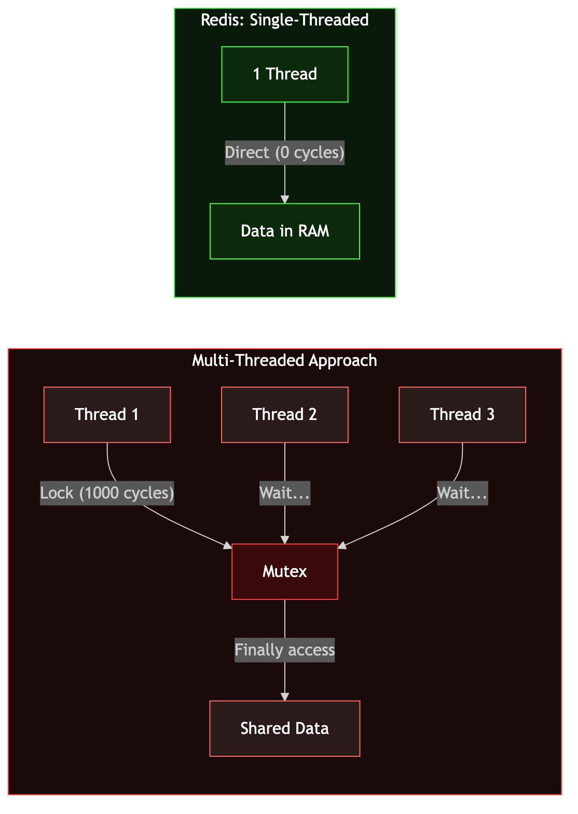
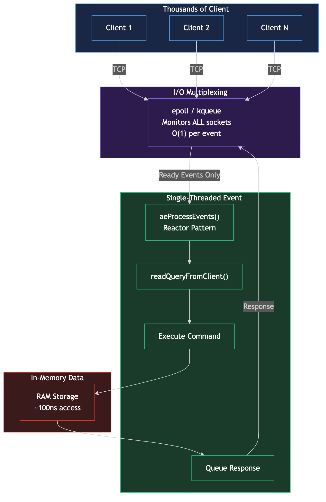
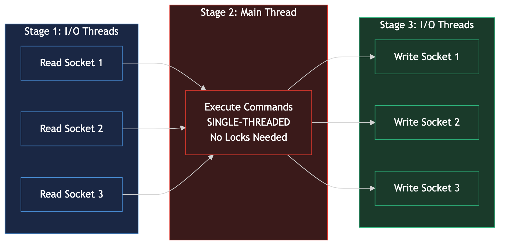

# How Redis Handles 100,000 Operations Per Second on a Single Thread

## The Hook

Redis processes over 100,000 operations per second — on a single thread, with zero locks. With pipelining, it hits **1.5 million ops/sec** on a MacBook Air. How does a single-threaded system outperform multi-threaded databases? The answer lies in three engineering decisions that most developers never think about.

---

## The Myth: More Threads = More Speed

Most developers have the same instinct — if you want more speed, add more threads. It seems obvious. But for an in-memory data store like Redis, multi-threading would actually make things **slower**. Here's why.

### The Lock Tax

Multi-threaded systems need synchronization. When two threads try to modify the same data, you need a lock (mutex) to prevent corruption. The cost?

| Operation | CPU Cycles |
|-----------|-----------|
| Non-atomic increment | 1–2 cycles |
| Atomic increment (uncontended) | 40–100 cycles |
| Uncontended mutex lock | 100–1,000 cycles |
| **Contended mutex lock** | **10,000+ cycles** |

A single Redis command (GET, SET, INCR) completes in **microseconds**. A contended mutex lock costs 10,000+ CPU cycles — that's more than the operation itself. You'd spend more time managing locks than doing actual work.

### Amdahl's Law Kills Parallelism

Not all of Redis's work can be parallelized. With approximately 30% of operations being parallelizable:

| Threads | Theoretical Speedup |
|---------|-------------------|
| 2 | 1.18x |
| 4 | 1.29x |
| 8 | 1.36x |
| 32 | 1.42x |

Compare this to horizontal scaling with Redis Cluster (8 nodes): **7.89x** throughput. Sharding wins decisively over multi-threading.

### Cache Line Ping-Pong

Single-threaded Redis keeps frequently accessed data in L1/L2 CPU cache (**1–4ns access**). With multiple threads, modifying shared data causes cache line invalidation across cores, forcing main memory fetches (**60–100ns**) — a two-order-of-magnitude penalty.



---

## How Redis Actually Works: The Reactor Pattern

Redis implements the **Reactor Pattern** — a design pattern where a single thread runs an event loop that monitors thousands of connections simultaneously and processes them one at a time.

### The Event Loop Architecture

Redis doesn't use `libevent` or `libev`. It has its own custom event library (`ae.c`) that's only ~800 lines of code.

The core loop:

```
1. Server starts listening on port 6379
2. Register listening socket with epoll (AE_READABLE event)
3. Loop forever:
   a. Call epoll_wait() → blocks until events arrive
   b. For each ready socket:
      - New connection? → Accept, register client socket
      - Data arrived? → Read command, execute, queue response
      - Socket writable? → Send response
   c. Process time events (serverCron — maintenance tasks)
```

### I/O Multiplexing: The Secret Weapon

The key is `epoll` (Linux) or `kqueue` (macOS/BSD). These kernel syscalls let one thread monitor **thousands of file descriptors simultaneously** with O(1) performance. Redis selects the best option at compile time:

```
Priority: evport (Solaris) > epoll (Linux) > kqueue (BSD/macOS) > select (fallback)
```

`epoll` uses a red-black tree internally and returns **only the ready file descriptors** — no scanning all connections. This is why one Redis thread can handle 60,000+ simultaneous connections.

### How It Processes Commands

When data arrives on a socket:
1. `readQueryFromClient()` fires — reads the raw bytes
2. RESP protocol parser decodes the command (simple text protocol, cheap to parse)
3. Command executes against in-memory data structures
4. Response queued for the write handler
5. Write handler sends response on next loop iteration

All of this happens in the same thread, sequentially. No context switches, no locks, no race conditions.



---

## Three Reasons Redis Is So Fast

### 1. Everything in RAM — Zero Disk I/O

The most fundamental reason: Redis stores the **entire dataset in memory**. RAM access is ~100ns. Disk access (SSD) is ~100,000ns. That's a **1,000x difference**.

While disk-based databases like PostgreSQL spend most of their time waiting for I/O, Redis never waits. Every read is a memory lookup. Every write is a memory mutation.

### 2. Single Thread = Zero Lock Contention

With one thread modifying data, every operation is **atomic by design**:
- `INCR counter` — no lock needed, it's the only thread
- `LPUSH queue item` — no race condition possible
- `MULTI/EXEC` transactions — naturally serialized

This eliminates an entire class of bugs (deadlocks, livelocks, race conditions) and removes the CPU overhead of synchronization primitives.

### 3. Custom Data Structures Optimized for Memory

Redis doesn't use standard library data structures. It has purpose-built implementations:

**SDS (Simple Dynamic Strings)**
- O(1) string length (stored in header, not strlen() scan)
- Binary-safe (works with `\0` bytes)
- Pre-allocates extra space to avoid repeated `realloc()` calls
- If new length < 1MB → allocate 2x. If >= 1MB → allocate +1MB extra.

**Skiplist (Sorted Sets)**
- O(log n) search, insert, delete
- Only 1.33 pointers per node (vs 2 for balanced trees)
- Range queries (`ZRANGEBYSCORE`) are naturally efficient — just walk forward at level 0
- Probability p = 1/4, max 32 levels

**Listpack (Redis 7.0+, replaced ziplist)**
- Contiguous memory block — extremely cache-friendly
- Each entry stores its own length (not previous entry's length)
- Eliminated the "cascading update" bug from ziplist
- Used for small hashes, lists, and sets

**Intset (Integer Sets)**
- Sorted array of integers with binary search
- Three encodings: 16-bit, 32-bit, 64-bit (auto-upgrades)
- Used when a Set has <= 512 integer-only elements

**Quicklist (Lists)**
- Doubly linked list of listpacks
- Interior nodes can be LZF-compressed to save memory
- Head/tail uncompressed for fast LPUSH/RPUSH/LPOP/RPOP

---

## The Nuance: Redis 6.0+ Threaded I/O

Redis isn't purely single-threaded anymore. Starting with Redis 6.0, **I/O operations** (socket reads and writes) can be offloaded to multiple threads. But **command execution remains single-threaded**.

### The Three-Stage Pipeline

```
Stage 1: I/O Threads READ client requests + PARSE RESP protocol
Stage 2: Main Thread EXECUTES all commands (single-threaded, no locks)
Stage 3: I/O Threads WRITE responses back to clients
```

Clients are distributed across I/O threads using round-robin assignment.

### Configuration

```
io-threads 4              # Number of I/O threads (default: 1 = disabled)
io-threads-do-reads yes   # Enable threaded reads (default: no)
```

Recommendation: set `io-threads` to ~75% of total vCPUs. More than 4 threads often shows diminishing returns.

### Redis 8.0: Even Faster

Redis 8.0 introduced a completely new async I/O threading implementation:
- **37% to 112% throughput improvement** with 8 I/O threads
- Latency improvements across 90 out of 149 benchmark tests
- Latency reduction range: 5.4% to 87.4% (median 16.7%)

The genius: applications don't need any code changes. The threading is entirely transparent.



---

## Official Benchmark Numbers

From redis.io benchmark documentation:

| Setup | Command | Throughput |
|-------|---------|-----------|
| MacBook Air (pipelining=16) | GET | **1,811,594 req/sec** |
| MacBook Air (pipelining=16) | SET | **1,536,098 req/sec** |
| Linux bare-metal (no pipelining, 50 clients) | SET | **180,180 req/sec** |
| Linux bare-metal (no pipelining, 50 clients) | LPUSH | **188,324 req/sec** |

The commonly cited "100K+ ops/sec" is a **conservative baseline** for commodity hardware without pipelining. With pipelining, throughput exceeds 1.5 million ops/sec.

Key performance factors:
- **Pipelining** is the single most impactful optimization
- **Unix sockets** give ~50% more throughput than TCP loopback on Linux
- **Data size** barely matters below Ethernet MTU (~1500 bytes) — 10 bytes vs 1000 bytes produce nearly identical throughput
- At **30,000 connections**, throughput drops to ~50% of what 100 connections achieve

---

## Summary

| Question | Answer |
|----------|--------|
| Why single-threaded? | CPU isn't the bottleneck. Locks cost more than operations. Cache stays warm. |
| How does it handle many connections? | Reactor Pattern + epoll/kqueue I/O multiplexing |
| Why is it so fast? | In-memory + zero locks + custom data structures |
| Is it still single-threaded? | Command execution: yes. I/O: multi-threaded since 6.0 |
| Real throughput? | 100K+ without pipelining, 1.5M+ with pipelining |

The lesson: **single-threaded doesn't mean slow. It means no contention.** Redis proves that the right architecture beats brute-force parallelism.

---

## Reel Script

| Scene | Duration | On-Screen (English) | Voiceover (Hindi/Hinglish) |
|-------|----------|-------------------|--------------------------|
| Hook | 5.5s | "100,000 ops/sec · 1 Thread · 0 Locks" | Redis EK LAKH operations handle karta hai per second. EK thread pe. ZERO locks. |
| Myth Busted | 10s | "More Threads = More Speed? WRONG" + lock cost comparison | Log sochte hain zyada threads matlab zyada speed. WRONG. Ek mutex = 1000 cycles. Redis command = microseconds. |
| Event Loop | 12.5s | Architecture flow diagram: Clients → epoll → Event Loop → RAM | Reactor Pattern. Ek thread, ek event loop. epoll se HAZAARON connections monitor. Sirf ready process. |
| 3 Secrets | 12s | Three cards: RAM / No Locks / Data Structures | Teen reasons — RAM, zero locks, custom data structures. |
| Plot Twist | 10s | "Redis 6.0+ I/O Threading" pipeline diagram | Redis 6.0 se I/O threads add hue. Commands still single-threaded. 112% tak faster. |
| CTA | 7s | Comment "REDIS" + Follow @techvijayforyou | Comment REDIS karo, full doc mil jaayega. |

---

## References

1. [Redis Event Library Internals](https://redis.io/docs/latest/operate/oss_and_stack/reference/internals/internals-rediseventlib/) — Official Redis docs on ae.c event loop
2. [Redis Benchmark Documentation](https://redis.io/docs/latest/operate/oss_and_stack/management/optimization/benchmarks/) — Official throughput numbers
3. [Redis SDS Internals](https://redis.io/docs/latest/operate/oss_and_stack/reference/internals/internals-sds/) — Official SDS documentation by Salvatore Sanfilippo
4. [Diving Into Redis 6.0](https://redis.io/blog/diving-into-redis-6/) — Official blog on threaded I/O
5. [Redis 8.0-M03 Performance](https://redis.io/blog/redis-8-0-m03-is-out-even-more-performance-new-features/) — Official Redis 8.0 I/O threading benchmarks
6. [RESP Protocol Specification](https://redis.io/docs/latest/develop/reference/protocol-spec/) — Official protocol docs
7. [The Engineering Wisdom Behind Redis's Single-Threaded Design](https://riferrei.com/the-engineering-wisdom-behind-rediss-single-threaded-design/) — Ricardo Ferreira's analysis
8. [Listpack Specification](https://github.com/antirez/listpack/blob/master/listpack.md) — Antirez's listpack design doc
9. [Redis Source Code: ae.c](https://github.com/redis/redis/blob/unstable/src/ae.c) — I/O multiplexing selection logic

---

*#redis #systemdesign #softwareengineer #coding #tech #performance #database #architecture #eventloop #singlethreaded*
