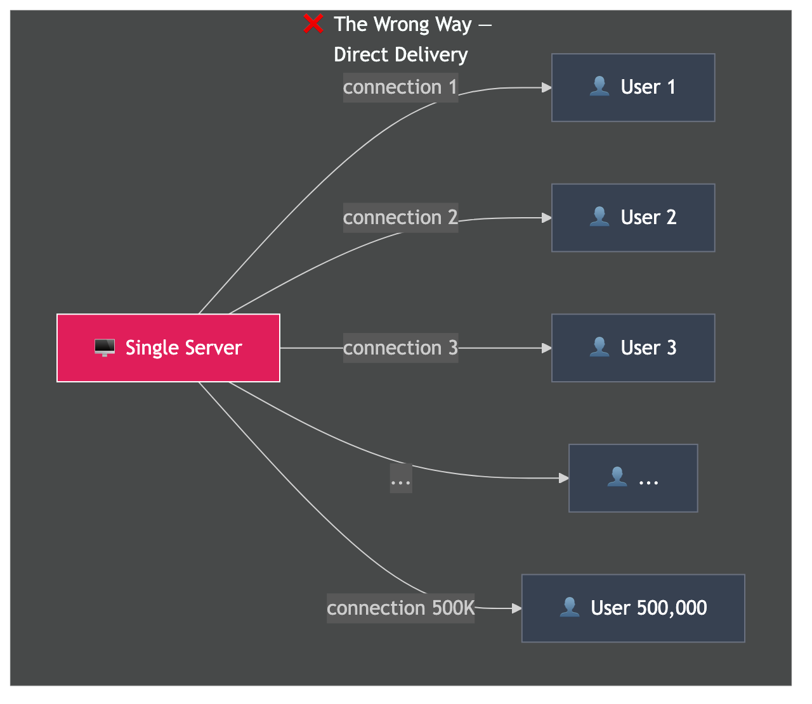
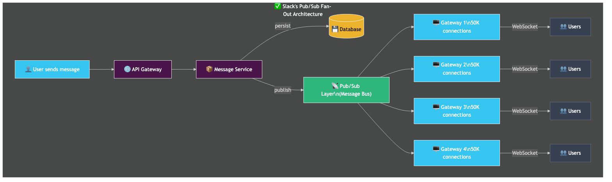
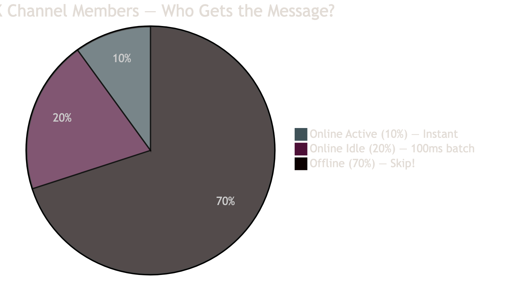
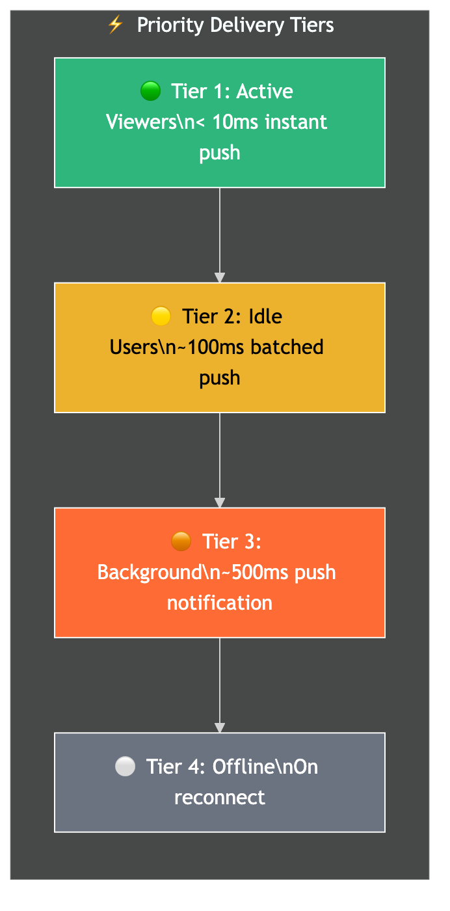
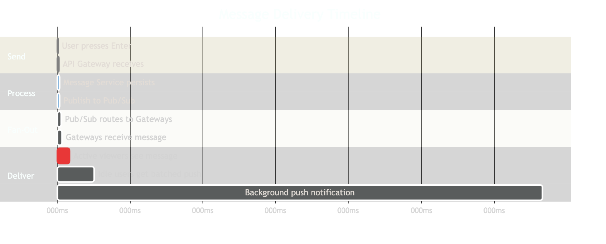

# How Slack Sends 1 Message to 500,000 People in Under 1 Second

## The Real Engineering Behind Slack's Messaging System

*You type one message in a 500K-member channel. Everyone sees it instantly. Here's exactly how that works.*

---

## The Problem

Think about it - you're in a Slack channel with 500,000 members. You type "Hey team, deployment is done!" and hit enter.

Within **1 second**, every single online person in that channel sees your message.

How? Let's break it down from the wrong approach to the actual architecture Slack uses.

---

## The Wrong Way: Direct Delivery

The most obvious approach - server sends the message directly to each user:



**Why this fails:**

| Problem | What Happens |
|---------|-------------|
| 500K TCP connections | Server runs out of file descriptors |
| Sequential delivery | Last user gets message minutes later |
| Single point of failure | Server crashes = nobody gets anything |
| Memory explosion | Each connection holds state in RAM |

A single server can handle roughly **10K-50K concurrent WebSocket connections** before it starts choking. At 500K, you'd need a fundamentally different approach.

```
0ms:     Message sent
10ms:    Server starts delivering to User 1, 2, 3...
500ms:   Server at 60% CPU, 10K users delivered
2s:      Memory at 90%, connections timing out
5s:      Server unresponsive
10s:     💥 Crash. 490K users got nothing.
```

---

## How Slack Actually Does It: Pub/Sub Fan-Out Architecture

Slack's real-time messaging is built on a **layered fan-out system**. No single server ever talks to all 500K users. Instead, the work is divided across multiple layers.

### The Architecture



### Step-by-Step Breakdown

#### Step 1: Message Hits the Message Service

When you send a message, it goes to the **Message Service**. This service does two things simultaneously:

```
Message Service receives "Hey team, deployment is done!"
    │
    ├──► Write to Database (persistent storage)
    │    └── INSERT INTO messages (channel_id, user_id, text, ts)
    │
    └──► Publish to Message Bus
         └── Topic: channel_C0500K
             Payload: {msg_id, channel_id, text, sender, timestamp}
```

The write to database and the publish to the message bus happen **in parallel**. The user gets confirmation as soon as both succeed.

#### Step 2: Channel Service Determines Recipients

Slack maintains a **Channel Service** (internally called something like Flannel) that knows:
- Which users are in channel `C0500K`
- Which Gateway server each user is connected to
- Whether each user is **online**, **idle**, or **offline**

```
┌──────────────────────────────────────────────────┐
│              CHANNEL SERVICE                      │
│                                                   │
│  Channel C0500K:                                  │
│  ├── Total members: 500,000                       │
│  ├── Online (active):  50,000  (10%)  → INSTANT   │
│  ├── Online (idle):   100,000  (20%)  → BATCHED   │
│  └── Offline:         350,000  (70%)  → SKIP      │
│                                                   │
│  Gateway mapping:                                 │
│  ├── GW-1: 18,000 members connected              │
│  ├── GW-2: 15,000 members connected              │
│  ├── GW-3: 22,000 members connected              │
│  ├── GW-4: 20,000 members connected              │
│  └── ... (more gateway servers)                   │
└──────────────────────────────────────────────────┘
```

This data is **cached at the edge** - it doesn't query a database every time. Channel membership is stored in a fast, in-memory data structure that's replicated across multiple servers.

#### Step 3: Fan-Out to Gateway Servers

The Pub/Sub layer routes the message to **only the Gateway servers that have connected members** of this channel. If a Gateway server has zero users from channel `C0500K`, it never sees this message.

```
Pub/Sub receives message for channel C0500K
    │
    ├──► GW-1 has 18K members of this channel  ──► Send
    ├──► GW-2 has 15K members of this channel  ──► Send
    ├──► GW-3 has 22K members of this channel  ──► Send
    ├──► GW-4 has 20K members of this channel  ──► Send
    ├──► GW-5 has 0 members of this channel    ──► SKIP
    └──► ...
```

Each Gateway server receives **one copy** of the message and then delivers it to all its locally connected channel members.

#### Step 4: Gateway Delivers via WebSocket

Each Gateway server maintains persistent **WebSocket connections** with clients. When it receives the message from the Pub/Sub layer, it:

1. Looks up which of its local connections belong to channel `C0500K`
2. Pushes the message to each connection
3. This is a **local, in-memory operation** - extremely fast

```
GW-1 receives message
    │
    ├── Local lookup: 18,000 connections for C0500K
    │
    ├── Push to Connection #1 ──► WebSocket frame sent
    ├── Push to Connection #2 ──► WebSocket frame sent
    ├── Push to Connection #3 ──► WebSocket frame sent
    └── ... x 18,000

    Time: ~50ms for all 18K local pushes
```

Since WebSocket push is just writing a frame to an already-open TCP connection, each push takes **microseconds**. 18,000 pushes take about 50ms.

---

## Optimization 1: The Offline Trick (Skip 60-70% of Work)

This is the biggest optimization. In a 500K-member channel, at any given time:

- **~10% are actively viewing** the channel (50K users)
- **~20% have the app open** but are in a different channel (100K users)
- **~70% are offline** - phone in pocket, laptop closed (350K users)



**Instead of delivering to 500K users, Slack only delivers to ~150K in real-time.**

That's a **70% reduction** in work.

### What Happens When an Offline User Comes Back?

When a user opens Slack after being offline:

```
User opens Slack app
    │
    ▼
┌──────────────────┐
│ Client connects   │   Establishes WebSocket to a Gateway
│ to Gateway        │
└────────┬─────────┘
         │
         ▼
┌──────────────────┐
│ Client sends      │   "Last message I saw in C0500K was at
│ sync request      │    timestamp 1706000000"
└────────┬─────────┘
         │
         ▼
┌──────────────────┐
│ Message Service   │   Queries: SELECT * FROM messages
│ fetches missed    │   WHERE channel_id = 'C0500K'
│ messages          │   AND ts > 1706000000
└────────┬─────────┘   ORDER BY ts ASC
         │             LIMIT 100
         ▼
┌──────────────────┐
│ Client receives   │   Gets all missed messages at once
│ batch of messages │   Renders them in the chat
└──────────────────┘
```

The user gets **all missed messages in one batch** when they reconnect. From the user's perspective, it looks like instant delivery.

---

## Optimization 2: Priority Batching

Not all online users need the message at the exact same millisecond. Slack uses **priority tiers**:



| Tier | Users | Latency | Method |
|------|-------|---------|--------|
| **1. Active Viewers** | Looking at channel right now | < 10ms | Individual WebSocket push |
| **2. Idle Users** | App open, different channel | ~100ms | Batched WebSocket push |
| **3. Background** | App minimized/background | ~500ms-2s | Push notification (APNS/FCM) |
| **4. Offline** | Not connected | On reconnect | Batch fetch from DB |

### Why 100ms Batching Matters

If 5 messages arrive in a channel within 100ms (common in active channels), instead of sending 5 separate WebSocket frames to each idle user, Slack sends **1 batched frame** containing all 5 messages.

```
Without batching (5 messages, 100K idle users):
    5 × 100,000 = 500,000 WebSocket pushes

With batching (same scenario):
    1 × 100,000 = 100,000 WebSocket pushes

    Result: 80% fewer network operations
```

Nobody notices a 100ms delay, but the server does **80% less work**.

---

## Optimization 3: Connection Multiplexing

A single Gateway server doesn't open one connection per channel per user. Instead, each user has **one WebSocket connection** that carries messages for **all their channels**.

```
┌────────────────────────────────────────────────────┐
│                 ONE WebSocket Connection            │
│                 User → Gateway Server               │
│                                                     │
│  Carries messages for:                              │
│  ├── #general          (500K members)               │
│  ├── #engineering      (2K members)                 │
│  ├── #random           (100K members)               │
│  ├── DM with @alice                                 │
│  ├── DM with @bob                                   │
│  └── 15 other channels                              │
│                                                     │
│  Total: 1 connection handles ALL channels           │
│  NOT 1 connection per channel!                      │
└────────────────────────────────────────────────────┘
```

This means a Gateway server with 50K connections is serving 50K **users**, not 50K channels. Each user might be in hundreds of channels, all multiplexed over that single connection.

---

## The Complete Timeline

Here's what happens from the moment you press Enter to everyone seeing your message:



| Stage | Time | What Happens |
|-------|------|-------------|
| Send | 0-2ms | You press Enter → API Gateway receives |
| Process | 5-10ms | Message Service persists + publishes to Pub/Sub |
| Fan-Out | 10-20ms | Pub/Sub routes to Gateway servers |
| **Tier 1** | **20-50ms** | **Active viewers see the message instantly** |
| Tier 2 | 100-150ms | Idle users receive batched WebSocket push |
| Tier 3 | 500ms-2s | Background users get push notification (APNS/FCM) |
| Tier 4 | On reconnect | Offline users fetch missed messages |

**Total time for active users: ~50ms. Perceived by humans: INSTANT.**

---

## Key Design Decisions That Make This Work

### 1. Fan-Out on Write, Not on Read

Slack pushes messages **when they're sent** (write-time fan-out), not when users check for updates (read-time fan-out).

```
Fan-Out on WRITE (What Slack does):
    Message sent → immediately pushed to all online users
    ✅ Low latency for receivers
    ✅ No polling needed
    ❌ More work at write time (but amortized across gateway servers)

Fan-Out on READ (What email does):
    Message stored → user checks inbox → fetches new messages
    ✅ Less work at write time
    ❌ Higher latency (depends on poll interval)
    ❌ Wastes bandwidth with empty polls
```

### 2. Sharded Channel Membership

Channel membership data is **sharded** across multiple servers. A 500K-member channel doesn't live on one machine.

```
Channel C0500K membership sharded by user_id hash:

    Shard 0: Users 0-49,999      → Server A
    Shard 1: Users 50,000-99,999 → Server B
    Shard 2: Users 100K-149,999  → Server C
    ...
    Shard 9: Users 450K-500K     → Server J

    Each shard independently resolves: user → gateway server
    All shards work IN PARALLEL
```

### 3. Persistent Connections with Heartbeats

Gateway servers know if a user is online through **heartbeat messages**:

```
Client ──── ping ───► Gateway     (every 30 seconds)
Client ◄─── pong ──── Gateway

If no ping for 60 seconds → mark user as offline
    → Stop sending real-time messages
    → Switch to push notification path
    → Free up connection resources
```

### 4. Edge Caching with Flannel

Slack built an edge caching system (called **Flannel**) that stores frequently accessed data close to Gateway servers:

```
┌──────────────────────────────────────────────────┐
│                  FLANNEL (Edge Cache)              │
│                                                   │
│  Cached per Gateway server:                       │
│  ├── Channel membership lists                     │
│  ├── User presence status (online/offline/idle)   │
│  ├── Channel metadata (name, topic, settings)     │
│  └── User profiles (name, avatar, status)         │
│                                                   │
│  Cache hit rate: >95%                             │
│  Latency: <1ms (local memory lookup)              │
│                                                   │
│  Without Flannel: Gateway → DB query → 10-50ms    │
│  With Flannel: Gateway → local cache → <1ms       │
└──────────────────────────────────────────────────┘
```

---

## Scaling Numbers

Here's what Slack's infrastructure roughly looks like for real-time messaging:

| Component | Count | Role |
|-----------|-------|------|
| Gateway Servers | 100-500+ | Handle WebSocket connections |
| Connections per Gateway | 50K-100K | Multiplexed user connections |
| Message Service | Replicated | Persistence + Pub/Sub publishing |
| Pub/Sub Brokers | Clustered | Message distribution (Kafka-like) |
| Channel Service / Flannel | Sharded + cached | Membership lookups |
| Database | Sharded | Message persistence |

### Why It Scales

```
Adding more users?
    → Add more Gateway servers
    → Each handles its own 50K connections
    → Pub/Sub automatically routes to new servers

Adding more channels?
    → Channel membership data is already sharded
    → More shards = more parallel lookups

Adding more messages?
    → Pub/Sub handles higher throughput
    → Gateway servers batch more aggressively
    → Database write path is independent of real-time delivery
```

---

## Comparison: Slack vs. Naive Approach

| Aspect | Naive (Direct) | Slack (Pub/Sub Fan-Out) |
|--------|---------------|------------------------|
| Connections | 500K from one server | 50K per gateway, distributed |
| Delivery time | Minutes (sequential) | <50ms (parallel) |
| Offline users | Still tries to send | Skips entirely (70% saved) |
| Server failure | Everyone disconnected | Only 50K affected, others fine |
| Scaling | Buy bigger server | Add more gateway servers |
| Batching | None | 100ms batching for idle users |
| Memory | All state on one machine | State distributed across cluster |

---

## Summary

```
╔══════════════════════════════════════════════════════════════════╗
║                 HOW SLACK DELIVERS MESSAGES                      ║
╚══════════════════════════════════════════════════════════════════╝

1. MESSAGE SERVICE
   → Persist to DB + Publish to Pub/Sub (parallel)

2. CHANNEL SERVICE
   → Look up: who's in this channel?
   → Which gateway server is each user connected to?
   → Cache this at the edge (Flannel)

3. PUB/SUB FAN-OUT
   → Route message to ONLY relevant gateway servers
   → Skip gateways with zero channel members

4. GATEWAY DELIVERY
   → Each gateway pushes to its local connections
   → WebSocket frame = microseconds per user

5. SMART OPTIMIZATIONS
   → Skip offline users (70% reduction)
   → Batch for idle users (80% fewer pushes)
   → Priority tiers (active < idle < background < offline)
   → Connection multiplexing (1 connection = all channels)

RESULT: 500K members, <50ms for active users, <150ms for all online
╚══════════════════════════════════════════════════════════════════╝
```

---

## Reel Script (Speaking Points)

Use these points while recording the face cam. Speak naturally in Hindi - the animated visuals cover the technical details.

| Time | Scene | What to Say |
|------|-------|-------------|
| 0-3s | Hook | "Slack mein ek message bhejo, 5 lakh logon ko 1 second mein mil jaata hai. Kaise? Batata hoon." |
| 3-8s | Wrong Way | "Seedha approach - server se har user ko individually bhejo. 5 lakh connections? Server crash ho jayega." |
| 8-20s | Pub/Sub | "Slack use karta hai Pub/Sub fan-out. Message ek queue mein jaata hai, wahan se multiple worker servers mein fan-out hota hai, aur har worker apne connected users ko deliver karta hai. Parallel." |
| 20-32s | Offline Trick | "Sabse smart trick - 70% users offline hote hain. Unko message bhejte hi nahi. Jab wapas aayenge, tab cache se mil jayega. 70% bandwidth saved." |
| 32-42s | Batching | "Active users ko instantly milta hai. Idle users ko 100ms baad batch mein milta hai. 100ms ka difference - koi notice nahi karta, but server pe 80% load kam." |
| 42-48s | CTA | "Agar ye helpful laga, comment mein 'SLACK' likho. Follow karo, aur aisi system design reels milti rahengi." |

---

## References

- [Slack Engineering Blog - Real-Time Messaging](https://slack.engineering/)
- [Flannel: Slack's Edge Cache](https://slack.engineering/flannel-an-application-level-edge-cache-to-make-slack-scale/)
- [Scaling Slack's Message Queue](https://slack.engineering/scaling-slacks-job-queue/)
- [WebSocket Protocol - RFC 6455](https://datatracker.ietf.org/doc/html/rfc6455)
- [Apache Kafka Documentation](https://kafka.apache.org/documentation/)

---

*Found this useful? Follow [@techvijayforyou](https://instagram.com/techvijayforyou) for more system design breakdowns!*

**Author:** Vijay
**Handle:** @techvijayforyou
**Topic:** System Design — Real-Time Messaging at Scale

---

#SystemDesign #Slack #PubSub #Messaging #WebSocket #ScaleArchitecture #Engineering #RealTime
