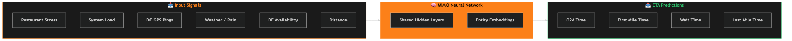
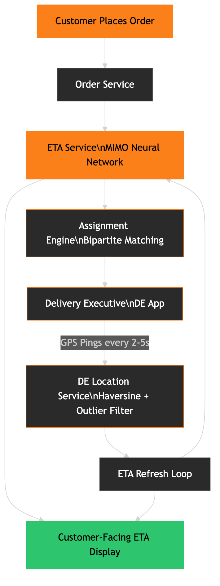

# Swiggy's "32 Minutes" Is Not a GPS Calculation — It's a Machine Learning Model

> **Every time you order on Swiggy, you see a delivery time before a delivery partner is even assigned. GPS only knows distance. So how does Swiggy know the time?**

---

## The Wrong Assumption Most People Make

When you open Swiggy and see "32 minutes," most people assume:

- Swiggy checks the restaurant's GPS coordinates
- Checks your GPS coordinates
- Calculates distance
- Divides by average speed → estimated time

This is **wrong**.

GPS gives you distance. It doesn't know:
- How many delivery partners are available right now in that zone
- Whether it's raining at 8 PM in Bangalore
- How backed-up that specific restaurant's kitchen is right now
- How stressed the Swiggy platform is (millions of orders at dinner rush)

Swiggy's ETA system uses **machine learning** that ingests 20+ real-time signals. GPS coordinates are just one of them.

---

## The Four-Leg Model (Verified — Swiggy Engineering Blog)

Swiggy breaks total delivery time into exactly **four sequential legs**. Each leg has its own ML sub-model.

| Leg | Name | What It Measures |
|-----|------|-----------------|
| **O2A** | Ordered to Assignment | Time from order placed → Delivery Executive (DE) assigned |
| **FM** | First Mile | Time from DE assignment → DE arrives at restaurant |
| **WT** | Wait Time | Time DE waits at restaurant for food to be ready |
| **LM** | Last Mile | Time from food pickup → delivered to customer's door |

**Total ETA = O2A + FM + WT + LM**

This decomposition is critical. It means each stage is independently predicted using the signals that are actually relevant to that stage — not a single black box estimating "total time."

---

## What Goes Into Each Sub-Model

### O2A — Before Anyone Is Assigned

The O2A model runs **before** a delivery partner is assigned. It predicts how long that assignment will take based on:

- Number of available DEs in the zone right now
- Average distance of available DEs from the restaurant
- **System stress** (overall platform load — are millions of orders firing simultaneously?)
- **Restaurant stress** (is that specific restaurant overwhelmed with 50 orders right now?)
- Weather conditions (rain increases demand but reduces DE availability)

### First Mile — After Assignment

Once a DE is assigned, the FM model takes over. It predicts how long the DE will take to reach the restaurant, using:
- DE's GPS location at time of assignment
- Current route conditions
- Real-time GPS ping data as the DE moves

### Wait Time — The Hardest Prediction

WT is the most variable and hardest to predict. It depends on:
- Restaurant's current kitchen load (restaurant stress)
- Type of dishes ordered (a pizza takes longer than packaged items)
- Time of day (lunch and dinner rush have non-linear prep time increases)
- Historical preparation patterns for that specific restaurant

### Last Mile — The Final Stretch

LM predicts from restaurant → customer's door:
- DE's real-time GPS ping data classified into time windows
- **Haversine distance** between successive GPS pings to calculate current DE speed
- Haversine distance between DE's latest coordinates and customer's drop location
- Route complexity (is the customer in a gated society, a high-rise, etc.)

---

## The MIMO Neural Network (Verified — Swiggy Engineering Blog)

Swiggy initially used **gradient boosting trees** (the standard industry approach). They switched to a **MIMO — Multi-Input, Multi-Output — deep neural network** supplemented with **entity embeddings**.

Why MIMO? Because the four legs are **interdependent**. O2A affects when the FM starts. FM affects when WT begins. Predicting them separately ignores these dependencies. Training them jointly in one network lets the model learn these relationships.

**Measured results from Swiggy's blog:**
- **~50% reduction** in training memory footprint (shared hidden layers across all four predictions)
- Training time dropped to **nearly a fifth** of previous
- **~30% improvement in MAE** for O2A predictions specifically
- Better exception management — when a DE assignment takes longer than predicted, the system can more accurately flag and escalate

Evaluation uses two metrics:
1. **MAE (Mean Absolute Error)** — primary accuracy metric
2. **Sudden ETA jumps** — even if final delivery is on-time, a sudden spike in ETA display causes customer anxiety. Minimizing these is a secondary objective.

---

## Pre-Order Prediction: The Number You See Before Placing the Order

There's a separate model that runs even before you place the order — what you see on the restaurant listing page.

This model predicts delivery time at the **cart stage**, using:
- Type of dishes (complex vs. simple prep)
- DE availability in the area
- Distance from restaurant to your location
- Time of day / meal peak patterns
- Historical prep time patterns for that restaurant

This is necessarily less accurate than the post-order model (no DE is assigned yet). But it's what Swiggy shows to help you decide whether to order.

---

## The Assignment Engine: JIT and Bipartite Matching

The ETA predictions aren't just for display. They **drive the assignment engine** that decides which DE gets which order.

Key algorithms (verified from Swiggy Bytes):

### JIT — Just-In-Time Assignment

Instead of assigning a DE immediately when you place an order, Swiggy uses **JIT Assignment**: dispatch the DE so they arrive at the restaurant **just as food is ready**, not before.

Why? If the DE arrives 10 minutes before food is ready, they wait — wasting time and reducing how many orders they can take. JIT uses the FM and WT predictions to calculate the optimal dispatch time.

### NOA — Next Order Assignment

While a DE is delivering one order, the system assigns their **next order** before they finish. This minimizes idle time between orders and increases the pool of DEs eligible for new orders.

### Bipartite Matching

The assignment is not just "give the nearest DE to the nearest restaurant." It uses a **bipartite matching algorithm** where:
- Left set: open orders
- Right set: available DEs
- Edges: scored by predicted ETA quality, proximity, and DE load

The algorithm finds the globally optimal assignment across the entire network at each tick, not local greedy matching.

---

## Architecture Overview

**Key components:**

1. **Order Service** — receives order, fires `OrderPlaced` event
2. **ETA Service** — MIMO model inference, returns O2A + FM + WT + LM predictions
3. **Assignment Engine** — bipartite matching using ETA predictions, assigns DE with JIT timing
4. **DE Location Service** — receives GPS pings from DE app every 2–5 seconds, filters outliers, computes Haversine speed
5. **ETA Refresh Loop** — re-runs LM predictions as DE moves, updates customer-facing ETA smoothly (avoids sudden jumps)

The DE app itself (verified from Swiggy Bytes) runs as a background process for **4–5 hours per session**, interfacing with GPS, Bluetooth, and network to send location pings.

---

## GPS vs. ML: Signal Comparison

| Signal | GPS Knows | ML Model Knows |
|--------|-----------|---------------|
| Restaurant location | ✅ | ✅ |
| Customer location | ✅ | ✅ |
| Straight-line distance | ✅ | ✅ |
| Number of DEs in zone | ❌ | ✅ |
| Restaurant kitchen load | ❌ | ✅ |
| Platform-wide demand | ❌ | ✅ |
| Rain / weather | ❌ | ✅ |
| DE rejection probability | ❌ | ✅ |
| Historical prep times | ❌ | ✅ |
| Current DE speed (Haversine) | ❌ | ✅ |

---

## What's Next (From Swiggy's Blog)

Swiggy has published what they are actively exploring:
- **RNN / LSTM models** for temporal sequence patterns across an order's lifecycle
- **Graph Neural Networks (GNNs)** to enhance last-mile prediction (modelling road networks as graphs)
- **Point of Interest (POI) features** — knowing a DE must pass through a congested market or narrow lane
- Better **DE rejection probability** modeling for long-tail events

---

## Key Takeaways

1. **ETA = O2A + FM + WT + LM** — four separate ML predictions, not one calculation
2. **GPS is one input, not the algorithm** — Swiggy ingests 20+ real-time signals
3. **MIMO neural network** lets all four predictions share learning — 30% MAE improvement, 5x faster training
4. **JIT Assignment** means DEs are dispatched to minimize wait time at the restaurant, not maximize speed of assignment
5. **ETA drives operations** — it's not just a display number; it controls the bipartite matching that routes every delivery

---

## References

- [How ML Powers — When is my order coming? Part I — Swiggy Bytes](https://bytes.swiggy.com/how-ml-powers-when-is-my-order-coming-part-i-4ef24eae70da)
- [How ML Powers — When is my order coming? Part II — Swiggy Bytes](https://bytes.swiggy.com/how-ml-powers-when-is-my-order-coming-part-ii-eae83575e3a9)
- [Predicting Food Delivery Time at Cart — Swiggy Bytes](https://bytes.swiggy.com/predicting-food-delivery-time-at-cart-cda23a84ba63)
- [The Swiggy Delivery Challenge Part One — Swiggy Bytes](https://bytes.swiggy.com/the-swiggy-delivery-challenge-part-one-6a2abb4f82f6)
- [The Swiggy Delivery Challenge Part Two — Swiggy Bytes](https://bytes.swiggy.com/the-swiggy-delivery-challenge-part-two-f095930816e3)
- [Architecture and Design Principles Behind Swiggy's Delivery Partners App — Swiggy Bytes](https://bytes.swiggy.com/architecture-and-design-principles-behind-the-swiggys-delivery-partners-app-4db1d87a048a)

---

*Comment "SWIGGY" on the Instagram reel to get this full breakdown doc.*
