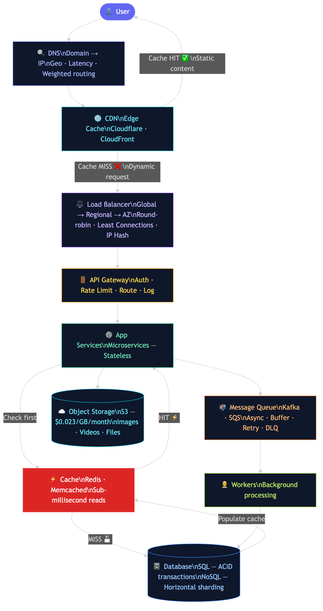
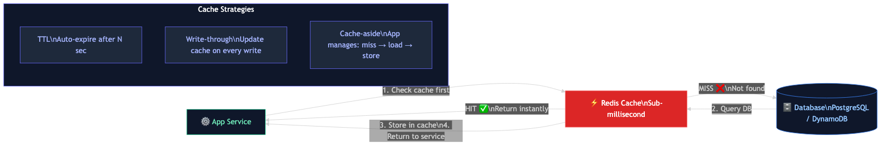
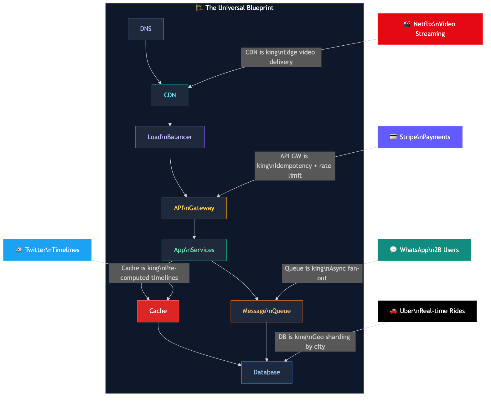

# Every System Design Follows The Same Blueprint

> Comment **HLD** below to get this doc. Or comment **LINK** for any previous doc.

Whether you're designing Netflix, Uber, WhatsApp, or Stripe — the skeleton is always the same 7 layers. The difference is only which layer gets the most stress, and why. Once you understand this blueprint, every system design interview becomes much more approachable.



---

## The 7 Layers — In Order of Every Request

### Layer 1: DNS

Every request starts here. When you type `netflix.com`, your device queries DNS to resolve that domain to an IP address.

DNS is more than just a phonebook. Modern DNS supports routing policies:
- **Geolocation routing** — route Indian users to Mumbai servers, US users to Virginia
- **Latency-based routing** — route to the region that gives minimum latency
- **Weighted routing** — send 90% traffic to primary, 10% to canary deployment
- **Failover routing** — automatically redirect if primary region is down

Tools: AWS Route 53, Cloudflare DNS, Google Cloud DNS.

---

### Layer 2: CDN (Content Delivery Network)

After DNS, your request typically hits the CDN first — before it ever reaches your servers.

A CDN is a globally distributed network of edge servers. It caches static content (images, videos, JS, CSS) close to the user.

**Two routing models exist:**
- **DNS-based CDN** (e.g. AWS CloudFront): DNS returns the IP of the nearest edge node.
- **Anycast-based CDN** (e.g. Cloudflare): A single IP is advertised globally; BGP routing automatically directs packets to the nearest edge node.

**Cache hit:** Content returned immediately from edge. Sub-10ms latency. Your origin servers never touched.

**Cache miss:** CDN forwards the request to your load balancer. After origin responds, CDN caches the response and serves future requests from edge.

CDNs also have built-in load balancing across edge nodes for high-traffic regions.

Tools: Cloudflare, AWS CloudFront, Akamai, Fastly.

---

### Layer 3: Load Balancer

The CDN handles static content. Dynamic requests pass through to the Load Balancer.

A Load Balancer distributes traffic across multiple server instances so no single machine becomes a bottleneck.

**Hierarchy:**
- **Global Load Balancer** → routes to regional LBs based on geography/health
- **Regional Load Balancer** → routes to AZ-level LBs
- **AZ Load Balancer** → routes to individual application instances

Each LB contains:
- **Listeners** — monitor incoming connections (port 443 for HTTPS, etc.)
- **Rules** — define routing logic (path-based, header-based)
- **Target Groups** — the pool of healthy application instances

**Algorithms:**
- Round-robin — simple rotation through instances
- Least connections — sends to the server with fewest active connections
- IP hash — same client always routes to same server (session stickiness)

**L4 vs L7:**
- **L4 (Transport Layer)** — routes based on IP/TCP. Better for WebSocket connections and low overhead.
- **L7 (Application Layer)** — routes based on HTTP headers, paths, cookies. More flexible but slightly higher overhead.

Tools: AWS Elastic Load Balancer, nginx, HAProxy, Envoy.

---

### Layer 4: API Gateway

All client requests pass through the API Gateway — a single entry point that handles cross-cutting concerns before routing to any microservice.

**What it does:**
- **Authentication** — verifies JWT tokens, API keys, OAuth tokens
- **Rate limiting** — prevents any single client from overloading the system
- **Request routing** — inspects URL path + headers → routes to correct service
- **Request aggregation** — can combine multiple downstream calls into one response
- **Logging and monitoring** — centralized request logging across all services

The API Gateway knows nothing about business logic. It just asks: "Who are you? Are you allowed? Where should I send you?"

Tools: AWS API Gateway, Kong, Apigee, nginx, Apache APISIX.

---

### Layer 5: App Services (Microservices)

This is where your business logic lives. Each microservice owns one domain:
- User Service — registration, profiles, auth
- Order Service — creating and managing orders
- Notification Service — emails, push notifications
- Payment Service — payment processing

**Key design principle: Stateless services.** No server stores session data locally. All state lives in the database or cache. This means any server instance can handle any request — the load balancer can freely route to any healthy instance without session affinity issues.

Each service can be deployed and scaled independently. If your notification service is overloaded, scale it — without touching the order service.

---

### Layer 6: Cache

Before hitting the database, app services check the cache.

**Cache hit:** Data found in Redis → return in sub-millisecond. Database never queried.

**Cache miss:** Data not in cache → query database → store result in cache → return to client. Future requests will be cache hits.

**Why this matters:** A single Redis instance can handle hundreds of thousands of operations per second. A database under heavy read load starts struggling. Caching dramatically reduces database pressure.

**Cache invalidation** is the hard part. When underlying data changes, cached data must be invalidated or updated. Common strategies:
- **TTL (Time to Live)** — cache entries expire after N seconds automatically
- **Write-through** — update cache whenever you write to DB
- **Cache-aside** — app code manages: check cache → miss → load from DB → store in cache

Tools: Redis, Memcached. Redis is most common — it supports complex data structures (sorted sets, pub/sub, etc.) beyond simple key-value.

---

### Layer 7: Database

The source of truth for all persistent data.

**SQL (Relational):**
- ACID transactions — Atomicity, Consistency, Isolation, Durability guaranteed
- Strong consistency — you always read what was written
- B-Tree indexes for fast range queries, Hash indexes for exact lookups
- Best for: financial data, user accounts, order management
- Tools: PostgreSQL, MySQL

**NoSQL:**
- Flexible schema — no rigid table structure
- Horizontal sharding via consistent hashing — split data across many nodes
- Tunable consistency — choose between strong and eventual consistency
- Best for: user activity feeds, product catalogs, time-series data, session storage
- Tools: DynamoDB (key-value), Cassandra (wide-column), MongoDB (document)

**Sharding:** When one DB node can't handle the write load, split data across multiple nodes using a shard key. Example: Uber shards ride data by city — all Mumbai rides go to one shard, Delhi rides to another.

**Object Storage (S3):**
For files, images, videos — never store binary blobs in your relational DB. Store them in S3 ($0.023/GB/month), store only the URL/pointer in your DB. Serve via CDN.



---

### Plus: Message Queue

Between app services and background workers, a message queue decouples producers from consumers.

**How it works:**
1. Producer (app service) writes an event to the queue
2. Consumer (worker) reads and processes events at its own pace
3. If consumers are slow, events buffer in the queue

**Why it matters:**
- Handles traffic spikes — a burst of 10,000 requests gets buffered, not dropped
- Async work — send email after order? Don't make the user wait. Queue it.
- Retry mechanism — failed events can be retried with backoff
- Dead letter queues (DLQ) — after N failed retries, route to DLQ for investigation

**Critical warning:** Queues hide capacity problems. If your system handles 200 req/s but receives 300 req/s continuously, the queue depth grows until consumers are overwhelmed. Monitor queue depth and set backpressure alerts.

Tools: Apache Kafka (high-throughput streaming + replay), AWS SQS (simpler managed queue).

---

## The Real Skill: Which Layer to Stress

The blueprint is the same for everyone. But every product has a unique bottleneck depending on its traffic pattern.



| Company | Primary Bottleneck | Why |
|---|---|---|
| **Netflix** | CDN | Video streaming. At peak, Netflix accounted for approximately 15% of global downstream internet traffic (Sandvine Global Internet Phenomena Report). The architecture is almost entirely about getting video to the edge efficiently. |
| **Uber** | Database | Real-time geo-queries — finding nearby drivers, computing ETAs, matching rides. Uber has published about geospatial indexing (H3 hexagonal grid system) and sharding ride data by geographic region. |
| **WhatsApp** | Message Queue | Fan-out to 2 billion users. When you send a message to a group, the system needs to deliver to every member. Message queues handle the async fan-out without blocking the sender. WhatsApp reached 2B users as of February 2020 (Meta official announcement). |
| **Stripe** | API Gateway | Every API call must be idempotent (same request twice = same result, no double charges). Stripe's idempotency keys are a well-documented feature of their public API. Rate limiting per customer and auth token validation are critical. |
| **Twitter/X** | Cache | Twitter uses a fan-out-on-write approach for timelines (pre-computing timelines into Redis). Twitter Engineering has published about this. Reading a timeline = reading from Redis, not querying the DB. |

> Note: Netflix CDN architecture, Uber's H3 system, WhatsApp's scale, and Stripe's idempotency are all publicly documented. Twitter's timeline caching approach was published in Twitter Engineering blog posts. These are verified claims, not inferences.

---

## Reliability: What Holds It Together

A system design isn't complete without reliability patterns:

**Circuit Breaker:** If Service A calls Service B and B starts failing, the circuit breaker "opens" — stops sending requests to B temporarily. Prevents cascading failures where B's slowness causes A to pile up waiting threads until A also crashes.

**Bulkhead:** Isolate failures. If your notification service crashes, it shouldn't crash your order service. Separate thread pools, separate connection pools per dependency.

**Graceful Degradation:** System continues in reduced capacity during partial outages. Netflix serves cached recommendations if the recommendation service is down — better than showing an error page.

---

## The Full Picture

```
User Request
    │
    ▼
[ DNS ] — resolves domain → IP, applies routing policy
    │
    ▼
[ CDN ] — serves static content from edge; cache miss goes deeper
    │
    ▼
[ Load Balancer ] — Global → Regional → AZ hierarchy
    │
    ▼
[ API Gateway ] — auth, rate limit, route to correct service
    │
    ▼
[ App Services ] — stateless microservices, independently scalable
    │          │
    ▼          ▼
 [Cache]   [Message Queue]
 (Redis)   (Kafka/SQS)
    │          │
    └────┬─────┘
         ▼
    [Database]
    SQL + NoSQL
         │
         ▼
  [Object Storage]
      (S3)
```

Every system design interview question is asking you to take this blueprint and explain which parts you'd scale, which you'd stress, and why — based on the specific product's traffic pattern.

---

## Key Takeaways

1. **DNS is the first step** — it resolves domains and applies routing policies before any request hits your servers.
2. **CDN offloads static content** — cache hits at the edge mean your origin never gets touched for 80%+ of traffic on content-heavy sites.
3. **Load balancers have hierarchy** — Global → Regional → AZ. L4 for persistent connections, L7 for flexible routing.
4. **API Gateway is the bouncer** — handles auth, rate limiting, routing before any service sees the request.
5. **Cache-before-DB is standard** — always check Redis first. Cache misses hit the DB and populate the cache.
6. **Message queues decouple and buffer** — producers and consumers operate independently; queues absorb traffic spikes.
7. **The bottleneck varies by product** — CDN for Netflix, DB for Uber, Queue for WhatsApp, API GW for Stripe, Cache for Twitter.

---

## References

- [ByteByteGo — System Design Blueprint](https://bytebytego.com/guides/system-design-blueprint-the-ultimate-guide/)
- [Sandvine Global Internet Phenomena Report](https://www.sandvine.com/global-internet-phenomena-report) — Netflix traffic share
- [Meta — WhatsApp 2B Users Announcement (2020)](https://blog.whatsapp.com/two-billion-users-connecting-the-world-privately)
- [Stripe — Idempotent Requests](https://stripe.com/docs/api/idempotent_requests) — official Stripe API docs
- [Uber Engineering — H3: Uber's Hexagonal Hierarchical Spatial Index](https://www.uber.com/en-IN/blog/h3/) — geospatial sharding
- [HelloInterview — System Design Key Technologies](https://www.hellointerview.com/learn/system-design/in-a-hurry/key-technologies)
- [System Design Handbook — Patterns](https://www.systemdesignhandbook.com/guides/system-design-patterns/)
