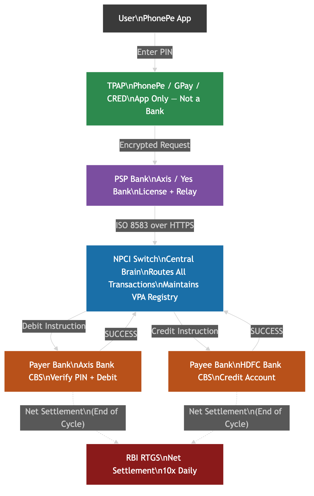
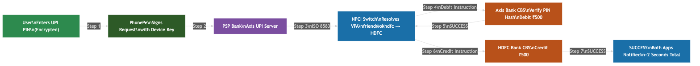
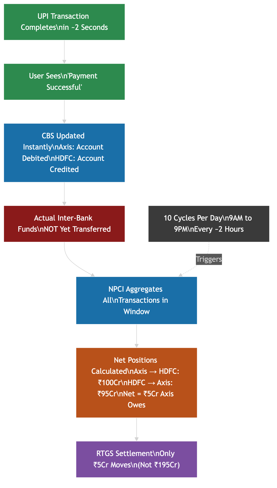
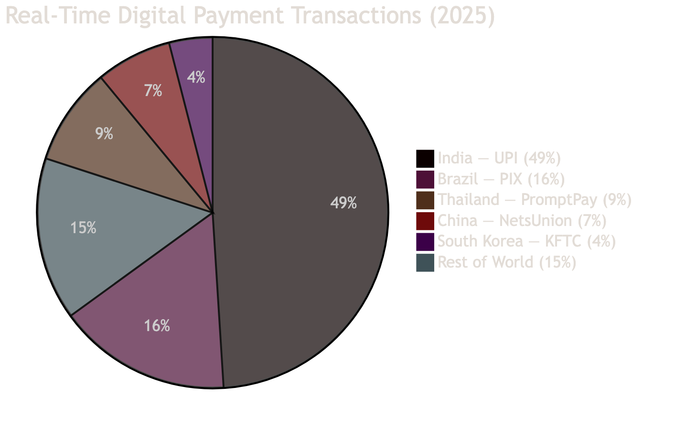

# UPI: How India Processes 700 Million Transactions a Day Without Crashing

India's Unified Payments Interface handled **21.70 billion transactions in January 2026** — roughly 700 million per day, 7,500 every second at peak. The IMF ranked it the world's largest retail fast-payment system by volume. UPI accounts for **49% of all global real-time digital payment transactions**. And it costs zero to use.

This is the architecture behind it.

---

## The Problem Before UPI

Before 2016, inter-bank transfers in India were painful:

- **NEFT** — batch processing every 30 minutes (now every hour). You'd wait hours. Needed account number + IFSC. One typo = money to a stranger.
- **IMPS** — instant, but originally required the receiver's **MMID (Mobile Money Identifier)** + mobile number — a 7-digit bank-generated code nobody memorised. (Account + IFSC was added later as an alternative, but MMID was the original friction point.)
- **Net banking** — different UI per bank, session timeouts, no mobile-native experience.

The core problem: **no common identity layer across banks.** Each bank was an island. Inter-bank transfer required you to know the bank's internal identifiers.

UPI solved this with a single abstraction: the **Virtual Payment Address (VPA)** — `vijay@oksbi`, `merchant@ybl`. Human-readable, bank-agnostic, memorable.

---

## The Four-Party Model

UPI operates on a four-party interoperable architecture:

### 1. TPAP (Third Party Application Provider)
PhonePe, Google Pay, CRED, Paytm. These are **apps, not banks.** They never store your UPI PIN, never hold your money, never have banking licenses. They maintain device-to-VPA mappings and transaction UX. Even if a TPAP's servers were fully compromised, attackers would find no bank credentials.

### 2. PSP (Payment Service Provider)
A licensed bank that gives a TPAP access to UPI infrastructure. PhonePe used Yes Bank historically; Google Pay uses Axis Bank and SBI. The PSP is responsible for:
- Registering VPAs with NPCI on behalf of users
- Relaying encrypted transaction messages between TPAP and NPCI
- Regulatory compliance and grievance handling

### 3. NPCI Switch
The central routing and orchestration engine operated by NPCI. This is the brain. It:
- Maintains the **VPA-to-bank-handle mapping registry** (the address book for every UPI ID in India)
- Routes every transaction between the payer's PSP and payee's PSP
- Coordinates the debit and credit instructions in sequence
- Manages settlement cycles

### 4. Issuer Bank / CBS (Core Banking System)
Your actual bank — where your account lives. The CBS exposes just **3 interfaces** to NPCI's UPI adapter:
1. Customer lookup (does this account exist?)
2. Balance check
3. Debit from account / Credit to account

This minimal interface design is what enabled 550+ banks to onboard UPI. Even a small cooperative bank can integrate with UPI if it can implement these 3 operations.

---

## VPA: The Key Abstraction

A VPA looks like: `username@handle`

Examples: `vijay@oksbi`, `merchant@ybl`, `9876543210@paytm`

The **handle** (`@oksbi`, `@ybl`, `@okaxis`) identifies which PSP manages the VPA. NPCI maintains a central **handle-to-PSP mapping registry** — when a transaction arrives for `friend@okhdfc`, NPCI knows immediately that HDFC Bank's UPI server is the destination.

The VPA is mapped to a specific account number + IFSC internally. The payer never needs to know either. One person can have multiple VPAs across multiple PSP apps, linked to the same or different bank accounts.

---

## The Transaction Flow

**Scenario: PhonePe user (Axis Bank) sends ₹500 to Google Pay user (HDFC Bank)**

### One-time Setup (Device Binding)
1. User installs PhonePe → app captures a **device fingerprint** (device ID, IMEI, SIM details)
2. App automatically sends an SMS from the registered mobile number — this proves the device physically has the registered SIM (possession proof)
3. NPCI/PSP records this device + SIM combination as the bound entity for this user
4. User links bank account via debit card → bank calls NPCI's `setCredentials` API
5. User sets a 4 or 6-digit UPI PIN → the PIN is associated with the issuer bank's card authentication infrastructure and verified via the bank's HSM (Hardware Security Module). The UPI spec does not mandate a specific storage format; this is handled within the issuer bank's secure infrastructure.

### Live Transaction (every time you pay)

| Step | What Happens | Who |
|---|---|---|
| 1 | User enters payee VPA + amount, confirms with UPI PIN | User on PhonePe |
| 2 | PhonePe app encrypts PIN using PSP's public key, packages request with device fingerprint | PhonePe (TPAP) |
| 3 | Encrypted request → PhonePe's PSP (Axis Bank's UPI server) | PhonePe → PSP |
| 4 | PSP forwards to NPCI Switch via ISO 8583 XML over HTTPS | PSP → NPCI |
| 5 | NPCI resolves `friend@okhdfc` → HDFC Bank is payee PSP | NPCI |
| 6 | NPCI sends VPA resolution request to HDFC; HDFC confirms account exists | NPCI → HDFC |
| 7 | NPCI instructs Axis Bank: "Verify PIN and debit ₹500 from account XXXX" | NPCI → Axis |
| 8 | Axis Bank verifies the encrypted PIN via its HSM (card authentication infrastructure), checks balance, debits account → sends SUCCESS | Axis Bank |
| 9 | NPCI instructs HDFC Bank: "Credit ₹500 to account YYYY" | NPCI → HDFC |
| 10 | HDFC Bank CBS credits account → sends SUCCESS | HDFC Bank |
| 11 | NPCI sends confirmation back to both PSPs | NPCI |
| 12 | PhonePe notifies payer; Google Pay notifies payee | TPAPs |

**End-to-end target latency: under 2 seconds.** NPCI reduced the API response time cap from 30s → 15s in June 2025, with further reductions planned.

---

## Two-Factor Authentication: Why UPI Is Hard to Compromise

UPI requires **both** factors simultaneously, per RBI's two-factor authentication mandate:

### Factor 1 — Possession (Device Binding)
- Your **registered SIM + specific device** = bound pair. Registration sends an automatic SMS from your SIM, proving device and SIM are co-located.
- Device fingerprint (device ID, IMEI, SIM details) is registered with the PSP during setup
- If you change phones or SIMs, full re-registration is required — the old binding is invalidated
- Note: UPI does not mandate a hardware secure element or private key chip architecture. Device binding works via SIM + device fingerprint validation, not hardware cryptography. Individual PSP implementations may add app-level signing, but this is not a universal UPI spec requirement.

### Factor 2 — Knowledge (UPI PIN)
- PIN is entered in a **bank-provided SDK overlay** — the TPAP app never sees the PIN value
- The PIN is **encrypted on-device** using the PSP's public key before transmission
- PIN verification happens inside the **issuer bank's HSM** using card authentication infrastructure — similar to how debit card PINs are verified. It is not a simple hash comparison.
- The encrypted PIN never reaches NPCI — verification is end-to-end between device and issuer bank.

**What this means:** Stealing just your phone doesn't work (you need the PIN, and re-binding on a new device requires re-registration). Stealing just the PIN doesn't work (you need the bound device + SIM). The TPAP never holds credentials — a TPAP server compromise reveals nothing useful.

---

## The Settlement Trick: What "Success" Actually Means

When PhonePe shows "Payment Successful," your Axis Bank account has been debited and your friend's HDFC account has been credited in their respective CBS systems — **in real time.** This is visible immediately.

But **Axis Bank and HDFC Bank have not exchanged actual funds yet.**

Here's what happens in the background:

NPCI runs **Deferred Net Settlement (DNS)** — multiple settlement batches throughout the day via RBI's infrastructure. The exact number of cycles is an operational parameter set by NPCI and RBI and can change over time (NPCI OC-197 documented a particular cycle schedule for FY2024-25, but treat this as an example, not a permanent fixed count).

Each batch:
1. NPCI aggregates all transactions across all bank pairs in that window
2. Calculates net positions: "Axis owes HDFC ₹847 crore net, HDFC owes ICICI ₹312 crore net..."
3. Net settlement instructions posted to **RBI's RTGS** (Real-Time Gross Settlement)
4. Banks transfer only the net amount via their RBI reserve accounts

**The math:** If in one window, Axis→HDFC transactions total ₹100 crore and HDFC→Axis total ₹95 crore, only **₹5 crore moves via RTGS** — not ₹195 crore of individual transactions. This dramatically reduces inter-bank liquidity requirements and makes the system capital-efficient.

Banks carry the intraday credit risk (crediting payees before actual inter-bank settlement) based on NPCI's guarantee, backed by RBI oversight and DNS settlement rules.

---

## UPI vs Everything Else

| Dimension | UPI | IMPS | NEFT | SWIFT |
|---|---|---|---|---|
| User experience | Instant (< 2s) | Instant (seconds) | Near-instant (batch) | Hours to days |
| Identifier | VPA / Account+IFSC / QR | Mobile+MMID / Account+IFSC | Account + IFSC | IBAN + SWIFT BIC |
| Auth | 2FA (device + PIN) | Password + OTP | Net banking | Correspondent trust |
| Settlement | Deferred Net Settlement (DNS) | Deferred Net | Batch | Correspondent chain |
| Cost to user | Zero | ₹1–25 | ₹1–25 | High (wire + FX) |
| Daily limit | ₹1L (₹5L select categories) | ₹5L | No limit | No standard |
| Availability | 24/7/365 | 24/7/365 | 24/7 (since Dec 2019) | Banking hours |

**Why UPI is fundamentally different from SWIFT:** SWIFT is a messaging network — it sends payment instructions but doesn't move money. Each bank along the correspondent chain holds funds and messages the next. UPI is a **centralized switch model** — NPCI orchestrates debit and credit in a single coordinated sequence, no correspondent chain, single hop.

---

## Infrastructure at Scale

**Data Centers (NPCI official press releases, 2020):**
- Two Tier IV data centers: Chennai (SIPCOT IT Park, Siruseri) and Hyderabad (Narsingi Village)
- Tier IV = 99.995% uptime at facility level (2-failure tolerant design)
- Active-active setup — traffic fails over automatically if one DC goes down
- Combined capacity: 50-70 billion transactions per month

**Technology stack (Kyndryl partnership, publicly announced):**
- Internal infrastructure: Terraform + Ansible + GitHub Runners + MAAS (Canonical) — NPCI calls it the "TARM stack"
- Protocol: ISO 8583 XML over HTTPS — the same format used in card payment networks, chosen because it accommodates limited bandwidth from small banks' CBS systems

**Scale controls (NPCI August 2025 circular):**
- NPCI introduced daily limits on balance enquiry and "list accounts" API calls
- PSPs required to rate-limit transaction initiation TPS to prevent spike overloads

**Published uptime:** 99.2% transaction success rate (includes all failure reasons — bank timeouts, CBS rejections, network drops). NPCI publishes month-wise uptime data at npci.org.in.

---

## Fraud Prevention

**MuleHunter.AI** — NPCI provides free ML tools to partner banks that analyze transaction patterns, device details, and behavioral anomalies in real time.

**Financial Fraud Risk Indicator (FRI)** — DoT launched this in May 2025. Classifies mobile numbers as Medium/High/Very High fraud risk based on cybercrime reports, telecom intelligence, and bank data. Available at transaction time.

**What UPI's architecture prevents by design:**
- Replay attacks: every transaction has a unique ID + timestamp
- Man-in-the-middle: end-to-end encryption + signed intents (QR codes carry merchant cryptographic signatures)
- Phishing: PIN entered in bank-controlled SDK, not TPAP UI
- SIM swap: device binding requires full re-registration from new SIM, triggering bank verification

---

## The Global Picture

India's UPI in 2025:
- 228.3 billion transactions, worth ₹299.7 lakh crore (~$3.6 trillion) — 29.3% YoY growth
- 49% of all global real-time digital payment transactions (ACI Worldwide, IMF 2025)
- India alone: 228.3B vs Brazil (37.4B) + Thailand (20.4B) + China (17.2B) + South Korea (9.1B) combined

NPCI's cross-border expansion: 40+ countries onboarding UPI acceptance. NPCI + NVIDIA partnership (Feb 2026) building an AI layer on top of UPI for fraud detection and credit scoring.

---

## Why UPI's Architecture Is Worth Studying

Three design decisions made UPI work at this scale:

1. **Centralized switch, decentralized accounts** — NPCI owns routing, banks own accounts. Clear separation of concerns. No bank has to trust another bank directly.

2. **Minimal CBS integration** — 3 operations (lookup, balance, debit). Even a 30-year-old bank CBS can implement this. Network effects scaled because the bar to join was low.

3. **Deferred Net Settlement** — instant experience for users, batch settlement for banks. Avoids requiring banks to maintain massive intraday liquidity buffers. Settlement risk managed by NPCI's guarantee, backed by RBI.

The elegance is that none of these individually is novel — what NPCI built was the right combination of trade-offs for the Indian banking system's specific constraints.

---

## References

- [NPCI UPI Product Statistics](https://www.npci.org.in/product/upi/product-statistics)
- [NPCI OC-197: 10 Settlement Cycles](https://www.npci.org.in/PDF/npci/upi/circular/2024/UPI-OC-No-197-FY-24-25-Implementation-of-10-settlement-cycles-&-revised-business-day-cutover.pdf)
- [NPCI OC-222A: Dispute Settlement Cycles](https://www.npci.org.in/uploads/UPI_OC_No_222_A_FY_2025_26_Addendum_segregation_of_UPI_settlement_cycles_for_Auth_and_disputes_transactions_42766ab9aa.pdf)
- [PIB: IMF Recognises UPI as World's Largest Real-Time Payment System](https://www.pib.gov.in/PressReleasePage.aspx?PRID=2200569&reg=3&lang=1)
- [PIB: DoT Introduces Financial Fraud Risk Indicator](https://www.pib.gov.in/PressReleasePage.aspx?PRID=2130249)
- [NPCI UPI Settlement Process (PDF)](https://www.npci.org.in/PDF/npci/others/UPI-Settlement-Process.pdf)
- [NPCI Chennai Data Center Press Release](https://www.npci.org.in/PDF/npci/press-releases/2020/NPCI%20Press%20Release%20-%20NPCI%20to%20launch%20Smart%20Data%20Center%20in%20Chennai.pdf)
- [NPCI Hyderabad Data Center Press Release](https://www.npci.org.in/PDF/npci/press-releases/2020/NPCI_Press_Release-NPCI_to_launch_Smart_Data_Center_in_Hyderabad.pdf)
- [NPCI + Kyndryl Data Centre Modernisation](https://www.itnews.asia/news/indias-npci-modernises-data-centres-using-kyndryls-cloud-services-592061)
- [ACI Worldwide: Prime Time for Real-Time 2024](https://www.aciworldwide.com/prime-time-for-real-time)
- [Setu: UPI 102 — The Transaction Cycle](https://blog.setu.co/articles/upi-102-the-transaction-cycle)
- [UPI Smashes Records — 21.6B Transactions December 2025](https://bfsi.eletsonline.com/upi-smashes-records-with-21-6-billion-transactions-in-december-2025/)
- [World Bank: India IMPS and UPI Case Study](https://fastpayments.worldbank.org/sites/default/files/2021-10/World_Bank_FPS_India_IMPS_and_UPI_Case_Study.pdf)

---

#systemdesign #upi #softwareengineer #india #fintech #distributedsystems #npci #payments #coding #techincident
