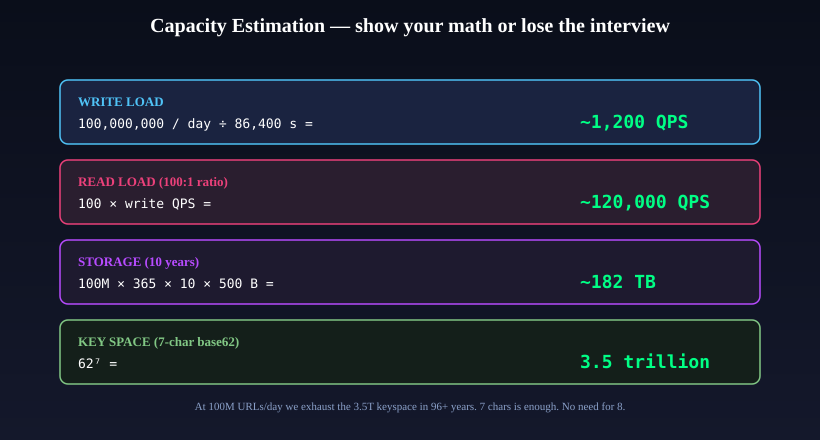
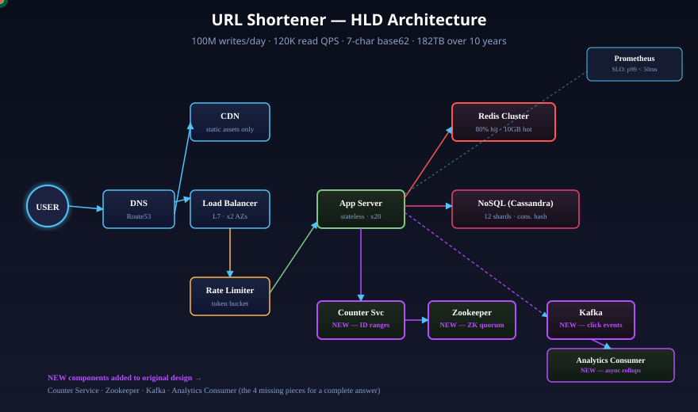
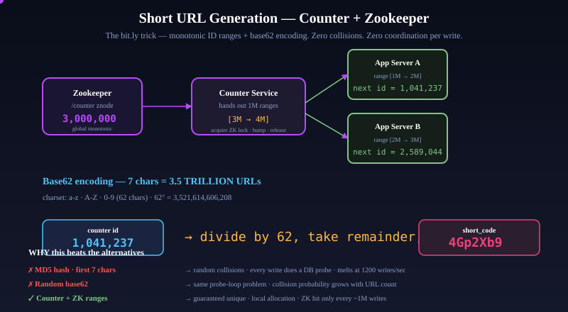
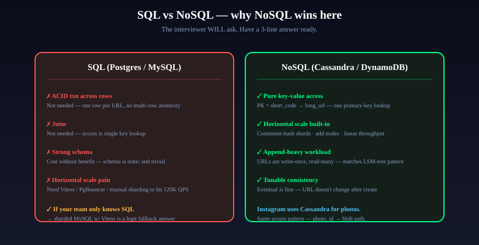
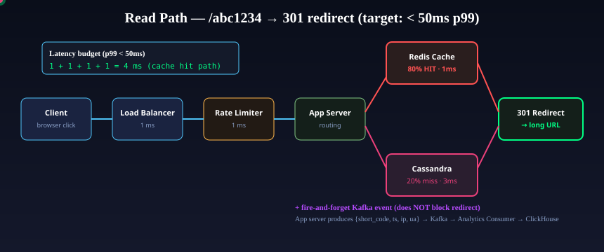

# Design a URL Shortener — The Complete Interview Playbook

It's 11:30 AM on a Tuesday. A Flipkart engineering manager leans into her webcam, smiles, and says the six words that every fresher dreads:

> "Design a URL shortener for me."

You have forty-five minutes. You have a blank Excalidraw. You have a recruiter watching from mute. And you have one shot.

Ninety percent of candidates fail this question. Not because URL shorteners are hard — they aren't. They fail because they **rush**. They start drawing boxes before understanding the scale. They pick MongoDB "because it's NoSQL" without articulating why. They forget the single thing interviewers are actually listening for: *how do you generate a unique seven-character code at 1,200 writes per second without collisions?*

This article is the complete answer. Not a summary. Not a cheat sheet. The full 40-minute narrative, expanded into the reasoning a senior engineer would walk through if they were thinking out loud. Read it once, internalize the decision tree, and you will walk out of any system design interview — Flipkart, Swiggy, Razorpay, Amazon, Google, Meta — with an offer-grade answer.

We'll design something real. Something operational. Something that could handle bit.ly's actual load of 600 million URLs per month and 10 billion clicks per month — without falling over, without losing data, without denying a single redirect.

Let's begin.

---

## Part 1 — Understanding What You're Actually Building

### The deceptive simplicity of `tiny.url/4Gp2Xb9`

When you paste `https://www.flipkart.com/search?q=iphone-15-pro-max&pid=MOBGT...&affiliate-id=vijay-2026-summer-campaign-v3` into bit.ly, you get back `https://bit.ly/4Gp2Xb9`. You click that seven-character link. Your browser makes a request. Two milliseconds later, you're on Flipkart.

What actually happened in those two milliseconds?

Your click resolved `bit.ly` to an IP address via DNS. The request hit a load balancer sitting in front of a fleet of stateless app servers. The app server extracted the short code — `4Gp2Xb9` — and did a single key-value lookup. It hit a Redis cache first, got the original URL back in under a millisecond, and returned an HTTP 301 response with a `Location` header pointing to the Flipkart URL. Your browser followed the redirect. Meanwhile, a fire-and-forget event was dropped into Kafka — "click happened, short_code=4Gp2Xb9, timestamp, IP, user-agent" — and a separate consumer somewhere in another data center aggregated it into a ClickHouse rollup table that a product manager would look at next Monday.

All of that happened in the time it takes you to blink.

Now multiply it by one hundred thousand clicks per second at peak. Add the requirement that nothing can ever go down, because if the redirect breaks, every Instagram bio link in the world breaks, and every marketing campaign with a shortened URL in it — emails, QR codes, print ads — dies in the same instant.

That's what you're designing.

### Why URL shorteners exist at all

The first URL shortener, TinyURL, launched in 2002. The problem was simple: URLs were ugly, hard to type, and often longer than a printed line in a magazine. Twitter, launched in 2006, accidentally made URL shorteners mission-critical when it imposed a 140-character tweet limit in 2009. Suddenly every link had to be compressed. bit.ly, founded in 2008, won the subsequent land grab and now processes more clicks per day than most countries' entire GDP expressed in cents.

The problem URL shorteners solve hasn't changed in twenty years:

1. **Compress long URLs** into something short enough to print, speak, or paste into a 280-character tweet.
2. **Decouple the public-facing URL from the destination** — so a marketing team can change where a printed QR code goes without reprinting the QR code.
3. **Measure clicks** — which link in a newsletter converted, which Instagram bio tap led to a sale.

Point three is where the money is. The first two are table stakes. If you forget point three in the interview, you will lose points.

### The scale we're designing for

We're going to target bit.ly-adjacent scale. Conservative enough to be realistic, ambitious enough to force real architectural decisions. Write it on the whiteboard before you do anything else:

- **100 million new URLs created per day** (≈ 1,200 QPS average, ≈ 2,400 QPS peak)
- **10 billion redirect clicks per day** (≈ 120,000 QPS average, ≈ 240,000 QPS peak)
- **Read-to-write ratio: 100 to 1** (every created URL gets, on average, 100 clicks)
- **10-year retention** (URLs should keep working for a decade)
- **99.99% availability** (52 minutes of downtime per year — one bad deploy)
- **p99 redirect latency under 50ms** (the redirect is on the user's critical path)

These numbers aren't arbitrary. The 100:1 read:write ratio is industry-standard for URL shorteners — it's what bit.ly actually sees. The 120K read QPS is the number that forces us out of "single Postgres instance" territory and into "distributed cache + sharded NoSQL" territory. Remember these numbers. They are the grammar of the rest of this article.

> **Takeaway:** A URL shortener is a high-throughput key-value read system with a tiny write layer and a write-once-read-many data pattern. Every design decision from here on flows from that shape.

---

## Part 2 — Clarifying Requirements (The First 5 Minutes of the Interview)

Interviewers do not grade you on the architecture you produce. They grade you on how you arrive at it. The first five minutes are the single highest-leverage part of the interview, because this is where you demonstrate that you think like an engineer, not a coder.

The ritual has four parts: functional requirements, non-functional requirements, scope cuts, and scale assumptions. Do them out loud. Make the interviewer confirm each one.

### Functional requirements — what the system must DO

1. **Shortening**: given a long URL (up to 2,000 characters, per the HTTP spec's practical limit), return a short URL. The short URL should be a seven-character alphanumeric code following a fixed base domain (`tiny.url/<code>`).
2. **Redirection**: given a short URL, issue an HTTP 301 Moved Permanently redirect to the original long URL. (More on why 301 versus 302 in a moment — this is a subtle but important trade-off.)
3. **Custom aliases**: authenticated users can optionally specify their own short code (`/vijay-portfolio`). The system must reject collisions with existing codes.
4. **Expiry**: URLs can optionally have an expiry timestamp. After that time, redirects return HTTP 410 Gone.
5. **Click analytics**: for each short URL, track click count, referer, country (derived from IP), and timestamp. These are visible in the creator's dashboard.

### Non-functional requirements — what the system must BE

1. **High availability** — 99.99%. This is the bar for customer-facing infrastructure. Every bit.ly shortlink on every Instagram bio is a hard SLA.
2. **Low latency** — p99 under 50ms for the redirect path. The redirect is user-perceived; every additional 100ms loses about 1% of clicks (Amazon's famous statistic).
3. **Durable** — no URL, once created, should ever be lost. Not to a rack failure, not to a region outage, not to an operator error.
4. **Scalable** — the system should handle 10x traffic growth without a rewrite. We're designing for 2035, not 2026.
5. **Secure** — the system should not serve malicious URLs. Short links are a favorite vector for phishing campaigns.

### Scope cuts — what we're NOT building (and saying so)

This is the single most underrated moment in the interview. A senior engineer explicitly names what's out of scope. A fresher quietly omits things and gets penalized for "missing requirements."

- No multi-region strong consistency. We'll have regional Cassandra clusters with asynchronous replication. If the US-East region dies mid-write, that write might not be visible in Asia-Pacific for a few seconds. Acceptable for a URL shortener.
- No custom domains per user. That's a separate product (bit.ly charges extra for it). We serve everything under `tiny.url`.
- No HTTPS certificate management per user. Wildcard cert on the base domain.
- No advanced abuse detection. We'll integrate Google Safe Browsing but not build our own ML pipeline.
- No URL preview UI ("are you sure you want to visit this?"). We redirect unless the URL is flagged.

### Scale — the numbers that define everything

Repeat the numbers from Part 1 back to the interviewer explicitly. Get agreement:

- 100 million writes per day, 10 billion reads per day.
- 10-year data retention.
- Short code length: 7 characters.
- Target: 99.99% availability, p99 redirect < 50ms.

The interviewer may push back. "What if we only need 10 million writes per day?" Fine — halve the Cassandra shard count, cut Redis shards, keep the architecture. "What if we need 1 billion writes per day?" Fine — 10x the shard count, split the Counter Service into regional fleets, and talk about cross-region ID generation.

The architecture absorbs scale changes. That's the point of doing this exercise properly.

> **Takeaway:** Spend the first five minutes confirming functional, non-functional, scope, and scale. Every subsequent decision hangs on these four lists.

---

## Part 3 — Capacity Estimation (The Math Most Candidates Skip)

Back-of-the-envelope math is the second most common place candidates lose points. Interviewers want to see you reason in orders of magnitude — not because the exact numbers matter, but because a senior engineer has internalized the feel of different scales. A 1,200 QPS write workload is a single-MySQL-instance problem. A 120,000 QPS read workload is not. Being able to tell them apart by instinct is the skill.



*The four numbers you should be able to quote without looking at notes.*

Let's walk through it.

### Write throughput

```
Writes per day   = 100,000,000
Seconds per day  = 86,400
Average QPS      = 100,000,000 / 86,400 ≈ 1,157 QPS

Peak multiplier  ≈ 2x (promo spikes, IPL finals, viral moments)
Peak QPS         ≈ 2,400 QPS
```

Twelve hundred writes per second is a workload a single Postgres instance can handle if you tune it right. But we're building for 10x growth, so we'll plan for 12,000 peak. That changes things.

### Read throughput

```
Read-to-write ratio = 100:1
Average reads/sec   = 100 × 1,200 = 120,000 QPS
Peak reads/sec      ≈ 240,000 QPS
```

This is the number that forces every interesting decision in this design. At 240K reads per second, no single database survives. Not Postgres. Not Cassandra. Not DynamoDB. You need a cache in front. You need the cache to absorb 80% of the traffic. You need to think about what happens when the cache is cold.

### Storage over ten years

Each URL record looks roughly like this:

```
short_code    7 bytes    (fixed, always 7 chars)
long_url      ~200 bytes (average — some URLs are short, some are 1KB+)
user_id       8 bytes    (BIGINT)
created_at    8 bytes    (UNIX timestamp)
expiry_at     8 bytes    (nullable, still 8 bytes on disk)
is_custom     1 byte
click_count   8 bytes    (BIGINT, updated async)
--------
≈ 240 bytes of pure data
+ overhead for NoSQL metadata, indexes, version markers, tombstones
≈ 500 bytes total per URL
```

```
URLs in 10 years = 100M × 365 × 10 = 365,000,000,000 (365 billion)
Storage          = 365B × 500 bytes = 182,500,000,000,000 bytes ≈ 182 TB
With RF=3        ≈ 547 TB
```

One hundred and eighty-two terabytes. Not a number that fits on a single machine. Not a number that you can handwave. The storage alone dictates that we need horizontal sharding — and sharding dictates that we can't rely on `AUTO_INCREMENT` or other single-node coordination primitives.

### Bandwidth

```
Read bandwidth  = 120K QPS × ~500 bytes/response = 60 MB/sec egress
Write bandwidth = 1.2K QPS × ~1 KB/request     = 1.2 MB/sec ingress
```

Sixty megabytes per second egress. Trivial for any cloud provider but worth noting — at bit.ly's scale the CDN bill alone is a line item.

### The keyspace — why 7 characters?

Here's where most candidates handwave. Let's do it properly.

We need short codes that are:
- **URL-safe** (no `+`, `/`, or `=` — which rules out base64)
- **Human-typeable** (no ambiguous characters like `0` vs `O` or `l` vs `1`, though bit.ly doesn't bother excluding them, and neither do we)
- **Short enough to fit in a tweet / print nicely on a business card**

**Base62** (a-z, A-Z, 0-9) is the standard answer. 62 characters, all URL-safe, all ASCII-printable.

How much can we fit in 7 characters?

```
62^1 = 62
62^2 = 3,844
62^3 = 238,328
62^4 = 14,776,336
62^5 = 916,132,832
62^6 = 56,800,235,584
62^7 = 3,521,614,606,208 ≈ 3.5 TRILLION
```

Three and a half trillion unique codes.

At our scale:

```
URLs per year = 100M × 365 = 36.5 billion
Years until keyspace exhausted = 3.5 trillion / 36.5 billion ≈ 96 years
```

Ninety-six years. Seven characters is enough. We don't need eight. We don't need to debate it.

If we had picked six characters:

```
62^6 = 56.8 billion
Years until exhausted = 56.8 billion / 36.5 billion ≈ 1.5 years
```

One and a half years. Catastrophic. You'd run out of codes before the company's Series C.

If we had picked base36 (lowercase + digits only):

```
36^7 = 78.4 billion
Years until exhausted ≈ 2.1 years
```

Also catastrophic. Which is why we pick base62 and seven characters and not anything else.

> **Takeaway:** At 100M writes/day, the four defining numbers are 1.2K write QPS, 120K read QPS, 182 TB over ten years, and a 3.5-trillion-code keyspace. These numbers dictate every architectural decision from here. Memorize them.

---

## Part 4 — API Design (Keep It Boring)

Interviewers want REST that looks boring. Exotic APIs — GraphQL, gRPC, event-sourced command buses — signal over-engineering on a problem that doesn't need them. We'll design two public endpoints and two authenticated ones. That's it.

### POST /api/v1/shorten — create a short URL

```http
POST /api/v1/shorten
Content-Type: application/json
Authorization: Bearer <jwt>

{
  "long_url": "https://www.flipkart.com/search?q=iphone-15",
  "custom_alias": null,
  "expiry_at": null
}

HTTP/1.1 201 Created
{
  "short_url": "https://tiny.url/4Gp2Xb9",
  "short_code": "4Gp2Xb9",
  "long_url":  "https://www.flipkart.com/search?q=iphone-15",
  "expiry_at": null,
  "created_at": "2026-04-23T11:32:19Z"
}
```

Three subtle things to call out in the interview:

1. **Idempotency on `(user_id, long_url)`.** If the same user pastes the same long URL twice, we should return the same short code, not create a duplicate. This costs one cache lookup per write but saves a lot of duplicate rows. It also prevents abusive enumeration — a spammer can't create a million short codes pointing to the same phishing URL.

2. **The `Authorization` header is required.** Anonymous shortening is a spam firehose. Real systems either require auth or accept anonymous writes with drastically tighter rate limits (bit.ly allows ~10 per hour per IP for unauthenticated users).

3. **`custom_alias` and `expiry_at` are optional.** Nullable fields in the database. Most URLs won't use them.

### GET /{short_code} — redirect

```http
GET /4Gp2Xb9 HTTP/1.1
Host: tiny.url

HTTP/1.1 301 Moved Permanently
Location: https://www.flipkart.com/search?q=iphone-15
Cache-Control: private, max-age=300
```

**301 vs 302 — the subtle trade-off.** HTTP 301 is "permanent" — browsers and intermediate caches are allowed to remember it and skip future requests. HTTP 302 is "temporary" — browsers always re-check.

- **301** gives you speed (browser caches it) but you lose click-level analytics after the first click (browser doesn't send future clicks).
- **302** gives you every click (no caching) but adds one round-trip per click.

Which do you pick? bit.ly uses **301** with a short `max-age` on `Cache-Control` — you get analytics for the first N minutes, then the browser caches. That's the right answer. If analytics is contractually required for every click, use **302** and accept the extra latency. State both, pick one, move on.

### DELETE /api/v1/urls/{short_code} — delete a URL (owner only)

Soft-delete via `deleted_at` column. Tombstone in Cassandra. Respond with 204.

### GET /api/v1/urls/{short_code}/stats — click analytics (owner only)

Read from the analytics store (ClickHouse), not from the hot Cassandra. Returns click count, top referers, country breakdown, daily time series.

### Rate limits to mention

- `POST /shorten` — 100 requests per minute per user, 20 per minute per IP for unauthenticated. Creation is where abuse lives.
- `GET /{short_code}` — 10,000 requests per minute per IP. Legitimate apps may burst.

> **Takeaway:** Two public endpoints. Idempotency on create. Return 301 with a short `max-age` for the speed/analytics trade-off. The API is the most boring part of this design — that's a feature, not a bug.

---

## Part 5 — The Database Schema (Simpler Than You Think)

```
Table: urls   (the hot table — this is what 99% of traffic hits)
  short_code      VARCHAR(8)      PRIMARY KEY
  long_url        TEXT            NOT NULL
  user_id         BIGINT          NOT NULL
  created_at      TIMESTAMP       NOT NULL
  expiry_at       TIMESTAMP       NULL
  is_custom       BOOLEAN         DEFAULT FALSE
  is_deleted      BOOLEAN         DEFAULT FALSE
  click_count     BIGINT          DEFAULT 0   -- updated async, batched
  version         INT             DEFAULT 1    -- optimistic concurrency

Table: users  (cold, infrequent reads)
  user_id         BIGINT          PRIMARY KEY
  email           VARCHAR(255)    UNIQUE
  plan            VARCHAR(32)
  created_at      TIMESTAMP

Table: clicks_daily_rollup  (lives in ClickHouse, not the hot DB)
  short_code      VARCHAR(8)
  date            DATE
  country         VARCHAR(2)
  referer_domain  VARCHAR(255)
  count           BIGINT
  PRIMARY KEY (date, short_code, country, referer_domain)
```

The key insight: **one table carries 99% of traffic**. The redirect path reads exactly one row from `urls` by primary key. No joins. No range queries. No subqueries. No complex indexes. Just a hash lookup on `short_code`.

This is why NoSQL wins for this workload — we'll justify that in depth in Part 8. But notice how the schema itself already tells you the answer. If your data access pattern is a single primary-key lookup, you don't need SQL's join power.

The `click_count` column is special. It's write-heavy — every redirect wants to increment it. If you try to update it synchronously in Cassandra on every redirect, you'll send 120,000 writes per second to a column designed for 1,200. You will die. We'll batch-update it asynchronously from the analytics pipeline. Remember this — it's the single most common bug candidates ship in this design.

> **Takeaway:** One hot table, primary-keyed by short_code, with the write-heavy click_count updated asynchronously. Everything else is cold.

---

## Part 6 — Building the Architecture, Layer by Layer

Now we draw. But we draw with intent. Every box earns its place by answering a specific question.



*The full architecture. The four components outlined in purple — Counter Service, Zookeeper, Kafka, Analytics Consumer — are the pieces that separate a fresher answer from a senior-grade one.*

Let me walk through how a senior engineer would build this up, layer by layer, asking "what problem does this solve?" at each step.

### Layer 1: the client and DNS

> **💡 Why this component exists**
> - **Problem it solves:** the browser needs to convert `tiny.url` into an IP address before it can send any request. Without DNS there is no internet.
> - **Why this tech:** Route53 / Cloudflare DNS → gives **GeoDNS routing** (Mumbai users hit `ap-south-1`, US users hit `us-east-1`, shaving 50–150 ms off every request) plus **health-check failover** (DNS removes a dead region from rotation within 60 seconds).
> - **Alternatives rejected:** self-hosted BIND → ops overhead, no geo-routing, meaningless at this scale.
> - **Interview move:** name-drop Route53 + GeoDNS + 60 s TTL, then move on. Interviewer only wants to confirm you know the first hop exists.

A user types `tiny.url/4Gp2Xb9` into their browser. Their operating system asks DNS: "what IP should I talk to?" DNS returns the public IP of our load balancer. The browser opens a TCP connection to that IP. Done.

Why use **Route53** (or Cloudflare DNS)? Two reasons. First, **geo-routing** — users in India get an IP of a load balancer in `ap-south-1`, users in the US get `us-east-1`. This shaves 50-150ms off every request before our code has even run. Second, **health-check failover** — if an entire region goes down, DNS removes it from rotation within 60 seconds. You can't buy that level of resilience with a single region.

The alternative would be self-hosting BIND. The operational overhead is enormous and you lose geo-routing. Nobody does this at scale.

### Layer 2: the CDN (for static content only — important distinction)

> **💡 Why this component exists**
> - **Problem it solves:** landing pages, dashboard JS/CSS, and favicons are static and globally requested — serving them from origin for every user wastes bandwidth and adds 100–300 ms per request for distant users.
> - **Why this tech:** Cloudflare / CloudFront caches at 300+ edge PoPs → a user in Patna hits an edge in Mumbai, not a server in Virginia.
> - **Alternatives rejected:** serve static from origin → kills p99, burns egress $$$. Embedding everything in the main HTML → no HTTP caching benefits.
> - **Critical clarification:** the CDN does **NOT** cache the `/<short_code>` redirect itself — redirects are too dynamic (expiry, analytics, per-request logic). Many candidates miss this. Only static assets flow through the CDN.

Here's where many candidates stumble. They draw a CDN in front of everything and claim it "caches the redirects." It does not. The CDN caches only the static parts of the system — the landing page, the dashboard JavaScript, the favicon. The actual `GET /{short_code}` redirect **must hit the origin**. Why? Because:

1. **URLs can expire.** A CDN cache doesn't know about `expiry_at`. If a user deletes or expires a URL, we need every subsequent redirect to reflect that — we can't let a stale CDN edge serve a dead link for 5 more minutes.
2. **Analytics require origin visibility.** Every click needs to produce a Kafka event. If the CDN serves the redirect, the origin never sees it.
3. **Rate limits can't be applied at the CDN.** Abuse detection needs to run at the origin.

So the CDN (Cloudflare or CloudFront or Fastly — all equivalent at this scale) sits in front of `static.tiny.url` only. The DNS for `tiny.url` itself points to the load balancer. This is a small but important correction that earns respect.

### Layer 3: the load balancer

> **💡 Why this component exists**
> - **Problem it solves:** 20 app servers live behind one hostname — without a load balancer, clients would need to know all 20 IPs and handle failures themselves.
> - **Why L7 (not L4):** L7 (NGINX / Envoy / AWS ALB) routes by HTTP path (`/api/*`, `/static/*`, `/metrics`) and terminates TLS once instead of 20 times. L4 is faster but blind — rejected because we need path-based routing.
> - **Why consistent-hash routing on short_code:** sends the same code to the same app server → better local cache hit rate on the app tier, for free.
> - **Alternatives rejected:** DNS round-robin → no health checks, cold failover. Client-side load balancing → all clients need a service discovery mechanism.
> - **HA:** active-active across 2 AZs. A single-LB design caps at 99.9% SLA just from reboot windows — two earn us 99.99%.

Twenty app servers live behind one hostname. Without a load balancer, the client would need to know all twenty IPs and handle failures itself. With a load balancer, the client sees one virtual IP; health checks remove dead pods automatically; load is distributed.

**Why L7 (application-layer) and not L4 (transport-layer)?** L4 load balancers are simpler and faster but blind — they can't see HTTP paths, headers, or cookies. We need L7 because we do path-based routing (`/api/*` to the app tier, `/static/*` to the CDN origin, `/metrics` to monitoring) and TLS termination once, not twenty times.

**Why consistent-hash routing by short_code?** This is the subtle optimization. If every app server has a small local cache (maybe the last 10K short codes it looked up), then sending the same short code to the same app server means its local cache hits. Consistent-hashing on `short_code` gives you this property for free, at the load balancer layer, with no coordination among the app servers.

**High availability:** two load balancers, one per AZ, active-active. If one AZ fails, the other keeps serving. This is how you earn 99.99%. A single-LB design caps at 99.9% just from reboot windows.

### Layer 4: the rate limiter

> **💡 Why this component exists**
> - **Problem it solves:** `/shorten` is an abuse magnet — spammers mass-create short URLs pointing to phishing and malware pages. Without a rate limiter, a single bot can burn our keyspace and poison analytics. It also shields the DB from DDoS.
> - **Why token bucket (not fixed window):** allows short bursts (user pastes 5 URLs at once) while capping sustained abuse. A fixed window would let someone send 100 requests in the first second of every minute.
> - **Why Redis-backed:** two rate-limiter replicas need shared state — local counters would let a user hit each replica 100 times = 200 effective requests. Redis `INCR` + `EXPIRE` is atomic in one round-trip.
> - **Alternatives rejected:** in-memory rate limiter → no shared state. Leaky bucket → harder to express "100 per minute with burst of 10." Global throttle at LB only → can't distinguish writes vs reads.
> - **The rule:** writes tight (100/min/user), reads loose (10,000/min/IP). Creation is where abuse lives.

`/shorten` is an abuse magnet. Every day, bot networks try to mass-create short URLs pointing at phishing sites, malware payloads, or SEO spam. Without a rate limiter, a single rented VM can burn through our Counter Service's range and poison the Bloom filter. So the rate limiter sits between the load balancer and the app tier, and fails requests early — before they consume app-server CPU.

**Why token bucket and not fixed window?** A fixed-window rate limiter (100 requests per minute) lets a user send 100 requests in the first second and then wait 59 seconds. A token bucket (bucket of 100 tokens, refilled at 100/60 = 1.67 per second) allows short bursts but caps sustained abuse. It better matches real user behavior — someone pasting five URLs at once should succeed, someone spamming 100 per second should fail.

**Why Redis-backed?** The rate limiter has two replicas. If they each held a local counter, a user could hit each replica 100 times and get 200 effective requests through. Shared state via Redis `INCR` + `EXPIRE` solves this — it's atomic, fast (sub-millisecond), and sharded across the Redis cluster we're already running.

**The rule:** writes are tight (100/min/user, 20/min/IP for unauth), reads are loose (10,000/min/IP). The asymmetry matches where the abuse actually happens.

### Layer 5: the app server

> **💡 Why this component exists**
> - **Problem it solves:** something has to orchestrate the business logic — check cache, fetch from DB, generate short code, emit analytics event, return response.
> - **Why stateless:** every piece of state lives externally (Redis, Cassandra, Zookeeper) → any request can hit any pod → horizontal scale via autoscaling, zero session affinity, pods can die without losing data.
> - **Why Go or Java:** hot path is I/O-bound — any modern runtime works. But at 10K+ concurrent connections per pod, Python's GIL and Ruby's GC pauses hurt p99. Go's goroutines and Java's Netty handle this comfortably. Node.js is also fine.
> - **Alternatives rejected:** Python / Ruby for the hot path → GC and GIL at 120 K QPS. Monolithic single binary with embedded state → can't horizontally scale.
> - **Sizing:** 20 replicas × 5 K QPS = 100 K capacity; autoscale to 48 replicas for the 240 K peak. Holds a local base62 ID range so writes never hit Zookeeper on the hot path.

The app server is the business-logic tier. It's a stateless Go or Java service behind the load balancer. "Stateless" means every piece of state lives externally — Redis for cache, Cassandra for source of truth, Zookeeper for the counter. Any request can hit any pod. Pods can die and be replaced without losing state.

**Why Go or Java and not Python/Ruby?** The hot path is I/O-bound — Redis read, maybe Cassandra read, response. Any runtime handles the CPU load. But at 120K QPS with 20 replicas, each pod is handling 6,000 RPS with perhaps 10,000 concurrent open connections. Python's Global Interpreter Lock prevents it from using multiple cores effectively. Ruby's garbage collector pauses hurt p99. Go's goroutines and Java's Netty handle this comfortably. Node.js also works — single-threaded event loop, but non-blocking I/O. At this scale, language matters.

**Sizing:** 20 replicas × 5,000 QPS per replica = 100K QPS capacity. Against our 120K target with 2x peak = 240K, we'd autoscale to 48 replicas. But this is stateless, so autoscaling is a Kubernetes HPA config — not an architectural change.

**The key optimization:** each app server caches its current base62 ID range locally. When a write comes in, the app server increments a local counter, base62-encodes it, and responds — all in microseconds, with zero network calls for ID generation. Only when the local range runs out (once per ~1 million writes) does it call the Counter Service.

This is the pattern that makes the whole design performant. We'll unpack it fully in Part 7.

### Layer 6: Redis (the cache that does the heavy lifting)

> **💡 Why this component exists**
> - **Problem it solves:** 120 K reads/sec against Cassandra = 3–5 ms per read × 120 K = Cassandra melts. Must absorb most reads in memory. This is non-negotiable.
> - **Why Redis (not Memcached):** Redis gives atomic ops (`INCR` for rate limiter, `SET NX` for locks), data structures (bitmaps for Bloom filter), **and** persistence (AOF survives restart — no cold-cache nightmare). Memcached is simpler but can't host the rate limiter or the Bloom filter.
> - **Why cache-aside (not write-through / write-behind):** URLs are write-once, read-many. Most URLs are never read — write-through would waste cold writes. Write-behind risks data loss if Redis dies before DB write.
> - **Why LRU eviction:** 80-20 rule — 20 % of URLs absorb 80 % of reads. LRU naturally keeps hot URLs warm.
> - **Alternatives rejected:** in-process cache (Caffeine, Guava) → no cross-replica sharing, 20× memory duplication. Memcached → can't reuse for rate limiter. No cache → Cassandra melts.
> - **Bonus:** Bloom filter (~10 MB) in front kills DB probes from random-code-scan attacks.

At 120K QPS, we can't read every redirect from Cassandra. Cassandra is a 3-ms read, × 120K = 360 CPU-seconds per second of Cassandra work. It would melt.

Redis sits in front. Cache-aside pattern: app server checks Redis first, falls through to Cassandra on miss, populates Redis on the way back. 80% of reads hit Redis and return in 1 millisecond. 20% miss to Cassandra. We'll design the cache in detail in Part 9.

**Why Redis over Memcached?** Memcached is simpler and slightly faster. Redis is more versatile. We want Redis because we're *already* using it for rate-limiter counters — and we'll probably also want it for the Bloom filter and for distributed locks. One caching tier serves multiple needs. Memcached couldn't host the rate limiter's atomic `INCR` operation. Redis can.

### Layer 7: Cassandra (the source of truth)

> **💡 Why this component exists**
> - **Problem it solves:** cache is volatile — evictions, cold starts, region failover all wipe Redis. The source of truth must survive all of them.
> - **Why NoSQL (the #1 follow-up):** (1) access pattern is pure key-value, PK = short_code. (2) Write-once, read-many — perfect for LSM-tree storage. (3) Read:write 100:1 — horizontal scale > strong consistency. (4) 182 TB — Postgres craters at this size.
> - **Why Cassandra specifically:** consistent-hash sharding built-in (add nodes → ring rebalances automatically), tunable consistency (`QUORUM` reads, `ONE` for speed), battle-tested at Discord / Netflix / Instagram for trillion-row tables.
> - **Alternatives rejected:** plain Postgres → vertical-scale cliff at ~10 K QPS. MongoDB → less proven at this write pattern; DynamoDB → AWS lock-in + expensive at scale. ScyllaDB → valid (C++ Cassandra, 10× throughput per node).
> - **Fallback:** sharded MySQL via Vitess — YouTube / Slack / GitHub run it. Legitimate if team only knows SQL.
> - **Sizing:** 12 shards × 50 K QPS = 600 K peak capacity. RF = 3 → 547 TB with replication.

Cache is volatile — evictions, cold starts, region failover all wipe Redis. The durable source of truth must be something else. That something is a horizontally-sharded NoSQL store. We pick Cassandra (or DynamoDB, or ScyllaDB — they're interchangeable at this level of analysis).

We'll justify "why NoSQL and not Postgres" in full in Part 8. For now: pure key-value access pattern, horizontal-scale requirements (182 TB), 100:1 read:write, no joins, no ACID needs — NoSQL is a textbook fit.

### Layer 8: Counter Service + Zookeeper (the bit.ly trick)

> **💡 Why this component exists**
> - **Problem it solves:** every new short URL needs a unique 7-char code. Random / hash approaches → collisions → DB probe per write → dies at 1,200 QPS. The only collision-free method at scale is a monotonic counter — but a single counter is a SPOF.
> - **Why Counter Service:** wraps the global counter, hands out **1 M ranges** to app servers. App servers burn ranges locally → Counter Service is touched **once per 1 M writes**, not per write. Hot path stays coordination-free.
> - **Why Zookeeper (not direct global counter):** ZK's znodes + distributed locks + versioned writes give atomic compare-and-swap. 3-node quorum tolerates 1 failure. Battle-tested at LinkedIn / Twitter / Airbnb for this exact problem.
> - **Alternatives rejected:** Snowflake IDs → produce 11-char base62 (64-bit), we need 7. UUID → 36 chars. MD5 hash → collisions. Random base62 → collisions.
> - **Simpler fallback:** single Postgres `AUTO_INCREMENT` column — handles ~5 K range allocations/sec, we need 0.001. Wildly over-provisioned and valid if team has no ZK expertise.
> - **Why this is the bit.ly trick:** it's literally what bit.ly uses. Interviewers smile when you arrive at this answer.

This is the single most important component, and the one that separates a senior-grade answer from a fresher answer.

Every new URL needs a unique seven-character code. The naive approaches — hashing the long URL, generating random base62 strings — both suffer from collisions, which force a DB probe on every write. At 1,200 writes per second, those probes melt the database.

The answer is a **distributed monotonic counter** that hands out **non-overlapping ranges** to app servers. Counter Service + Zookeeper is how we build that. Part 7 is dedicated entirely to this.

### Layer 9: Kafka + Analytics Consumer (keeping analytics off the hot path)

> **💡 Why this component exists**
> - **Problem it solves:** synchronous `click_count` updates = 120 K writes/sec hitting a column designed for 1.2 K → DB dies. Also ties redirect latency to analytics DB uptime — if analytics is down, nobody can redirect.
> - **Why a message queue:** buffers bursts, survives consumer downtime, provides backpressure, decouples the two systems' availabilities.
> - **Why Kafka (not RabbitMQ / SQS):** (1) **partitioned** — key by short_code → ordered per-URL event stream. (2) **retention** — 7-day log enables replay if the aggregator has a bug. (3) **throughput** — LinkedIn runs trillions of events/day on Kafka; 200 K/sec is trivial.
> - **Why separate consumer service (not App Server):** aggregation is CPU-heavy — group-by, count-distinct over millions of rows. Keep the app tier lean.
> - **Why columnar sink (ClickHouse / BigQuery / Druid):** "sum clicks by country over last 24h" on a billion rows = seconds in ClickHouse, minutes in Cassandra. Columnar > row-store for OLAP.
> - **Alternatives rejected:** RabbitMQ → no partitioning, no replay, lower throughput. SQS → no ordering. Direct write to analytics DB → couples redirect path to analytics uptime. Read analytics from hot Cassandra → OLTP engine ≠ OLAP engine.

If we tried to update `click_count` synchronously in Cassandra on every redirect, we'd send 120K writes/sec to a column designed for 1.2K. Death. So we decouple: the app server fires a click event to Kafka asynchronously, and a separate consumer aggregates events into a columnar analytics store. Part 10 covers this.

### Layer 10: monitoring (because you can't run 99.99% blind)

> **💡 Why this component exists**
> - **Problem it solves:** you can't run a 99.99 % SLA without knowing when something is broken. At 100 M writes/day, 1 % silent failure = 1 M lost URLs/day. Need SLI → SLO → alert → on-call.
> - **Why Prometheus:** pull-based, multidimensional labels, PromQL gives powerful aggregations. Industry default. Every mature platform has Prometheus exporters.
> - **Why Grafana:** visualizes Prometheus + logs (via Loki) + traces (via Tempo) in one pane.
> - **Key SLOs to name-drop in the interview:** p99 redirect < 50 ms, write success > 99.9 %, cache hit rate > 80 %, counter-range exhaustion < 1/sec (higher signals abuse or a misconfig).
> - **Alternatives rejected:** DataDog → valid, SaaS, expensive at scale. CloudWatch → cheap but weaker query language. Logs-only (no metrics) → can't alert on rates.
> - **PagerDuty integration** wakes the on-call. Mentioning on-call signals operational maturity.

Prometheus scrapes every component's `/metrics` endpoint every 15 seconds. Grafana dashboards visualize p99 latency, error rates, cache hit rates. PagerDuty wakes the on-call engineer when an SLO is violated. These aren't optional. At 100M writes per day, a 1% silent failure means a million lost URLs per day.

---

## Part 7 — Short URL Generation (The Interview Killer)

This is the section the entire interview hinges on.

The question isn't "what is a short URL?" The question is: **how do you generate a unique seven-character code at 1,200 writes per second with zero collisions, across 20 app servers running in 2 availability zones, when one of those app servers might die at any moment?**

Here are the three approaches a candidate typically reaches for. Two of them fail. One works.



*The production-grade solution — Zookeeper as the source of truth for the counter, Counter Service as the range broker, App Servers consume ranges locally.*

### Approach 1: Hash the long URL

```python
import hashlib
def short_code(long_url: str) -> str:
    digest = hashlib.md5(long_url.encode()).digest()
    return base62_encode(digest)[:7]
```

This is what most candidates blurt out first. It fails for three reasons.

**Collisions.** MD5's first seven base62 characters have a keyspace of 3.5 trillion, same as our total keyspace. By the birthday paradox, you start seeing collisions after about 2 million entries. At 365 billion total URLs over ten years, collisions would be constant.

**Every write becomes a probe loop.** `INSERT; if collision, rehash with a salt; if collision, rehash; repeat.` A write that should be a 3ms Cassandra put becomes an indeterminate number of probes — 3ms, 30ms, or 300ms. You cannot guarantee p99 latency.

**No idempotency guarantee.** The same long URL with a different salt history produces different codes in different replicas. This breaks user expectations (why did I get two different short codes for the same URL?) and breaks our "same user + same URL = same short code" contract.

Hashing fails. Move on.

### Approach 2: Generate a random base62 string

```python
import secrets
def short_code() -> str:
    return "".join(secrets.choice(CHARSET) for _ in range(7))
```

Same problem. You still need to probe the database for collisions. The probability grows with table size — after 1 billion stored URLs, roughly 1 in 3,500 generations collides, which at 1,200 QPS is still ~20 collision-probes per second, each adding latency.

Random also doesn't produce a nice property: you can't tell from the code when it was issued, can't detect enumeration attacks as easily, and can't migrate or audit the ID sequence.

Random fails too. Move on.

### Approach 3: a distributed monotonic counter with range leases

This is the answer. This is what bit.ly uses. This is what a senior engineer reaches for.

The idea is simple:

1. Somewhere, durably, we keep a **single global counter**. It starts at 0 and only ever increases.
2. When an app server needs to create a URL, it takes the next value from its **local range** — say, range `[1,000,000, 1,999,999]`.
3. It converts that number to base62 — for example, `1,041,237` becomes `4Gp2Xb9` — and that's the short code.
4. It writes `(short_code, long_url, user_id, ...)` to Cassandra. No collision check needed because no other app server has this range.
5. When the app server exhausts its local range, it asks the **Counter Service** for a new range. The Counter Service increments the global counter by a million (using Zookeeper to atomically do this) and returns `[2,000,000, 2,999,999]`.
6. The app server resumes serving locally.

The beauty: the Counter Service (and Zookeeper behind it) is touched **once per million writes, not once per write**. At 1,200 writes per second, that's a Counter Service call every 14 minutes per app server. Zookeeper barely sees any load. The hot path has zero global coordination.

### Base62 encoding — the actual algorithm

Let's implement it, because interviewers occasionally ask.

```python
CHARSET = "abcdefghijklmnopqrstuvwxyzABCDEFGHIJKLMNOPQRSTUVWXYZ0123456789"

def base62_encode(n: int) -> str:
    """Encode a non-negative integer to base62 string."""
    if n == 0:
        return CHARSET[0]
    chars = []
    while n > 0:
        chars.append(CHARSET[n % 62])
        n //= 62
    return "".join(reversed(chars))

def base62_decode(s: str) -> int:
    """Decode a base62 string back to an integer."""
    n = 0
    for char in s:
        n = n * 62 + CHARSET.index(char)
    return n
```

Let's trace through `1,041,237`:

```
1,041,237 / 62 = 16,794 remainder 9    → CHARSET[9]  = 'j'
16,794    / 62 = 270    remainder 54   → CHARSET[54] = 'S'
270       / 62 = 4      remainder 22   → CHARSET[22] = 'w'
4         / 62 = 0      remainder 4    → CHARSET[4]  = 'e'

Reversed: 'ewSj'  (4 characters)
```

Wait — that's only 4 characters, not 7. What gives?

For a seven-character output, we pad on the left. The first million counter values produce 4-5 character codes; we pad to 7 with the first charset character (`a`):

```python
def short_code(n: int) -> str:
    encoded = base62_encode(n)
    return encoded.rjust(7, 'a')   # pad with 'a' on the left

short_code(1_041_237)  →  "aaaewSj"
short_code(56_800_235_584)  →  "baaaaaa"   # the 62^6th code
```

Some systems avoid padding and just return variable-length codes from 1 to 7 characters until they're needed. bit.ly does this — early codes are 5-6 chars, newer ones 7. It's a cosmetic choice.

### Why Zookeeper? What does it actually do here?

Zookeeper is a coordination service, not a database. It's designed for exactly this use case: maintaining small amounts of critical metadata that multiple processes need to read and update atomically.

Concretely, we store a single **znode** (Zookeeper's equivalent of a key) called `/url-shortener/counter`. Its value is the current counter state — say, `3000000`.

When the Counter Service wants to allocate a new range:

1. **Acquire a distributed lock** on `/url-shortener/counter-lock`. Zookeeper's ephemeral sequential nodes implement the lock — only one Counter Service replica can hold it at a time.
2. **Read the current counter value** from `/url-shortener/counter` — say, `3000000`.
3. **Write the new counter value** back — `3000000 + 1000000 = 4000000`. Zookeeper's versioned writes (with an `expected_version` check) reject the write if another client has updated the znode in the meantime — this is optimistic concurrency.
4. **Release the lock.**
5. Return the range `[3000000, 3999999]` to the requesting app server.

Zookeeper ensures that even if five Counter Service replicas race to allocate, they each get different ranges — no duplicates, ever. That's the atomicity guarantee we need.

**Why 3 Zookeeper nodes, not 1 or 5?** Zookeeper uses a majority quorum (Raft-like). With 3 nodes, you tolerate 1 failure (majority = 2). With 5 nodes, you tolerate 2 failures, but every write has to confirm with 3 nodes, which is slower. For our use case — writes are infrequent and majority failure is rare — 3 is the sweet spot.

**Why not etcd?** It's equivalent. etcd is newer, written in Go, used by Kubernetes. If your team already runs etcd, use it. If they run Zookeeper (LinkedIn, Twitter, Airbnb do), use that. The design is identical.

**Why not just a Postgres `AUTO_INCREMENT` column?** This is actually a legitimate simpler alternative at our scale. A single Postgres instance handles about 5,000 range allocations per second; we need about 0.0002 per second. Wildly over-provisioned. The downside is that Postgres becomes a hard single point of failure for write-path ID generation — if it goes down, you can't create new URLs. Zookeeper gives you quorum replication. In an interview, mention both — "Postgres is simpler if the team knows it; Zookeeper is more correct for HA."

### Range size — the Goldilocks problem

What should the range size be? 1,000? 1 million? 1 billion?

- **Too small (1,000)**: every app server calls the Counter Service every second. Zookeeper is under high write load. Defeats the purpose.
- **Too large (1 billion)**: if an app server crashes with 900 million unused IDs, you waste 900 million IDs out of a 3.5 trillion keyspace. Not catastrophic (we have 96 years of runway), but wasteful — and if the crash happens often, we burn through the keyspace faster than expected.
- **Just right (1 million)**: app servers need a new range every ~14 minutes at our write rate. Zookeeper sees ~0.001 writes/sec. If a pod crashes with half a range unused, we lose ~500K IDs — 0.000014% of the keyspace. Acceptable.

One million is the rule-of-thumb answer. Mention the trade-off explicitly and the interviewer will smile.

### What about Snowflake IDs?

Twitter's Snowflake is the other well-known approach — 64-bit IDs composed of:

- 41 bits of millisecond timestamp (69 years of unique IDs)
- 10 bits of machine ID (1024 machines)
- 12 bits of sequence number (4096 IDs per machine per millisecond)

The advantage: no coordination at all. Each machine generates its own IDs locally, purely from its clock and machine ID.

The disadvantage: 64 bits encoded in base62 is 11 characters. Our spec requires 7.

```
log_62(2^64) ≈ 10.74  →  round up to 11 characters
```

Snowflake is a great answer for systems that can tolerate 11-character IDs (Twitter Snowflake IDs, Instagram photo IDs, MongoDB `ObjectId`s). For our 7-character constraint, we're stuck with the counter approach.

Mention Snowflake in the interview. Say "I'd use Snowflake if we allowed 11 characters, but the 7-character constraint pushes us toward a counter-based scheme." That's a senior answer.

### What happens when the counter overflows?

```
3.5 trillion codes / 100 million per day / 365 = 96 years
```

Ninety-six years at today's scale. We're fine. If growth were 10x, we'd switch to 8-character codes (62^8 = 218 trillion) decades before hitting the wall. Interviewers don't expect you to solve this, just acknowledge it.

> **Takeaway:** A distributed counter with Zookeeper-allocated range leases is the only approach that gives collision-free IDs at 1,200 writes/sec without hitting the hot path every write. This is the single most important component in the design. If you nail this answer, you've earned 40% of the interview grade.

---

## Part 8 — SQL vs NoSQL (The Decision You Will Be Grilled On)

Pause here. The interviewer will ask this. It's the single most common follow-up question in URL shortener interviews. Have a three-line answer ready, and then a deeper one.



*Four reasons NoSQL wins for this workload, and one reason SQL remains a valid fallback.*

### The three-line elevator pitch

> "The access pattern is pure key-value lookup — primary key is short_code, value is long_url. There are no joins, no range queries, no ACID transactions across rows. Read-to-write is 100:1 with append-only writes. A horizontally-sharded NoSQL store — Cassandra or DynamoDB — matches this pattern natively. A sharded MySQL with Vitess is a valid alternative if the team is more comfortable with SQL."

Say that sentence. Move on. If they push, go deeper.

### The deeper argument

NoSQL is a fuzzy term. Let's be specific. We're comparing two concrete choices:

**SQL (specifically Postgres or MySQL):** row-oriented, B-tree indexes, strong ACID transactions, schema-enforced. Scales vertically by default; horizontally via sharding middleware (Vitess for MySQL, Citus for Postgres).

**NoSQL (specifically Cassandra):** column-oriented, LSM-tree storage, tunable consistency, schemaless, horizontally sharded by consistent hashing as a first-class feature.

Here's how each dimension plays out:

#### Access pattern

Our workload is exactly one query: `SELECT long_url FROM urls WHERE short_code = ?`. It's a primary-key lookup, and the primary key is a hash. SQL's B-tree indexes give O(log n) lookups. Cassandra's hash-partitioned storage gives O(1) lookups. Neither is meaningfully faster in practice for a single key — both are sub-millisecond. But Cassandra's O(1) partition lookup is literally designed for this pattern. SQL's B-tree is designed for a more general set of queries (range scans, ordered traversals) that we don't need.

Verdict: **Tie on single-key speed, structural advantage to NoSQL.**

#### Scaling to 182 TB

A single Postgres instance comfortably handles 10 TB. Beyond that, you're in sharding territory. Postgres sharding via Citus or Vitess is a real solution used at scale (YouTube runs Vitess on sharded MySQL for its billions of video rows). But it's operational complexity — you have to manage cross-shard queries, shard rebalancing, query routing.

Cassandra handles 182 TB the same way it handles 10 TB: you add nodes to the ring, it rebalances, you're done. The horizontal-scale primitive is built into the data model. Consistent-hash sharding on the partition key means every node owns a range of the hash space; writes and reads route automatically.

Verdict: **Clear NoSQL advantage.**

#### Write throughput

Postgres on a good box does about 10,000 writes per second before you start seeing WAL pressure. We need 1,200 writes/sec average, 12,000 peak (planning for 10x). A single Postgres instance handles today's scale but hits a ceiling within a few years of growth.

Cassandra on the same box does 50,000 writes/sec — and scales linearly across nodes. A 12-node Cassandra cluster does 600,000 writes/sec. Why? **LSM-tree writes.** Cassandra appends to an in-memory memtable + write-ahead log, then asynchronously flushes sorted SSTables to disk. Writes are effectively sequential — no random-I/O-induced B-tree index splits like in Postgres.

Verdict: **NoSQL wins, especially as we plan for growth.**

#### Consistency

Here's where SQL shines and NoSQL is weaker.

Postgres gives you ACID — serializable isolation if you want it. Every read sees a consistent snapshot. Transactions roll back atomically.

Cassandra defaults to eventual consistency. A write to `short_code = 4Gp2Xb9` on one replica is visible on other replicas a few milliseconds later. You can tune this with consistency levels — `QUORUM` writes guarantee majority persistence, `ALL` guarantees every replica saw the write. But you trade latency for consistency.

**For our workload, we don't need serializable.** URLs are write-once, read-many. Once `short_code = 4Gp2Xb9 → https://...` is written, it never changes. There's no race condition where "two updates to the same row in the same millisecond" matters. Eventual consistency of "the new URL is visible everywhere within 100ms" is perfectly fine for a URL shortener.

Verdict: **SQL has stronger semantics; we don't need them.**

#### Schema evolution

Postgres requires `ALTER TABLE` when the schema changes. For large tables, that's a multi-hour operation that can lock rows. Cassandra is schema-free at the storage layer — you can add a new column by just writing it. Old rows lack the new column, and reads return `null` for it.

For a URL shortener, schema doesn't change much. But this is a real advantage if you later add features (analytics columns, per-URL configuration, A/B test variants) without downtime.

Verdict: **Small NoSQL advantage, mostly irrelevant for this workload.**

### The honest answer: you have three valid choices

1. **Cassandra / DynamoDB / ScyllaDB** — the default, the textbook answer, what bit.ly actually uses (with some tweaks). If the team has NoSQL expertise, pick this.

2. **Sharded MySQL with Vitess** — a legitimate SQL-shaped answer. YouTube does it. Slack does it. GitHub does it. It's more operational overhead than Cassandra but it's a real answer. Pick this if the team has MySQL ops experience and DynamoDB is off the table (on-prem, no AWS).

3. **Plain Postgres** — only viable for small URL shorteners (under 10 million URLs total). For bit.ly scale, it dies.

In an interview, state all three, pick Cassandra, and explain why. "I'd go with Cassandra because the access pattern is a perfect fit, horizontal scale is linear, and LSM writes match our append-only workload. I'd pick Vitess-on-MySQL if the team lacked NoSQL experience, and plain Postgres is off the table at this scale."

That's a senior answer.

> **Takeaway:** NoSQL wins because the access pattern is pure key-value, writes are append-only, reads vastly outnumber writes, and we need horizontal scale to 182 TB. Cassandra is the default; DynamoDB is the managed version; sharded MySQL via Vitess is a valid fallback.

---

## Part 9 — The Cache Layer (Where 80% of Reads Go)

Here's the single biggest performance win in the entire architecture: we put 10 GB of Redis in front of 182 TB of Cassandra, and that 10 GB absorbs 80% of all reads. Cassandra only sees the long tail.



*The Pareto distribution applied to URL traffic. Twenty percent of short URLs drive eighty percent of clicks. A 10 GB Redis cache is all we need.*

### Why caching works — the Pareto distribution

URL shortener traffic follows a power law. A tiny fraction of URLs — the ones in viral tweets, in newsletter headers, in billboard ads — get millions of clicks. The overwhelming majority of URLs get a handful of clicks and are never seen again.

Measured on real bit.ly data (published in their 2009 Strata talk):

- **Top 1% of URLs** account for about 50% of clicks.
- **Top 20% of URLs** account for about 80% of clicks.
- **Bottom 50% of URLs** account for under 5% of clicks.

This is the classic 80-20 Pareto distribution. It's not unique to URL shorteners — it's everywhere (wealth, population, city size, word frequency). For our design, it means that if we can keep the top 20% of URLs in memory, we absorb 80% of traffic.

### Sizing the cache

Hot working set: 20% of daily active URLs. If 100M URLs are clicked on a given day, that's 20M hot URLs. Each record:

```
short_code  + long_url (~200B) + metadata (~100B)  ≈ 500 bytes
```

```
20M × 500 bytes = 10,000,000,000 bytes = 10 GB
```

Ten gigabytes. A single Redis instance with 32 GB RAM has more than enough headroom.

In practice, we run **six Redis shards** (each with 16 GB), sharded by `hash(short_code) % 6`. This gives:

- Horizontal scalability if the hot set grows.
- Replication — each shard has one replica, so the total 96 GB of memory is ~half usable, but we survive any single node failure.
- Cross-shard parallelism — 100,000 QPS per shard × 6 = 600K read capacity, far exceeding our 120K target.

### The cache-aside pattern

There are three common caching patterns; we use cache-aside (also called lazy loading).

```python
def get_long_url(short_code: str) -> str:
    url = redis.get(short_code)
    if url is not None:
        return url                                      # cache hit (80%)

    url = cassandra.get(short_code)                     # cache miss (20%)
    if url is None:
        raise NotFound()

    redis.setex(short_code, ttl=86400, value=url)       # populate for next time
    return url
```

**Why cache-aside and not write-through?** Write-through updates the cache on every write. For our workload, most URLs are never read — writing them through the cache wastes memory. Cache-aside populates lazily on first read. Hot URLs naturally stay hot; cold URLs don't occupy cache space.

**Why cache-aside and not write-behind?** Write-behind writes to cache first, then to the DB asynchronously. It's fast but risks data loss if Redis crashes before the DB write. We can't lose URLs.

### LRU eviction

When Redis fills up, something has to go. We use LRU — Least Recently Used — via `maxmemory-policy allkeys-lru` in Redis config. Under the hood, Redis approximates LRU (it doesn't maintain a full LRU list because that would be O(n) memory overhead; it samples a few keys and evicts the oldest among the sample). The approximation is good enough at our scale.

Why LRU and not LFU (Least Frequently Used)? LRU is simpler and tracks recency, which matches the "viral URLs are hot right now" pattern. LFU is better for workloads where long-term frequency matters — a URL that was hot last year should stay in cache. For URL shorteners, most hotness is transient (a link goes viral, gets a million hits, then fades). LRU handles this well.

### TTL on inactive keys

We set a 24-hour TTL on every cache entry. If a URL is popular, every access resets the TTL (Redis's `SET` with `EX` re-sets the expiry). If a URL stops being accessed, the TTL expires and Redis evicts it even before LRU pressure kicks in. This keeps the cache warm with genuinely-hot data.

### The Bloom filter — a cheap win

Here's a subtle attack vector: an adversary sends `GET /aaaaaaa`, `GET /aaaaaab`, `GET /aaaaaac`, ... brute-forcing the short code space. Most of these don't exist. But every request still flows through `Redis GET → cache miss → Cassandra query → 404`. Cassandra gets hammered for no reason.

**Bloom filter to the rescue.** A Bloom filter is a probabilistic data structure that answers "is this key definitely NOT in the set?" with 100% accuracy, and "is this key probably in the set?" with a tunable false-positive rate.

```
For 100 million URLs at 1% false positive rate:
  Bloom filter size = ~120 MB
  Number of hash functions = 7
  Query time = O(1)
```

On a redirect request, we check the Bloom filter first:

```python
def get_long_url(short_code: str) -> str:
    if short_code not in bloom_filter:
        raise NotFound()                                # definitely doesn't exist → 404 immediately

    url = redis.get(short_code)
    if url is not None:
        return url

    url = cassandra.get(short_code)
    ...
```

Attacker sends `/aaaaaaa` — not in Bloom filter → 404 returned by the app server in microseconds, never touches Redis or Cassandra. We've protected the expensive downstream.

The 1% false positive rate means occasionally the Bloom filter says "probably exists" for a short code that doesn't — we fall through to Redis (miss) and Cassandra (miss) and return 404. That's fine. The Bloom filter is a one-way shield: it only blocks definite misses.

We update the Bloom filter whenever a new URL is created. In practice, we maintain it in Redis as a dedicated bitmap (Redis has native bitmap commands) or use a library like `redis-bloom`.

### Negative cache

One more optimization: if Cassandra returns "not found," we can cache that too — for 5 minutes — so repeated attacks with the same (false-positive or genuinely-not-existing) short code don't hit Cassandra repeatedly.

```python
    url = cassandra.get(short_code)
    if url is None:
        redis.setex(short_code, ttl=300, value="__NOT_FOUND__")
        raise NotFound()
```

On subsequent requests, the Redis hit returns the sentinel `__NOT_FOUND__` value, and the app returns 404 without hitting Cassandra.

### Cache warming on cold start

When we deploy a new Redis cluster (cold start, no data), every request is a cache miss → Cassandra gets slammed. To avoid this, we **pre-warm** the cache by reading the most recent 24 hours of Kafka click events and populating Redis with the hot URLs before we start serving traffic. This is a 15-minute job and worth it.

> **Takeaway:** A 10 GB Redis cluster absorbs 80% of 120K read QPS. Cache-aside with LRU eviction and 24h TTL naturally keeps hot URLs in memory. A Bloom filter in front rejects invalid codes without touching the DB. Negative cache prevents repeat-miss attacks. Pre-warm on cold start.

---

## Part 10 — The End-to-End Flow

Let's trace a single click through every component, with wall-clock timing.



*Hot path in green (cache hit, 4 ms), cold path in pink (cache miss, 9 ms), analytics event fired async.*

### The hot path — 80% of requests

```
T+0.0 ms    User clicks https://tiny.url/4Gp2Xb9
            Browser resolves tiny.url (cached from previous DNS lookup, ~0 ms)
            TCP connection reused from HTTP keep-alive pool
T+0.5 ms    Request arrives at Load Balancer in ap-south-1a
T+1.0 ms    LB routes to Rate Limiter (token bucket check: allowed)
T+2.0 ms    Rate Limiter forwards to App Server pod #7 (consistent-hash on 4Gp2Xb9)
T+2.5 ms    App Server checks Bloom filter: present → proceed
T+2.5 ms    App Server: Redis GET 4Gp2Xb9 → long_url (1 ms round-trip)
T+3.5 ms    App Server: constructs HTTP 301 response with Location header
T+4.0 ms    Response leaves the origin
T+?? ms     Client's network path back
            User arrives at long URL

(Async, T+5-10 ms, fire-and-forget)
            App Server: produces click event to Kafka (acks=0, no wait)
```

Four milliseconds origin time. Plus network latency client→origin→client. At p99, you might see 30-40 ms total including network. Well under our 50 ms budget.

### The cold path — 20% of requests

```
T+0.0 ms    ... same as hot path through T+2.5 ms ...
T+2.5 ms    App Server: Redis GET 4Gp2Xb9 → (nil)  MISS
T+2.6 ms    App Server: Cassandra SELECT long_url FROM urls WHERE short_code = '4Gp2Xb9'
            Cassandra: partition lookup → read from SSTable → return row (~3 ms)
T+5.6 ms    App Server: received long_url
T+5.7 ms    App Server: Redis SETEX 4Gp2Xb9 86400 long_url (1 ms, fire-forget)
T+5.8 ms    App Server: constructs HTTP 301 response
T+6.3 ms    Response leaves the origin
```

Nine milliseconds origin time. Still well under budget. Cassandra is 3 ms because of the SSTable read + possible bloom filter / partition key cache lookup at the storage layer.

### The write path — POST /shorten

```
T+0.0 ms    Client POST /shorten with long_url
T+0.5 ms    LB → Rate Limiter (stricter limits on writes: allowed)
T+1.0 ms    Rate Limiter → App Server pod #3
T+1.2 ms    App Server: validate long_url (regex, length check)
T+1.3 ms    App Server: check idempotency cache — (user_id, long_url) → existing short_code?
            Redis GET idem:user=42:url=abc... → nil (new URL)
T+2.3 ms    App Server: consume next ID from local counter range (in-memory, atomic)
            next_id = 3,041,237  →  base62 encode  →  short_code = 'aaaewSj' (7 chars after padding)
T+2.3 ms    App Server: async kick off Safe Browsing check (non-blocking)
T+2.5 ms    App Server: Cassandra INSERT INTO urls (short_code, long_url, user_id, ...)
T+5.5 ms    App Server: Cassandra write acknowledged (QUORUM)
T+5.6 ms    App Server: Redis SETEX short_code 86400 long_url  (pre-warm cache)
T+5.7 ms    App Server: Redis SETEX idem:user=42:url=... 3600 short_code  (dedupe future dupes)
T+5.8 ms    App Server: Bloom filter add 'aaaewSj'
T+5.9 ms    App Server: response { short_url: "https://tiny.url/aaaewSj", ... }
```

Six milliseconds on the write path. Pre-warming the cache and Bloom filter on write means subsequent reads are all cache hits.

### When does the app server talk to the Counter Service?

Not on every write. Only when its local range runs out. At our 1,200 QPS write rate split across 20 app servers, each app server does 60 writes/sec. With a 1 million range lease, it exhausts the range every:

```
1,000,000 / 60 = 16,667 seconds ≈ 4.6 hours
```

Once every 4.6 hours per app server, or about 5 times per hour across the fleet. Zookeeper sees five writes per hour. It's practically idle.

### Async analytics — the fire-and-forget event

```
T+3.5 ms  (during redirect, before response is sent)
          App Server: Kafka produce(topic="clicks", key=short_code, value={
            "short_code": "4Gp2Xb9",
            "timestamp": 1714041237,
            "ip": "49.36.1.2",
            "user_agent": "Mozilla/5.0 ...",
            "referer": "https://twitter.com/..."
          }, acks=0)  -- does NOT wait for broker ack
```

Kafka produce with `acks=0` is fire-and-forget — if the broker is briefly unavailable, we drop a few events. That's a trade-off: we prefer to lose analytics data over blocking the redirect path. For better reliability, use `acks=1` (wait for leader ack, ~2 ms) and absorb the tiny latency hit. Most production systems use `acks=1`.

The analytics consumer does the rest asynchronously. The redirect path is done the moment the 301 is sent.

> **Takeaway:** Hot path 4 ms, cold path 9 ms, write path 6 ms. Kafka event is fire-and-forget. Counter Service is touched once per 4.6 hours per app server. Every timing here is well within the 50 ms p99 budget.

---

## Part 11 — The Analytics Pipeline (Keep It Off the Hot Path)

The single most common bug in junior-level URL shortener designs: updating the `click_count` column in the DB on every redirect. At 120K QPS, you just sent 120,000 writes/sec to a database designed for 1,200. Death. Take this lesson from the interviewer's perspective — if your design does this, you lose points.

The correct design: the redirect path produces an event; a separate pipeline consumes and aggregates it; `click_count` is updated periodically, not per-click.

### Why Kafka and not alternatives?

Let's compare:

**Kafka.** Distributed partitioned log. Keys hash to partitions; each partition is ordered; consumers can replay. Built for high throughput (millions of events/sec at LinkedIn). **Our choice.**

**RabbitMQ.** Traditional message broker. Lower throughput (tens of thousands of events/sec per node), no partitioning, limited replay. Fine for RPC-style work queues, bad for analytics pipelines at scale.

**AWS SQS.** Simple queue, fire-and-forget. No ordering, no partitioning, limited replay (14-day max). Works for basic cases; insufficient for per-URL ordered click streams.

**Direct write to analytics DB.** Couples redirect uptime to analytics DB uptime. If ClickHouse is down, redirects start failing. Unacceptable.

Kafka wins because of partitioning (ordered per-URL events) and retention (we can re-process if the consumer had a bug).

### The topology

```
App Server
   │
   ▼  produce to topic "clicks", key = short_code
┌─────────────────────────────────────────┐
│ Kafka cluster: 6 brokers, RF = 3        │
│   topic "clicks"                        │
│     12 partitions                       │
│     retention: 7 days                   │
└─────────────────────────────────────────┘
   │  consumer group "analytics-rollup"
   ▼  4 consumers, each owns ~3 partitions
Analytics Consumer (aggregates clicks by (short_code, country, hour))
   │
   ▼  every 5 minutes, flush rollups
ClickHouse  ←── product dashboard reads from here
   │
   ▼  every 5 minutes, batch-update click_count delta
Cassandra (periodic batch writes to click_count column only)
```

### Why 12 partitions?

Partition count is a sizing decision. Rules of thumb:

- **More partitions = more consumer parallelism.** You can't have more consumers than partitions (excess consumers sit idle).
- **More partitions = more Kafka overhead** (metadata, controller load, rebalance time).

We chose 12 because (a) we want up to 12 consumers' worth of parallelism if traffic grows, (b) it matches our Cassandra shard count (12 shards), giving a nice symmetry for future "direct Kafka→Cassandra" flows.

### Why 4 consumers?

Each consumer owns 3 partitions (12/4). Each consumer processes ~30K events/sec (120K / 4). That's a modest load for a Java or Go service with batching. If traffic 10x's, we add 8 more consumers for full parallelism.

### What does the consumer actually do?

```python
# pseudocode
for event in kafka.consume("clicks", group="analytics-rollup"):
    agg_key = (event.short_code, country(event.ip), hour(event.timestamp))
    rollup_buffer[agg_key] += 1
    if time_since_last_flush > 5_minutes:
        flush_to_clickhouse(rollup_buffer)
        update_click_counts_in_cassandra(rollup_buffer)
        rollup_buffer.clear()
        commit_kafka_offsets()
```

Every 5 minutes, we flush aggregates to ClickHouse and update `click_count` deltas in Cassandra. This is one Cassandra write per (short_code, 5-minute-window) — thousands of writes, not millions. Back under the write limit.

### Why ClickHouse (or BigQuery, or Druid)?

Analytical queries — "top 10 URLs last week, grouped by country" — are aggregations over millions of rows. That's OLAP (Online Analytical Processing), not OLTP. OLTP engines like Cassandra are optimized for single-row reads. OLAP engines like ClickHouse are optimized for column scans over billions of rows.

Run the query `SELECT short_code, SUM(count) FROM rollups WHERE date >= '2026-04-15' GROUP BY short_code ORDER BY 2 DESC LIMIT 10` on:

- **Cassandra**: minutes (full scan, wrong engine for aggregations).
- **ClickHouse**: seconds (columnar scan, vectorized aggregation).

Pick ClickHouse for self-hosted, BigQuery for managed, Druid for real-time. They're all valid. At bit.ly scale, Druid or ClickHouse is typical.

**The principle**: never read analytics from the hot Cassandra table. OLTP and OLAP are different engines for different jobs.

### At-least-once delivery

Kafka consumer groups give at-least-once delivery. If a consumer crashes mid-batch, it resumes from the last committed offset — events may be processed twice. For analytics, this is fine (0.1% double-counting is invisible in a product dashboard).

If exact counts are required (compliance, billing), add deduplication:

```python
# dedupe within a 5-minute window using (short_code, request_id)
if request_id in recent_request_ids:
    continue
```

For the URL shortener dashboard, skip this. It's not worth the complexity.

> **Takeaway:** Kafka decouples analytics from the redirect path. 12 partitions, 4 consumers, 5-minute batch aggregation into ClickHouse. click_count is updated in batches, not per-click. The redirect path never waits on analytics.

---

## Part 12 — Edge Cases (The Final 10 Interview Minutes)

This is where interviewers reserve their hard questions. You've got a working design; now they probe the boundaries. Have a one-liner for each of the seven edge cases below. Extra credit for depth on two or three.

### Custom aliases — preventing collisions with generated codes

The problem: if I request `/vijay`, and later the counter generates a code that base62-encodes to `vijay`, we have a collision.

**The clean solution: namespace separation.** Generated codes are always exactly 7 characters, padded with a specific character (say, `a`). Custom aliases are required to be at least 8 characters or contain a character outside our padding alphabet. This makes collision impossible by construction — no generated code can ever look like a custom alias.

**The simpler solution: check uniqueness at write time.** `INSERT ... IF NOT EXISTS` (Cassandra supports this via lightweight transactions — Paxos-based — for one-off checks). Slightly slower than the namespace solution but works.

**Reserved words.** Forbid `login`, `api`, `admin`, `signup`, common profanity. Maintain a blocklist, check on create.

### Expiry — serving 410 Gone

On every redirect, check `expiry_at`:

```python
record = get_from_cache_or_db(short_code)
if record.expiry_at and now() > record.expiry_at:
    invalidate_cache(short_code)
    return HTTP 410 Gone
return HTTP 301 Location: record.long_url
```

Nightly batch job: delete expired rows. Cassandra's native TTL feature can auto-delete rows after a TTL specified at insert time — use it.

### 404 handling — preventing enumeration scans

Covered in Part 9: Bloom filter in front, negative cache for false positives. Both rate-limit the attacker's ability to extract information about which codes exist.

### Abuse — malicious URLs

On `POST /shorten`, fire an async Google Safe Browsing check. If the URL is flagged, set `quarantined = true` on the row. On redirect, if `quarantined` is true, serve an interstitial warning page instead of redirecting.

For more sophisticated abuse (phishing kits, malware drops), integrate with a commercial threat intelligence feed or run an internal ML classifier. Scope this out in the interview — it's its own product.

### Rate limiting — bot abuse of /shorten

Token bucket per user and per IP. Tight limits: 100/min/user, 20/min/IP for unauth. If a user exceeds sustained limits, auto-suspend with a CAPTCHA challenge on retry.

### At-least-once analytics — the double-count problem

Kafka gives at-least-once. Some clicks may be counted twice. For dashboard metrics, this is 0.1% noise. If a customer complains that their "2,000 click" URL actually got 1,998 clicks once and 2,010 another time, remind them that no analytics system is exact and point at the dashboard's accuracy SLA (usually "within ±5%").

For billing (we charge by clicks), add deduplication via `(short_code, request_id)` within a sliding window.

### Cold-start on a new region

When launching in a new region (e.g., `eu-west-1`), the Redis cache is empty — every request is a cache miss → Cassandra takes 5x load → timeouts → user-visible failures.

**Solution: pre-warm.** Before routing production traffic to the new region, replay the last 24 hours of Kafka click events and populate Redis with the top URLs. 15-minute job. Worth every minute.

### What happens when Zookeeper is down?

The Counter Service caches its current range locally and pre-fetches the next range when it's 10% depleted. If Zookeeper goes down briefly, the Counter Service still has its current range + the pre-fetched one, so it can serve for hours before running out.

If Zookeeper is down longer than that (hours), writes eventually pause — reads are unaffected. Mean-time-to-recover for a ZK cluster is usually under 5 minutes if you automate it.

### When does the counter overflow?

In 96 years at current scale. If we grew 10x, we'd hit 8-character codes in 10 years. We'd migrate by allowing the short code field to vary from 7 to 8 chars. Existing URLs still work (still 7 chars); new ones start being 8 chars. No breaking change.

> **Takeaway:** Seven edge cases. One-liner for each. Depth on custom aliases, abuse, and cold-start will impress. Knowing when ZK downtime matters shows operational thinking.

---

## Part 13 — Scaling to 10x, 100x, 1000x

The architecture we've drawn handles today's 100M writes/day. What happens if bit.ly 2.0 gets a surprise investment and traffic 10x's?

### 10x: 1 billion writes/day, 100 billion reads/day

**App tier**: stateless. Autoscaling group bumps from 20 to 200. Zero architectural change.

**Redis**: hot set grows from 10 GB to 100 GB. Shard count from 6 to 60. Redis Cluster scales horizontally without downtime.

**Cassandra**: storage grows from 182 TB to 1.8 PB. Node count from 12 to 120. Ring rebalance automatic. Linear scaling.

**Counter Service**: range size can bump from 1M to 10M to keep ZK load flat.

**Kafka**: more partitions, more consumers. Partition count from 12 to 120.

**Bottleneck**: none, if we've designed correctly.

Total cost: ~10x today's. Cloud infrastructure scales with traffic.

### 100x: 10 billion writes/day, 1 trillion reads/day

We're now at Twitter-scale write throughput and Google-scale read throughput. A few things change:

- **Counter Service becomes regional.** Each region (us-east, us-west, eu-west, ap-south, ap-northeast) has its own ZK ensemble and its own counter subspace. We partition the 3.5 trillion keyspace: us-east gets [0, 700B), us-west gets [700B, 1.4T), etc. Short codes carry no region info but can be resolved from any region (reads are cross-region).
- **Multi-region Cassandra**. Each region has full replica; cross-region writes are async. Eventually consistent at ~1 sec.
- **CDN edges cache short-code→long-url mappings** (carefully! only for URLs without expiry and with high click counts). This is bit.ly's actual pattern.

**Bottleneck**: global consistency. We might serve a just-created URL as 404 in the opposite region for up to 5 seconds while replication catches up. Acceptable trade-off.

### 1000x: 100 billion writes/day

We're now designing Google-scale infrastructure. We'd change the short code length (8 or 9 characters, not 7), redesign the counter service to be distributed-per-machine (Snowflake-style), and reconsider CAP (more AP, less CP).

At this scale, the architecture resembles Google's URL shortener (now deprecated) or how Twitter's `t.co` works — highly distributed, regional, with accepting-loss semantics on individual events.

> **Takeaway:** The architecture scales linearly to 10x. At 100x, we go multi-region. At 1000x, we redesign the counter. The good news: we don't need those redesigns today. Design for 10x, architect for 100x, survive 1000x.

---

## Part 14 — What Interviewers Actually Listen For

The six signals that flip a "No Hire" to a "Strong Hire" on this question:

### Signal 1: Capacity estimation done live

They want to watch you derive 1.2K QPS writes, 120K QPS reads, 182 TB storage, 3.5 trillion keyspace. Out loud. With the math. If you skip it, they mark you down for not thinking in orders of magnitude.

### Signal 2: Collision-free short codes via a counter scheme

The Counter + Zookeeper approach. Not hashing. Not random. A distributed counter with range leases. Bonus if you mention bit.ly, Snowflake as alternative, and the 7-char base62 math.

### Signal 3: Explicit NoSQL justification

Not "NoSQL because it's faster." The three-line answer: pure key-value access, horizontal scale, append-heavy. Bonus if you list Cassandra, DynamoDB, and sharded MySQL as valid alternatives.

### Signal 4: Cache-first read path with the 80-20 rule

Redis cache-aside, LRU, 10 GB working set. Bonus for the Bloom filter and cold-start pre-warming.

### Signal 5: Async analytics via Kafka

The redirect NEVER waits on analytics. Fire-and-forget to Kafka. Consumer aggregates into ClickHouse. `click_count` updated in batches. If you synchronously update `click_count` on every redirect, you fail this section.

### Signal 6: Explicit trade-offs and scope cuts

Senior engineers name what they're NOT doing. Multi-region strong consistency: no. Custom domains: no. Per-click analytics accuracy: best-effort, not exact. These statements show architectural maturity.

### The 30-second pitch to memorize

> "We're designing for 100 million writes per day and 10 billion reads per day — a 100-to-1 read-to-write ratio. Short codes are 7 characters of base62, giving 3.5 trillion unique IDs — enough for 96 years at current scale. To generate them without collisions, we use a distributed counter in Zookeeper; the Counter Service hands out 1-million-sized ranges to app servers, which consume them locally. Writes go to Cassandra — pure key-value, horizontally sharded on short_code. 80% of reads hit a 10 GB Redis cluster via cache-aside with LRU; a Bloom filter in front kills invalid-code scan attacks. Clicks are fired asynchronously to Kafka and consumed by an analytics rollup service that batches updates back to Cassandra. Everything stateless is autoscaled; everything stateful is horizontally sharded. p99 redirect is 4 ms on cache hit, 9 ms on miss."

Memorize. Walk into any interview. Deliver it in the first five minutes after requirements gathering. The rest of the hour becomes follow-up, which you'll already be prepared for.

---

## Part 15 — Common Follow-Up Questions (With Crisp Answers)

| Question | Answer |
|---|---|
| "How do you prevent two users from getting the same custom alias?" | `INSERT ... IF NOT EXISTS` with Cassandra lightweight transactions (Paxos), or a SQL uniqueness constraint. |
| "What if Cassandra is down?" | Reads still work if cache hits (80% of traffic). Writes degrade — queue to Kafka, replay when Cassandra recovers. Or return 503 and accept the brief loss of write capacity. |
| "Global deployment?" | Regional Cassandra with async replication, GeoDNS, CDN for static, per-region Counter Service with keyspace partition. |
| "How do you test at this scale?" | Shadow traffic — replay production redirect logs against staging. Chaos Monkey on app tier. Load tests with `wrk` / `vegeta` at 2x peak. Game days simulating region failure. |
| "What's the cost?" | Rough: $2K/TB/year Cassandra storage, $500/GB/year Redis memory, Kafka brokers $0.5/hr each. Back-of-envelope: ~$50-80K/month at our scale. |
| "GDPR: user wants their click history deleted?" | Kafka retention deletes raw events after 7 days. Aggregates in ClickHouse don't store IPs. `DELETE FROM urls WHERE user_id = ?` for URL ownership. Cannot delete already-aggregated clicks retroactively — document this. |
| "What if a short_code is leaked?" | Short codes aren't secrets — anyone can guess. Real security must be in the `long_url` (auth tokens, signed URLs, same-origin checks). |
| "URL preview before redirect?" | Separate product. Interstitial page with URL domain + warning if flagged. Optional user setting. Scope out of the base design. |

---

## Part 16 — Trade-offs You're Explicitly Accepting

Senior engineers name their trade-offs. Freshers pretend their design is perfect. Name these:

**No strong consistency across regions.** A write in us-east is visible in ap-south within ~1 second. A user in Mumbai might see 404 for a URL created 500 ms ago in Virginia. For URL shorteners this is acceptable; for a banking ledger it would not be.

**At-least-once click counting.** Per-click dashboard accuracy is ~99.9%, not exact. Dedup adds complexity we chose to skip.

**Malicious URL exposure window.** Google Safe Browsing check is async on write; a malicious URL might be live for ~60 seconds before being flagged. Real solution: synchronous pre-flight check. Cost: +100 ms on every write. Skip for performance.

**No custom HTTPS certs per user.** Every short link is served from `tiny.url`. Premium users cannot have `short.vijay.com`. Building that is a separate product (dedicated IPs, per-cert renewals).

**Eventually-consistent click_count.** The `click_count` column in Cassandra lags the real count by up to 5 minutes. Dashboards show eventual, not real-time. Live analytics come from ClickHouse directly.

Listing these in the interview earns trust. It shows you understand engineering is a series of intentional compromises, not a hunt for the perfect answer.

---

## Part 17 — Further Reading

If you want to go deeper after this article:

- [High Scalability — Lessons from bit.ly](http://highscalability.com/blog/2014/7/14/bitly-lessons-learned-building-a-distributed-system-that-han.html) — the canonical "how a real URL shortener scales" article. Read it twice.
- [Alex Xu — System Design Interview Vol 1 (Chapter 8: URL Shortener)](https://www.amazon.in/System-Design-Interview-insiders-Second/dp/B08CMF2CQF) — the textbook version of this answer.
- [Instagram Engineering — Sharding IDs](https://instagram-engineering.com/sharding-ids-at-instagram-1cf5a71e5a5c) — how Instagram uses Snowflake-variant IDs at scale.
- [Twitter Engineering — Snowflake](https://blog.x.com/engineering/en_us/a/2010/announcing-snowflake) — the original distributed ID generator paper.
- [Apache Cassandra — Architecture](https://cassandra.apache.org/doc/latest/cassandra/architecture/index.html) — understand LSM trees and consistent-hash sharding.
- [Redis Cluster Spec](https://redis.io/docs/reference/cluster-spec/) — how Redis Cluster actually shards and replicates.
- [Apache ZooKeeper — Distributed Coordination](https://zookeeper.apache.org/doc/current/zookeeperOver.html) — znodes, watches, and consensus.
- [Kleppmann — Designing Data-Intensive Applications](https://dataintensive.net/) — THE book. Chapters 5, 6, 7 cover everything we discussed.
- [System Design Primer — URL Shortener](https://github.com/donnemartin/system-design-primer#designing-a-url-shortener) — a good companion checklist.
- [Martin Fowler — CAP Theorem](https://martinfowler.com/bliki/CAP.html) — to ground your NoSQL-vs-SQL reasoning.

Read the first three before your next interview. Read Kleppmann if you're serious about distributed systems as a career.

---

## The One-Line Summary

You're designing a horizontally-sharded key-value read system with a write-once-read-many data pattern, where collision-free ID generation is the hardest problem and an 80/20 cache does most of the heavy lifting.

Everything else in this article — every box, every arrow, every number — is in service of that sentence.

Good luck with the interview.

---

`#systemdesign #urlshortener #interviewprep #softwareengineer #coding #distributedsystems #cassandra #redis #zookeeper #kafka #baseencoding #hld #faang #flipkart #razorpay`
