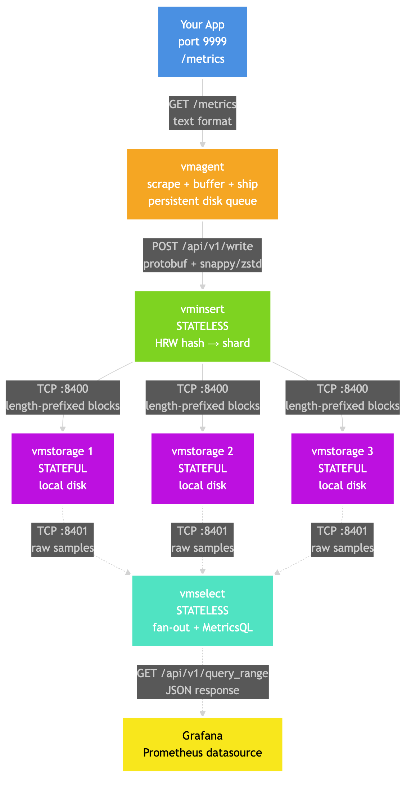
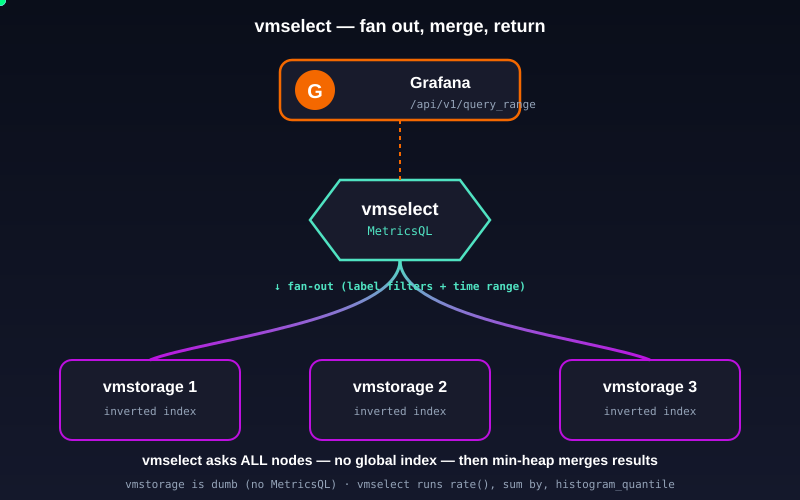

# How Metrics Flow in VictoriaMetrics — From `/metrics` to Grafana

You open Grafana. You see a beautiful CPU graph. A request rate chart. A latency histogram with p50, p95, and p99 lines stacked on top of each other. The data feels alive — points trickling in, lines extending to the right, the dashboard auto-refreshing every fifteen seconds.

You probably never thought about it, but those numbers traveled through **four different processes** before they ever showed up on your screen. The trip started inside your application's RAM, made its way through a courier daemon, got hashed and sharded across a fleet of storage nodes, slept on a disk for a while, got pulled back by a query engine, got merged with sibling samples from other shards, ran through a query language interpreter, and finally arrived as JSON for Grafana to render as pixels.

If your team uses Grafana with Prometheus-style metrics at any real scale, there's a very good chance you're already running **VictoriaMetrics** under the hood. It's the open-source TSDB that has quietly become the default behind hundreds of large engineering teams — Wix, Roblox, CERN, Criteo, Adidas, Razorpay's monitoring stack, and a long tail of Indian startups that hit Prometheus's limits and didn't want to pay for Datadog.

This article traces the **complete journey of one metric sample** — from your application's `/metrics` endpoint, through the four VictoriaMetrics cluster components, all the way back to your Grafana dashboard. We'll go deep on each component: the wire format, the algorithm, the data structure, the named flag you'd set in production. By the end, you should be able to draw the full pipeline on a whiteboard and explain every arrow.

> **In short:** A sample is born in your app's RAM, scraped by `vmagent`, sharded by `vminsert`, stored by `vmstorage`, and read back by `vmselect` — and Grafana never knows it's not talking to Prometheus.

---

## The Problem — Why Not Just Use Prometheus?

Prometheus is brilliant for the first ~1 million active series. It's a single binary. You give it a `prometheus.yml`, point it at some scrape targets, and it stores the data on local disk in its own TSDB. Grafana queries it. Done.

But the moment you try to scale Prometheus past a single box, you hit walls everywhere:

- **There is no horizontal write scaling.** Prometheus is a single process. If your scrape volume outgrows one machine, your only option is "buy a bigger machine." There is no built-in sharding.
- **There is no horizontal read scaling either.** All queries hit the same process. A single bad query (`{foo=~".*"}` over a year) can pin one CPU and starve every dashboard in your company.
- **Long-term storage is bolted on.** To keep more than ~15 days of data, you need Thanos, Cortex, M3, or Mimir — all of which add their own moving parts.
- **Compression is okay, not great.** Prometheus stores roughly 1.5–2.1 bytes per sample on disk for typical node_exporter workloads. At scale this is real money.
- **Retention is expensive.** Prometheus has to compact and rewrite old chunks as data ages. It's not "free deletion."
- **HA is awkward.** The official answer is "run two identical Prometheis side by side and dedupe in Thanos." It works, but you pay 2× for everything and the dedup is itself a moving part.

VictoriaMetrics looked at all of this and said: what if we **separated compute from storage**, used a custom storage engine inspired by ClickHouse's MergeTree, ditched the WAL entirely, compressed harder, made retention free, and shipped a drop-in Prometheus API so you didn't have to change Grafana? That's the cluster architecture in one sentence.

> **In short:** Prometheus is a single binary that doesn't shard. VictoriaMetrics cluster is the same job, split into four components — three of them stateless — so you can scale write capacity, read capacity, and storage capacity independently.

---

## Architecture Overview

The cluster has four components. Three of them are stateless and disposable. Only one holds durable data on disk.

| Component | Stateful? | Job |
|---|---|---|
| **vmagent** | No (small disk buffer) | Scrape `/metrics` endpoints, buffer, ship to `vminsert` |
| **vminsert** | No | Accept writes, hash each series, route to one or more `vmstorage` nodes |
| **vmstorage** | **YES** | Store samples on local disk, maintain inverted index, serve raw blocks to `vmselect` |
| **vmselect** | No (optional in-memory cache) | Accept queries, fan out to all `vmstorage` nodes, merge results, run MetricsQL |

The split exists because **storage is the only thing that genuinely needs state**. Compute (write path + read path) is stateless and scales by adding pods behind a load balancer. Storage scales by adding shards. This is the same shape as Cassandra, ClickHouse, and Snowflake — separate compute from storage so you can scale them independently and restart the stateless tier whenever you want without losing anything.

In a typical Kubernetes deployment:
- `vmagent` runs as a DaemonSet (one per node) or a scaled Deployment
- `vminsert` runs as a horizontally-scaled Deployment behind a `Service`
- `vmstorage` runs as a `StatefulSet` with one PVC per pod (local NVMe in production)
- `vmselect` runs as a horizontally-scaled Deployment behind another `Service`
- Grafana points its Prometheus datasource at the `vmselect` service URL



And the full journey of one sample, animated end-to-end:

<p align="center">
  
</p>

Watch the green orb leave your app, get scraped by vmagent, sharded by vminsert, stored on disk by vmstorage, queried back by vmselect, and finally land on the Grafana chart. That entire round-trip is what we're about to break down hop by hop.

> **In short:** Four components, three stateless, one stateful. Compute and storage scale independently. Grafana talks to vmselect over the Prometheus HTTP API and never knows the difference.

---

## Step 1 — Your Application Exposes Metrics on `:9999`

It starts in your app. Whether you write Go, Java, Python, Rust, or Node, the pattern is identical: link a Prometheus client library, declare a counter or gauge or histogram, and expose an HTTP endpoint that serializes the current values on demand.

```go
// Go example
import (
    "net/http"
    "github.com/prometheus/client_golang/prometheus"
    "github.com/prometheus/client_golang/prometheus/promauto"
    "github.com/prometheus/client_golang/prometheus/promhttp"
)

var requests = promauto.NewCounterVec(
    prometheus.CounterOpts{Name: "http_requests_total"},
    []string{"method", "status"},
)

// In your HTTP handler
func handler(w http.ResponseWriter, r *http.Request) {
    requests.WithLabelValues(r.Method, "200").Inc()
    // ... do real work
}

// Expose /metrics
func main() {
    http.Handle("/metrics", promhttp.Handler())
    http.ListenAndServe(":9999", nil)
}
```

That `Inc()` call isn't writing to a database. It isn't logging. It isn't sending anything over the network. It's incrementing a `uint64` **in process memory**, inside a struct held by the client library. Your app keeps a `map[label-set] → currentValue` for every metric, and `Inc()` just bumps the counter for the matching label combination.

When something hits `GET /metrics`, the client library walks every metric in its registry and serializes it as plain text in the **Prometheus exposition format**:

```
# HELP http_requests_total Total HTTP requests
# TYPE http_requests_total counter
http_requests_total{method="GET",status="200"} 1423
http_requests_total{method="POST",status="500"} 7
process_cpu_seconds_total 142.51
go_goroutines 89
```

That's it. No agent. No daemon. No sidecar. Just a plain HTTP endpoint that returns text. The metric only exists in your app's RAM until somebody asks for it. If your process dies, those counters are gone — and that's fine, because rates are computed by the scraper from successive snapshots, not from absolute values.

A few details that surprise people:

- **Counters never reset to anything except zero.** When your app restarts, the counter goes from `1423` back to `0`. The scraper detects this and treats it as a "counter reset" — `rate()` and `increase()` know to handle this edge case.
- **Histograms are just buckets.** A histogram metric is actually multiple counter time series under the hood — one per bucket boundary, plus `_sum` and `_count`. When you compute `histogram_quantile()`, you're interpolating across those bucket counters.
- **Labels create cardinality.** Every unique combination of label values is a separate time series. Adding a label like `user_id` is the most common production outage in observability — your active series count explodes overnight and your TSDB falls over.
- **The endpoint is HTTP only.** There's no push, no UDP, no gRPC. The client library only knows how to serve `/metrics` over HTTP and wait. This is a deliberate design choice — pull-based monitoring is healthier than push-based at scale because the scraper controls the rate and timing.

> **In short:** Your app doesn't push metrics. It just holds them in RAM and waits for someone to scrape them. The metric only becomes "real" when somebody hits `/metrics` over HTTP.

---

## Step 2 — `vmagent` Scrapes Your App

This is where `vmagent` enters the picture. It's a tiny binary (under 50 MB) that does **three jobs**: scrape, buffer, ship. It is functionally a drop-in replacement for Prometheus's "agent mode" — but with much better resource usage and a few extra features.

### Scrape configuration

`vmagent` reads a YAML config file with the **exact same syntax as Prometheus**. You can literally copy your existing `prometheus.yml` and point `vmagent` at it:

```yaml
scrape_configs:
  - job_name: my-api
    scrape_interval: 15s
    scrape_timeout: 10s
    static_configs:
      - targets: ['my-api-1:9999', 'my-api-2:9999', 'my-api-3:9999']

  - job_name: kubernetes-pods
    kubernetes_sd_configs:
      - role: pod
    relabel_configs:
      - source_labels: [__meta_kubernetes_pod_annotation_prometheus_io_scrape]
        action: keep
        regex: true
      - source_labels: [__meta_kubernetes_namespace]
        target_label: namespace
```

It supports every Prometheus service discovery type you might want: **Kubernetes**, Consul, EC2, GCE, Azure, OpenStack, Docker Swarm, Nomad, Eureka, DNS (SRV/A), file-based, HTTP-based, and static. In production you almost never list targets manually — you let `vmagent` discover pods automatically by scanning the Kubernetes API and filtering with `relabel_configs`.

### What happens on every scrape

Every `scrape_interval` (default 1 minute, typically configured to 15 seconds), `vmagent` sends `GET /metrics` to every discovered target. For each one:

1. It opens an HTTP connection (or reuses one from a keep-alive pool).
2. It receives the text exposition response (capped at 16 MB by `-promscrape.maxScrapeSize`).
3. It parses every line into a `(label set, timestamp, value)` triple.
4. It automatically adds two labels Prometheus-style: `job` (from your scrape config) and `instance` (from the target address).
5. It applies `metric_relabel_configs` to rewrite, drop, or keep specific samples.
6. It emits the standard Prometheus synthetic metrics for the scrape itself: `up` (1 on success, 0 on failure), `scrape_duration_seconds`, `scrape_samples_scraped`, `scrape_series_added`.

After parsing, an in-flight sample looks like this in `vmagent`'s memory:

```
TimeSeries {
  labels: [
    {name: "__name__", value: "http_requests_total"},
    {name: "method",   value: "GET"},
    {name: "status",   value: "200"},
    {name: "job",      value: "my-api"},
    {name: "instance", value: "10.0.1.5:9999"},
  ]
  samples: [
    {timestamp: 1733900000123, value: 1423.0}
  ]
}
```

Here's the scrape cycle visualized — every 15 seconds, `vmagent` pulls fresh data from your app and stages it for shipping:

<p align="center">
  
</p>

### Buffering — the persistent on-disk queue

This is `vmagent`'s killer feature. After parsing, samples don't go straight out the door. They go into a **fast queue** that is hybrid: an in-memory channel up to ~8 MB blocks, then it spills to disk under `-remoteWrite.tmpDataPath`. On disk, blocks are written into chunk files of about 500 MB each.

**Why this matters:** if `vminsert` is down, network is broken, or there's a deploy in progress, `vmagent` keeps scraping. It buffers everything to local disk. When the destination comes back online, the buffered samples replay in order — **zero data loss** for short outages, and graceful old-data-drop if the buffer hits its `-remoteWrite.maxDiskUsagePerURL` cap.

The official benchmark vs Prometheus Agent and Grafana Agent on 5,000 node_exporter targets makes the difference brutal:

| | vmagent | Grafana Agent | Prometheus Agent |
|---|---:|---:|---:|
| RSS memory | **2.2 GB** | 25.3 GB | 19 GB |
| Network egress | **4.78 MB/s** | 17.3 MB/s | 15.2 MB/s |
| CPU | **2.69 cores** | 4.16 | 3.69 |

And during a **remote storage outage**, `vmagent` RAM stayed flat at ~2 GB, while Grafana Agent ballooned to 17 GB and Prometheus Agent to 13.7 GB — because both of them buffer in RAM instead of spilling to disk like `vmagent` does.

### Shipping — the `remote_write` protocol

After buffering, `vmagent` ships samples to `vminsert` using the **Prometheus `remote_write` protocol**:

- Transport: HTTPS POST to `/api/v1/write`
- Body: a `WriteRequest` protobuf message
- Compression: Snappy by default — or **Zstandard** when both sides are VictoriaMetrics (auto-negotiated since v1.88, gives 2×–4× lower bandwidth)
- Headers: `Content-Encoding: snappy` (or `zstd`), `Content-Type: application/x-protobuf`, `X-Prometheus-Remote-Write-Version: 0.1.0`

The protobuf schema is dead simple — same one Prometheus uses:

```protobuf
message WriteRequest {
  repeated TimeSeries timeseries = 1;
}
message TimeSeries {
  repeated Label  labels  = 1;
  repeated Sample samples = 2;
}
message Sample { double value = 1; int64 timestamp = 2; }  // ms since Unix epoch
```

A single HTTP POST carries thousands of `TimeSeries`, each with one or more `(timestamp, float64)` samples. After Snappy compression, the wire size is roughly **~50 bytes per sample**. With Zstandard, it drops to ~12–25 bytes per sample. Multiply by hundreds of millions of samples per day and you understand why Cloudflare-scale shops care about the compression algorithm.

### Stream aggregation (advanced)

`vmagent` also supports **streaming aggregation** via `-streamAggr.config=/etc/stream-aggr.yaml`. This lets you compute per-deployment / per-namespace rollups (sum, avg, quantiles, histograms) **before** the data ever reaches storage. For high-cardinality workloads, streaming aggregation can shrink storage cost by 10× or more — instead of storing one series per pod, you store one series per deployment.

> **In short:** `vmagent` is the courier. It picks up metrics from your app, packages them in a tamper-proof envelope, and keeps a copy in its own bag in case the destination is closed. Zero data loss for short outages, drop-in Prometheus config, and 10× lighter than alternatives.

---

## Step 3 — `vminsert` Receives and Shards

The `vmagent`'s POST lands on a `vminsert` pod — randomly chosen by the Kubernetes Service load balancer. `vminsert` is **completely stateless**: it holds no durable data, can be killed any time, and you scale it by simply running more pods. There's no leader election, no coordination, nothing to back up.

Its job is one specific decision: **which `vmstorage` node should own this time series?**

### Building the shard key

For each incoming `TimeSeries`, `vminsert` builds a byte buffer in this exact order:

```
uint32(accountID) || uint32(projectID) ||
  for each label:
    uint16(len(name)) || name ||
    uint16(len(value)) || value
```

It then hashes this buffer with **xxhash64** — a fast, non-cryptographic hash function. That hash is the **shard key** for the time series.

> **Subtle gotcha:** by default, `vminsert` does NOT sort labels before hashing. If the same series arrives with labels in a different order (`{a, b, c}` vs `{c, b, a}`), it hashes differently and gets routed to a different `vmstorage`. Both nodes then think they own the series, the cardinality doubles, and the `storage/tsid` cache balloons. The fix is the **`-sortLabels=true` flag** — every production cluster should set it. Alternatively, ensure your scrapers always emit labels in a canonical order (most do, but it's not guaranteed).

### Picking a `vmstorage` — Rendezvous Hashing (HRW)

This part surprises most people. `vminsert` does **NOT** use a consistent hash ring with virtual nodes (the Cassandra/Dynamo model). It uses **Rendezvous Hashing**, also called **HRW (Highest Random Weight)**.

Each `vmstorage` node has a precomputed `xxhash64(node-address)`. For each incoming series hash `h`, `vminsert` iterates through ALL nodes and picks the one that maximises:

```
fastHashUint64(nodeHash XOR h)
```

The node with the highest mixed value wins. The full HRW selection animation:

<p align="center">
  
</p>

Watch the score bars rise for each candidate node. The middle node wins because its XOR-mixed score is highest. The selection is fully deterministic — every `vminsert` pod that sees the same series will route it to the same `vmstorage`.

**Why HRW instead of a hash ring?**

- **Adding or removing one node only moves `1/N` of series.** Same property as a consistent hash ring, but with simpler code and no virtual nodes.
- **Unlike Google's jump hash, HRW supports arbitrary node removal**, not just append-only growth — essential for handling temporarily-down nodes during rolling restarts.
- **HRW gives a total ordering of nodes** for each key, not just a "next node." This makes "pick the top K" trivial — and that's exactly what replication needs: just pick the top `replicationFactor` nodes from the ordering.
- **The math is dirt simple.** No virtual nodes to manage, no ring data structure to maintain. Just `N` xxhash64 calls and a max-search per write.

### Sending it to `vmstorage` over a custom binary protocol

Once the target node is picked, `vminsert` opens a **persistent TCP connection** (not HTTP) to `vmstorage` on **port 8400** and sends the block in a custom binary format:

```
[ 8-byte little-endian length ][ block payload (compressed) ]
```

After every block, `vmstorage` replies with **a single ACK byte**:

- `1` = success — data received and durably queued
- `2` = read-only — `vmstorage` is below `-storage.minFreeDiskSpaceBytes` (default 10 MB free) and refusing writes; `vminsert` will reroute

`vminsert` waits for the ACK before sending the next block. **This blocking ACK is the core backpressure mechanism** — a slow `vmstorage` naturally throttles its upstream. There's no separate flow-control protocol; just "send block, wait for byte, send next block."

### Replication

Set `-replicationFactor=N` on `vminsert` and each series gets written to the **top N nodes** from the HRW ordering. The cost is `N×` on CPU, RAM, disk, and network. Semantics are **at-least-once** — if at least one copy lands, the write is accepted. Deduplication happens later at query time on `vmselect`. You **must** also set `-replicationFactor=N` on `vmselect` and `-dedup.minScrapeInterval=1ms` so that the read side knows to dedupe replicated samples.

### Rerouting on failure

If a `vmstorage` is unreachable, `vminsert` reroutes new writes to the remaining healthy nodes (default behavior, controlled by `-disableRerouting`). Historical data on the dead node is **not migrated** — only new samples re-route. With `-replicationFactor >= 2`, the lost data is still readable from a replica.

### Multi-tenancy

`vminsert` supports multi-tenancy via the URL path: writes go to `/insert/<accountID>/prometheus/api/v1/write`. The `accountID` is encoded into every shard key (it's the first `uint32` in the buffer above), so tenants get clean isolation without needing separate clusters.

> **In short:** `vminsert` is the post office sorter. It xxhash64's the labels, picks a winner via Rendezvous Hashing, opens a persistent TCP connection to that vmstorage node, sends a length-prefixed block, and waits for one ACK byte before grabbing the next letter. Backpressure is built in. Replication is "pick top N." Failover is "reroute new writes."

---

## Step 4 — `vmstorage` Writes to Disk

`vmstorage` is the only stateful component. This is where samples actually live on disk. The storage engine is custom-built and inspired by **ClickHouse's MergeTree** (not the more famous RocksDB-style classical LSM). The whole design is unusual enough that it deserves a careful walk-through.

### The "part" — VictoriaMetrics's storage atom

A **part** is an immutable directory of column files. Inside a samples part you'll find:

- `timestamps.bin` — delta-of-delta compressed timestamps
- `values.bin` — Gorilla-XOR + Zstandard compressed float values (the largest file)
- `index.bin` — block headers describing block structure
- `metaindex.bin` — small top-level index, mmap'd into RAM for fast block lookup
- `metadata.json` / `parts.json` — the part manifest

Each block holds **up to 8,192 samples for a SINGLE time series** — so a block is a long run of same-series samples, which is exactly what makes delta and XOR compression efficient. Two adjacent samples for the same `http_requests_total{method="GET"}` are usually `15 seconds` and `+3` apart. Storing those deltas is much cheaper than storing two full timestamps and two full floats.

### The 5-second flush — and there is NO WAL

Here's the design choice that makes VictoriaMetrics genuinely different from Prometheus, InfluxDB, and Cassandra: **`vmstorage` has no Write-Ahead Log**.

The argument from VM creator Aliaksandr Valialkin: a WAL only provides durability if you `fsync` after every record. `fsync` tops out at ~1K–10K ops/sec on SSD. So most TSDBs `fsync` only periodically — Prometheus on segment boundaries, Cassandra every 10 seconds, InfluxDB on batch flushes. **All of them lose recently-inserted data on power loss anyway.** The WAL gives the illusion of durability, not actual durability.

VictoriaMetrics is honest about it. Samples flow through three tiers, each with a different durability promise:

1. **Tier 1 — Raw row shards.** Per-CPU-core in-memory append buffers, ~8 MB each. Rows here are **not yet queryable**. They're staging.
2. **Tier 2 — In-memory parts.** Flushed from raw shards every ~2 seconds. Now queryable. Still in RAM.
3. **Tier 3 — On-disk small parts.** Flushed from in-memory parts every **~5 seconds** (configurable via `-inmemoryDataFlushInterval`). Queryable, durable, on disk.

Watch a sample fall through the three tiers:

<p align="center">
  
</p>

The flush-to-disk protocol is the cleverest part:

1. Write the new part to `data/.../<part>.tmp/` — separate files for `timestamps.bin`, `values.bin`, etc.
2. Call `fsync` on each file.
3. Call `fsync` on the parent directory.
4. **Atomically `rename`** `<part>.tmp` → `<part>`. **This rename is the commit point.**

The atomic rename is guaranteed by POSIX. On crash recovery, `vmstorage` simply scans for `.tmp` directories — they're garbage from interrupted flushes — and deletes them. Committed parts are loaded from disk. **No log replay.**

The trade-off: up to ~5 seconds of samples can be lost on a hard crash. This is comparable to or better than Prometheus's WAL window in practice, and `vmstorage` running with the standard `SIGTERM` graceful shutdown loses zero data because it flushes everything before exiting.

### Compression — ~0.3 bytes per sample

VictoriaMetrics uses a custom compression pipeline that's much more aggressive than Prometheus's:

- **Timestamps:** delta-of-delta encoding. Most scrape intervals are near-constant (every 15s), so the second-order differences are tiny — usually zero — and compress to a few bits each.
- **Values:** float → integer pre-scaling first (multiply by `10^x` where possible — integers compress far better than IEEE 754 floats), then Gorilla-style XOR for the residual, then **Zstandard** as a finisher over the whole block.

The published benchmark on 24.5 billion node_exporter samples:

| | VictoriaMetrics | Prometheus |
|---|---:|---:|
| Disk used | **7.2 GB** | 52.3 GB |
| Bytes per sample | **~0.3** | ~2.1 |
| RAM | **4.3 GB** | 6.5 – 14 GB (spikes to 23) |
| Write throughput | ~15 MB/s peak | ~50 MB/s peak |
| Read throughput | ~15 MB/s peak | ~95 MB/s peak |

**That's roughly 7× less disk than Prometheus on the same data.** Multiply by years of retention and you understand the cost case.

### The inverted index (`indexdb`)

When a query asks for `up{job="api", env="prod"}`, `vmstorage` doesn't scan all data. It uses an inverted index — built on a separate, simpler engine called **`mergeset`** (a single-level LSM optimized for sorted byte-string keys).

`indexdb` stores **seven** logical mappings, each with a leading prefix byte:

| Prefix | Mapping | Scope |
|---|---|---|
| 1 | `tag=value → []MetricID` | global |
| 2 | `MetricID → TSID` | global |
| 3 | `MetricID → metric name (full label set)` | global |
| 4 | `DeletedMetricID` | global tombstones |
| 5 | `date → []MetricID` | per-day |
| 6 | `date + tag=value → []MetricID` | per-day |
| 7 | `date + metric name → TSID` | per-day |

Per-day indexes (5–7) are critical: they let queries narrow the search space to just the days in the time range, instead of scanning the global posting list across the entire 12-month retention.

For a query like `up{job="api", env="prod"}` over the last hour, the index walk is:

1. For each day in the time range (usually 1 day, occasionally 2 if it crosses UTC midnight), look up prefix 6 entries for `job=api` and `env=prod` and `__name__=up`. Each lookup returns a sorted list of `MetricID`s.
2. **Intersect** the sorted lists. The result is the set of MetricIDs that match all three label filters and were active that day.
3. For each surviving MetricID, look up prefix 2 to get the `TSID` (which contains the actual file pointers).
4. Use the TSIDs to read the matching blocks from `timestamps.bin` and `values.bin`.

### Per-day partitioning and free retention

Samples land in `data/{small,big}/<YYYYMMDD>/`. **One UTC day per partition.** When a partition falls outside `-retentionPeriod`, `vmstorage` simply `rm -rf`'s the directory. Cost is O(directory size) I/O, independent of sample count.

Compare this to Prometheus, which has to compact and rewrite chunks as data ages. VictoriaMetrics retention is essentially **free**. Adding 90 days of retention doesn't cost you anything in CPU — it just costs more disk space proportional to the new data you're keeping.

### Background merges

Like any LSM-style engine, `vmstorage` continuously merges small parts into bigger ones to keep the part count bounded. Merges happen in the background, are crash-safe (via the same atomic-rename protocol), and deduplicate samples if `-dedup.minScrapeInterval > 0`. There's no scheduled compaction — merges happen opportunistically based on part-size ratios, similar to ClickHouse.

> **In short:** `vmstorage` is a notebook with one page per UTC day. New entries get scribbled in the margin (raw shards), then copied neatly onto the page in batches (in-memory parts), then committed by tearing the page out of the scribble pad and stapling it into the binder (atomic rename). Old pages get torn out wholesale when retention expires. There's no "draft log" — durability comes from fsync + atomic rename, not from a WAL.

---

## Step 5 — Grafana Queries `vmselect`

You open Grafana. The dashboard fires:

```
GET /select/0/prometheus/api/v1/query_range
    ?query=rate(http_requests_total{job="api"}[5m])
    &start=1733900000
    &end=1733903600
    &step=15s
```

Grafana **thinks it's talking to Prometheus**. It has no idea VictoriaMetrics exists — and it doesn't need to, because `vmselect` exposes the **exact same Prometheus HTTP API**. You just point Grafana's Prometheus datasource at `http://vmselect:8481/select/0/prometheus`. Done.

`vmselect` is stateless. Any pod can serve any query. You scale by adding more pods behind a Service.

### Parsing — MetricsQL

`vmselect` parses the query into an AST using the standalone `metricsql` Go package. The query language is **MetricsQL** — a PromQL superset. Existing Prometheus dashboards work unchanged because every PromQL function is also a MetricsQL function. But MetricsQL also adds:

- **`keep_metric_names` modifier** — `rate({__name__=~"foo|bar"}[5m]) keep_metric_names` preserves the metric names in the output. PromQL strips them.
- **`rollup_rate`, `rollup_increase`, `rollup_candlestick`** — multi-stat rollups that compute several stats in one pass.
- **`[1i]` duration literal** meaning "one step interval." `rate(metric)` with no bracket is automatically `rate(metric[$__interval])`.
- **A correctness fix on `rate()` and `increase()`** that uses the sample BEFORE the lookback window — closer to what users actually expect.
- **Better error messages** with hints about likely fixes.
- **`WITH` templates** for DRY queries (let bindings, not in PromQL).
- **More analytics functions** — `holt_winters`, `hoeffding_bound_*`, `zscore_over_time`, `mad_over_time`, etc.

MetricsQL is positioned as backward-compatible with PromQL. In practice, dashboards built against Prometheus work unchanged.

### The fan-out

Here's the part that surprises people: `vmselect` does NOT know which `vmstorage` node holds which series. There's no global index. So it does the only thing it can — **it asks every single `vmstorage` node**.

The fan-out and merge phase, animated:

<p align="center">
  
</p>

For each query, `vmselect` opens TCP connections to all `vmstorage` nodes on **port 8401** (different from the `vminsert` port 8400 — the same `vmstorage` process listens on both, one for writes and one for reads) and sends a binary RPC request. Crucially, it does NOT send the parsed MetricsQL AST. It sends a much simpler `SearchQuery`:

- Time range (start, end in ms)
- Tag filters (the label matchers extracted from the query: `__name__="http_requests_total"`, `job="api"`)
- Account/project ID for multi-tenancy

`vmstorage` is "dumb" relative to MetricsQL. It knows nothing about `rate()`, `sum`, or `histogram_quantile`. Its job is just:

1. Walk the inverted index (`indexdb` prefixes 1, 2, 3, 5, 6, 7) to find matching `MetricID`s
2. Resolve those to `TSID`s
3. Read the matching blocks from `timestamps.bin` and `values.bin`
4. Decompress them
5. Stream the raw `(timestamp, value)` samples back to `vmselect` over the same TCP connection

All MetricsQL evaluation — `rate()`, `sum by (label)`, `histogram_quantile` — happens on **`vmselect`**, never on `vmstorage`. This is the crucial separation: storage nodes do dumb data fetching, query nodes do smart aggregation. It means `vmstorage` stays simple, CPU-cheap, and easy to scale by adding shards.

### Merge and dedup

`vmselect` collects block streams from each `vmstorage` into in-memory buffers. Oversized result sets spill to temp files at `cacheDataPath/tmp/searchResults`. Then `mergeSortBlocks()` runs a **min-heap merge** over the sorted blocks, producing one globally time-sorted stream per series.

When `replicationFactor > 1`, the same sample arrives from multiple replicas. `vmselect` deduplicates them — but **only if you set `-dedup.minScrapeInterval=1ms`**. Without this flag, functions like `sum_over_time` and `count_over_time` will silently double-count replicated samples. This is one of the most common production gotchas in HA VictoriaMetrics deployments.

### MetricsQL execution

With the merged sample stream in hand, `vmselect` walks the AST recursively:

- `MetricExpr` → fetch series (already done by the fan-out)
- `RollupExpr` → apply `rate(http_requests_total[5m])` → for each series, slide a 5-minute window across the samples and compute the per-second rate
- `AggrFuncExpr` → `sum by (status)` → group by `status` label, sum across grouped series
- `BinaryOpExpr` → arithmetic between series (`a / b`, `a > b`)
- `FuncExpr` → transform functions (`abs`, `round`, `clamp_max`)

For aggregations like `sum`, `avg`, `min`, `max`, `vmselect` uses **incremental aggregation** — it processes series in batches, updating running totals as data streams in, instead of materializing every input series in memory at once. Functions that need all data at once (`quantile`, `histogram_quantile`) can't do this and are more memory-hungry, which is why a single `histogram_quantile(0.99, sum by (le) (rate(...)))` query over a year-long range can OOM your `vmselect` if cardinality is high.

### The rollup result cache

`vmselect` caches query results in memory (up to 12.5% of `-memory.allowedPercent`, which itself defaults to 60% of system RAM). The cache key is `expression + step-aligned start/end + step duration`. The last 5 minutes of any range query is **excluded from caching** because late samples might still arrive (`-search.cacheTimestampOffset` default 5m).

This is why range queries for "last 24 hours" hit the cache hard — the older 23h55m of data is stable and cached, the last 5m gets recomputed every time. It's also why opening the same dashboard twice in 10 seconds is essentially free.

### Concurrency limits

`vmselect` protects itself with hard limits:

- `-search.maxConcurrentRequests` default `2 × CPU cores`, **capped at 16**
- `-search.maxQueueDuration` default 10s — wait queue for over-limit requests
- `-search.maxQueryDuration` default 30s
- `-search.maxUniqueTimeseries` — caps how many series a single query can touch (defense against label explosion)

If you blow these limits, you get HTTP 429 with a clear error message telling you which limit you hit.

### Back to Grafana

After execution, `vmselect` formats the result as JSON in the **Prometheus HTTP API response shape**:

```json
{
  "status": "success",
  "data": {
    "resultType": "matrix",
    "result": [
      {
        "metric": {"__name__": "http_requests_total", "method": "GET"},
        "values": [
          [1733900000, "1423"],
          [1733900015, "1431"],
          [1733900030, "1438"]
        ]
      }
    ]
  }
}
```

Grafana receives the JSON, parses the matrix, and renders it as the line you see on the dashboard. The journey is complete. Your `Inc()` call from Step 1 just made it onto a screen.

> **In short:** `vmselect` is the librarian. It can't remember which shelf any book is on, so it asks every aisle in parallel, collects all matching books, sorts them by date in a min-heap merge, runs MetricsQL over the merged stream, formats the result as Prometheus-shaped JSON, and ships it to Grafana — which has no idea Prometheus isn't on the other end.

---

## End-to-End Walk-Through

Let's trace one specific sample — `http_requests_total{method="GET",status="200"} 1423` — through the entire pipeline, hop by hop, second by second.

**T = 0.000s** — A user hits your `GET /api/users` endpoint. Your handler does its work and calls `requests.WithLabelValues("GET", "200").Inc()`. The Prometheus Go client library increments the in-RAM counter for the `(GET, 200)` label combination from 1422 to **1423**. No network, no disk, just a `uint64` increment.

**T = 0.000s — 14.999s** — The counter sits in your app's RAM. Other requests come in and bump it further. Maybe it reaches 1438 by the end of this window. Nothing else happens.

**T = 15.000s** — `vmagent` fires its scheduled scrape. It opens an HTTP connection to `your-app:9999`, sends `GET /metrics`, and gets back the text exposition response. Among hundreds of lines, one of them is:
```
http_requests_total{method="GET",status="200"} 1438
```
`vmagent` parses this into a `TimeSeries` with five labels (`__name__`, `method`, `status`, `job`, `instance`) and one sample `(timestamp=1733900015000, value=1438)`. It applies `metric_relabel_configs` (none for this sample). It writes the parsed sample into its in-memory write queue.

**T = 15.001s** — A few milliseconds later, the in-memory queue hits its block size threshold. `vmagent` flushes the block to its persistent on-disk queue under `/var/lib/vmagent/`.

**T = 15.005s** — One of `vmagent`'s remote-write workers picks up the block, compresses it with Zstandard, and POSTs it to `http://vminsert:8480/insert/0/prometheus/api/v1/write`. The Kubernetes Service load-balances the request to a randomly chosen `vminsert` pod.

**T = 15.010s** — `vminsert` decompresses the block, parses the protobuf, and processes each `TimeSeries` independently. For our sample, it builds the canonical byte buffer:
```
[uint32 accountID=0][uint32 projectID=0]
[uint16 len=8]"__name__"[uint16 len=19]"http_requests_total"
[uint16 len=6]"method" [uint16 len=3]"GET"
[uint16 len=6]"status" [uint16 len=3]"200"
[uint16 len=3]"job"    [uint16 len=6]"my-api"
[uint16 len=8]"instance"[uint16 len=14]"10.0.1.5:9999"
```
It hashes this with `xxhash64()` → `0xA3F9C8...`. Then it iterates through all 3 vmstorage nodes, computes `fastHashUint64(nodeHash XOR seriesHash)` for each, and picks the maximum. In our scenario, that's `vmstorage-2`.

**T = 15.012s** — `vminsert` sends the block over its persistent TCP connection to `vmstorage-2:8400`. The wire format is `[8-byte length][block bytes]`. It then waits.

**T = 15.014s** — `vmstorage-2` reads the length header, reads the block payload, decompresses it, and dispatches each row into the right per-CPU raw row shard (Tier 1). Our sample lands in shard #4 (because the hashing landed on CPU 4). It writes the ACK byte `1` back to `vminsert`.

**T = 15.014s** — `vminsert` reads the ACK byte. It can now send the next block.

**T = 17.000s** — About 2 seconds later, `vmstorage`'s flush timer fires. The raw row shards get rolled into in-memory parts (Tier 2). Our sample is now queryable from `vmselect`. It still lives in RAM.

**T = 22.000s** — Another 5 seconds pass. The in-memory parts get flushed to disk. `vmstorage` writes new files into `data/small/20251204/<part-id>.tmp/`, calls `fsync` on each file, calls `fsync` on the directory, and atomically renames the directory to drop the `.tmp` suffix. **This rename is the commit.** Our sample is now durably stored.

**T = 60.000s** — 45 seconds later, you open Grafana. Your dashboard fires `rate(http_requests_total{method="GET"}[5m])` over the last hour. Grafana sends this as `GET /api/v1/query_range` to the `vmselect` Service.

**T = 60.005s** — The Kubernetes Service picks a random `vmselect` pod. `vmselect` parses the MetricsQL query into an AST. The cache lookup misses (this is a fresh range). `vmselect` extracts the label filters (`__name__="http_requests_total"`, `method="GET"`) and the time range. It opens TCP connections to **all 3 vmstorage nodes** on port 8401 and sends a `SearchQuery` RPC to each.

**T = 60.010s** — Each `vmstorage` walks its inverted index to find matching MetricIDs, resolves them to TSIDs, reads the matching blocks from disk (or memory if recent), decompresses them, and starts streaming raw `(timestamp, value)` samples back to `vmselect`. **Our specific sample comes back from `vmstorage-2`** because that's where it was sharded.

**T = 60.030s** — `vmselect` collects sample streams from all 3 nodes into in-memory buffers. It runs `mergeSortBlocks()` — a min-heap merge that produces one globally time-sorted stream per series. For replicated setups (`replicationFactor > 1`), it dedupes samples here.

**T = 60.040s** — `vmselect` walks the MetricsQL AST. The outer node is a `RollupExpr` (`rate(...[5m])`). For each series in the merged stream, it slides a 5-minute window across the samples and computes the per-second rate. The result is a smaller set of series (one per unique label combination) with derived rate values.

**T = 60.045s** — `vmselect` formats the result as Prometheus-shaped JSON and writes it back to the HTTP response.

**T = 60.060s** — Grafana receives the JSON, parses the matrix, and renders the line on the chart. **Your sample from T=15s is now a pixel on the screen.**

The whole journey takes around 60 seconds end-to-end if you query immediately. The two slowest hops are: (1) waiting for `vmagent` to scrape (up to 15 seconds), and (2) waiting for `vmstorage` to flush in-memory parts to disk (up to 5 seconds, but querying happens against in-memory parts as soon as they exist, so this doesn't actually delay the read path).

> **In short:** Your Inc() lives in app RAM for 0–15 seconds, gets scraped, gets sharded by xxhash, gets ACK'd by one storage node, becomes queryable in ~2s, becomes durable in ~5s, gets fanned out and merged on the read side, runs through MetricsQL, and lands as JSON on Grafana. Total round-trip: under a minute.

---

## Why This Architecture Wins

Compared to single-node Prometheus, the VictoriaMetrics cluster gives you a long list of concrete wins:

| Property | Prometheus | VictoriaMetrics cluster |
|---|---|---|
| Horizontal write scaling | ❌ single binary | ✅ add `vminsert` pods |
| Horizontal read scaling | ❌ single binary | ✅ add `vmselect` pods |
| Horizontal storage scaling | ❌ single disk | ✅ add `vmstorage` shards |
| Bytes per sample on disk | ~2.1 | **~0.3** (7× better) |
| RAM per million series | ~3 GB | **~1 GB** |
| Long-term storage | needs Thanos/Cortex | **built in** |
| Built-in HA | needs duplicated Prometheis | **`-replicationFactor=N`** |
| Retention deletion cost | proportional to chunks | **proportional to directory** (essentially free) |
| Has a WAL | yes (replays on crash) | **no** (atomic rename = commit) |
| Persistent buffer on agent | no | **`vmagent` disk queue** |
| Drop-in Prometheus API | n/a (it IS the API) | **yes** (Grafana works unchanged) |
| Query language | PromQL | **MetricsQL** (PromQL superset) |

And from the production benchmarks:
- **Single-node VictoriaMetrics** can sustain ~100M active series and ~2M samples/sec on one box.
- **Cluster mode** can sustain billions of active series and hundreds of millions of samples/sec across the fleet.
- The 100M samples/sec benchmark used 16 `vmagent` replicas (8 vCPU, 25 GB RAM each), pushing ~2 GB/s of compressed network traffic into the cluster.

The trade-off is more moving parts. Single-node VictoriaMetrics is one binary and is plenty for most teams up to ~1M active series. Cluster mode is for the ones who need to ingest hundreds of thousands of samples per second, store billions of active series, or run with multi-tenant isolation.

> **In short:** Cluster VictoriaMetrics is "Prometheus-compatible, horizontally scalable, 7× cheaper on disk, and uses an honest no-WAL durability model." If you're hitting Prometheus's single-binary ceiling and don't want to pay Datadog, this is the migration target.

---

## Common Production Gotchas

A few things that bite people in real deployments — worth knowing before you ship this to prod:

1. **Always set `-sortLabels=true` on `vminsert`.** Otherwise label-order differences create duplicate series and inflate cardinality.
2. **Always set `-dedup.minScrapeInterval=1ms` on `vmselect`** when you use `-replicationFactor > 1`. Without it, `sum_over_time` and friends double-count replicated samples.
3. **Size your `vmagent` `-remoteWrite.maxDiskUsagePerURL`** to a multiple of 500 MB. Below that, the persistent queue can't function reliably. Most teams set it to 10–50 GB so a multi-hour outage doesn't lose data.
4. **Enable streaming aggregation** for high-cardinality workloads. Aggregating per-deployment instead of per-pod can shrink your active series count by 100×.
5. **Watch `vm_slow_row_inserts_total`.** This counter ticks whenever a "new" series shows up that wasn't in the TSID cache. A high rate means you have a churn problem (rolling deploys with `pod_id` labels are the usual culprit).
6. **Use NVMe local disk for `vmstorage`, not network block storage.** The atomic-rename commit protocol relies on fast `fsync`, and the merge engine is throughput-heavy. EBS gp3 works but NVMe is dramatically better.
7. **Don't forget to back up your `vmstorage` snapshots.** `vmstorage` supports atomic snapshots via hardlinks (`/snapshot/create` HTTP endpoint). Use this with `vmbackup` or your own tooling — local disk durability doesn't survive hardware failure.
8. **Set `-storageNode` to the same list, in the same order, on every `vminsert` pod.** HRW is deterministic only if all pods agree on the node set.

> **In short:** The defaults are mostly good, but a few flags (`-sortLabels`, `-dedup.minScrapeInterval`, `-remoteWrite.maxDiskUsagePerURL`) and one habit (NVMe + snapshots) separate "works in dev" from "survives production."

---

## References

- [VictoriaMetrics: Cluster docs](https://docs.victoriametrics.com/cluster-victoriametrics/)
- [vmagent: official docs](https://docs.victoriametrics.com/vmagent/)
- [vmagent: how it works (engineering blog)](https://victoriametrics.com/blog/vmagent-how-it-works/)
- [Comparing vmagent vs Prometheus Agent vs Grafana Agent](https://victoriametrics.com/blog/comparing-agents-for-scraping/)
- [When metrics meet vminsert: a data delivery story](https://victoriametrics.com/blog/vminsert-how-it-works/)
- [How vmstorage handles data ingestion](https://victoriametrics.com/blog/vmstorage-how-it-handles-data-ingestion/)
- [vmstorage: retention, merging, deduplication](https://victoriametrics.com/blog/vmstorage-retention-merging-deduplication/)
- [vmstorage: how indexdb works](https://victoriametrics.com/blog/vmstorage-how-indexdb-works/)
- [WAL usage looks broken in modern TSDBs — Aliaksandr Valialkin](https://valyala.medium.com/wal-usage-looks-broken-in-modern-time-series-databases-b62a627ab704)
- [Inside vmselect: query processing engine](https://victoriametrics.com/blog/vmselect-how-it-works/)
- [How vmstorage handles query requests from vmselect](https://victoriametrics.com/blog/vmstorage-how-it-handles-query-requests/)
- [MetricsQL docs](https://docs.victoriametrics.com/metricsql/)
- [Save network costs with VictoriaMetrics remote write protocol](https://victoriametrics.com/blog/victoriametrics-remote-write/)
- [Prometheus vs VictoriaMetrics benchmark on node_exporter](https://valyala.medium.com/prometheus-vs-victoriametrics-benchmark-on-node-exporter-metrics-4ca29c75590f)
- [Prometheus remote_write protocol spec](https://prometheus.io/docs/specs/prw/remote_write_spec/)
- [How VictoriaMetrics makes instant snapshots for multi-terabyte time series data](https://valyala.medium.com/how-victoriametrics-makes-instant-snapshots-for-multi-terabyte-time-series-data-e1f3fb0e0282)

---

## Hashtags

#systemdesign #softwareengineer #coding #devops #observability #monitoring #prometheus #grafana #victoriametrics #metrics #sre #timeseries
