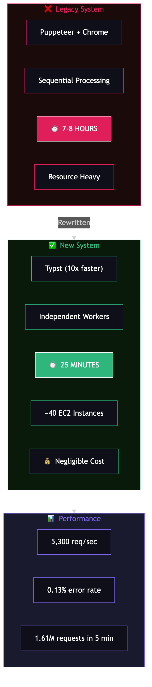
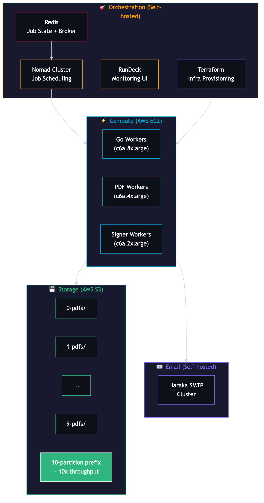

# Zerodha: 1.5 Million PDFs in 25 Minutes — How India's Largest Broker Generates Contract Notes

Every trading day, Zerodha must generate a digitally signed PDF contract note for every user who transacted. According to [their engineering blog](https://zerodha.tech/blog/1-5-million-pdfs-in-25-minutes/), that's **1.5+ million PDFs** daily — and it can double on volatile days. The legacy system took **7-8 hours**. The new system? **~25 minutes.**

Here's how they built it.

---

## The Problem

Indian stock brokers are **regulated** to send digitally signed PDF contract notes to every user after each trading day. The contract note contains details of every trade executed, and must be delivered before the next trading day begins.

At Zerodha's scale:
- **1.5+ million** users transact daily
- **~7 million** ephemeral files generated per session (PDFs, signed copies, intermediate files)
- PDF sizes range from **100KB-200KB** typical, up to **MBs** for heavy traders
- Largest single PDF: **~2,000 pages**

The legacy system using Puppeteer + headless Chrome took **7-8 hours** to process everything. That left almost no margin before the next trading day.

---

## The Pipeline — 4 Independent Steps

The key architectural insight: the entire workflow is composed of **independent units of work**. Data processing, PDF generation, signing, and emailing can all have independent workers doing their respective jobs.

### Step 1: Data Processing (Go)

Exchange CSV dumps arrive after market close. Go workers process this data and prepare it for PDF generation. Originally Python + Jinja templates, rewritten in Go for concurrency and speed.

### Step 2: PDF Generation (Typst)

This is where the biggest performance gain came from. The evolution:

| Engine | Performance | Issue |
|--------|------------|-------|
| **Puppeteer + Chrome** | Slow, resource-heavy | Legacy — required headless browser per PDF |
| **pdflatex** | Faster | Memory limits for large PDFs |
| **lualatex** | Handles large PDFs | Cryptic errors on 1000+ page docs |
| **Typst** | **Significantly faster** | Single static binary, no Docker bloat |

Typst is the winner. Per the blog, a **~2,000-page PDF** that took **~18 minutes with lualatex** compiles in **~1 minute with Typst** — a dramatic improvement for their largest documents.

Typst is also a single static binary — no massive TeX bundle Docker images needed. Smaller images = faster startup = faster scaling.

### Step 3: Digital Signing (Java/OpenPDF)

A Java-based HTTP server using the **OpenPDF library** handles signing. Deployed as a sidecar service — single JVM boot, handles concurrent signing requests. This is the one component that stayed in Java because OpenPDF is a mature, regulation-compliant PDF signing library.

### Step 4: Email Dispatch (Self-hosted Haraka SMTP)

Signed PDFs are emailed via a self-hosted **Haraka SMTP cluster**. Haraka replaced Postal (which was a bottleneck). Haraka scales horizontally — add nodes, send more emails. Zerodha built a custom Go library called `smtppool` for high-throughput email dispatch.

---

## The Numbers

| Metric | Value | Source |
|--------|-------|--------|
| PDFs generated per session | **1.5+ million** | Zerodha Tech Blog |
| Total time | **~25 minutes** | Zerodha Tech Blog |
| Legacy time | **7-8 hours** | Zerodha Tech Blog |
| Trial run throughput | **1.61M requests in 5 min** | Zerodha Tech Blog |
| Requests per second | **~5,300/sec** | Zerodha Tech Blog |
| Error rate | **0.13%** | Zerodha Tech Blog |
| EC2 instances used | **~40** | Zerodha Tech Blog |
| Instance types | c6a.8xlarge, c6a.2xlarge, c6a.4xlarge | Zerodha Tech Blog |
| Ephemeral files per session | **~7 million** | Zerodha Tech Blog |
| Cost | **"Negligible"** (their words — relative to scale) | Zerodha Tech Blog (direct quote) |

---

## Infrastructure

Zerodha runs a **hybrid setup** — self-hosted orchestration + AWS compute.

### Self-hosted
- **Nomad cluster** — orchestrates Go worker binaries across EC2 nodes. Provisioned fresh nightly via Terraform.
- **Redis** — job state storage + message broker
- **Haraka SMTP cluster** — auto-scaling email dispatch
- **RunDeck** — monitoring UI, streams job statuses from Redis in real-time

### AWS
- **EC2** — compute for workers (~40 instances)
- **S3** — ephemeral file storage (PDFs, signed copies)
- **Terraform** — provisions ASGs, launch templates, IAM roles

### Execution Flow

1. **Initialization**: Terraform provisions Nomad server + client nodes
2. **Job Deployment**: Nomad deploys Go worker binaries (pulled from S3). System jobs ensure one instance per node. Constraints route tasks to correct ASGs (PDF workers vs signer workers vs email workers).
3. **Teardown**: Monitor Redis job count → Terraform destroy → reset ASGs to 0, drain nodes, halt jobs

Infrastructure is **ephemeral** — provisioned for the job, destroyed after.

---

## The S3 Rate Limit Problem

During trial runs, Zerodha hit AWS S3 rate limits at ~5.3k requests/second:

**S3 limits per prefix:**
- PUT/COPY/POST/DELETE: 3,500 req/sec
- GET/HEAD: 5,500 req/sec

Despite using KSUIDs (unique IDs) as prefixes, all requests were routing to a **single S3 partition** (`2CTgQ`). S3's auto-partitioning wasn't distributing load fast enough.

**Solution:** Fixed **10-partition prefix schema** — `{0-9}-{pdfs, signed_pdfs, contract_notes}`. This distributes load evenly across 10 partitions, effectively **multiplying capacity by 10x**. AWS team also pre-warmed the partitions.

Error rate dropped to **0.13%** with 10 retry attempts.

---

## Storage Evaluation

Before choosing S3, Zerodha benchmarked multiple storage options:

| Storage | Latency | Issue |
|---------|---------|-------|
| **EFS General Purpose** | 4-5 seconds | Hit 35k ops/sec limit |
| **EFS Max I/O** | 17-18 seconds | Too slow |
| **EBS** | 400ms | Fastest, but not shared storage |
| **S3** | 4-5 seconds | Chosen — cost-effective, scalable, shared |

S3 won because it's shared (all workers can access), cost-effective, and the rate limit problem was solvable with partitioning.

---

## Why This Works — The System Design Lesson

1. **Independent workers** — Each pipeline step (processing, generation, signing, emailing) runs as separate workers. No step blocks another. Scale each independently.

2. **Right tool for each job** — Go for data processing (concurrency), Typst for PDF generation (speed), Java for signing (mature library), Haraka for SMTP (horizontal scaling).

3. **Ephemeral infrastructure** — Provision for the job, destroy after. No idle resources. This is why cost is "negligible."

4. **Simple tools at scale** — No Kubernetes. No microservice mesh. Nomad + Terraform + Redis. Sometimes the simplest orchestration wins.

5. **Partition your bottlenecks** — S3 rate limits were solved by understanding how S3 partitions work and designing prefix schemas accordingly.

---

## Zerodha Context

As of their "Hello World" engineering blog post (2020):
- **30-member tech team** built India's largest stock broker from scratch
- **7+ million trades daily** (vs. Charles Schwab's 2.7M)
- **1+ billion trades annually**
- **15-20%** of all Indian retail trading volume
- Tech stack: Go, Python/Django, Java, VueJS, Flutter
- Databases: Self-managed PostgreSQL (hundreds of billions of rows), MySQL (billions of rows)
- **Self-host everything**: intranet, HR, CRM, chat, mail servers, databases, proxies
- Philosophy: *"A tech team should be run with a developer-centric approach, not business or management-centric one."*

Source: [zerodha.tech/blog/hello-world/](https://zerodha.tech/blog/hello-world/)

---

## References

- [1.5+ million PDFs in 25 minutes — Zerodha Tech Blog](https://zerodha.tech/blog/1-5-million-pdfs-in-25-minutes/) — Primary source for all pipeline and performance details
- [Hello, World! — Zerodha Tech Blog](https://zerodha.tech/blog/hello-world/) — Team size, scale numbers, philosophy
- [Typst](https://typst.app/) — The PDF generation engine that replaced LaTeX

---

## Hashtags

#zerodha #systemdesign #performanceengineering #pdf #go #golang #typst #aws #s3 #nomad #terraform #india #fintech #techarchitecture #softwareengineering #scalability #coding #devops
