## How we eliminated ~$10K/year in AWS cross-zone data transfer costs with zone-aware Kubernetes

Our production EKS cluster was quietly handing AWS an extra ~$10,000 per year. The workload was fine. The traffic was normal. The cluster was healthy. And yet, every single day, 2–3 TB of data was being transferred between availability zones just to scrape metrics — **and AWS was billing us for every byte, in both directions**.

This is the story of how one misunderstood line item on the AWS bill led us down a rabbit hole through Kubernetes service discovery, Prometheus-style scraping, and a subtle fact that every engineer running metrics on EKS should know: **Topology Aware Routing does not save your scraper traffic**.

The fix wasn't glamorous. A Kyverno policy. A `nodeSelector`. A handful of relabeling rules. But the result was loud: cross-AZ transfer dropped to effectively zero, monthly AWS charges collapsed by $600–$900, and the vmagent fleet even got ~30% cheaper on CPU and memory as a side effect.

If you're running any Prometheus-style metrics pipeline on EKS — VictoriaMetrics, Prometheus Operator, Grafana Agent, whatever — this pattern is almost certainly waiting in your bill. Let's pull it apart.

### The problem nobody looks at

AWS makes a lot of noise about internet egress pricing, but the cost killer for most Kubernetes workloads is a different line item: **inter-AZ data transfer inside the same region**. Every byte of VPC traffic that crosses an availability zone boundary is metered, and it's metered on **both ends of the connection**.

The official AWS VPC pricing page states `$0.01/GB` per direction. The subtle part — documented but easy to miss — is that "per direction" means **both the sending AZ and the receiving AZ get billed the same $0.01/GB for the same byte**. So a single gigabyte of cross-AZ traffic actually costs you **$0.02 per GB of data moved**. Corey Quinn's *Last Week in AWS* has an excellent experimental writeup confirming this: 10 GB of cross-AZ traffic shows up as 20¢ on the bill, not 10¢.

At our scale — a 136-node cluster with 1000+ pods spread across `ap-south-1a` and `ap-south-1c` — the monitoring stack alone was pushing 2–3 TB/day across the zone boundary. Do the math:

```
2.5 TB/day × 1024 GB × $0.02/GB  =  $51.20/day
$51.20/day × 30 days             =  $1,536/month peak
Observed bill: $600 – $900/month
Annual burn: ~$7,200 – $10,800
```

No application was misbehaving. No customer request crossed a zone boundary unnecessarily. It was **purely metrics scraping** — vmagent pods in Zone A reaching out to scrape application pods in Zone C, and vice versa, all day, every day.

> **In short:** AWS charges $0.02/GB *effective* for cross-AZ traffic (not $0.01), and metric scraping at scale is one of the biggest hidden sources of it.

### The architecture before the fix



Every vmagent pod was a cross-zone offender. The deployment scheduled vmagent replicas across both AZs for HA, but `VMServiceScrape` objects had no zone filter — so every vmagent discovered every pod in the cluster and scraped them all, regardless of zone.

Our VictoriaMetrics stack looked like this:

- **vmagent** — scrape-time component. Pulls `/metrics` from application pods and forwards samples to vminsert. The biggest cross-AZ offender.
- **vminsert** — ingest router. Hashes series into vmstorage shards (zone-agnostic by design).
- **vmstorage** — time-series store. Stateful shards, one per AZ in our setup.
- **vmselect** — query fan-out. Queries span all vmstorage instances (cross-AZ is unavoidable here, but low volume).

The concentrated pain was the vmagent → app-pod scrape path. Hundreds of `ServiceScrape` targets × thousands of metrics × 30-second scrape interval × zero zone awareness = 2–3 TB/day of pure cross-zone noise.

> **In short:** The vmagent → pod scrape fan-out was the hot path. Everything else was rounding error.

### Why "just enable Topology Aware Routing" doesn't work here



This was the first wrong turn. The obvious instinct is: *"Kubernetes has native zone-aware routing now — just enable it."* Kubernetes shipped **Topology Aware Hints** (TAH) in 1.21 (GA in 1.24), renamed to **Topology Aware Routing**, and followed it up with `spec.trafficDistribution: PreferClose` in 1.31 as a cleaner API.

All three mechanisms do the same thing: they influence **which endpoint kube-proxy picks when a client pod talks to a ClusterIP Service**. They work by populating `hints.forZone` on `EndpointSlice` objects, and kube-proxy reads those hints when doing iptables/eBPF load-balancing.

Here's the catch: **Prometheus-style scrapers don't go through a Service.** They go through the Kubernetes API directly.

When vmagent (or Prometheus, or Grafana Agent) starts up, it uses Kubernetes service discovery (`kubernetes_sd_configs`) to query the API server and pull a list of every pod matching its scrape selectors. It gets back raw `Pod` objects with pod IPs, and it opens TCP connections directly to those pod IPs. The ClusterIP Service is never in the picture. kube-proxy is never in the picture. And therefore **TAH, topology-mode, and trafficDistribution are all invisible to it**.

You can set `service.kubernetes.io/topology-mode: Auto` on every Service in your cluster and it won't shave a single byte off your scraper bill. The fix has to happen at a **different layer** — the scrape-target-assignment layer, not the service-routing layer.

> **In short:** TAH works on Service routing. Scrapers bypass Services. You need to shard targets across scrapers by zone — Kubernetes gives you no native API for that.

### The architecture after the fix



The solution has three moving pieces, each solving one problem:

1. **Every pod needs a `topology.kubernetes.io/zone` label** — so scrapers can filter by it. Manually maintaining this across every Deployment is not realistic. Kyverno does it at admission time.
2. **Each vmagent needs to run in one specific zone** — via `nodeSelector` — and only discover scrape targets in the same zone.
3. **VMServiceScrape objects need relabeling rules** that drop any scrape target whose zone doesn't match the local vmagent's zone.

Together, these turn the vmagent fleet from *"one scraper, every pod"* into *"one scraper per zone, only co-located pods"*. Cross-AZ scrape traffic goes to zero.

> **In short:** Label every pod with its zone → pin each vmagent to a zone → filter scrape targets by zone. Three small pieces, one enormous bill drop.

### Component 1 — Kyverno: auto-label every pod with its zone



The first problem is ontological: **pods don't know what zone they're in until the scheduler picks a node for them**. The zone is a property of the *node*, not the *pod*. So we can't just bake `topology.kubernetes.io/zone=ap-south-1a` into our Deployment manifests — we don't know the answer when the manifest is written.

Kubernetes exposes a subresource called `Pod/binding` that fires the moment the scheduler has picked a node and is about to commit the binding. Kyverno can intercept this subresource with a `ClusterPolicy`, look up the chosen node's zone label via a JMESPath API call, and mutate the pod to inject the same label.

```yaml
apiVersion: kyverno.io/v1
kind: ClusterPolicy
metadata:
  name: add-zone-label-on-bind
spec:
  rules:
    - name: inject-node-zone
      match:
        any:
          - resources:
              kinds:
                - Pod/binding
      context:
        - name: node
          variable:
            jmesPath: request.object.target.name
        - name: zoneLabel
          apiCall:
            urlPath: "/api/v1/nodes/{{node}}"
            jmesPath: 'metadata.labels."topology.kubernetes.io/zone"'
      mutate:
        patchStrategicMerge:
          metadata:
            labels:
              topology.kubernetes.io/zone: "{{ zoneLabel }}"
```

A couple of gotchas that burned us:

- **Kyverno's default webhook config filters out Binding resources.** You have to remove `Binding` from the `resourceFilters` list in the Kyverno ConfigMap, otherwise the policy never fires. This is called out in the upstream Kyverno policy library but easy to miss.
- **Kyverno 1.10+ is required.** Earlier versions had flaky `Pod/binding` support.
- **The policy must be `background: false`** — there's no point applying it to already-bound pods; the mutation only makes sense at bind time.
- **The apiCall happens on every pod creation**, which adds a tiny amount of latency to scheduling. In practice it's negligible (< 10 ms) because node objects are already cached, but it's worth knowing.

Why not use a mutating admission webhook with a custom controller? Because Kyverno is declarative, versioned, and runs next to every other policy we have. One `ClusterPolicy` YAML beats a custom Go binary for something this small.

> **In short:** Kyverno intercepts `Pod/binding`, reads the chosen node's zone, and stamps the same zone label on the pod — no app code changes, no manifest changes.

### Component 2 — Zone-pinned vmagent replicas

Now that every pod in the cluster carries its zone label, we replace our single cluster-wide vmagent deployment with **N vmagents, one per AZ**, each pinned to its zone via `nodeSelector`.

```yaml
apiVersion: operator.victoriametrics.com/v1beta1
kind: VMAgent
metadata:
  name: vmagent-ap-south-1a
  namespace: monitoring
spec:
  replicaCount: 1
  nodeSelector:
    topology.kubernetes.io/zone: ap-south-1a
  serviceScrapeSelector:
    matchLabels:
      zone-aware: "true"
  serviceScrapeNamespaceSelector: {}
  remoteWrite:
    - url: "http://vminsert.monitoring.svc:8480/insert/0/prometheus"
```

(And the same object again with `ap-south-1a` → `ap-south-1c`, and `name: vmagent-ap-south-1c`.)

The `nodeSelector` guarantees the vmagent pod itself lands in that zone. But **scheduling the scraper in a zone is not enough** — the vmagent would still try to scrape every pod the API server returns. That's where the next piece comes in.

> **In short:** `nodeSelector` pins where the scraper *runs*. That's necessary but not sufficient — we still need to filter what it *scrapes*.

### Component 3 — VMServiceScrape with zone-matching relabel rules

The actual traffic elimination happens here. A `VMServiceScrape` (VictoriaMetrics Operator's equivalent of Prometheus Operator's `ServiceMonitor`) defines both which pods to discover and how to label / filter the resulting scrape targets.

We use a **`keep` action** in `relabelConfigs` that drops every target whose pod zone doesn't match the vmagent's zone. The zone of the target pod is exposed by the Kubernetes service discovery as a meta-label because of the label Kyverno stamped in Component 1.

```yaml
apiVersion: operator.victoriametrics.com/v1beta1
kind: VMServiceScrape
metadata:
  name: app-zone-aware-a
  namespace: monitoring
  labels:
    zone-aware: "true"       # picked up by vmagent-ap-south-1a's selector
spec:
  selector:
    matchLabels:
      app: my-service
  endpoints:
    - port: metrics
      interval: 30s
      scrapeTimeout: 10s
      relabelConfigs:
        - action: keep
          sourceLabels:
            - __meta_kubernetes_pod_label_topology_kubernetes_io_zone
          regex: ap-south-1a
      metricRelabelConfigs:
        - action: drop
          sourceLabels: [__name__]
          regex: ^(noisy_internal_metric|debug_.*)$
```

A few things that are easy to get wrong — we got each of these wrong at least once:

- **The field is `relabelConfigs`, not `relabelings`.** VictoriaMetrics Operator mirrors the Prometheus Operator CRD naming. A lot of blog posts out there use the shorter name; it will fail to apply.
- **Similarly `metricRelabelConfigs`, not `metricRelabelings`.**
- **The meta-label that carries the pod's zone** is `__meta_kubernetes_pod_label_topology_kubernetes_io_zone`. This is constructed automatically by Kubernetes service discovery by taking the pod label `topology.kubernetes.io/zone` and rewriting the dots and slashes into underscores. There is **no `%{VM_NODE_ZONE}` template variable** — if you see that in a blog post, it's wrong. The only operator-level placeholder VMAgent supports in relabel rules is `%SHARD_NUM%` (for horizontal scaling), not zone.
- **The `VMServiceScrape` object needs a label that the vmagent's `serviceScrapeSelector` will match**. In the example above we use `zone-aware: "true"` on the `VMServiceScrape` itself, and the same selector on the vmagent. One `VMServiceScrape` per zone (with hardcoded `regex: ap-south-1a` on one, `ap-south-1c` on the other) means each vmagent only sees the pods it should scrape.

For apps with lots of noisy internal metrics, we also layer in `metricRelabelConfigs` with `drop` actions to reduce volume further — a separate optimization, but it compounds well with the zone fix.

> **In short:** `keep` on `__meta_kubernetes_pod_label_topology_kubernetes_io_zone` is the single line that does the actual work. Everything else is plumbing to make that line possible.

### End-to-end walkthrough: one metric sample's journey


Let's trace one `http_requests_total` sample from the moment an app pod comes up to the moment it lands in vmstorage:

**t=0** — `kubectl apply -f deployment.yaml` creates a new pod.

**t=0.1s** — The scheduler picks `node-42`, which lives in `ap-south-1a`.

**t=0.11s** — The scheduler submits a `Pod/binding` object. Kyverno intercepts it. Kyverno fires `GET /api/v1/nodes/node-42`, reads `metadata.labels["topology.kubernetes.io/zone"] = "ap-south-1a"`, and patches the incoming pod to add `topology.kubernetes.io/zone=ap-south-1a` to its labels.

**t=0.12s** — Binding commits. The pod now has its zone label baked in.

**t=0.5s** — The pod starts up, exposes `:9090/metrics` with `http_requests_total{...}`.

**t=5s** — `vmagent-ap-south-1a`'s Kubernetes service discovery picks up the new pod. It builds a target list, populating `__meta_kubernetes_pod_label_topology_kubernetes_io_zone=ap-south-1a` from the pod's labels.

**t=5.1s** — Relabel rules evaluate. `keep` rule with `regex: ap-south-1a` matches. Target is retained.

**t=5.1s** — In parallel, `vmagent-ap-south-1c` also sees the new pod via its own service discovery. Its `VMServiceScrape` has `regex: ap-south-1c`. The zone label is `ap-south-1a`. `keep` rule does not match. **Target is dropped before any TCP connection is attempted.** Zero cross-zone bytes.

**t=35s** — First scrape fires from `vmagent-ap-south-1a`. Connection is within-zone (the vmagent pod itself is in `ap-south-1a`, the target pod is in `ap-south-1a`). `http_requests_total` sample is collected.

**t=35.01s** — vmagent batches the sample and sends it to `vminsert.monitoring.svc:8480`. `vminsert` is cluster-wide (we didn't zone-pin it because its traffic is tiny compared to scrape fan-out), so this hop **may** cross zones — but it's one connection per flush, not thousands of scrape connections per minute. The cost impact is negligible.

**t=35.02s** — vminsert hashes `http_requests_total{pod=...,zone=ap-south-1a}` into a vmstorage shard and forwards the sample. Sample persists.

The interesting part is **t=5.1s** — the moment the cross-zone vmagent drops the target. That single `keep` action is what eliminates the ~$10K/year.

> **In short:** The zone filter runs *before* the TCP dial. Kyverno does the labeling, `relabelConfigs` does the filtering, and you never pay for a packet you don't send.

### Results and trade-offs



The numbers from our environment, measured over ~6 weeks after rollout:

| Metric | Before | After | Change |
|---|---|---|---|
| Cross-AZ data transfer (monitoring) | 2–3 TB/day | ~0 GB/day | **~100% reduction** |
| AWS inter-AZ charges (attributable to monitoring) | $600–$900/month | $0–$50/month | **~$7.2K–$10.8K/year saved** |
| vmagent CPU usage | 100% baseline | ~70% baseline | **~30% reduction** |
| vmagent memory usage | 100% baseline | ~75% baseline | **~25% reduction** |
| Query latency (p95 on Grafana dashboards) | 100% baseline | ~85% baseline | **~15% improvement** |
| Per-zone failure blast radius | Whole cluster observability | Per-zone isolated | **Better isolation** |

The CPU and memory drops are a pleasant second-order effect: each vmagent is now responsible for roughly half as many targets, and no cross-zone TCP connections need to be held open. Smaller working set, smaller buffers, smaller GC pressure.

**Trade-offs worth naming honestly:**

- **You're now running N vmagents instead of 1.** With zones=2, that's an extra pod and an extra copy of config. Not a big deal at our size, but worth budgeting.
- **Every `VMServiceScrape` needs to be duplicated per zone** (with hardcoded `regex: <zone>`), OR — the cleaner approach — use a single `VMServiceScrape` per app and rely on each vmagent's own zone identity via environment variables. We went with the duplicated approach because it was easier to reason about, at the cost of slightly more YAML.
- **You can't use Topology Aware Routing for other services in the cluster independently.** This approach coexists fine with TAH on regular Service traffic — they solve different problems — but it's easy to confuse them when onboarding new engineers.
- **If a zone fails, you lose observability for that zone.** With zone-pinned vmagents, if `ap-south-1a` goes down, `vmagent-ap-south-1a` goes with it and nothing is scraping the (now-gone) pods in that zone. In the old world, the other zone's vmagent would still try to scrape them. Arguably this is fine — if the zone is down there's nothing to scrape anyway — but it is a behavioral change.
- **Cross-zone ingest (vmagent → vminsert) is still cross-zone sometimes.** If vminsert lands in a different AZ from vmagent, that single hop is cross-zone. Volume is small (batched writes at 30s intervals), but it's not literally zero. You can pin vminsert per-zone too if you want to hit actual zero.

> **In short:** We accepted 2x the pod count and slightly more YAML in exchange for ~$10K/year and a ~30% resource reduction. Good trade.

### When to copy this pattern — and when not to

This approach earns its complexity when **all three** of these are true in your cluster:

1. You run a Prometheus-style pull-based metrics pipeline (VictoriaMetrics, Prometheus Operator, Grafana Agent).
2. You have multiple AZs and the cluster spans them.
3. Your cross-AZ bill line item is non-trivial. (If your cluster is small — say <20 nodes — the savings may not be worth the operational overhead.)

For push-based pipelines (OpenTelemetry Collector in agent mode, DaemonSet-based collectors that only talk to local pods), zone-awareness is often already baked in — you're running one collector per node, and it only scrapes `localhost`-ish targets.

For ClusterIP-based services (user requests, internal RPC), **do use `trafficDistribution: PreferClose`** — that's exactly the right tool for that job. Don't confuse the two.

> **In short:** Pull-based metrics at scale with multi-AZ = this pattern. Push-based / local agents / regular Services = use native K8s topology routing.

### References

1. [AWS VPC Pricing — inter-AZ data transfer rates](https://aws.amazon.com/vpc/pricing/) — confirms $0.01/GB per direction
2. [Last Week in AWS — Cross-AZ data transfer costs more than AWS says](https://www.lastweekinaws.com/blog/aws-cross-az-data-transfer-costs-more-than-aws-says/) — empirical $0.02/GB effective rate
3. [AWS CUR Data Transfer Charges](https://docs.aws.amazon.com/cur/latest/userguide/cur-data-transfers-charges.html) — two `DataTransfer-Regional-Bytes` line items per transfer
4. [Kubernetes — Topology Aware Routing](https://kubernetes.io/docs/concepts/services-networking/topology-aware-routing/) — what TAH is and its limits
5. [KEP-2433 — Topology Aware Hints](https://github.com/kubernetes/enhancements/tree/master/keps/sig-network/2433-topology-aware-hints) — the original design
6. [KEP-4444 — Traffic Distribution](https://github.com/kubernetes/enhancements/tree/master/keps/sig-network/4444-traffic-distribution) — `PreferClose` design
7. [Kyverno Policy Library — mutate-pod-binding](https://kyverno.io/policies/other/mutate-pod-binding/mutate-pod-binding/) — the canonical Kyverno recipe for Pod/binding mutation
8. [VictoriaMetrics Operator — VMAgent resource](https://docs.victoriametrics.com/operator/resources/vmagent/) — `serviceScrapeSelector`, `nodeSelector` reference
9. [VictoriaMetrics Operator — VMServiceScrape API](https://docs.victoriametrics.com/operator/api/) — canonical `relabelConfigs` / `metricRelabelConfigs` field names
10. [Kubernetes Well-Known Labels](https://kubernetes.io/docs/reference/labels-annotations-taints/) — why `topology.kubernetes.io/zone` (not the deprecated beta label)
11. [Prometheus Kubernetes Service Discovery — meta-labels](https://prometheus.io/docs/prometheus/latest/configuration/configuration/#kubernetes_sd_config) — how `__meta_kubernetes_pod_label_*` meta-labels are derived
12. [Original Medium article by Vijay Rauniyar](https://medium.com/@vijayrauniyar1818/how-we-eliminated-10k-year-in-aws-cross-zone-data-transfer-costs-with-zone-aware-kubernetes-09fff0c2435b) — the author's firsthand writeup

### Hashtags

#kubernetes #aws #devops #systemdesign #softwareengineer #coding #cloudcost #victoriametrics #kyverno #eks #sre #observability
